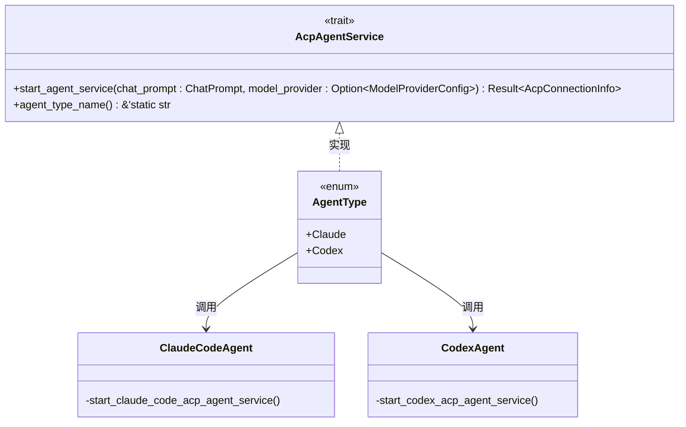
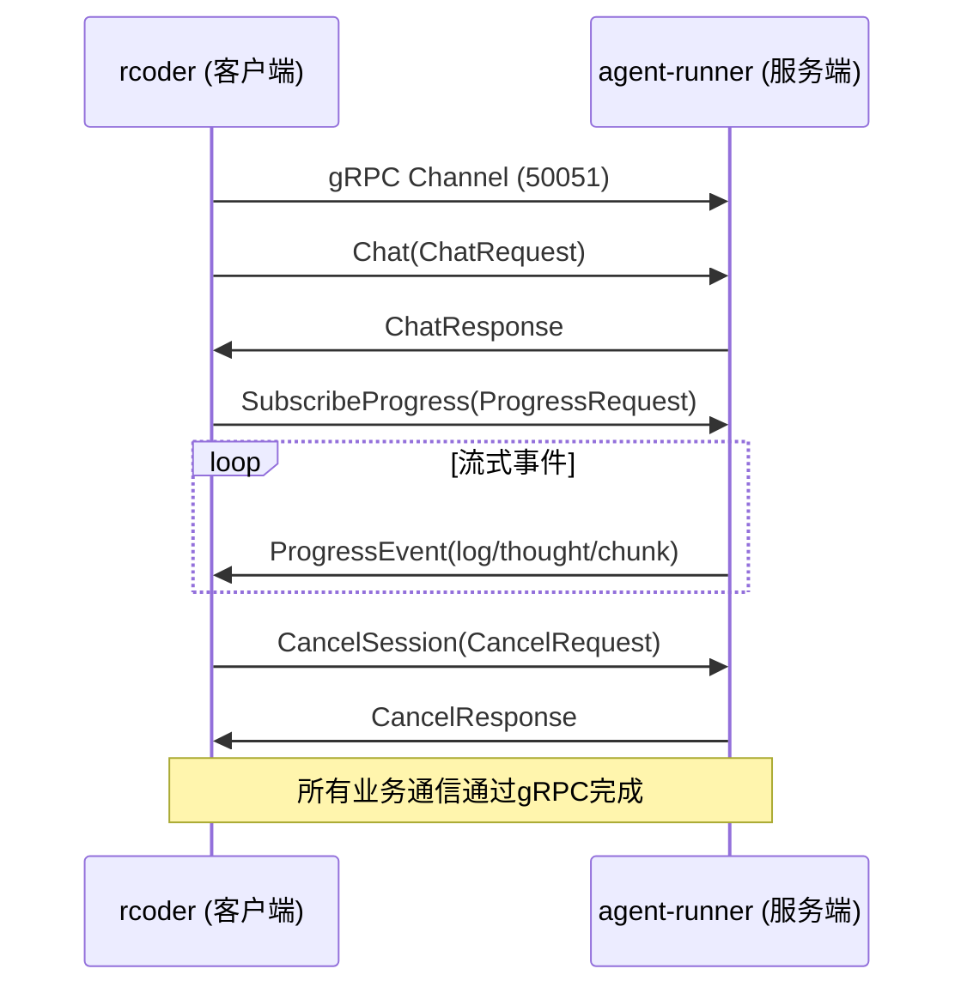
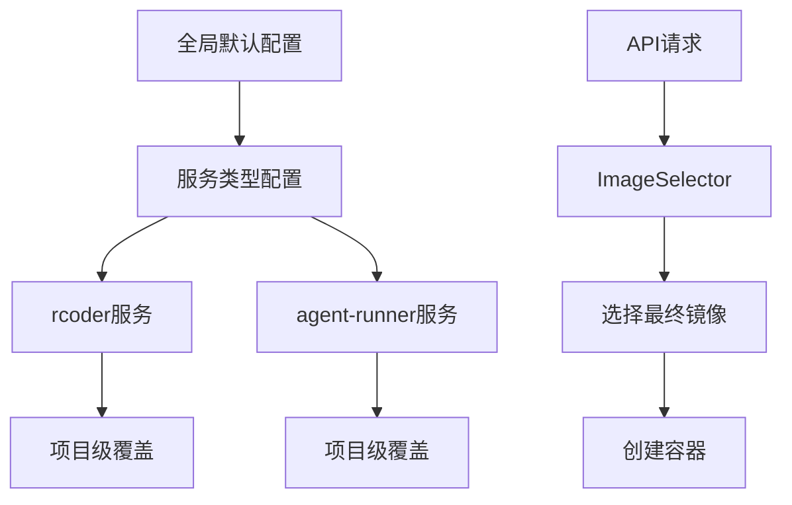

# 设计文档

<cite>
**本文档引用的文件**  
- [agent-abstraction-layer-design.md](file://specs/agent-abstraction-layer-design.md)
- [grpc-migration-design.md](file://specs/grpc-migration-design.md)
- [multi-docker-image-design.md](file://specs/multi-docker-image-design.md)
- [agent.proto](file://crates/shared_types/proto/agent.proto)
- [agent.rs](file://crates/shared_types/src/grpc/agent.rs)
- [acp_agent.rs](file://crates/agent_runner/src/proxy_agent/acp_agent.rs)
- [agent_service.rs](file://crates/agent_runner/src/proxy_agent/agent_service.rs)
- [claude_code_agent.rs](file://crates/agent_runner/src/proxy_agent/claude_code_agent.rs)
- [codex_agent.rs](file://crates/agent_runner/src/proxy_agent/codex_agent.rs)
- [manager.rs](file://crates/docker_manager/src/manager.rs)
- [image_selector.rs](file://crates/docker_manager/src/image_selector.rs)
- [multi_image_config.rs](file://crates/shared_types/src/multi_image_config.rs)
- [main.rs](file://crates/agent_runner/src/main.rs)
- [main.rs](file://crates/rcoder/src/main.rs)
</cite>

## 目录
1. [引言](#引言)
2. [代理抽象层设计](#代理抽象层设计)
3. [gRPC迁移设计](#grpc迁移设计)
4. [多Docker镜像设计](#多docker镜像设计)
5. [常见问题与解决方案](#常见问题与解决方案)
6. [结论](#结论)

## 引言
本文档详细阐述了RCoder项目中三个核心架构设计的实现细节：代理抽象层、gRPC通信迁移和多Docker镜像支持。这些设计旨在提升系统的可扩展性、性能和灵活性。代理抽象层通过统一的接口管理不同类型的AI代理，gRPC迁移通过二进制协议替代文本流提升通信效率，多Docker镜像设计则支持在同一系统中运行不同功能的服务。本文将深入分析每个设计的实现原理、决策依据和组件关系，为开发人员提供全面的技术参考。

## 代理抽象层设计

代理抽象层是RCoder系统的核心，它提供了一个统一的接口来管理和启动不同类型的AI代理（如Claude和Codex），实现了系统的可扩展性和配置灵活性。该设计的核心是通过`AcpAgentService` trait定义一个通用的代理服务接口，允许系统在不修改核心逻辑的情况下集成新的代理类型。

### 核心组件与实现

代理抽象层的设计围绕几个关键组件展开：`AcpAgentService` trait、`AgentType`枚举以及具体的代理实现模块。`AcpAgentService` trait定义了所有代理必须实现的`start_agent_service`方法，该方法负责启动代理服务并返回连接信息。`AgentType`枚举则作为代理类型的标识符，通过为该枚举实现`AcpAgentService` trait，系统可以根据运行时的类型选择正确的代理启动逻辑。

**Diagram sources**
- [agent_service.rs](file://crates/agent_runner/src/proxy_agent/agent_service.rs#L7-L62)
- [claude_code_agent.rs](file://crates/agent_runner/src/proxy_agent/claude_code_agent.rs#L28-L311)
- [codex_agent.rs](file://crates/agent_runner/src/proxy_agent/codex_agent.rs#L25-L398)

#### 启动流程与生命周期管理

代理的启动流程遵循一个标准化的模式。以`claude_code_agent`为例，其`start_claude_code_acp_agent_service`函数首先构建子进程的启动参数和环境变量，然后使用`tokio::process::Command`启动`claude-code-acp`子进程。成功启动后，它会通过`ClientSideConnection`建立与代理的ACP（Agent Client Protocol）连接，并初始化会话。整个过程通过`CancellationToken`和`AgentLifecycleGuard`进行生命周期管理，确保在任务取消时能正确清理子进程和相关资源。

**Section sources**
- [claude_code_agent.rs](file://crates/agent_runner/src/proxy_agent/claude_code_agent.rs#L28-L311)
- [codex_agent.rs](file://crates/agent_runner/src/proxy_agent/codex_agent.rs#L25-L398)

#### 配置与环境变量映射

为了实现配置的灵活性，系统设计了环境变量映射机制。代理的配置（如API密钥、模型名称）通过`ModelProviderConfig`结构体传递。在启动代理时，系统会将这些配置值映射到代理期望的环境变量名上。例如，`ModelProviderConfig`中的`api_key`字段会被映射到`ANTHROPIC_API_KEY`或`CODEX_API_KEY`等环境变量中。这种设计允许代理使用自己特定的环境变量名，同时从统一的配置源获取值，实现了配置的标准化和灵活性。

## gRPC迁移设计

gRPC迁移设计旨在将`rcoder`与`agent-runner`之间的通信协议从HTTP/SSE（Server-Sent Events）升级为gRPC，以提升通信性能、增强类型安全并简化流式数据处理。

### 架构变更与协议定义

迁移前，系统使用HTTP POST命令通道和SSE数据通道进行通信。迁移后，所有通信都通过单一的gRPC通道完成。核心的通信契约在`crates/shared_types/proto/agent.proto`文件中定义。`AgentService`服务定义了四个核心RPC方法：`Chat`（一元调用，用于发送聊天请求）、`SubscribeProgress`（服务器流式调用，用于订阅进度事件）、`CancelSession`（一元调用，用于取消会话）和`GetStatus`（一元调用，用于获取状态）。

**Diagram sources**
- [agent.proto](file://crates/shared_types/proto/agent.proto#L1-L98)
- [agent.rs](file://crates/shared_types/src/grpc/agent.rs#L1-L651)

#### 模块改造与实现

`shared_types` crate负责`.proto`文件的编译和代码生成，使用`tonic`和`prost`库生成Rust代码。`agent_runner`作为gRPC服务端，在其`main.rs`中启动Tonic gRPC服务器，同时保留Axum HTTP服务器用于健康检查。`rcoder`作为gRPC客户端，通过维护gRPC Channel连接池来与`agent-runner`通信。在`agent_session_notification.rs`中，原有的SSE转发逻辑被改造为调用`SubscribeProgress` gRPC方法，并将接收到的`ProgressEvent`消息转换为Axum SSE事件流，从而实现了与前端的无缝兼容。

**Section sources**
- [grpc-migration-design.md](file://specs/grpc-migration-design.md#L1-L163)
- [main.rs](file://crates/agent_runner/src/main.rs#L1-L232)
- [main.rs](file://crates/rcoder/src/main.rs#L1-L451)

## 多Docker镜像设计

多Docker镜像设计支持在动态创建容器时指定不同的服务类型（如`rcoder`或`agent-runner`），以满足当前功能和未来新功能的开发需求。

### 配置结构与选择策略

该设计的核心是`MultiImageConfig`结构，它定义了多层级的镜像配置体系。配置层级从上到下依次为：全局默认镜像配置、服务类型特定配置（如`rcoder`和`agent-runner`）、以及可选的项目级镜像覆盖。`ServiceType`枚举定义了支持的服务类型，`ImageSelector`组件则根据服务类型和项目配置，按照预定义的策略（如`ServiceOnly`）选择最终的Docker镜像。

**Diagram sources**
- [multi-docker-image-design.md](file://specs/multi-docker-image-design.md#L1-L710)
- [multi_image_config.rs](file://crates/shared_types/src/multi_image_config.rs#L1-L604)
- [image_selector.rs](file://crates/docker_manager/src/image_selector.rs#L1-L160)

#### 镜像选择器与容器创建

`ImageSelector`是镜像选择逻辑的核心。它首先验证请求的服务类型是否已启用，然后根据平台（ARM64/AMD64）和配置优先级（服务通用镜像 > 平台专用镜像 > 默认镜像）来确定最终的镜像名称。`DockerManager`的`create_container_with_service_type`方法利用`ImageSelector`选择镜像，并将服务特定的环境变量和挂载点应用到容器配置中，最后调用`create_container`完成容器的创建。

**Section sources**
- [image_selector.rs](file://crates/docker_manager/src/image_selector.rs#L1-L160)
- [manager.rs](file://crates/docker_manager/src/manager.rs#L1-L800)

## 常见问题与解决方案

### 代理启动失败
**问题**：代理子进程启动失败，日志中出现“无法启动 claude-code-acp 子进程”。
**解决方案**：检查`PATH`环境变量是否包含`claude-code-acp`命令，或确认该命令已正确安装。确保`agent_servers`配置中的`command`字段指向正确的可执行文件路径。

### gRPC连接超时
**问题**：`rcoder`客户端调用gRPC服务时出现连接超时。
**解决方案**：确认`agent-runner`容器内部的gRPC端口（如50051）已在`docker-compose.yml`中正确暴露，并且`rcoder`能够通过容器网络访问该端口。检查防火墙设置。

### 镜像选择错误
**问题**：创建容器时使用了错误的Docker镜像。
**解决方案**：检查`docker_config`中的`services`配置，确保`enabled`字段为`true`，并且`image`、`arm64_image`或`amd64_image`字段的值正确。确认API请求中指定的`service_type`与配置中的键名匹配。

## 结论
本文档详细分析了RCoder项目中代理抽象层、gRPC迁移和多Docker镜像三大核心设计。代理抽象层通过trait和枚举实现了代理的可扩展管理；gRPC迁移通过二进制协议和强类型契约显著提升了通信效率和可靠性；多Docker镜像设计则通过灵活的配置体系支持了服务的多样化部署。这些设计共同构建了一个高性能、高可扩展且易于维护的AI开发平台架构。未来的工作可以在此基础上进一步优化性能监控和资源调度。