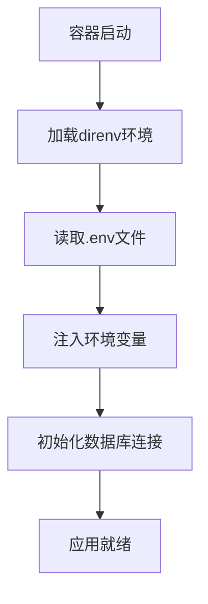
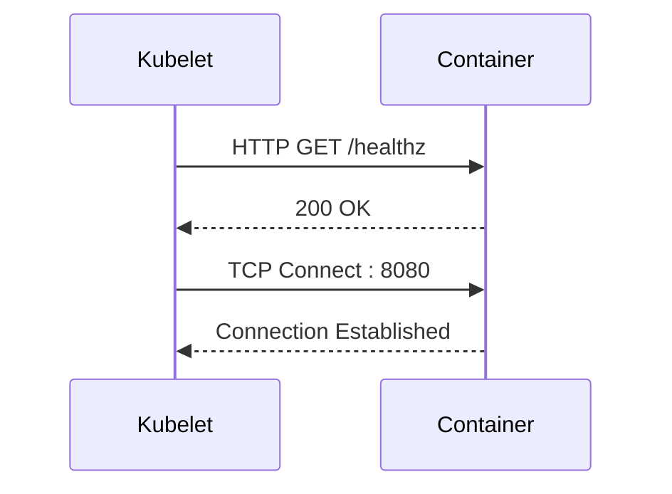
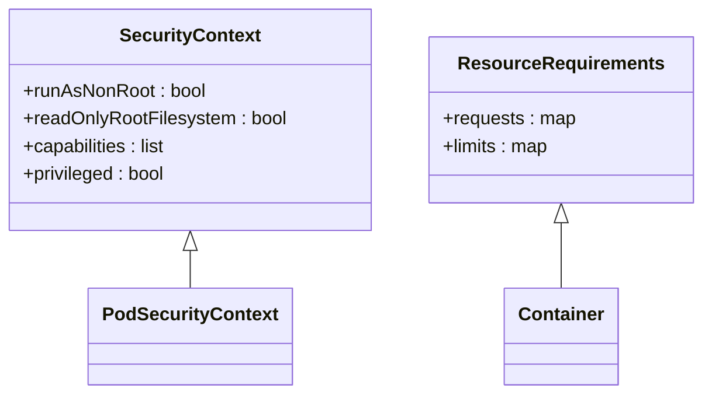
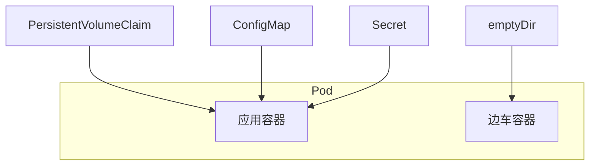

# 容器化部署

<cite>
**本文档中引用的文件**  
- [context_server_store.rs](file://crates/project/src/context_server_store.rs)
- [project_settings.rs](file://crates/project/src/project_settings.rs)
- [direnv.rs](file://crates/project/src/direnv.rs)
- [lsp_store.rs](file://crates/project/src/lsp_store.rs)
- [go.rs](file://crates/project/src/debugger/locators/go.rs)
- [extension.rs](file://crates/project/src/context_server_store/extension.rs)
- [registry.rs](file://crates/project/src/context_server_store/registry.rs)
</cite>

## 目录
1. [简介](#简介)
2. [Docker容器化部署方案](#docker容器化部署方案)
3. [Kubernetes部署示例](#kubernetes部署示例)
4. [容器环境中的数据库连接管理](#容器环境中的数据库连接管理)
5. [日志输出与健康检查](#日志输出与健康检查)
6. [资源限制与安全上下文配置](#资源限制与安全上下文配置)
7. [容器网络与存储卷挂载最佳实践](#容器网络与存储卷挂载最佳实践)
8. [结论](#结论)

## 简介
本文档旨在为基于Rust的项目提供完整的容器化部署解决方案，涵盖从Docker镜像构建到Kubernetes集群部署的全流程。重点包括多阶段构建、镜像优化、资源配置、安全策略以及运行时环境管理等方面。

## Docker容器化部署方案

### Dockerfile编写规范
在构建Docker镜像时，应遵循最小化原则，仅包含运行应用所必需的依赖项。使用Alpine Linux作为基础镜像可显著减小最终镜像体积。

### 多阶段构建策略
采用多阶段构建以分离编译和运行环境。第一阶段使用完整的Rust工具链进行编译，第二阶段仅复制生成的二进制文件至轻量级运行时镜像中。

### 镜像优化技巧
通过删除调试符号、合并RUN指令、使用.dockerignore排除不必要的文件等方式进一步减小镜像大小。利用缓存机制提升构建效率。

**Section sources**
- [context_server_store.rs](file://crates/project/src/context_server_store.rs#L51-L90)
- [project_settings.rs](file://crates/project/src/project_settings.rs#L143-L181)

## Kubernetes部署示例

### Deployment配置清单
定义应用的部署策略，包括副本数、更新策略、就绪与存活探针等。确保Pod能够自动恢复并在升级过程中保持服务可用性。

### Service配置清单
通过Service暴露应用服务，支持ClusterIP、NodePort或LoadBalancer类型，实现内部通信或外部访问。

### ConfigMap配置清单
使用ConfigMap管理非敏感配置数据，如环境变量、配置文件内容等，便于配置与镜像解耦。

### PersistentVolume配置清单
为需要持久化存储的应用组件（如数据库）配置PersistentVolume和PersistentVolumeClaim，确保数据持久性。

**Section sources**
- [context_server_store.rs](file://crates/project/src/context_server_store.rs#L92-L138)
- [lsp_store.rs](file://crates/project/src/lsp_store.rs#L554-L571)

## 容器环境中的数据库连接管理

### 连接池配置
合理设置数据库连接池大小，避免因连接过多导致数据库压力过大或连接不足影响性能。

### 环境变量注入
通过环境变量传递数据库连接信息（如主机地址、端口、用户名、密码），结合Kubernetes Secrets实现敏感信息的安全管理。

### 动态配置加载
利用`direnv`等工具在容器启动时动态加载环境变量，支持多环境配置切换。

**Diagram sources**
- [direnv.rs](file://crates/project/src/direnv.rs#L0-L37)

**Section sources**
- [direnv.rs](file://crates/project/src/direnv.rs#L0-L37)

## 日志输出与健康检查

### 日志输出规范
统一日志格式，输出至标准输出（stdout）和标准错误（stderr），便于容器平台收集和分析。

### 健康检查配置
配置Liveness和Readiness探针，定期检查应用状态。Liveness探针用于判断是否需要重启容器，Readiness探针用于控制流量分发。

**Diagram sources**
- [lsp_store.rs](file://crates/project/src/lsp_store.rs#L554-L571)

**Section sources**
- [lsp_store.rs](file://crates/project/src/lsp_store.rs#L554-L571)

## 资源限制与安全上下文配置

### CPU/内存资源限制
为容器设置合理的资源请求（requests）和限制（limits），防止资源耗尽影响其他应用。

### 安全上下文配置
启用安全上下文，禁止以root用户运行，启用只读文件系统，限制能力集（capabilities），提升容器安全性。

**Diagram sources**
- [context_server_store.rs](file://crates/project/src/context_server_store.rs#L1148-L1172)

**Section sources**
- [context_server_store.rs](file://crates/project/src/context_server_store.rs#L1148-L1172)

## 容器网络与存储卷挂载最佳实践

### 网络配置
使用Kubernetes NetworkPolicy限制Pod间通信，遵循最小权限原则。选择合适的CNI插件以满足性能和功能需求。

### 存储卷挂载
根据应用需求选择合适的存储类型（如emptyDir、hostPath、persistentVolumeClaim）。确保挂载路径权限正确，避免因权限问题导致应用失败。

**Diagram sources**
- [context_server_store/extension.rs](file://crates/project/src/context_server_store/extension.rs#L50-L87)

**Section sources**
- [context_server_store/extension.rs](file://crates/project/src/context_server_store/extension.rs#L50-L87)

## 结论
本文档提供了从Docker镜像构建到Kubernetes部署的完整容器化解决方案。通过合理配置资源、安全策略和运行时环境，可确保应用在容器环境中稳定、高效、安全地运行。建议结合实际业务场景持续优化部署策略。