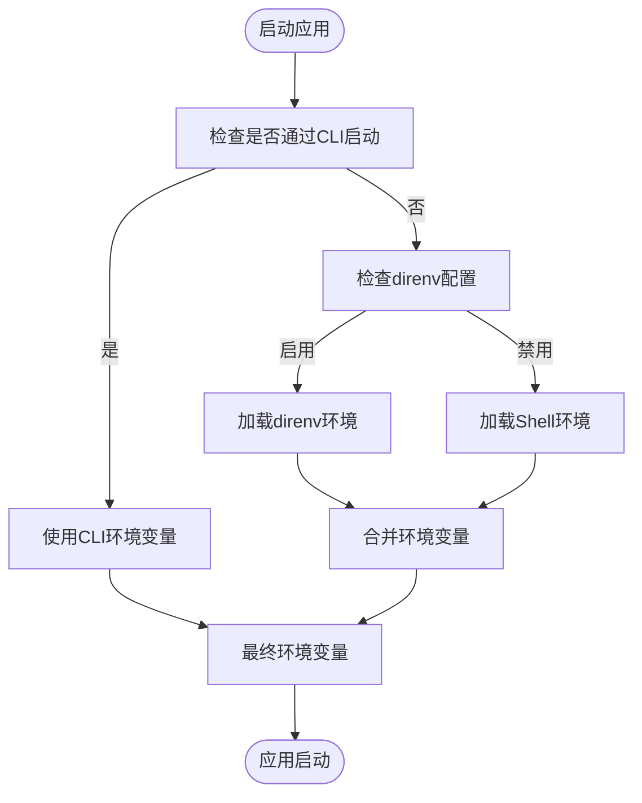
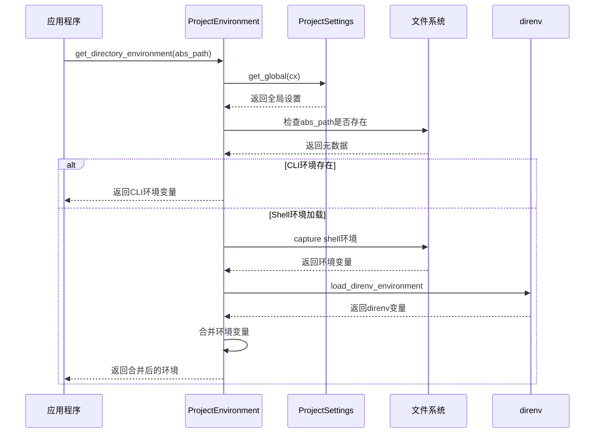

# 环境配置

<cite>
**本文档中引用的文件**  
- [Cargo.toml](file://Cargo.toml)
- [environment.rs](file://crates/project/src/environment.rs)
- [project_settings.rs](file://crates/project/src/project_settings.rs)
- [direnv.rs](file://crates/project/src/direnv.rs)
- [main.rs](file://crates/rcoder/src/main.rs)
</cite>

## 目录
1. [简介](#简介)
2. [环境变量配置](#环境变量配置)
3. [Cargo.toml 配置项详解](#cargotoml-配置项详解)
4. [配置加载流程与默认值处理](#配置加载流程与默认值处理)
5. [配置验证与常见错误排查](#配置验证与常见错误排查)
6. [结论](#结论)

## 简介
本指南详细说明如何通过环境变量和 `Cargo.toml` 文件配置项目行为。涵盖开发、测试、生产环境的配置差异，解释关键配置项的作用范围和优先级，并提供配置验证方法和常见问题排查步骤。

## 环境变量配置

### 核心环境变量
项目支持以下核心环境变量控制服务行为：

- **RUST_LOG**：控制日志输出级别，影响 `tracing` 和 `log` 框架的行为。
- **DATABASE_URL**：指定数据库连接字符串，用于初始化 SQLx 连接池。
- **PORT**：定义 HTTP 服务器监听端口。

这些变量在不同环境中具有不同的优先级和作用范围。

### 环境变量作用范围与优先级
环境变量的优先级从高到低依次为：
1. 命令行直接设置（CLI）
2. `.env` 文件或 `direnv` 加载的环境
3. 系统默认环境变量

当项目通过 CLI 启动时，CLI 提供的环境变量具有最高优先级。若未通过 CLI 启动，则尝试从当前工作目录加载 shell 环境变量。



**Diagram sources**
- [environment.rs](file://crates/project/src/environment.rs#L15-L19)
- [direnv.rs](file://crates/project/src/direnv.rs#L1-L84)

**Section sources**
- [environment.rs](file://crates/project/src/environment.rs#L1-L328)
- [direnv.rs](file://crates/project/src/direnv.rs#L1-L84)

### 不同环境的配置差异
#### 开发环境
- 推荐使用 `.env` 文件或 `direnv` 自动加载环境变量
- `RUST_LOG=debug` 启用详细日志
- `DATABASE_URL` 指向本地 SQLite 或开发数据库
- `PORT` 可省略，默认使用 8080

#### 测试环境
- 通过 CI/CD 系统注入环境变量
- `RUST_LOG=test=info` 控制测试日志输出
- 使用内存数据库或临时数据库实例
- 并行测试需确保端口不冲突

#### 生产环境
- 通过容器编排系统（如 Kubernetes）或 systemd 注入环境变量
- `RUST_LOG=info` 避免过多日志影响性能
- `DATABASE_URL` 指向高可用数据库集群
- 明确指定 `PORT` 以匹配反向代理配置

## Cargo.toml 配置项详解

### 依赖版本管理
`Cargo.toml` 中定义了项目依赖及其版本约束：

```toml
[dependencies]
tokio = { version = "1.0", features = ["full"] }
sqlx = { version = "0.7", features = ["runtime-tokio-rustls", "sqlite", "chrono", "uuid"] }
```

版本号遵循语义化版本控制，`1.0` 表示兼容所有 `1.x` 版本更新。

### 特性开关（Features）
通过特性开关控制可选功能：
- `sqlx` 的 `sqlite` 特性启用 SQLite 支持
- `tower-http` 的 `cors` 和 `trace` 特性启用跨域和追踪中间件
- `uuid` 的 `v4` 和 `v7` 特性支持不同版本的 UUID 生成

### 构建目标配置
工作区配置指定了成员 crate 和排除路径：

```toml
[workspace]
members = ["crates/*"]
exclude = ["tmp/*"]
```

这确保只有 `crates` 目录下的模块被构建，避免临时文件干扰。

**Section sources**
- [Cargo.toml](file://Cargo.toml#L1-L157)

## 配置加载流程与默认值处理

### 配置加载机制
配置加载遵循以下流程：



**Diagram sources**
- [environment.rs](file://crates/project/src/environment.rs#L15-L19)
- [project_settings.rs](file://crates/project/src/project_settings.rs#L39-L78)

**Section sources**
- [environment.rs](file://crates/project/src/environment.rs#L1-L328)
- [project_settings.rs](file://crates/project/src/project_settings.rs#L1-L1230)

### 默认值处理策略
当环境变量未设置时，系统采用以下默认值：
- `RUST_LOG`：无默认值，不设置则使用库的默认日志级别
- `DATABASE_URL`：无默认值，必须显式提供
- `PORT`：默认值为 8080

代码中通过 `std::env::var` 尝试读取环境变量，失败时返回 `Err`，由调用方决定是否使用默认值。

```rust
let port = std::env::var("PORT")
    .map(|p| p.parse().expect("PORT must be a number"))
    .unwrap_or(8080);
```

**Section sources**
- [main.rs](file://crates/rcoder/src/main.rs#L34)

## 配置验证与常见错误排查

### 配置验证方法
1. **启动时验证**：在 `main` 函数中检查必要环境变量
2. **运行时监控**：通过健康检查端点暴露配置状态
3. **日志审计**：记录配置加载过程的关键信息

### 常见配置错误及解决方法
| 错误现象 | 可能原因 | 解决方案 |
|---------|--------|--------|
| 数据库连接失败 | `DATABASE_URL` 格式错误或服务未启动 | 检查连接字符串格式，确认数据库服务状态 |
| 端口绑定失败 | `PORT` 被占用或权限不足 | 更换端口号，检查防火墙设置 |
| 日志无输出 | `RUST_LOG` 设置不当 | 设置为 `info` 或 `debug` 级别 |
| direnv 加载失败 | `load_direnv` 配置错误或 `direnv` 未安装 | 检查 `ProjectSettings` 配置，安装 `direnv` |

### 调试技巧
- 使用 `print_env` 工具打印当前环境变量
- 启用 `RUST_LOG=trace` 获取最详细的执行轨迹
- 检查 `ZED_ENVIRONMENT_ORIGIN_MARKER` 环境变量确定环境来源

**Section sources**
- [environment.rs](file://crates/project/src/environment.rs#L1-L328)
- [direnv.rs](file://crates/project/src/direnv.rs#L1-L84)

## 结论
合理的环境配置是项目稳定运行的基础。通过理解环境变量的作用机制和 `Cargo.toml` 的配置选项，可以有效管理不同环境下的应用行为。建议建立标准化的配置管理流程，结合自动化工具确保配置的一致性和可靠性。