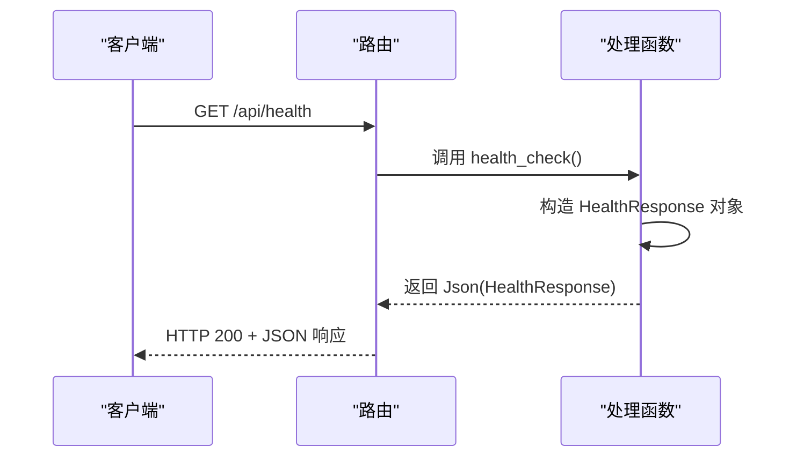

# 监控与告警

<cite>
**本文档引用的文件**  
- [lib.rs](file://crates/http_server/src/lib.rs)
- [handlers.rs](file://crates/http_server/src/handlers.rs)
- [middleware.rs](file://crates/http_server/src/middleware.rs)
- [Cargo.toml](file://crates/http_server/Cargo.toml)
- [log_store.rs](file://crates/project/src/lsp_store/log_store.rs)
</cite>

## 目录
1. [引言](#引言)
2. [健康检查端点实现](#健康检查端点实现)
3. [Tracing框架集成与结构化日志记录](#tracing框架集成与结构化日志记录)
4. [Prometheus指标采集配置](#prometheus指标采集配置)
5. [日志收集系统（ELK栈）集成指导](#日志收集系统elk栈集成指导)
6. [分布式追踪实现指导](#分布式追踪实现指导)
7. [常见异常模式的告警规则配置示例](#常见异常模式的告警规则配置示例)
8. [结论](#结论)

## 引言
本文档旨在为`rcoder`项目设计并实现一套全面的监控告警体系。该体系将涵盖健康检查、结构化日志记录、指标采集、日志收集和分布式追踪等多个方面，以确保系统的可观测性、稳定性和可维护性。

**Section sources**
- [lib.rs](file://crates/http_server/src/lib.rs#L1-L64)

## 健康检查端点实现
健康检查端点是监控系统的基础，用于快速判断服务的可用性。在本项目中，健康检查端点已通过HTTP服务器实现。

### 实现逻辑
健康检查端点 `/api/health` 的实现逻辑如下：
1.  **端点定义**：在 `create_app` 函数中，通过 `.route("/api/health", get(health_check))` 将 `/api/health` 路径与 `health_check` 处理函数绑定。
2.  **响应结构**：`health_check` 函数返回一个 `Json<HealthResponse>` 响应。`HealthResponse` 结构体包含三个字段：
    *   `status`: 字符串，固定为 `"healthy"`，表示服务状态正常。
    *   `version`: 字符串，表示当前服务的版本号。
    *   `timestamp`: 时间戳，表示响应生成的时间。
3.  **调用方式**：客户端可以通过发送一个 `GET` 请求到 `http://<server>:<port>/api/health` 来调用此端点。如果服务正常运行，将收到一个包含上述信息的JSON响应，HTTP状态码为200。

此实现提供了一个简单而有效的服务存活探针。



**Diagram sources**
- [lib.rs](file://crates/http_server/src/lib.rs#L1-L64)
- [handlers.rs](file://crates/http_server/src/handlers.rs#L20-L26)

**Section sources**
- [lib.rs](file://crates/http_server/src/lib.rs#L1-L64)
- [handlers.rs](file://crates/http_server/src/handlers.rs#L20-L26)

## Tracing框架集成与结构化日志记录
为了实现细粒度的请求追踪和结构化日志记录，项目已集成 `tracing` 框架。

### 集成方式
1.  **依赖引入**：在 `crates/http_server/Cargo.toml` 文件中，明确列出了 `tracing` 和 `tracing-subscriber` 作为依赖项，为日志记录提供了基础支持。
2.  **中间件配置**：核心的Tracing功能通过 `tracing_middleware` 函数实现。该函数创建了一个 `TraceLayer`，并配置了三个关键的钩子（hook）：
    *   **`on_request`**: 在每个HTTP请求开始时触发，使用 `debug!` 宏记录请求的 `method` 和 `uri`。
    *   **`on_response`**: 在每个HTTP请求结束时触发，使用 `debug!` 宏记录响应的 `status` 状态码和处理请求所花费的 `latency` 延迟。
    *   **`on_failure`**: 在请求处理过程中发生错误时触发，使用 `error!` 宏记录具体的错误信息。
3.  **应用层集成**：在 `create_app` 函数中，通过 `.layer(tower_http::trace::TraceLayer::new_for_http())` 将Tracing中间件应用到整个路由上，确保所有请求都被追踪。

### 结构化日志记录
`tracing` 框架天然支持结构化日志。代码中使用 `debug!`, `info!`, `error!`, `warn!` 等宏进行日志输出。这些日志不再是纯文本，而是包含键值对的结构化数据。例如，`debug!(method = %request.method(), uri = %request.uri(), "started processing request")` 会生成包含 `method`, `uri` 和 `message` 字段的日志条目，便于后续的查询、过滤和分析。

**Section sources**
- [Cargo.toml](file://crates/http_server/Cargo.toml#L1-L23)
- [lib.rs](file://crates/http_server/src/lib.rs#L1-L64)
- [middleware.rs](file://crates/http_server/src/middleware.rs#L9-L28)

## Prometheus指标采集配置
虽然代码中未直接实现Prometheus指标的暴露，但通过集成 `tower_http::trace::TraceLayer`，为指标采集奠定了坚实的基础。`TraceLayer` 记录的请求延迟和状态码等信息，是定义关键监控指标的核心数据源。

### 关键监控指标定义
基于现有架构，可以定义以下关键监控指标：

| 指标名称 | 指标类型 | 描述 | 数据来源 |
| :--- | :--- | :--- | :--- |
| `http_request_duration_seconds` | Histogram | HTTP请求处理延迟的直方图 | `on_response` 钩子中的 `latency` |
| `http_requests_total` | Counter | HTTP请求数量计数器，按状态码和方法分组 | `on_response` 钩子中的 `status` 和 `method` |
| `http_request_errors_total` | Counter | HTTP请求错误总数计数器 | `on_failure` 钩子中的错误事件 |
| `database_connections_used` | Gauge | 数据库连接池当前使用连接数 | （需在数据库模块中实现） |
| `database_connections_idle` | Gauge | 数据库连接池当前空闲连接数 | （需在数据库模块中实现） |
| `database_connections_max` | Gauge | 数据库连接池最大连接数 | （需在数据库模块中实现） |

要将这些指标暴露给Prometheus，需要在项目中引入 `prometheus` 或 `metrics` crate，并创建一个专门的 `/metrics` 端点来输出指标数据。`TraceLayer` 记录的日志可以被Prometheus的 `pushgateway` 或日志收集系统（如ELK）消费，进而转换为时间序列数据。

**Section sources**
- [middleware.rs](file://crates/http_server/src/middleware.rs#L9-L28)

## 日志收集系统ELK栈集成指导
为了集中管理和分析由 `tracing` 框架生成的结构化日志，建议集成ELK（Elasticsearch, Logstash, Kibana）栈。

### 集成步骤
1.  **日志格式化**：配置 `tracing-subscriber` 将日志输出为JSON格式。这可以通过 `fmt::layer().json()` 来实现。例如：
    ```rust
    tracing_subscriber::fmt()
        .with_max_level(tracing::Level::INFO)
        .json()
        .init();
    ```
    这将确保每条日志都以JSON对象的形式输出，完美适配ELK栈。
2.  **日志收集**：在部署环境中，使用 `Filebeat` 或 `Fluentd` 等日志收集代理。配置代理程序监控应用的日志文件（或标准输出），并将JSON格式的日志发送到 `Logstash`。
3.  **日志处理 (Logstash)**：配置 `Logstash` 的 `pipeline`，接收来自Filebeat的日志。`Logstash` 可以对日志进行进一步的解析、过滤和增强，然后将其索引到 `Elasticsearch` 中。
4.  **数据存储 (Elasticsearch)**：`Elasticsearch` 作为分布式搜索引擎，负责存储和索引所有日志数据，提供高效的全文搜索和聚合能力。
5.  **可视化 (Kibana)**：使用 `Kibana` 连接到 `Elasticsearch`，创建仪表盘（Dashboard）来可视化关键指标。例如，可以创建图表展示每分钟的请求量、错误率、平均延迟等。

通过ELK栈，可以实现对系统日志的集中化、结构化和可视化管理。

**Section sources**
- [middleware.rs](file://crates/http_server/src/middleware.rs#L9-L28)

## 分布式追踪实现指导
虽然当前代码主要实现了单服务内的请求追踪，但 `tracing` 框架是构建分布式追踪系统的理想选择。

### 实现路径
1.  **OpenTelemetry集成**：将 `tracing` 与 `opentelemetry` crate 结合使用。`opentelemetry` 提供了与主流分布式追踪后端（如Jaeger, Zipkin, AWS X-Ray）兼容的API和SDK。
2.  **传播上下文**：配置 `opentelemetry` 的 `Propagator`（如 `TraceContext`），使其能够从HTTP请求头（如 `traceparent`）中提取追踪上下文，并在调用下游服务时将其注入到请求头中。这确保了追踪链路的连续性。
3.  **导出器配置**：配置 `opentelemetry` 的 `Exporter`，将生成的追踪数据（Spans）发送到指定的后端。例如，使用 `opentelemetry-jaeger` 将数据发送到Jaeger Agent。
4.  **代码改造**：在服务间调用的客户端代码中，需要确保 `tracing` 上下文被正确传递。通常，`opentelemetry` 的HTTP客户端集成（如 `reqwest-opentelemetry`）可以自动完成此工作。

通过以上步骤，可以将当前的单机Tracing升级为完整的分布式追踪系统，清晰地展示请求在微服务架构中的完整调用链路。

**Section sources**
- [middleware.rs](file://crates/http_server/src/middleware.rs#L9-L28)

## 常见异常模式的告警规则配置示例
基于定义的关键指标，可以为常见的异常场景配置Prometheus告警规则。

### 告警规则示例 (Prometheus Rule Format)
```yaml
groups:
- name: service-alerts
  rules:
  # 服务不可用
  - alert: ServiceDown
    expr: up{job="rcoder"} == 0
    for: 5m
    labels:
      severity: critical
    annotations:
      summary: "服务 {{ $labels.instance }} 已经宕机超过5分钟"
      description: "服务 {{ $labels.job }} 在 {{ $labels.instance }} 上无法访问。"

  # 性能下降 (错误率过高)
  - alert: HighErrorRate
    expr: |
      sum(rate(http_requests_total{status=~"5.."}[5m])) by (job, instance)
      /
      sum(rate(http_requests_total[5m])) by (job, instance)
      > 0.05
    for: 10m
    labels:
      severity: warning
    annotations:
      summary: "服务 {{ $labels.instance }} 错误率过高"
      description: "服务 {{ $labels.job }} 在 {{ $labels.instance }} 上的5xx错误率在过去10分钟内持续高于5%。"

  # 性能下降 (延迟过高)
  - alert: HighRequestLatency
    expr: histogram_quantile(0.95, sum(rate(http_request_duration_seconds_bucket[5m])) by (le)) > 1
    for: 15m
    labels:
      severity: warning
    annotations:
      summary: "服务 {{ $labels.instance }} 请求延迟过高"
      description: "服务 {{ $labels.job }} 在 {{ $labels.instance }} 上的95%请求延迟在过去15分钟内持续超过1秒。"

  # 资源耗尽 (数据库连接池使用率过高)
  - alert: HighDatabaseConnectionUsage
    expr: (database_connections_used / database_connections_max) > 0.9
    for: 10m
    labels:
      severity: warning
    annotations:
      summary: "数据库连接池使用率过高"
      description: "数据库连接池在 {{ $labels.instance }} 上的使用率在过去10分钟内持续超过90%。"
```

**Section sources**
- [middleware.rs](file://crates/http_server/src/middleware.rs#L9-L28)

## 结论
本文档详细阐述了为`rcoder`项目构建全面监控告警体系的方案。通过实现 `/api/health` 健康检查端点、集成 `tracing` 框架进行结构化日志记录、定义关键的Prometheus监控指标，并指导了ELK栈和分布式追踪的集成路径，为系统的稳定运行提供了有力保障。最后，提供了针对服务不可用、性能下降和资源耗尽等常见场景的告警规则示例。建议尽快实施Prometheus指标暴露和ELK集成，以全面提升系统的可观测性。