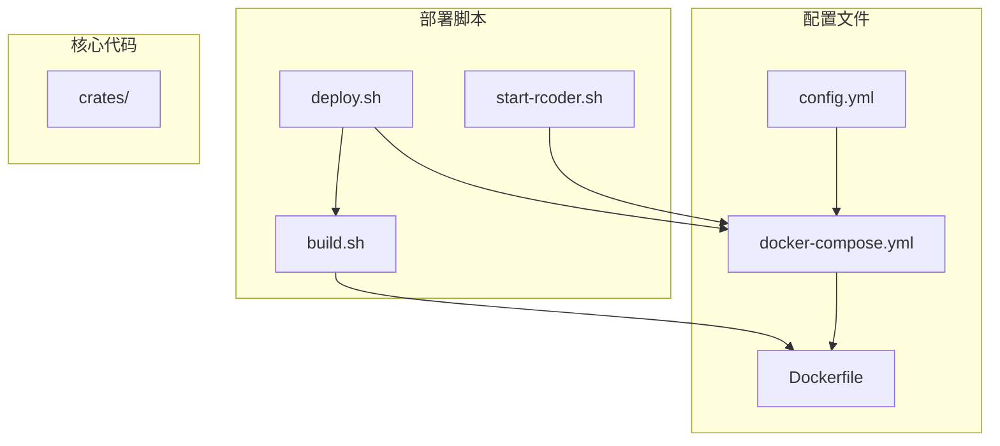
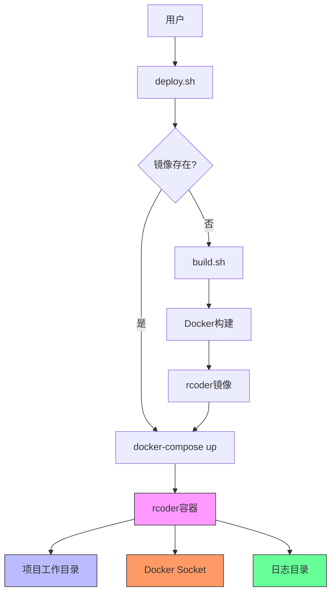
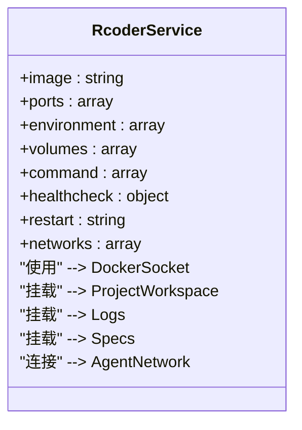
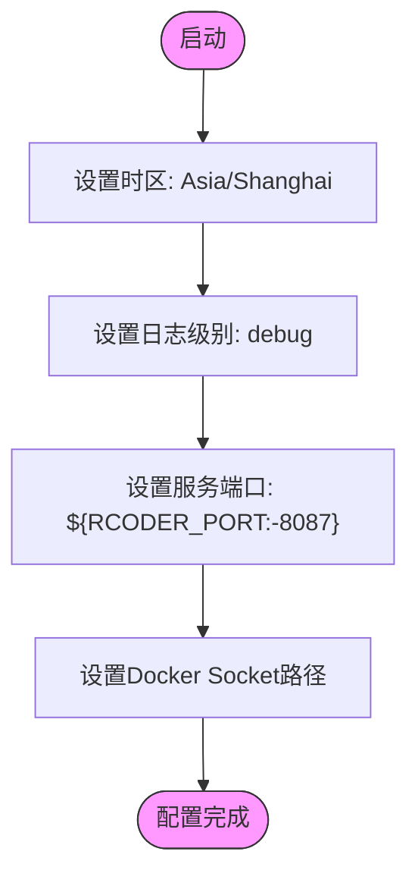
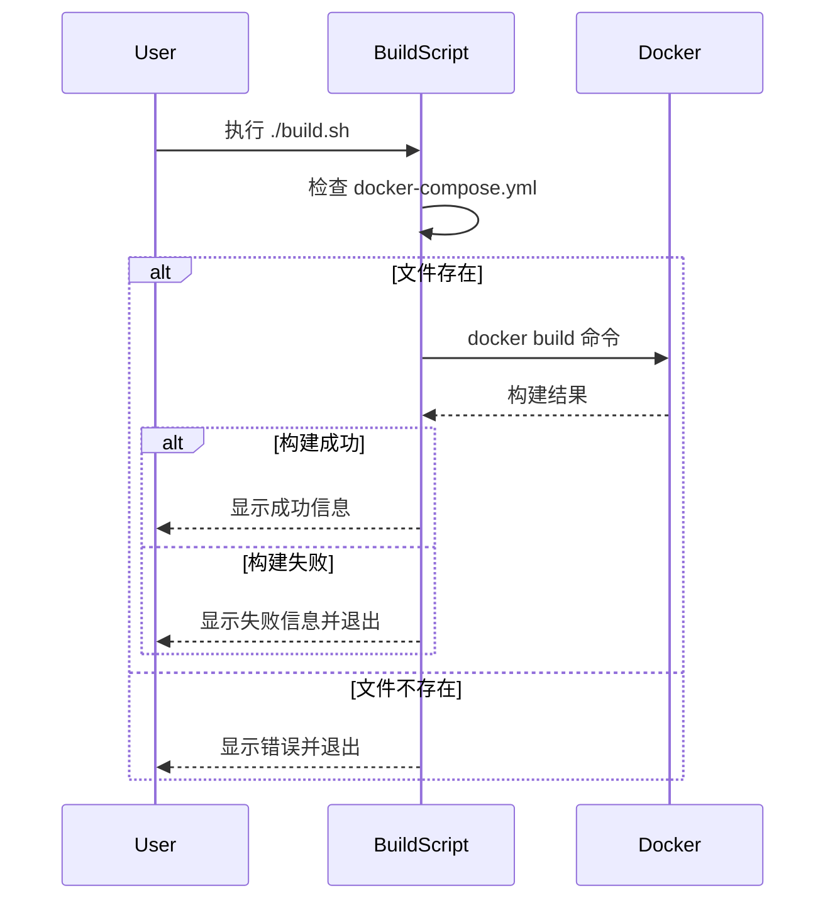
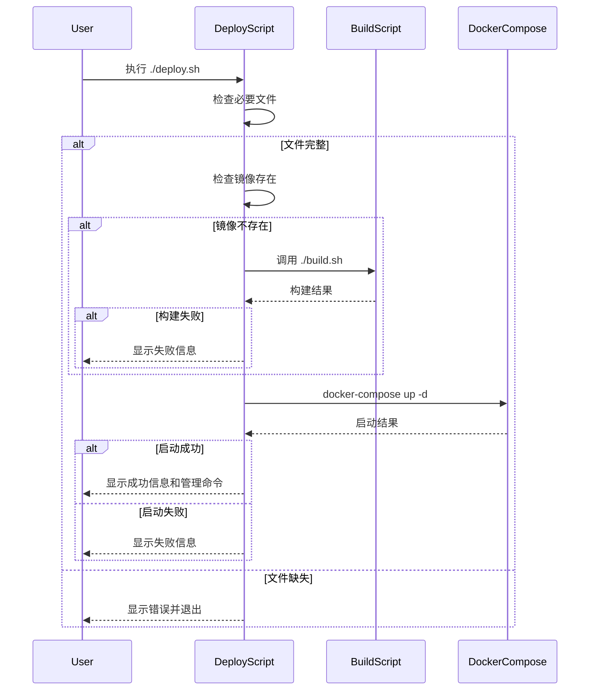
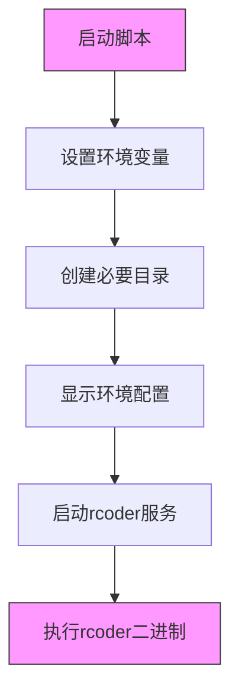
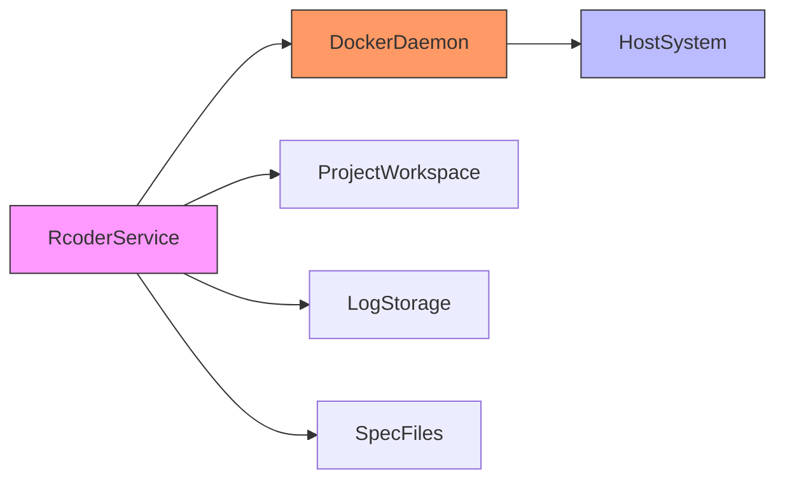
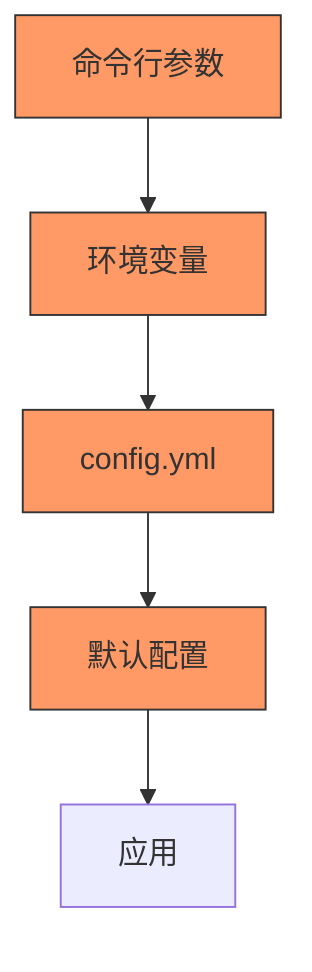

# Docker Compose部署

<cite>
**本文档中引用的文件**  
- [docker-compose.yml](file://docker/docker-compose.yml)
- [build.sh](file://docker/scripts/build.sh)
- [deploy.sh](file://docker/scripts/deploy.sh)
- [Dockerfile](file://docker/Dockerfile)
- [start-rcoder.sh](file://docker/start-rcoder.sh)
- [config.yml](file://config.yml)
- [README.md](file://README.md)
</cite>

## 目录
1. [简介](#简介)
2. [项目结构](#项目结构)
3. [核心组件](#核心组件)
4. [架构概述](#架构概述)
5. [详细组件分析](#详细组件分析)
6. [依赖分析](#依赖分析)
7. [性能考虑](#性能考虑)
8. [故障排除指南](#故障排除指南)
9. [结论](#结论)

## 简介
本文档全面阐述了RCoder项目的Docker Compose部署方案。通过分析`docker-compose.yml`文件、构建脚本和部署流程，详细说明了一键部署的实现机制。文档涵盖了服务编排、环境配置、多环境差异、部署对比以及常见问题的排查方法，旨在为新手和经验丰富的运维人员提供完整的部署指导。

## 项目结构
RCoder项目采用模块化设计，主要包含crates核心组件、docker部署脚本和配置文件。部署相关文件集中在docker目录下，包括Dockerfile、docker-compose.yml和一系列shell脚本。

**图源**
- [docker-compose.yml](file://docker/docker-compose.yml)
- [build.sh](file://docker/scripts/build.sh)
- [deploy.sh](file://docker/scripts/deploy.sh)

**节源**
- [docker-compose.yml](file://docker/docker-compose.yml)
- [build.sh](file://docker/scripts/build.sh)
- [deploy.sh](file://docker/scripts/deploy.sh)

## 核心组件
本节分析Docker Compose部署的核心组件，包括服务定义、构建流程和启动机制。通过环境变量注入、卷挂载和网络配置，实现了灵活的部署方案。

**节源**
- [docker-compose.yml](file://docker/docker-compose.yml)
- [Dockerfile](file://docker/Dockerfile)
- [start-rcoder.sh](file://docker/start-rcoder.sh)

## 架构概述
RCoder的Docker Compose部署采用单服务架构，主服务rcoder包含所有必要组件。部署架构通过分层设计实现了构建、部署和运行的分离。

**图源**
- [deploy.sh](file://docker/scripts/deploy.sh)
- [build.sh](file://docker/scripts/build.sh)
- [docker-compose.yml](file://docker/docker-compose.yml)

## 详细组件分析
### Docker Compose配置分析
`docker-compose.yml`文件定义了rcoder服务的完整配置，包括镜像、端口、环境变量、卷挂载和健康检查。

#### 服务定义

**图源**
- [docker-compose.yml](file://docker/docker-compose.yml)

#### 环境变量配置
服务通过环境变量实现灵活配置，支持默认值和变量替换机制。

**图源**
- [docker-compose.yml](file://docker/docker-compose.yml)

### 构建与部署流程
#### 构建脚本分析
`build.sh`脚本实现了镜像的自动化构建流程，包含错误检查和构建成功提示。

**图源**
- [build.sh](file://docker/scripts/build.sh)

#### 部署脚本分析
`deploy.sh`脚本实现了完整的部署流程，包括依赖检查、镜像构建和容器启动。

**图源**
- [deploy.sh](file://docker/scripts/deploy.sh)
- [build.sh](file://docker/scripts/build.sh)

### 启动脚本分析
`start-rcoder.sh`脚本负责容器内的服务启动和环境初始化。

**图源**
- [start-rcoder.sh](file://docker/start-rcoder.sh)

## 依赖分析
### 服务依赖关系
RCoder服务依赖于宿主机的Docker守护进程，通过挂载Docker Socket实现容器管理功能。

**图源**
- [docker-compose.yml](file://docker/docker-compose.yml)
- [config.yml](file://config.yml)

### 配置文件依赖
系统通过多层配置机制实现灵活的环境适配，优先级从高到低为：命令行参数 > 环境变量 > 配置文件 > 默认值。

**图源**
- [config.yml](file://config.yml)
- [README.md](file://README.md)

## 性能考虑
Docker Compose部署方案在性能方面具有以下特点：
- **启动时间**：由于需要拉取镜像和启动容器，首次启动时间较长
- **资源占用**：容器化部署增加了少量资源开销，但提供了更好的隔离性
- **网络性能**：通过端口映射和内部网络通信，网络延迟极低
- **存储性能**：使用卷挂载，文件I/O性能接近原生

对于生产环境，建议：
1. 预先构建镜像以减少部署时间
2. 配置适当的资源限制防止资源耗尽
3. 使用持久化存储确保数据安全
4. 启用健康检查确保服务可用性

## 故障排除指南
### 常见问题及解决方案
#### 服务启动失败
**可能原因**：
- 必要文件缺失
- 镜像构建失败
- 端口被占用
- Docker Socket权限不足

**解决方案**：
1. 检查`docker-compose.yml`和`Dockerfile`是否存在
2. 确认Docker服务正在运行
3. 检查8087端口是否被其他进程占用
4. 确保用户有访问`/var/run/docker.sock`的权限

#### 网络连接超时
**可能原因**：
- 容器网络配置错误
- 防火墙阻止连接
- 服务未正确启动

**解决方案**：
1. 检查`docker-compose.yml`中的网络配置
2. 验证容器是否在`agent-network`网络中
3. 使用`docker logs`查看服务日志
4. 检查防火墙设置

#### 配置加载异常
**可能原因**：
- 环境变量未正确设置
- 配置文件格式错误
- 卷挂载路径不正确

**解决方案**：
1. 检查`deploy.sh`中的环境变量设置
2. 验证`config.yml`的YAML格式
3. 确认卷挂载路径在宿主机上存在
4. 使用`docker exec`进入容器验证配置文件位置

**节源**
- [deploy.sh](file://docker/scripts/deploy.sh)
- [docker-compose.yml](file://docker/docker-compose.yml)
- [config.yml](file://config.yml)

## 结论
RCoder的Docker Compose部署方案提供了一套完整、可靠的部署机制。通过`build.sh`和`deploy.sh`脚本实现了一键部署，降低了部署复杂度。`docker-compose.yml`文件清晰地定义了服务配置，包括端口映射、卷挂载和环境变量注入。

与独立Docker部署相比，Docker Compose方案具有以下优势：
- **简化管理**：通过单一配置文件管理多个服务
- **环境一致性**：确保开发、测试和生产环境的一致性
- **依赖管理**：自动处理服务间的依赖关系
- **可移植性**：配置文件可在不同环境中复用

对于高级用户，可以进一步集成监控系统、实现自动化CI/CD流水线，并配置高可用集群以满足生产环境需求。