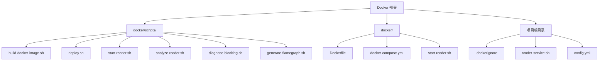
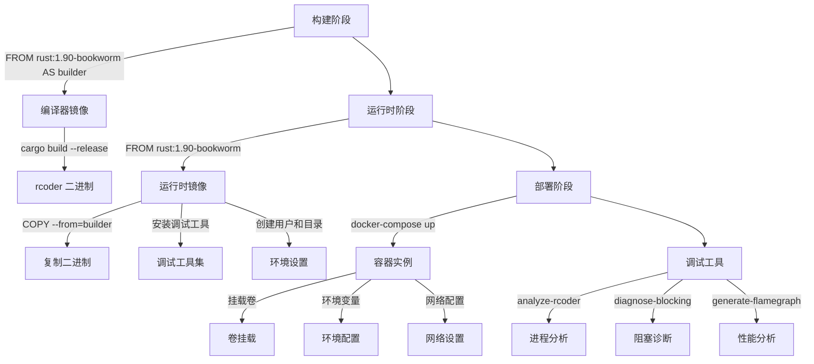
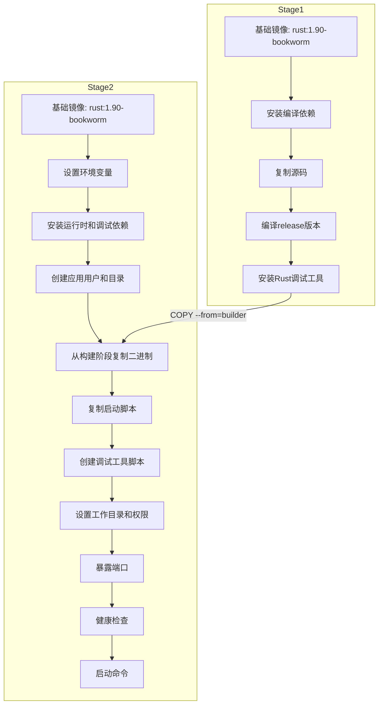
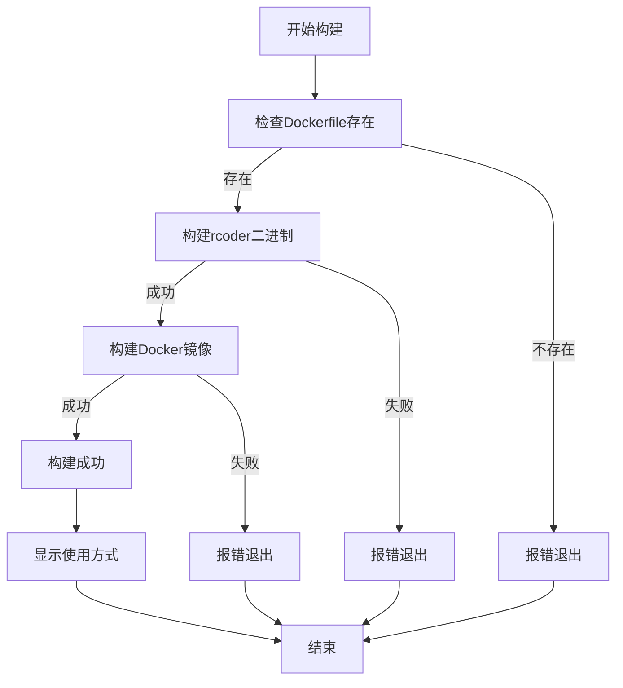
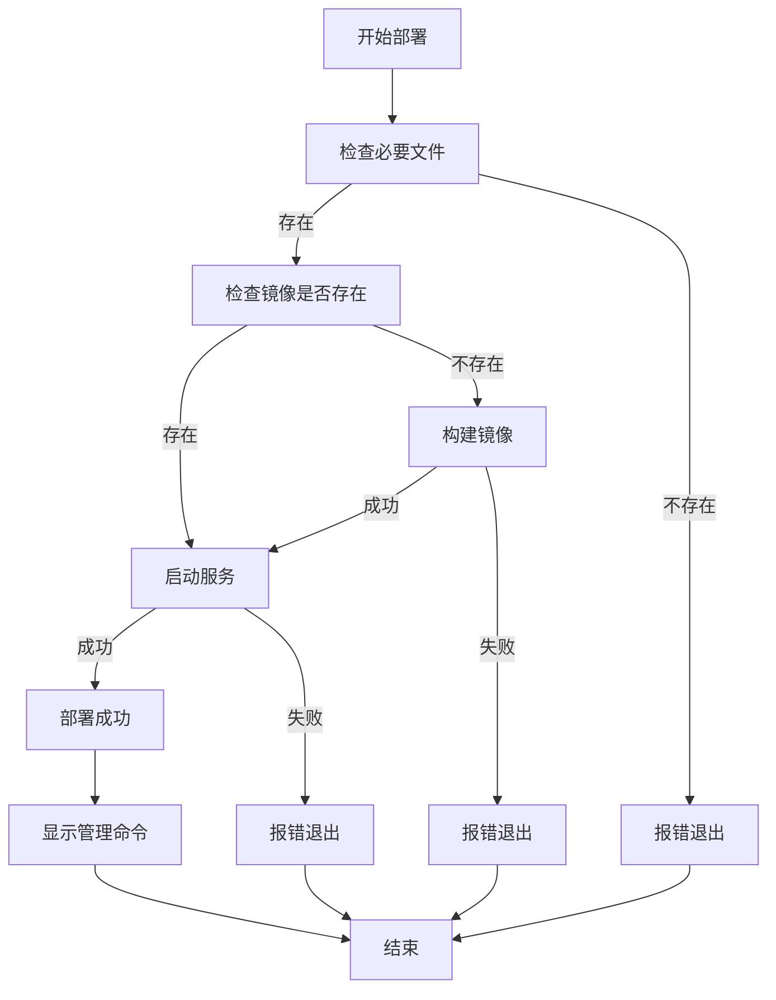
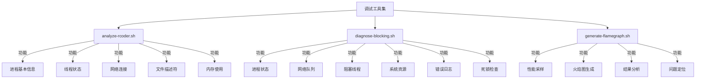
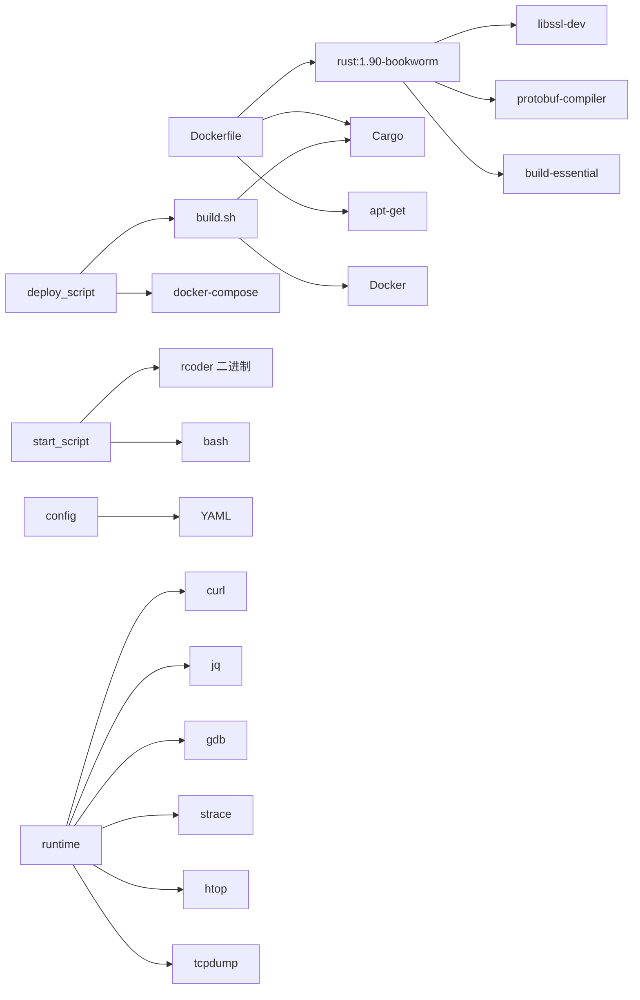
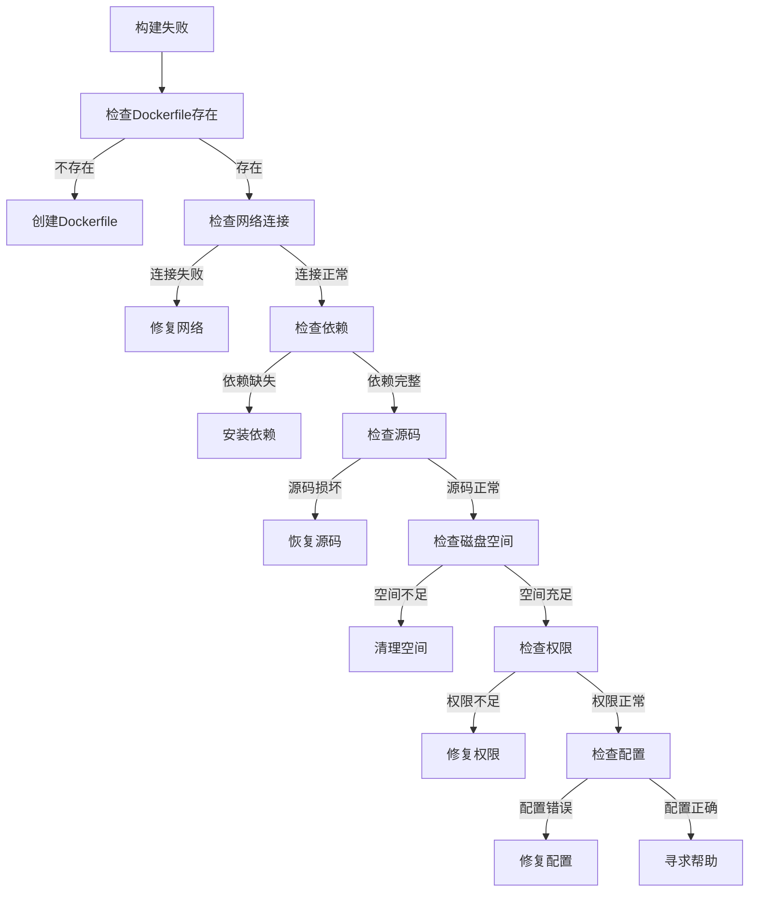

# Docker部署

<cite>
**本文档引用的文件**
- [Dockerfile](file://docker/Dockerfile)
- [build-docker-image.sh](file://docker/scripts/build-docker-image.sh)
- [docker-compose.yml](file://docker/docker-compose.yml)
- [.dockerignore](file://.dockerignore)
- [start-rcoder.sh](file://docker/start-rcoder.sh)
- [deploy.sh](file://docker/scripts/deploy.sh)
- [analyze-rcoder.sh](file://docker/scripts/analyze-rcoder.sh)
- [generate-flamegraph.sh](file://docker/scripts/generate-flamegraph.sh)
- [diagnose-blocking.sh](file://docker/scripts/diagnose-blocking.sh)
- [rcoder-service.sh](file://rcoder-service.sh)
- [config.yml](file://config.yml)
</cite>

## 目录
1. [简介](#简介)
2. [项目结构](#项目结构)
3. [核心组件](#核心组件)
4. [架构概述](#架构概述)
5. [详细组件分析](#详细组件分析)
6. [依赖分析](#依赖分析)
7. [性能考虑](#性能考虑)
8. [故障排除指南](#故障排除指南)
9. [结论](#结论)

## 简介
本文档详细介绍了Rcoder项目的Docker部署方案。文档深入解析了多阶段构建过程、基础镜像选择、依赖安装和二进制文件复制策略。通过实际代码库中的具体示例，展示了构建脚本`build-docker-image.sh`的使用方法和参数配置。文档还记录了环境变量、挂载卷和网络配置的最佳实践，解释了Docker部署与rcoder主服务的集成关系，并提供了常见构建失败、权限问题和容器启动错误的解决方案。为初学者提供逐步指导的同时，也为高级用户提供性能优化和安全加固建议。

## 项目结构

**图源**
- [docker/Dockerfile](file://docker/Dockerfile)
- [docker/scripts/](file://docker/scripts/)
- [docker-compose.yml](file://docker/docker-compose.yml)

**本节来源**
- [docker/Dockerfile](file://docker/Dockerfile)
- [docker/scripts/](file://docker/scripts/)
- [docker-compose.yml](file://docker/docker-compose.yml)

## 核心组件

本文档的核心组件包括Docker多阶段构建系统、调试工具集、部署脚本和配置管理。Dockerfile采用多阶段构建策略，分离编译和运行环境，确保生产镜像的轻量化和安全性。构建脚本`build-docker-image.sh`自动化了镜像构建流程，而`deploy.sh`脚本则提供了完整的部署解决方案。调试工具集包括`analyze-rcoder.sh`、`diagnose-blocking.sh`和`generate-flamegraph.sh`，为生产环境的问题诊断提供了强大支持。

**本节来源**
- [docker/Dockerfile](file://docker/Dockerfile)
- [docker/scripts/build-docker-image.sh](file://docker/scripts/build-docker-image.sh)
- [docker/scripts/deploy.sh](file://docker/scripts/deploy.sh)

## 架构概述

**图源**
- [docker/Dockerfile](file://docker/Dockerfile)
- [docker-compose.yml](file://docker/docker-compose.yml)
- [docker/scripts/](file://docker/scripts/)

## 详细组件分析

### Docker多阶段构建分析

**图源**
- [docker/Dockerfile](file://docker/Dockerfile#L12-L304)

**本节来源**
- [docker/Dockerfile](file://docker/Dockerfile#L12-L304)

### 构建脚本分析

**图源**
- [docker/scripts/build-docker-image.sh](file://docker/scripts/build-docker-image.sh#L1-L38)

**本节来源**
- [docker/scripts/build-docker-image.sh](file://docker/scripts/build-docker-image.sh#L1-L38)

### 部署脚本分析

**图源**
- [docker/scripts/deploy.sh](file://docker/scripts/deploy.sh#L1-L42)

**本节来源**
- [docker/scripts/deploy.sh](file://docker/scripts/deploy.sh#L1-L42)

### 调试工具分析

**图源**
- [docker/scripts/analyze-rcoder.sh](file://docker/scripts/analyze-rcoder.sh)
- [docker/scripts/diagnose-blocking.sh](file://docker/scripts/diagnose-blocking.sh)
- [docker/scripts/generate-flamegraph.sh](file://docker/scripts/generate-flamegraph.sh)

**本节来源**
- [docker/scripts/analyze-rcoder.sh](file://docker/scripts/analyze-rcoder.sh)
- [docker/scripts/diagnose-blocking.sh](file://docker/scripts/diagnose-blocking.sh)
- [docker/scripts/generate-flamegraph.sh](file://docker/scripts/generate-flamegraph.sh)

## 依赖分析

**图源**
- [docker/Dockerfile](file://docker/Dockerfile)
- [docker/scripts/build-docker-image.sh](file://docker/scripts/build-docker-image.sh)
- [docker/scripts/deploy.sh](file://docker/scripts/deploy.sh)

**本节来源**
- [docker/Dockerfile](file://docker/Dockerfile)
- [docker/scripts/build-docker-image.sh](file://docker/scripts/build-docker-image.sh)
- [docker/scripts/deploy.sh](file://docker/scripts/deploy.sh)

## 性能考虑

Rcoder的Docker部署在性能方面进行了多项优化。多阶段构建确保了运行时镜像的轻量化，减少了攻击面和启动时间。调试镜像包含了完整的性能分析工具集，包括`perf`、`flamegraph`和`strace`，可以进行深入的性能分析。`generate-flamegraph.sh`脚本自动化了火焰图的生成过程，帮助开发者快速定位性能瓶颈。`diagnose-blocking.sh`脚本专门用于诊断阻塞问题，通过分析线程状态和系统调用，快速发现潜在的性能问题。

**本节来源**
- [docker/Dockerfile](file://docker/Dockerfile)
- [docker/scripts/generate-flamegraph.sh](file://docker/scripts/generate-flamegraph.sh)
- [docker/scripts/diagnose-blocking.sh](file://docker/scripts/diagnose-blocking.sh)

## 故障排除指南

### 常见构建失败解决方案

**本节来源**
- [docker/scripts/build-docker-image.sh](file://docker/scripts/build-docker-image.sh)
- [docker/Dockerfile](file://docker/Dockerfile)

### 权限问题解决方案

当遇到权限问题时，首先检查Docker守护进程是否正在运行，并确保当前用户有权限访问Docker socket。如果使用`sudo`运行Docker命令，考虑将用户添加到`docker`组以避免权限问题。对于容器内部的权限问题，检查Dockerfile中是否正确创建了应用用户，并确保挂载卷的权限设置正确。

**本节来源**
- [docker/Dockerfile](file://docker/Dockerfile)
- [docker/docker-compose.yml](file://docker/docker-compose.yml)

### 容器启动错误解决方案

容器启动错误可能由多种原因引起。首先检查`docker-compose.yml`文件中的配置是否正确，特别是端口映射和卷挂载。使用`docker logs`命令查看容器日志，定位具体的错误信息。如果遇到依赖缺失问题，确保所有必要的依赖都已正确安装。对于网络问题，检查容器的网络配置和防火墙设置。

**本节来源**
- [docker/docker-compose.yml](file://docker/docker-compose.yml)
- [docker/scripts/deploy.sh](file://docker/scripts/deploy.sh)

## 结论

Rcoder项目的Docker部署方案设计精良，采用了多阶段构建策略，确保了生产环境的安全性和效率。调试镜像包含了丰富的诊断工具，为生产环境的问题排查提供了强大支持。构建和部署脚本自动化了整个流程，降低了人为错误的风险。通过合理的配置管理和卷挂载策略，实现了配置与代码的分离，提高了部署的灵活性。整体方案既适合初学者快速上手，也为高级用户提供了深入优化和调试的可能性。