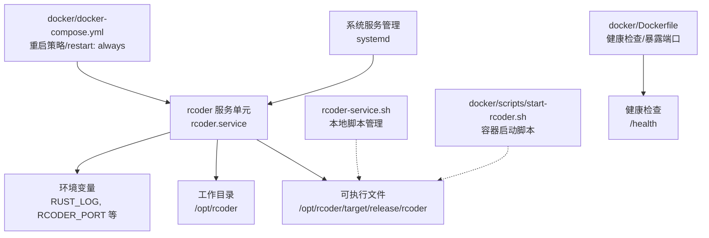
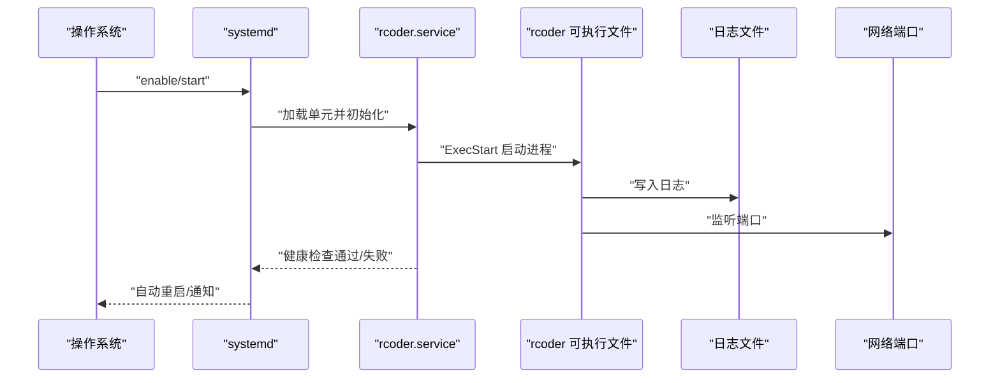
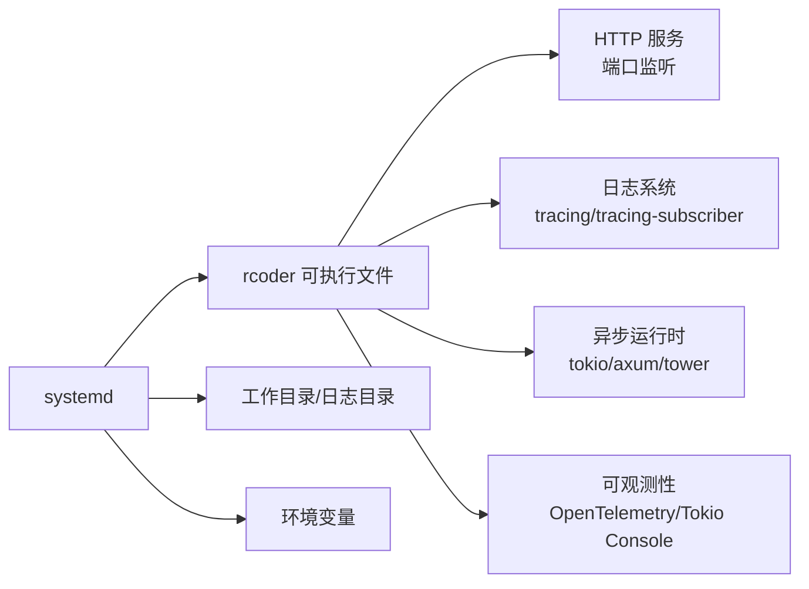
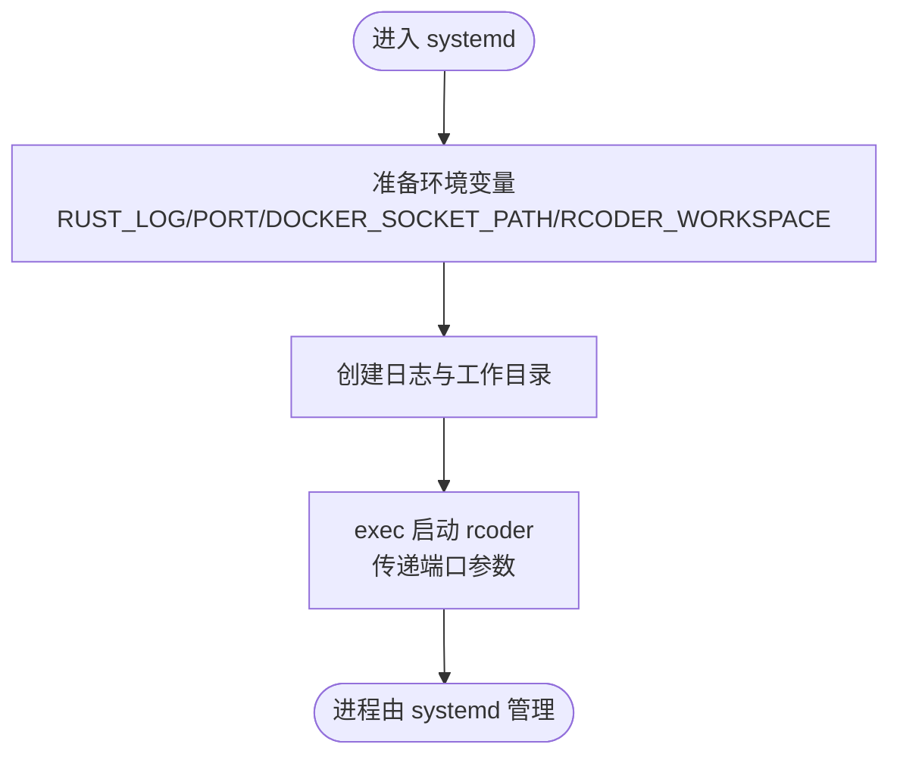

# systemd服务管理

<cite>
**本文引用的文件**
- [rcoder-service.sh](file://rcoder-service.sh)
- [README.md](file://README.md)
- [docker/scripts/start-rcoder.sh](file://docker/scripts/start-rcoder.sh)
- [docker/Dockerfile](file://docker/Dockerfile)
- [docker/docker-compose.yml](file://docker/docker-compose.yml)
- [Cargo.toml](file://Cargo.toml)
</cite>

## 目录
1. [简介](#简介)
2. [项目结构](#项目结构)
3. [核心组件](#核心组件)
4. [架构总览](#架构总览)
5. [详细组件分析](#详细组件分析)
6. [依赖关系分析](#依赖关系分析)
7. [性能考虑](#性能考虑)
8. [故障排查指南](#故障排查指南)
9. [结论](#结论)
10. [附录](#附录)

## 简介
本文件面向运维与开发团队，系统性阐述如何将 rcoder 服务通过 systemd 进行开机自启、自动重启与状态监控，并结合仓库内的脚本与配置，给出完整的集成方案与最佳实践。重点覆盖：
- rcoder-service.sh 与 systemd 的集成方式与差异
- systemd 服务单元文件的编写要点（[Service]、[Install]、[Timer]）
- start-rcoder.sh 在 systemd 上下文中的执行流程与环境准备
- 日志查看、状态查询与故障排查的标准操作
- 权限管理、资源限制与安全沙箱的配置建议
- 常见问题（启动失败、权限不足、依赖未就绪）的定位与解决

## 项目结构
围绕 systemd 集成的关键文件与位置如下：
- systemd 服务单元示例位于 README.md 中，提供标准的 [Unit]/[Service]/[Install] 配置模板
- rcoder-service.sh 是传统“手动服务管理脚本”，用于本地或非 systemd 场景
- docker/scripts/start-rcoder.sh 是容器场景下的启动脚本，展示环境变量与工作目录准备
- docker/Dockerfile 与 docker/docker-compose.yml 展示了容器内健康检查与重启策略
- Cargo.toml 描述了项目依赖与运行时特性，有助于理解 systemd 下的运行环境

图表来源
- [README.md](file://README.md#L560-L583)
- [rcoder-service.sh](file://rcoder-service.sh#L134-L191)
- [docker/scripts/start-rcoder.sh](file://docker/scripts/start-rcoder.sh#L1-L23)
- [docker/Dockerfile](file://docker/Dockerfile#L293-L304)
- [docker/docker-compose.yml](file://docker/docker-compose.yml#L30-L33)

章节来源
- [README.md](file://README.md#L560-L583)
- [rcoder-service.sh](file://rcoder-service.sh#L1-L328)
- [docker/scripts/start-rcoder.sh](file://docker/scripts/start-rcoder.sh#L1-L23)
- [docker/Dockerfile](file://docker/Dockerfile#L293-L304)
- [docker/docker-compose.yml](file://docker/docker-compose.yml#L30-L33)

## 核心组件
- systemd 服务单元：定义服务行为、用户、工作目录、环境变量、重启策略与安装目标
- rcoder-service.sh：提供 start/stop/restart/status 的本地脚本化管理，适合非 systemd 场景
- start-rcoder.sh：容器内启动脚本，负责环境变量注入、目录创建与执行 rcoder
- 健康检查与重启策略：Dockerfile 的 HEALTHCHECK 与 docker-compose.yml 的 restart: always 体现容器层面的自愈能力

章节来源
- [README.md](file://README.md#L560-L583)
- [rcoder-service.sh](file://rcoder-service.sh#L134-L284)
- [docker/scripts/start-rcoder.sh](file://docker/scripts/start-rcoder.sh#L1-L23)
- [docker/Dockerfile](file://docker/Dockerfile#L293-L304)
- [docker/docker-compose.yml](file://docker/docker-compose.yml#L30-L33)

## 架构总览
下图展示了 systemd 与 rcoder 的典型交互：systemd 启动 rcoder，rcoder 通过健康检查对外提供服务；容器场景下，start-rcoder.sh 负责环境准备与进程启动。

图表来源
- [README.md](file://README.md#L560-L583)
- [docker/Dockerfile](file://docker/Dockerfile#L293-L304)

## 详细组件分析

### systemd 服务单元文件编写指南
- [Unit]：描述服务元信息与依赖时机
  - Description：服务描述
  - After：在网络就绪后再启动
- [Service]：核心执行与生命周期控制
  - Type：simple（systemd 直接管理 ExecStart 进程）
  - User：指定运行用户（建议独立非 root 用户）
  - WorkingDirectory：工作目录（存放配置、日志、PID 文件）
  - ExecStart：启动命令（建议使用绝对路径）
  - Restart：always（异常退出后自动重启）
  - RestartSec：重启间隔（避免频繁抖动）
  - Environment：注入日志级别、端口等环境变量
- [Install]：安装目标
  - WantedBy：multi-user.target（多用户运行级别）

章节来源
- [README.md](file://README.md#L560-L583)

### rcoder-service.sh 与 systemd 的差异与迁移建议
- rcoder-service.sh 的职责
  - 依赖检查（可执行文件、Bun/NPM 等）
  - PID 文件管理与进程状态判断
  - 日志输出与错误提示
  - 启停与状态查询
- 与 systemd 的差异
  - rcoder-service.sh 为“前台”脚本，systemd 期望“后台”守护进程
  - rcoder-service.sh 自带 nohup 与日志重定向，systemd 通过 StandardOutput/StandardError 管理日志
  - rcoder-service.sh 依赖本地 PATH 与工作目录，systemd 通过 WorkingDirectory 与 Environment 管理
- 迁移建议
  - 若仍使用 rcoder-service.sh，建议将其作为 ExecStart 的入口脚本，但需确保其按 systemd 期望的“后台”方式运行
  - 更推荐直接使用 ExecStart 指向 rcoder 可执行文件，并通过 Environment 注入所需变量

章节来源
- [rcoder-service.sh](file://rcoder-service.sh#L68-L103)
- [rcoder-service.sh](file://rcoder-service.sh#L134-L191)
- [rcoder-service.sh](file://rcoder-service.sh#L193-L236)
- [rcoder-service.sh](file://rcoder-service.sh#L246-L284)

### start-rcoder.sh 在 systemd 上下文中的执行流程与环境准备
- 环境变量准备
  - RUST_LOG：日志级别
  - PORT：服务端口
  - DOCKER_SOCKET_PATH：Docker 套接字路径
  - RCODER_WORKSPACE：工作区目录
- 目录创建
  - logs 与 workspace 目录确保存在
- 启动 rcoder
  - 使用 exec 方式启动，使 systemd 能正确接管进程
  - 通过 -- 参数传递端口给 rcoder

章节来源
- [docker/scripts/start-rcoder.sh](file://docker/scripts/start-rcoder.sh#L1-L23)

### systemd 与容器场景的协同
- docker/Dockerfile
  - EXPOSE 暴露端口（含 tokio-console 端口）
  - HEALTHCHECK 对 /health 进行健康检查
- docker/docker-compose.yml
  - restart: always 提供容器层面的自愈
  - 健康检查与端口映射配合 systemd 的外部可用性

章节来源
- [docker/Dockerfile](file://docker/Dockerfile#L293-L304)
- [docker/docker-compose.yml](file://docker/docker-compose.yml#L30-L33)

## 依赖关系分析
- rcoder 服务对运行时环境的依赖
  - Rust 运行时与日志库（tracing、tracing-subscriber）
  - HTTP 与异步运行时（tokio、axum、tower）
  - OpenTelemetry 与 Tokio Console（可选）
- systemd 对服务的依赖
  - 可执行文件路径与权限
  - 工作目录与日志目录的可写权限
  - 环境变量（端口、日志级别、Docker 套接字等）

图表来源
- [Cargo.toml](file://Cargo.toml#L54-L102)
- [Cargo.toml](file://Cargo.toml#L92-L102)
- [Cargo.toml](file://Cargo.toml#L199-L205)

章节来源
- [Cargo.toml](file://Cargo.toml#L54-L102)
- [Cargo.toml](file://Cargo.toml#L92-L102)
- [Cargo.toml](file://Cargo.toml#L199-L205)

## 性能考虑
- 日志级别与性能
  - RUST_LOG=info 适合生产；debug 会增加 IO 与 CPU 开销
- 端口与网络
  - 确保端口未被占用；合理规划防火墙规则
- 健康检查与重启
  - HEALTHCHECK 与 restart: always 可提升可用性，但需避免过度重启导致抖动
- 资源限制
  - systemd 可通过 LimitNOFILE、LimitMEM/CPU 等进行资源约束（建议在单元文件中配置）

[本节为通用指导，不直接分析具体文件]

## 故障排查指南
- 启动失败
  - 检查 ExecStart 路径与权限
  - 查看日志：journalctl -u rcoder -f
  - 验证环境变量是否正确注入
- 权限不足
  - 确认 User 拥有工作目录与日志目录的读写权限
  - 端口是否需要 root 权限（建议使用非特权端口）
- 依赖服务未就绪
  - 使用 After=network.target 等依赖时机
  - 在容器场景下，确认 Docker 套接字挂载与权限
- 日志查看与状态查询
  - 日志：journalctl -u rcoder -n 100
  - 状态：systemctl status rcoder
  - 启停：systemctl start/stop/restart rcoder
- 常见问题定位
  - 端口占用：调整 RCODER_PORT 或停止占用进程
  - 端口被占用：参考 README 中的端口调整示例

章节来源
- [README.md](file://README.md#L560-L583)
- [rcoder-service.sh](file://rcoder-service.sh#L134-L191)
- [rcoder-service.sh](file://rcoder-service.sh#L193-L236)
- [rcoder-service.sh](file://rcoder-service.sh#L246-L284)

## 结论
- systemd 集成 rcoder 的关键在于：明确的单元文件、正确的 ExecStart、合理的环境变量与工作目录、以及可靠的健康检查与重启策略
- 若采用容器部署，start-rcoder.sh 提供了清晰的环境准备与启动流程，可作为 systemd ExecStart 的入口脚本
- 生产环境中建议结合日志级别控制、资源限制与健康检查，确保服务稳定与可观测

[本节为总结性内容，不直接分析具体文件]

## 附录

### systemd 服务单元文件编写示例（基于仓库内容）
- [Unit]
  - Description：RCoder AI Development Platform
  - After：network.target
- [Service]
  - Type：simple
  - User：rcoder
  - WorkingDirectory：/opt/rcoder
  - ExecStart：/opt/rcoder/target/release/rcoder --port 3000
  - Restart：always
  - RestartSec：5
  - Environment：RUST_LOG=info；RCODER_PORT=3000
- [Install]
  - WantedBy：multi-user.target

章节来源
- [README.md](file://README.md#L560-L583)

### start-rcoder.sh 在 systemd 上下文中的执行流程

图表来源
- [docker/scripts/start-rcoder.sh](file://docker/scripts/start-rcoder.sh#L1-L23)

### 日志查看、状态查询与故障排查标准操作
- 日志查看
  - journalctl -u rcoder -f
  - journalctl -u rcoder -n 100
- 状态查询
  - systemctl status rcoder
- 启停控制
  - systemctl start/stop/restart rcoder
- 常见问题
  - 端口被占用：调整端口或释放占用进程
  - 权限不足：修正用户与目录权限
  - 依赖未就绪：检查 After 与 Docker 套接字挂载

章节来源
- [README.md](file://README.md#L560-L583)
- [rcoder-service.sh](file://rcoder-service.sh#L134-L191)
- [rcoder-service.sh](file://rcoder-service.sh#L193-L236)
- [rcoder-service.sh](file://rcoder-service.sh#L246-L284)