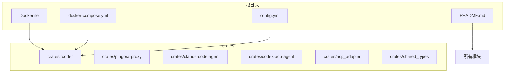
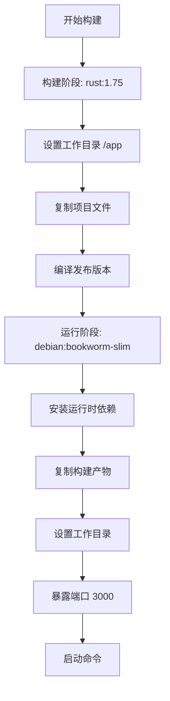
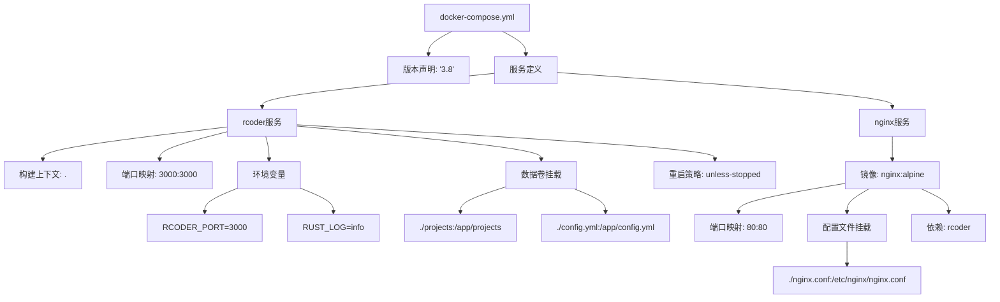
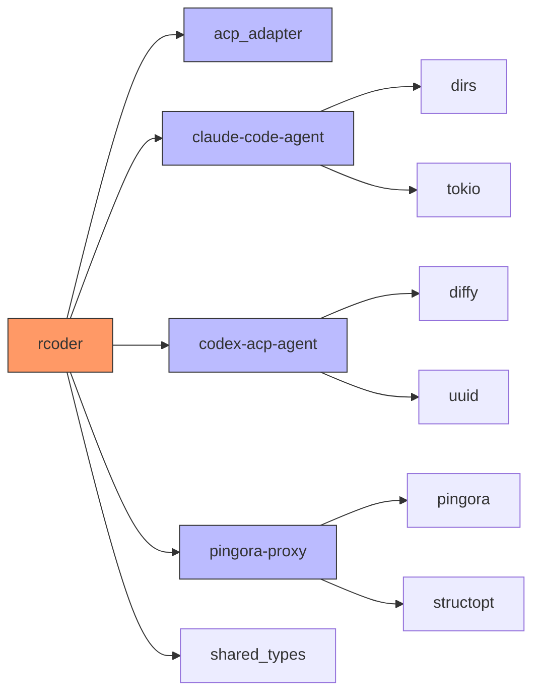

# 容器化部署

<cite>
**本文档中引用的文件**  
- [Dockerfile](file://Dockerfile)
- [docker-compose.yml](file://docker-compose.yml)
- [config.yml](file://config.yml)
- [README.md](file://README.md)
</cite>

## 目录
1. [简介](#简介)
2. [项目结构](#项目结构)
3. [核心组件](#核心组件)
4. [架构概述](#架构概述)
5. [详细组件分析](#详细组件分析)
6. [依赖分析](#依赖分析)
7. [性能考虑](#性能考虑)
8. [故障排除指南](#故障排除指南)
9. [结论](#结论)
10. [附录](#附录)（如有必要）

## 简介
本文档提供RCoder项目的全面容器化部署指南，涵盖Docker和Docker Compose两种部署方式。文档深入解析了Dockerfile的每一层指令，包括基础镜像选择、依赖安装、二进制构建和多阶段构建优化策略。同时提供了完整的镜像构建命令示例，并解释了关键构建参数。文档还详细说明了docker-compose.yml的配置结构，包括服务定义、端口映射、环境变量注入、持久化卷挂载以及服务间网络配置。此外，文档演示了如何通过docker-compose启动、停止和监控服务，并包含了常见容器启动失败的排查方法。

## 项目结构
RCoder项目采用Rust工作区（workspace）结构，包含多个独立的crates，每个crate负责特定功能模块。项目根目录包含主配置文件、Docker相关文件和启动脚本。核心功能分布在crates目录下，包括主应用rcoder、Pingora反向代理、AI代理适配器等模块。这种模块化设计使得各组件可以独立开发和测试，同时通过Cargo工作区统一管理依赖和构建。



**图源**  
- [Dockerfile](file://Dockerfile)
- [docker-compose.yml](file://docker-compose.yml)
- [config.yml](file://config.yml)
- [README.md](file://README.md)

**本节来源**  
- [README.md](file://README.md#L0-L651)
- [项目结构](file://#L0-L30)

## 核心组件
RCoder的核心组件包括基于Axum的HTTP服务器、基于Pingora的高性能反向代理、多AI代理支持系统和统一的配置管理系统。主应用通过Axum框架提供REST API接口和SSE实时进度流，同时集成Pingora反向代理实现高性能的端口路由功能。系统支持多种AI代理，通过ACP（Agent Client Protocol）协议实现统一交互。配置系统支持命令行参数、环境变量和配置文件三种方式，具有明确的优先级顺序。

**本节来源**  
- [README.md](file://README.md#L0-L651)
- [crates/rcoder/src/main.rs](file://crates/rcoder/src/main.rs)
- [crates/pingora-proxy/src/lib.rs](file://crates/pingora-proxy/src/lib.rs)

## 架构概述
RCoder采用现代化的微服务架构设计，主服务与反向代理并行运行，互不阻塞。Axum主服务负责业务API、会话管理和SSE进度流，而Pingora反向代理则独立监听代理端口，按路径前缀进行请求转发。两者通过清晰的职责分离实现了高性能和高可用性。系统通过MCP（Model Context Protocol）服务器集成多种AI代理，包括context7和frontend-template等，为开发者提供丰富的AI辅助功能。

```mermaid
graph TB
A[客户端] --> B[Axum HTTP服务器]
A --> C[Pingora反向代理]
B --> D[API路由]
B --> E[代理工作线程]
C --> F[后端服务: 127.0.0.1:{端口}]
subgraph "AI代理集成"
G[context7 MCP服务器]
H[frontend-template MCP服务器]
E --> G
E --> H
end
style A fill:#f9f,stroke:#333
style B fill:#bbf,stroke:#333
style C fill:#f96,stroke:#333
```

**图源**  
- [README.md](file://README.md#L0-L651)
- [crates/rcoder/src/utils/mcp_config.rs](file://crates/rcoder/src/utils/mcp_config.rs#L0-L194)
- [crates/rcoder/src/config.rs](file://crates/rcoder/src/config.rs#L50-L104)

## 详细组件分析
### Docker部署配置分析
RCoder的Docker部署采用多阶段构建策略，优化了镜像大小和构建效率。构建过程分为两个阶段：构建阶段使用Rust基础镜像编译应用程序，运行阶段使用轻量级Debian镜像部署编译后的二进制文件。这种设计既保证了构建环境的完整性，又最大限度地减少了最终镜像的体积。

#### Dockerfile指令解析


**图源**  
- [Dockerfile](file://Dockerfile)
- [README.md](file://README.md#L492-L518)

**本节来源**  
- [Dockerfile](file://Dockerfile)
- [README.md](file://README.md#L492-L518)

### Docker Compose配置分析
Docker Compose配置文件定义了RCoder服务的完整运行环境，包括主服务和可选的Nginx反向代理。配置采用了版本3.8语法，确保了与现代Docker版本的兼容性。服务配置包含了端口映射、环境变量、数据卷挂载和重启策略等关键参数。

#### docker-compose.yml结构说明


**图源**  
- [docker-compose.yml](file://docker-compose.yml)
- [README.md](file://README.md#L530-L596)

**本节来源**  
- [docker-compose.yml](file://docker-compose.yml)
- [README.md](file://README.md#L530-L596)

## 依赖分析
RCoder项目的依赖关系复杂而清晰，通过Cargo工作区机制进行统一管理。主应用rcoder依赖于多个内部crates，包括acp_adapter、claude-code-agent、codex-acp-agent等AI代理适配器，以及pingora-proxy反向代理模块。外部依赖包括Axum、Tokio、Serde等Rust生态中的主流库。Docker部署引入了额外的运行时依赖，如ca-certificates和libssl3，确保容器环境的完整性和安全性。



**图源**  
- [Cargo.toml](file://Cargo.toml#L125-L173)
- [crates/codex-acp-agent/Cargo.toml](file://crates/codex-acp-agent/Cargo.toml#L0-L52)
- [crates/claude-code-agent/src/util.rs](file://crates/claude-code-agent/src/util.rs#L42-L128)

**本节来源**  
- [Cargo.toml](file://Cargo.toml)
- [crates/*/Cargo.toml](file://crates/*/Cargo.toml)

## 性能考虑
在容器化部署中，RCoder的性能优化主要体现在多阶段构建、轻量级运行时和合理的资源配置上。多阶段构建策略将构建环境与运行环境分离，最终镜像仅包含必要的运行时依赖，显著减小了镜像体积。使用debian:bookworm-slim作为基础镜像，进一步减少了攻击面和网络传输开销。在Docker Compose配置中，通过设置适当的重启策略和资源限制，确保了服务的稳定性和资源利用率。

## 故障排除指南
容器化部署过程中可能遇到多种问题，以下是常见故障的排查方法：

**本节来源**  
- [README.md](file://README.md#L0-L651)
- [config.yml](file://config.yml#L0-L28)

### 权限问题排查
当容器无法访问挂载的卷或配置文件时，通常是由文件权限问题引起的。解决方案包括：
- 确保宿主机文件对容器内运行用户可读
- 在docker-compose.yml中指定用户ID
- 使用适当的文件权限设置（如755目录权限，644文件权限）

### 端口冲突排查
端口冲突是容器启动失败的常见原因，排查步骤包括：
- 使用`docker ps`检查已运行容器的端口占用情况
- 使用`netstat -tuln | grep <端口>`检查宿主机端口占用
- 修改docker-compose.yml中的端口映射配置
- 确保防火墙规则允许相应端口的通信

### 依赖服务未就绪排查
当RCoder服务依赖其他服务（如数据库或缓存）时，可能出现依赖服务未就绪的问题。解决方案包括：
- 在docker-compose.yml中使用`depends_on`指定服务依赖关系
- 实现服务健康检查和重试机制
- 使用初始化脚本等待依赖服务就绪
- 配置适当的超时和重试参数

## 结论
RCoder项目提供了完善的容器化部署方案，通过Docker和Docker Compose实现了灵活、可移植的部署方式。多阶段构建策略优化了镜像大小和构建效率，而详细的配置文件提供了丰富的自定义选项。部署方案充分考虑了生产环境的需求，包括持久化存储、环境变量配置和重启策略等关键特性。通过遵循本文档的指导，用户可以快速、可靠地部署RCoder服务，并根据具体需求进行定制化配置。

## 附录
### 完整的Docker构建和运行命令
```bash
# 构建镜像
docker build -t rcoder:latest .

# 运行容器
docker run -p 3000:3000 \
  -e RCODER_PORT=3000 \
  -v $(pwd)/projects:/app/projects \
  -v $(pwd)/config.yml:/app/config.yml \
  rcoder:latest
```

### 完整的Docker Compose命令
```bash
# 启动服务
docker-compose up -d

# 停止服务
docker-compose down

# 查看服务状态
docker-compose ps

# 查看日志
docker-compose logs -f
```