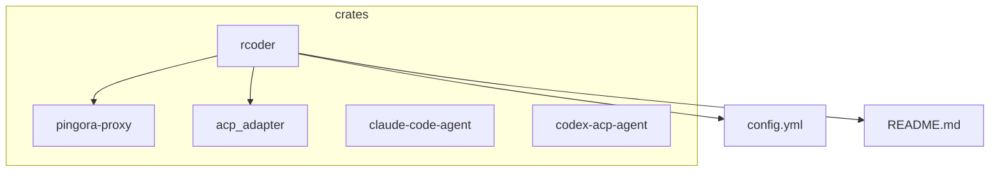
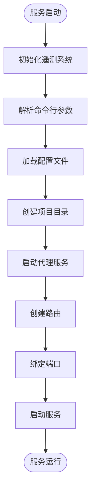
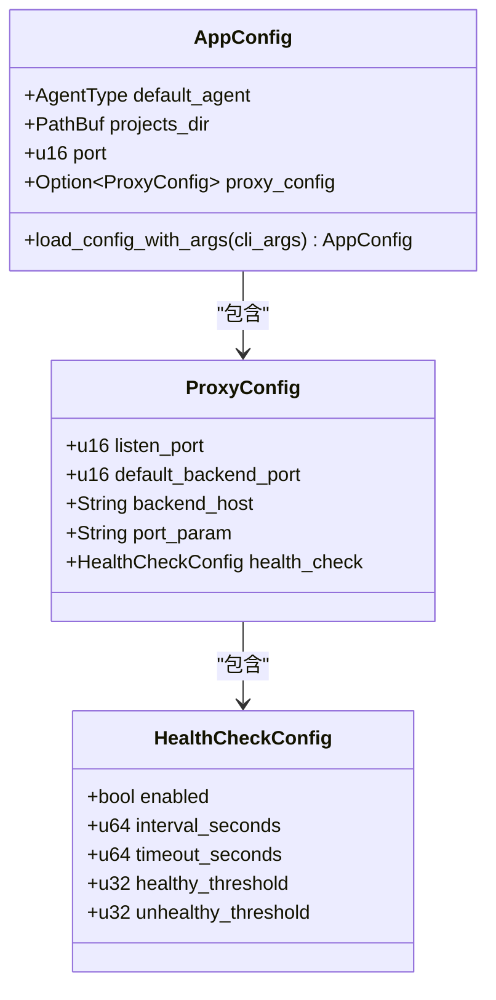
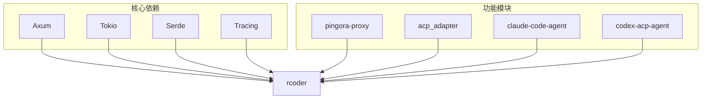

# 服务管理

<cite>
**本文档引用的文件**
- [main.rs](file://crates/rcoder/src/main.rs)
- [config.rs](file://crates/rcoder/src/config.rs)
- [config.yml](file://config.yml)
- [README.md](file://README.md)
</cite>

## 目录
1. [简介](#简介)
2. [项目结构](#项目结构)
3. [核心组件](#核心组件)
4. [架构概述](#架构概述)
5. [详细组件分析](#详细组件分析)
6. [依赖分析](#依赖分析)
7. [性能考虑](#性能考虑)
8. [故障排除指南](#故障排除指南)
9. [结论](#结论)

## 简介
rcoder 是一个基于 Rust 构建的现代化 AI 驱动开发平台，通过 ACP (Agent Client Protocol) 协议实现与多种 AI 代理的统一交互。该平台提供简洁的 HTTP API 接口，让开发者能够轻松集成和管理 AI 辅助开发功能。本指南重点介绍如何将 rcoder 服务注册为系统守护进程，并提供 systemd 服务单元文件的完整配置示例。

**Section sources**
- [README.md](file://README.md#L1-L50)

## 项目结构
rcoder 项目采用模块化设计，主要由多个 crates 组成，包括主应用、代理适配器、协议封装等。主应用位于 `crates/rcoder` 目录下，负责业务逻辑、路由处理和配置管理。`crates/pingora-proxy` 封装了 Cloudflare Pingora 反向代理功能，提供高性能的端口路由能力。配置文件 `config.yml` 位于项目根目录，定义了服务的基本参数。



**Diagram sources**
- [README.md](file://README.md#L150-L200)
- [config.yml](file://config.yml#L1-L5)

## 核心组件
rcoder 的核心组件包括主服务、反向代理、AI 代理管理和配置系统。主服务基于 Axum 框架构建，处理业务 API 和会话管理。反向代理基于 Cloudflare Pingora 实现，提供高性能的 `/proxy/{port}/{path}` 路由功能。AI 代理管理通过 ACP 协议统一接入 Codex、Claude Code 等多种 AI 代理。配置系统支持命令行参数、环境变量和配置文件三种方式，优先级为命令行 > 环境变量 > 配置文件。

**Section sources**
- [main.rs](file://crates/rcoder/src/main.rs#L1-L50)
- [config.rs](file://crates/rcoder/src/config.rs#L1-L50)

## 架构概述
rcoder 采用异步架构，基于 Tokio 运行时实现高并发处理。系统由两个主要服务组成：Axum 主服务和 Pingora 反向代理服务。Axum 服务负责处理业务 API、会话管理和 SSE 进度流，监听主端口（默认 3000）。Pingora 服务负责反向代理，监听代理端口（默认 8080），按路径前缀 `/proxy/{port}/{path}` 转发到指定后端。两个服务并行运行，互不阻塞。

```mermaid
graph TB
A[客户端] --> B[Axum HTTP 服务]
A --> C[Pingora 代理]
B --> D[API 路由]
B --> E[代理工作线程 (LocalSet)]
C --> F[后端: 127.0.0.1:{port}]
```

**Diagram sources**
- [README.md](file://README.md#L60-L70)

## 详细组件分析

### 主服务分析
主服务是 rcoder 的核心，负责处理所有业务逻辑和 API 请求。服务启动时会初始化 OpenTelemetry 遥测系统，解析命令行参数，加载配置文件，并创建项目工作目录。主服务使用 Tokio 运行时，通过 `tokio::net::TcpListener` 绑定到指定端口，使用 Axum 框架处理 HTTP 请求。



**Diagram sources**
- [main.rs](file://crates/rcoder/src/main.rs#L1-L100)

### 配置系统分析
rcoder 的配置系统支持多层配置优先级，从高到低依次为：命令行参数、环境变量、配置文件和默认配置。配置文件 `config.yml` 采用 YAML 格式，定义了默认 AI 代理类型、项目工作目录、主服务端口和反向代理配置等参数。系统在启动时会按优先级顺序加载配置，确保最高优先级的配置生效。



**Diagram sources**
- [config.rs](file://crates/rcoder/src/config.rs#L50-L104)

## 依赖分析
rcoder 项目依赖多个 Rust crates 来实现其功能。核心依赖包括 Axum 用于 Web 框架，Tokio 用于异步运行时，Serde 用于序列化，Tracing 用于日志记录。反向代理功能依赖于 `pingora-proxy` crate，AI 代理集成依赖于 `acp_adapter`、`claude-code-agent` 和 `codex-acp-agent` 等 crate。这些依赖关系在 `Cargo.toml` 文件中定义，确保了项目的模块化和可维护性。



**Diagram sources**
- [README.md](file://README.md#L80-L90)

## 性能考虑
rcoder 采用异步架构和高性能组件来确保良好的性能表现。Axum 框架基于 Tokio 运行时，能够高效处理大量并发请求。Pingora 反向代理提供高性能的端口路由能力，避免了传统代理的性能瓶颈。日志系统采用 Tracing + OpenTelemetry 方案，支持结构化日志和分布式追踪，便于性能分析和问题排查。建议在生产环境中使用 release 模式编译，以获得最佳性能。

## 故障排除指南
当 rcoder 服务出现问题时，可以按照以下步骤进行排查。首先检查日志文件，日志位于 `logs/rcoder-*.log` 文件中，按天滚动。确认服务端口是否被占用，可以使用 `netstat` 或 `lsof` 命令检查。验证配置文件格式是否正确，YAML 文件对缩进敏感。如果 AI 代理连接失败，检查相关环境变量和网络连接。对于反向代理问题，确认目标后端服务是否正常运行。

**Section sources**
- [main.rs](file://crates/rcoder/src/main.rs#L200-L220)
- [config.rs](file://crates/rcoder/src/config.rs#L200-L265)

## 结论
rcoder 是一个功能强大且易于部署的 AI 驱动开发平台。通过合理的系统设计和配置管理，可以轻松将其部署为系统服务。使用 systemd 可以方便地管理服务的启动、停止和自启动。在生产环境中，建议结合日志监控和性能分析工具，确保服务的稳定运行。平台的模块化设计也便于后续的功能扩展和维护。