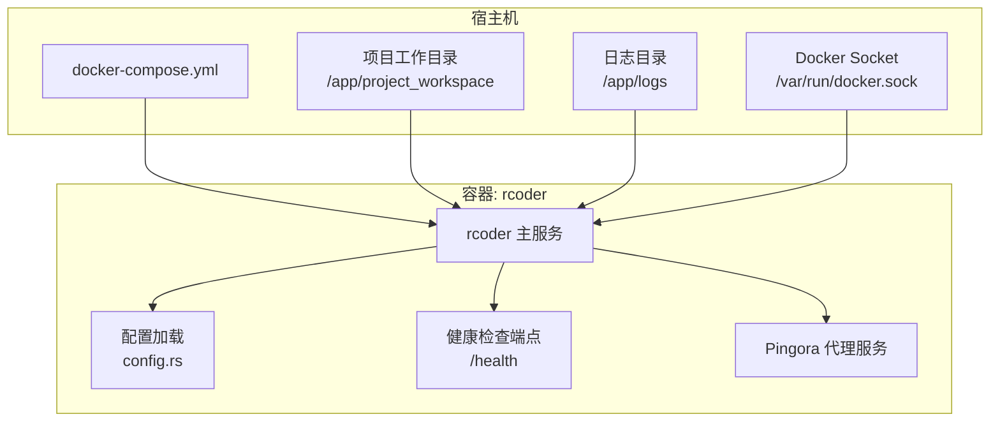
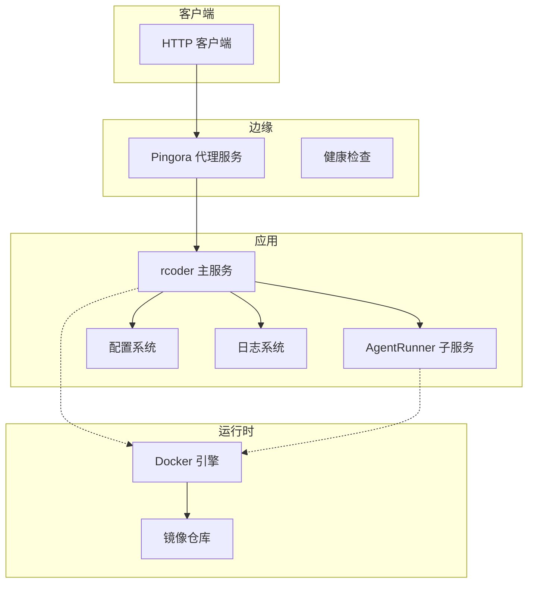
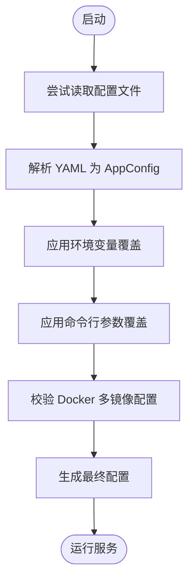
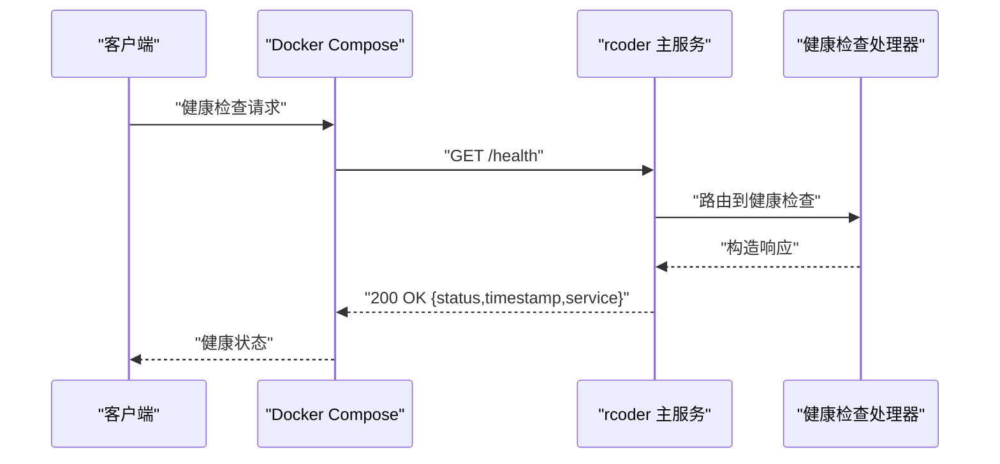
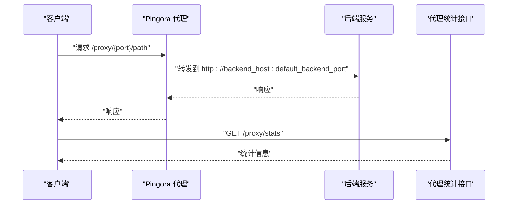
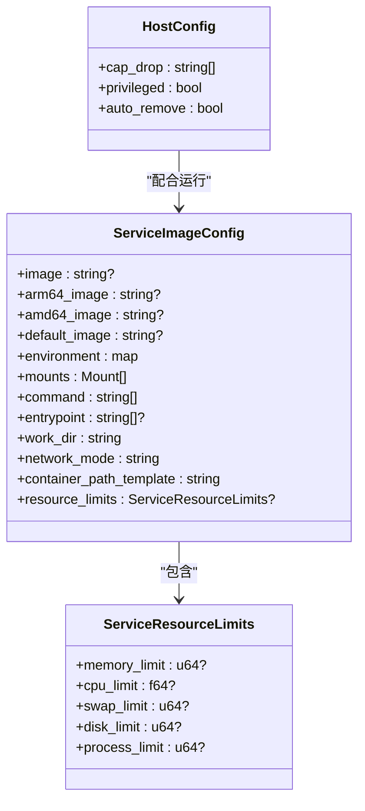
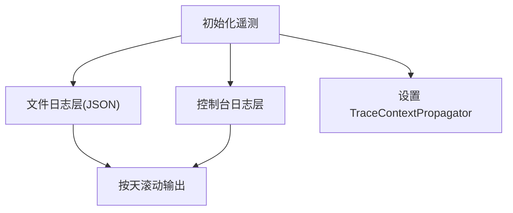
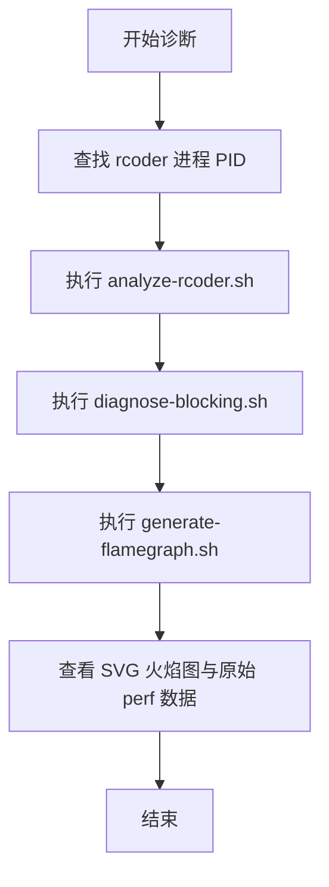
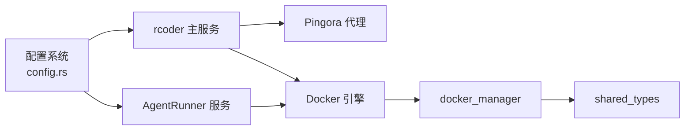

# 生产环境配置

<cite>
**本文引用的文件列表**
- [config.yml](file://config.yml)
- [rcoder_default.yml](file://crates/rcoder/src/rcoder_default.yml)
- [config.rs（rcoder）](file://crates/rcoder/src/config.rs)
- [config.rs（agent_runner）](file://crates/agent_runner/src/config.rs)
- [docker-compose.yml](file://docker/docker-compose.yml)
- [start-rcoder.sh](file://docker/start-rcoder.sh)
- [health_handler.rs](file://crates/rcoder/src/handler/health_handler.rs)
- [analyze-rcoder.sh](file://docker/scripts/analyze-rcoder.sh)
- [diagnose-blocking.sh](file://docker/scripts/diagnose-blocking.sh)
- [generate-flamegraph.sh](file://docker/scripts/generate-flamegraph.sh)
- [server.rs（pingora-proxy）](file://crates/pingora-proxy/src/server.rs)
- [types.rs（docker_manager）](file://crates/docker_manager/src/types.rs)
- [manager.rs（docker_manager）](file://crates/docker_manager/src/manager.rs)
- [service_config.rs（shared_types）](file://crates/shared_types/src/service_config.rs)
- [router.rs（rcoder）](file://crates/rcoder/src/router.rs)
- [main.rs（rcoder）](file://crates/rcoder/src/main.rs)
- [main.rs（agent_runner）](file://crates/agent_runner/src/main.rs)
- [install.md](file://install.md)
</cite>

## 目录
1. [简介](#简介)
2. [项目结构](#项目结构)
3. [核心组件](#核心组件)
4. [架构总览](#架构总览)
5. [详细组件分析](#详细组件分析)
6. [依赖关系分析](#依赖关系分析)
7. [性能考量](#性能考量)
8. [故障排查指南](#故障排查指南)
9. [结论](#结论)
10. [附录](#附录)

## 简介
本文件面向系统管理员与运维工程师，系统化梳理生产环境配置，涵盖 config.yml 中的各项参数、性能调优、安全加固、日志级别、资源限制、健康检查、高可用策略、TLS/访问控制/审计日志建议、配置热更新与敏感信息管理、配置版本控制，以及结合 analyze-rcoder.sh、generate-flamegraph.sh 等诊断脚本的生产监控与瓶颈分析方法，并提供生产部署检查清单与优化建议。

## 项目结构
- 配置来源与优先级：命令行参数 > 环境变量 > 配置文件 > 默认值
- Docker Compose 通过挂载宿主机 Docker Socket 与工作目录，实现容器内对宿主机资源的可见性与隔离
- 服务包含主服务与 AgentRunner 两个子服务，二者共享多镜像配置与资源限制能力

图表来源
- [docker-compose.yml](file://docker/docker-compose.yml#L1-L37)
- [config.rs（rcoder）](file://crates/rcoder/src/config.rs#L253-L354)
- [health_handler.rs](file://crates/rcoder/src/handler/health_handler.rs#L1-L36)
- [server.rs（pingora-proxy）](file://crates/pingora-proxy/src/server.rs#L38-L72)

章节来源
- [docker-compose.yml](file://docker/docker-compose.yml#L1-L37)
- [config.rs（rcoder）](file://crates/rcoder/src/config.rs#L253-L354)

## 核心组件
- 配置加载与优先级
  - 命令行参数覆盖配置文件；环境变量覆盖所有配置；未设置时回退到默认值
  - Docker 配置支持环境变量覆盖（如网络模式、工作目录、自动清理、容器 TTL）
- 健康检查
  - 主服务提供 /health 健康端点；Compose 健康检查基于该端点
- 代理与负载均衡
  - 基于 Pingora 的反向代理，支持轮询/一致性哈希、健康检查、连接池与 HTTP/2
- 资源限制与容器安全
  - 多镜像配置支持为 rcoder 与 agent-runner 设置独立资源限制（内存/CPU/交换）
  - 容器安全通过能力降级与网络隔离策略降低风险
- 日志与遥测
  - 按天滚动 JSON 日志；支持 trace_id 传播；控制台与文件双通道输出

章节来源
- [config.rs（rcoder）](file://crates/rcoder/src/config.rs#L253-L354)
- [config.rs（agent_runner）](file://crates/agent_runner/src/config.rs#L110-L191)
- [health_handler.rs](file://crates/rcoder/src/handler/health_handler.rs#L1-L36)
- [docker-compose.yml](file://docker/docker-compose.yml#L24-L30)
- [server.rs（pingora-proxy）](file://crates/pingora-proxy/src/server.rs#L38-L72)
- [types.rs（docker_manager）](file://crates/docker_manager/src/types.rs#L51-L82)
- [manager.rs（docker_manager）](file://crates/docker_manager/src/manager.rs#L147-L165)
- [main.rs（rcoder）](file://crates/rcoder/src/main.rs#L274-L320)
- [main.rs（agent_runner）](file://crates/agent_runner/src/main.rs#L173-L231)

## 架构总览
生产环境采用“主服务 + 代理 + 多镜像容器”的组合，通过 Docker Compose 统一编排，rcoder 主服务负责业务逻辑与健康检查，Pingora 代理负责端口转发与健康检查，容器内通过资源限制与安全策略保障稳定性与安全性。

图表来源
- [server.rs（pingora-proxy）](file://crates/pingora-proxy/src/server.rs#L38-L72)
- [health_handler.rs](file://crates/rcoder/src/handler/health_handler.rs#L1-L36)
- [config.rs（rcoder）](file://crates/rcoder/src/config.rs#L253-L354)
- [docker-compose.yml](file://docker/docker-compose.yml#L1-L37)

## 详细组件分析

### 配置系统与优先级
- 配置来源与顺序
  - 命令行参数 > 环境变量 > 配置文件 > 默认值
  - DockerConfig 支持环境变量覆盖网络模式、工作目录、自动清理、容器 TTL
- 关键配置项说明（来自 config.yml 与 rcoder_default.yml）
  - default_agent：默认 AI 代理类型
  - projects_dir：项目工作目录
  - port：主服务端口
  - proxy_config.listen_port：代理监听端口
  - proxy_config.default_backend_port：默认后端端口
  - proxy_config.health_check.*：健康检查策略
  - docker_config.multi_image_config.*：多镜像配置（含 rcoder 与 agent-runner 的镜像、环境变量、命令、资源限制、挂载、工作目录、网络模式等）
  - docker_config.auto_cleanup：自动清理
  - docker_config.container_ttl_seconds：容器存活时间

图表来源
- [config.rs（rcoder）](file://crates/rcoder/src/config.rs#L253-L354)
- [config.rs（agent_runner）](file://crates/agent_runner/src/config.rs#L110-L191)

章节来源
- [config.rs（rcoder）](file://crates/rcoder/src/config.rs#L253-L354)
- [config.rs（agent_runner）](file://crates/agent_runner/src/config.rs#L110-L191)
- [config.yml](file://config.yml#L1-L161)
- [rcoder_default.yml](file://crates/rcoder/src/rcoder_default.yml#L1-L175)

### 健康检查与高可用
- 主服务健康端点：/health 返回服务状态与时间戳
- Compose 健康检查：基于 /health，重试次数、间隔、超时、启动期均配置
- 代理健康检查：proxy_config.health_check.* 控制代理后端健康探测

图表来源
- [docker-compose.yml](file://docker/docker-compose.yml#L24-L30)
- [health_handler.rs](file://crates/rcoder/src/handler/health_handler.rs#L1-L36)

章节来源
- [docker-compose.yml](file://docker/docker-compose.yml#L24-L30)
- [health_handler.rs](file://crates/rcoder/src/handler/health_handler.rs#L1-L36)

### 代理与负载均衡
- Pingora 代理支持轮询/一致性哈希、健康检查、连接池与 HTTP/2
- 代理端口与后端端口、后端主机、端口参数名均可配置
- 代理统计接口可用于观测请求量、成功率、平均响应时间等

图表来源
- [server.rs（pingora-proxy）](file://crates/pingora-proxy/src/server.rs#L38-L72)
- [router.rs（rcoder）](file://crates/rcoder/src/router.rs#L1-L50)

章节来源
- [server.rs（pingora-proxy）](file://crates/pingora-proxy/src/server.rs#L38-L72)
- [router.rs（rcoder）](file://crates/rcoder/src/router.rs#L1-L50)

### 资源限制与容器安全
- 多镜像配置支持为 rcoder 与 agent-runner 设置资源限制（内存、CPU、交换），并可配置工作目录、网络模式、挂载、命令、入口点等
- 容器安全策略：移除 NET_RAW/NET_ADMIN 能力，禁用特权模式，降低容器逃逸与网络攻击面
- 容器 TTL 与自动清理：避免僵尸容器积累

图表来源
- [service_config.rs（shared_types）](file://crates/shared_types/src/service_config.rs#L48-L91)
- [types.rs（docker_manager）](file://crates/docker_manager/src/types.rs#L51-L82)
- [manager.rs（docker_manager）](file://crates/docker_manager/src/manager.rs#L147-L165)
- [config.yml](file://config.yml#L31-L161)
- [rcoder_default.yml](file://crates/rcoder/src/rcoder_default.yml#L31-L175)

章节来源
- [service_config.rs（shared_types）](file://crates/shared_types/src/service_config.rs#L48-L91)
- [types.rs（docker_manager）](file://crates/docker_manager/src/types.rs#L51-L82)
- [manager.rs（docker_manager）](file://crates/docker_manager/src/manager.rs#L147-L165)
- [config.yml](file://config.yml#L31-L161)
- [rcoder_default.yml](file://crates/rcoder/src/rcoder_default.yml#L31-L175)

### 日志级别与遥测
- 日志滚动：按天滚动，保留最近 N 天日志
- 输出格式：JSON 文件日志便于采集与分析；控制台简洁输出
- 环境变量：RUST_LOG 控制日志级别；RCODER_PORT/RCODER_PROJECTS_DIR 等覆盖端口与工作目录
- 追踪传播：支持 trace_id 传播，便于分布式链路追踪

图表来源
- [main.rs（rcoder）](file://crates/rcoder/src/main.rs#L274-L320)
- [main.rs（agent_runner）](file://crates/agent_runner/src/main.rs#L173-L231)
- [config.rs（rcoder）](file://crates/rcoder/src/config.rs#L283-L310)

章节来源
- [main.rs（rcoder）](file://crates/rcoder/src/main.rs#L274-L320)
- [main.rs（agent_runner）](file://crates/agent_runner/src/main.rs#L173-L231)
- [config.rs（rcoder）](file://crates/rcoder/src/config.rs#L283-L310)

### 诊断脚本与性能分析
- analyze-rcoder.sh：进程基本信息、线程状态、网络连接、文件描述符、内存、CPU、上下文切换
- diagnose-blocking.sh：阻塞线程分析、futex 等待、系统资源、最近错误日志、推荐下一步诊断
- generate-flamegraph.sh：perf 采样、火焰图生成、原始 perf 数据保存、输出位置与分析要点

图表来源
- [analyze-rcoder.sh](file://docker/scripts/analyze-rcoder.sh#L1-L56)
- [diagnose-blocking.sh](file://docker/scripts/diagnose-blocking.sh#L1-L98)
- [generate-flamegraph.sh](file://docker/scripts/generate-flamegraph.sh#L1-L59)

章节来源
- [analyze-rcoder.sh](file://docker/scripts/analyze-rcoder.sh#L1-L56)
- [diagnose-blocking.sh](file://docker/scripts/diagnose-blocking.sh#L1-L98)
- [generate-flamegraph.sh](file://docker/scripts/generate-flamegraph.sh#L1-L59)

## 依赖关系分析
- 配置依赖
  - rcoder 主服务依赖配置系统加载 AppConfig，其中包含代理与 Docker 配置
  - agent_runner 服务同样依赖配置系统，支持独立的端口与代理配置
- 运行时依赖
  - Docker Compose 依赖 Docker Socket 与工作目录挂载
  - 代理依赖 Pingora 库提供的服务实例
- 安全与资源
  - 容器安全策略依赖 docker_manager 的 HostConfig 配置
  - 资源限制依赖 shared_types 的 ServiceResourceLimits

图表来源
- [config.rs（rcoder）](file://crates/rcoder/src/config.rs#L253-L354)
- [config.rs（agent_runner）](file://crates/agent_runner/src/config.rs#L110-L191)
- [server.rs（pingora-proxy）](file://crates/pingora-proxy/src/server.rs#L38-L72)
- [manager.rs（docker_manager）](file://crates/docker_manager/src/manager.rs#L147-L165)
- [service_config.rs（shared_types）](file://crates/shared_types/src/service_config.rs#L48-L91)

章节来源
- [config.rs（rcoder）](file://crates/rcoder/src/config.rs#L253-L354)
- [config.rs（agent_runner）](file://crates/agent_runner/src/config.rs#L110-L191)
- [server.rs（pingora-proxy）](file://crates/pingora-proxy/src/server.rs#L38-L72)
- [manager.rs（docker_manager）](file://crates/docker_manager/src/manager.rs#L147-L165)
- [service_config.rs（shared_types）](file://crates/shared_types/src/service_config.rs#L48-L91)

## 性能考量
- 端口与代理
  - 代理监听端口与默认后端端口应与业务端口一致，减少跨端口转发开销
  - 健康检查间隔与阈值应平衡探测频率与系统负载
- 资源限制
  - 根据业务峰值合理设置内存/CPU/交换限制，避免 OOM 与资源争抢
  - 容器 TTL 与自动清理避免长期运行导致的资源泄漏
- 日志与追踪
  - 生产环境建议 INFO 或更高级别，必要时通过 RUST_LOG 动态调整
  - JSON 日志便于集中采集与分析，控制台仅用于实时观察
- 代理统计
  - 定期检查 /proxy/stats，关注请求量、失败率与平均响应时间

章节来源
- [config.yml](file://config.yml#L14-L30)
- [rcoder_default.yml](file://crates/rcoder/src/rcoder_default.yml#L14-L30)
- [types.rs（docker_manager）](file://crates/docker_manager/src/types.rs#L51-L82)
- [main.rs（rcoder）](file://crates/rcoder/src/main.rs#L274-L320)
- [router.rs（rcoder）](file://crates/rcoder/src/router.rs#L1-L50)

## 故障排查指南
- 健康检查失败
  - 检查 /health 端点可达性与响应体
  - 查看 Compose 健康检查配置与重试策略
- 阻塞与死锁
  - 使用 diagnose-blocking.sh 检查阻塞线程与 futex 等待
  - 结合 analyze-rcoder.sh 查看线程、内存、CPU、上下文切换
- 性能瓶颈
  - 使用 generate-flamegraph.sh 生成火焰图，定位热点函数与调用栈
  - 关注 tokio 运行时、cleanup_task、docker_manager 相关调用
- 网络与 I/O
  - 使用 analyze-rcoder.sh 的网络连接与 FD 统计
  - 结合 ss、lsof、iostat 等工具进行系统层面分析

章节来源
- [health_handler.rs](file://crates/rcoder/src/handler/health_handler.rs#L1-L36)
- [docker-compose.yml](file://docker/docker-compose.yml#L24-L30)
- [diagnose-blocking.sh](file://docker/scripts/diagnose-blocking.sh#L1-L98)
- [analyze-rcoder.sh](file://docker/scripts/analyze-rcoder.sh#L1-L56)
- [generate-flamegraph.sh](file://docker/scripts/generate-flamegraph.sh#L1-L59)

## 结论
生产环境配置应遵循“最小权限、可观测、可恢复”的原则。通过合理的资源限制、健康检查、代理与日志策略，结合诊断脚本与火焰图分析，可以有效提升系统的稳定性与可维护性。建议在上线前完成配置基线评审与演练，并建立变更流程与回滚预案。

## 附录

### 生产配置与开发配置的关键差异
- 日志级别：生产建议 INFO 或更高；开发可使用 DEBUG
- 代理与端口：生产需明确代理监听端口与后端端口，确保与业务端口一致
- 资源限制：生产必须设置内存/CPU/交换限制，避免资源滥用
- 健康检查：生产需启用并合理配置健康检查间隔与阈值
- 安全策略：生产需启用容器安全能力降级与网络隔离

章节来源
- [config.rs（rcoder）](file://crates/rcoder/src/config.rs#L283-L310)
- [config.yml](file://config.yml#L14-L30)
- [rcoder_default.yml](file://crates/rcoder/src/rcoder_default.yml#L14-L30)
- [manager.rs（docker_manager）](file://crates/docker_manager/src/manager.rs#L147-L165)

### TLS 加密、访问控制与审计日志（建议）
- TLS 加密
  - 建议在反向代理层（Nginx/Traefik/Caddy）启用 TLS，证书由 ACME 自动签发与续期
  - 对 rcoder 主服务与 AgentRunner 服务分别配置证书与域名
- 访问控制
  - 在反向代理层添加认证（如 JWT/OAuth）、速率限制与 IP 白名单
  - 对 /proxy/* 端口访问进行细粒度授权
- 审计日志
  - 启用统一日志采集（Fluent Bit/Vector）与集中存储（ELK/Graylog/Loki）
  - 对敏感操作（如代理端口访问、容器生命周期事件）进行审计记录

[本节为概念性建议，不直接分析具体文件，故无章节来源]

### 配置热更新、敏感信息管理与版本控制
- 配置热更新
  - 通过环境变量覆盖实现动态生效（如 RCODER_PORT、RCODER_PROJECTS_DIR、RCODER_NETWORK_MODE、RCODER_AUTO_CLEANUP、RCODER_CONTAINER_TTL）
  - 对于 Docker 配置，建议在重启容器或重新拉起服务时应用新配置
- 敏感信息管理
  - 将密钥、令牌放入密钥管理服务（如 HashiCorp Vault、KMS），通过环境变量注入
  - 避免将敏感信息写入配置文件或镜像
- 配置版本控制
  - 将 config.yml 与 rcoder_default.yml 纳入版本控制，使用分支策略与 PR 审批
  - 对关键变更进行变更记录与回滚预案

章节来源
- [config.rs（rcoder）](file://crates/rcoder/src/config.rs#L283-L310)
- [config.rs（agent_runner）](file://crates/agent_runner/src/config.rs#L134-L171)

### 生产部署检查清单
- 基础设施
  - Docker 引擎版本与内核参数满足要求
  - 系统时间同步（NTP）
  - 磁盘空间与 inode 足够
- 配置验证
  - config.yml 与 rcoder_default.yml 参数齐全且合理
  - 环境变量覆盖生效（RCODER_PORT、RCODER_PROJECTS_DIR、RCODER_NETWORK_MODE、RCODER_AUTO_CLEANUP、RCODER_CONTAINER_TTL）
  - 代理端口与后端端口一致，健康检查阈值合理
- 安全加固
  - 容器能力降级（移除 NET_RAW/NET_ADMIN），禁用特权模式
  - 网络隔离策略生效
  - 证书与访问控制已在反向代理层配置
- 监控与日志
  - 日志按天滚动，保留策略合理
  - /health 与 /proxy/stats 可用
  - 诊断脚本可用并具备执行权限
- 高可用与备份
  - Compose 健康检查与重启策略配置
  - 容器 TTL 与自动清理开启
  - 备份策略（工作目录、日志、配置）

章节来源
- [docker-compose.yml](file://docker/docker-compose.yml#L1-L37)
- [config.rs（rcoder）](file://crates/rcoder/src/config.rs#L253-L354)
- [config.rs（agent_runner）](file://crates/agent_runner/src/config.rs#L110-L191)
- [manager.rs（docker_manager）](file://crates/docker_manager/src/manager.rs#L147-L165)
- [main.rs（rcoder）](file://crates/rcoder/src/main.rs#L274-L320)
- [main.rs（agent_runner）](file://crates/agent_runner/src/main.rs#L173-L231)