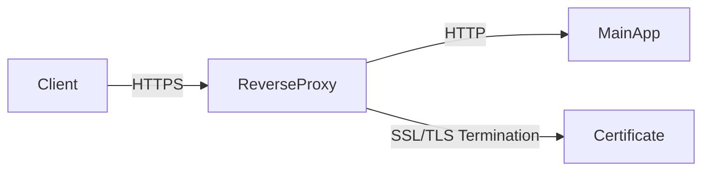
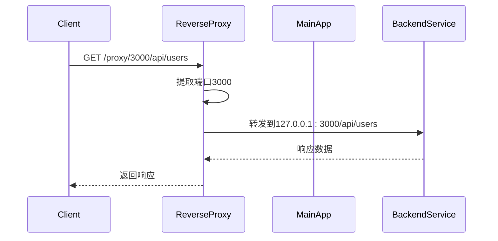

# 生产环境配置

<cite>
**本文档引用的文件**
- [config.yml](file://config.yml)
- [crates/rcoder/src/config.rs](file://crates/rcoder/src/config.rs)
- [crates/rcoder/src/main.rs](file://crates/rcoder/src/main.rs)
- [crates/pingora-proxy/src/config.rs](file://crates/pingora-proxy/src/config.rs)
- [crates/pingora-proxy/src/service.rs](file://crates/pingora-proxy/src/service.rs)
- [crates/rcoder/src/middleware/tracing_middleware.rs](file://crates/rcoder/src/middleware/tracing_middleware.rs)
- [crates/rcoder/src/router.rs](file://crates/rcoder/src/router.rs)
- [crates/rcoder/src/handler/proxy_handler_api.rs](file://crates/rcoder/src/handler/proxy_handler_api.rs)
</cite>

## 目录
1. [简介](#简介)
2. [核心配置参数详解](#核心配置参数详解)
3. [配置优先级机制](#配置优先级机制)
4. [反向代理与主应用协同](#反向代理与主应用协同)
5. [多AI代理实例负载均衡](#多ai代理实例负载均衡)
6. [敏感信息安全管理](#敏感信息安全管理)
7. [生产环境最佳实践](#生产环境最佳实践)

## 简介
本文档详细说明了基于 `config.yml` 文件的生产环境完整配置方案。涵盖了监听地址与端口的安全配置、TLS证书集成、日志级别调优（Tracing配置）、请求限流策略和超时设置等关键生产级设置。同时解释了配置优先级机制在生产环境中的应用，以及如何配置反向代理服务与主应用的协同工作和多AI代理实例的负载均衡设置。最后提供了敏感信息（如API密钥）的安全管理建议。

## 核心配置参数详解

### 监听地址与端口安全配置
在生产环境中，服务的监听地址和端口配置至关重要。主服务默认监听端口为3000，而Pingora反向代理服务默认监听端口为8080。这些端口可以在 `config.yml` 文件中进行自定义配置。

```yaml
# 主服务端口
port: 3000

# Pingora 反向代理配置
proxy_config:
  # 代理服务监听端口 (用于接收外部请求)
  listen_port: 8080
  # 默认后端服务端口 (当请求未指定端口时使用)
  default_backend_port: 3000
```

为了增强安全性，建议将主服务绑定到 `127.0.0.1` 而不是 `0.0.0.0`，并通过反向代理对外提供服务。这样可以有效隔离内部服务和外部网络。

**Section sources**
- [config.yml](file://config.yml#L15-L29)
- [crates/rcoder/src/config.rs](file://crates/rcoder/src/config.rs#L100-L150)

### TLS证书集成方法
虽然当前配置文件中未直接体现TLS配置，但可以通过反向代理（如Nginx或Pingora）来实现TLS终止。建议在生产环境中使用Let's Encrypt等免费证书颁发机构获取SSL/TLS证书，并通过反向代理进行配置。



**Diagram sources**
- [crates/pingora-proxy/src/service.rs](file://crates/pingora-proxy/src/service.rs#L200-L300)

### 日志级别调优（Tracing配置）
生产环境中的日志级别需要精心调优以平衡调试信息和性能开销。系统使用 `tracing` 库进行日志记录，支持多种日志级别（debug, info, warn, error）。

```rust
// 初始化遥测系统
fn init_telemetry() -> anyhow::Result<()> {
    // 设置全局文本传播器
    opentelemetry::global::set_text_map_propagator(
        opentelemetry_sdk::propagation::TraceContextPropagator::new(),
    );

    // 初始化 tracing subscriber
    tracing_subscriber::registry()
        .with(
            tracing_subscriber::EnvFilter::try_from_default_env().unwrap_or_else(|_| {
                "rcoder=info,tower_http=info,axum_tracing_opentelemetry=info".into()
            }),
        )
        .with(file_layer)
        .with(console_layer)
        .init();

    Ok(())
}
```

建议生产环境使用 `info` 级别，避免过多的 `debug` 日志影响性能。

**Section sources**
- [crates/rcoder/src/main.rs](file://crates/rcoder/src/main.rs#L150-L200)
- [crates/rcoder/src/middleware/tracing_middleware.rs](file://crates/rcoder/src/middleware/tracing_middleware.rs#L50-L100)

### 请求限流策略和超时设置
系统通过Pingora反向代理实现了健康检查机制，可用于间接实现请求限流和超时控制。

```yaml
proxy_config:
  health_check:
    enabled: true
    interval_seconds: 5
    timeout_seconds: 1
    healthy_threshold: 2
    unhealthy_threshold: 3
```

这些设置确保了后端服务的稳定性，当服务响应超时时（`timeout_seconds: 1`），系统会将其标记为不健康，从而避免过多请求堆积。

**Section sources**
- [config.yml](file://config.yml#L23-L29)
- [crates/pingora-proxy/src/service.rs](file://crates/pingora-proxy/src/service.rs#L500-L600)

## 配置优先级机制
系统采用多层次的配置优先级机制，确保配置的灵活性和可覆盖性。优先级顺序为：命令行 > 环境变量 > 配置文件 > 默认配置。

```rust
/// 加载配置
/// 配置优先级：命令行参数 > 环境变量 > 配置文件 > 默认配置
pub fn load_config_with_args(cli_args: CliArgs) -> AppConfig {
    // 1. 首先加载默认配置
    let mut config = AppConfig::default();

    // 2. 尝试从当前目录读取配置文件
    match load_config_from_file() {
        Ok(file_config) => {
            config = file_config;
            info!("成功从 {} 加载配置", CONFIG_FILE);
        }
        Err(e) => {
            warn!("无法读取配置文件 {}: {}, 使用默认配置", CONFIG_FILE, e);
        }
    }

    // 3. 环境变量覆盖配置
    if let Ok(port) = env::var("RCODER_PORT") {
        match port.parse::<u16>() {
            Ok(p) => {
                config.port = p;
                info!("使用环境变量 RCODER_PORT 设置端口: {}", p);
            }
            Err(_) => {
                warn!(
                    "环境变量 RCODER_PORT 值无效: {}, 使用配置文件中的端口: {}",
                    port, config.port
                );
            }
        }
    }

    // 4. 命令行参数覆盖配置（优先级最高）
    if let Some(port) = cli_args.port {
        config.port = port;
        info!("使用命令行参数设置端口: {}", port);
    }

    config
}
```

这种机制允许在不同环境中灵活调整配置，例如在Kubernetes中通过环境变量覆盖配置文件中的设置。

**Section sources**
- [crates/rcoder/src/config.rs](file://crates/rcoder/src/config.rs#L150-L250)

## 反向代理与主应用协同
Pingora反向代理与主应用通过端口路由机制协同工作，实现了动态服务发现和负载均衡。

### 代理路由机制
反向代理支持两种路由格式：
- 路径格式：`/proxy/{port}/{path}` - 推荐使用
- 查询参数格式：`/proxy?port=3000&path=/api/users` - 向后兼容



**Diagram sources**
- [crates/pingora-proxy/src/service.rs](file://crates/pingora-proxy/src/service.rs#L300-L400)
- [crates/rcoder/src/handler/proxy_handler_api.rs](file://crates/rcoder/src/handler/proxy_handler_api.rs#L200-L300)

### 健康检查与动态发现
系统实现了自动健康检查和动态服务发现机制：

```rust
/// 启动健康检查循环
pub fn start_health_check_loop(&self, interval_secs: u64, timeout_ms: u64) {
    let svc = self.clone();
    tokio::spawn(async move {
        let interval = std::time::Duration::from_secs(interval_secs);
        loop {
            svc.update_health_once(timeout_ms).await;
            tokio::time::sleep(interval).await;
        }
    });
}
```

这确保了只有健康的后端服务才会接收流量，提高了系统的整体稳定性。

**Section sources**
- [crates/pingora-proxy/src/service.rs](file://crates/pingora-proxy/src/service.rs#L600-L650)

## 多AI代理实例负载均衡
系统通过Pingora反向代理实现了多AI代理实例的负载均衡，支持轮询（Round Robin）算法。

### 负载均衡配置
```rust
impl PingoraProxyService {
    /// 设置负载均衡算法
    pub fn with_load_balancing(mut self, use_round_robin: bool) -> Self {
        self.use_round_robin = use_round_robin;
        self
    }
}
```

默认使用轮询算法，确保请求均匀分布到各个AI代理实例。

### 指标监控
系统提供了详细的代理统计信息，便于监控负载均衡效果：

```rust
/// 代理统计信息
#[derive(Debug, Serialize, ToSchema)]
pub struct ProxyStats {
    pub total_requests: u64,
    pub successful_requests: u64,
    pub failed_requests: u64,
    pub avg_response_time_ms: f64,
    pub active_connections: u32,
    pub port_stats: Vec<PortStats>,
}
```

这些指标可以通过 `/proxy/stats` API 获取，用于实时监控系统性能。

**Section sources**
- [crates/pingora-proxy/src/service.rs](file://crates/pingora-proxy/src/service.rs#L100-L200)
- [crates/rcoder/src/handler/proxy_handler_api.rs](file://crates/rcoder/src/handler/proxy_handler_api.rs#L100-L150)

## 敏感信息安全管理
生产环境中敏感信息（如API密钥）的安全管理至关重要。

### 环境变量管理
建议将敏感信息存储在环境变量中，而不是配置文件中：

```rust
/// 获取 claude code 环境变量的模型提供商配置
pub fn claude_from_env() -> Result<HashMap<String, String>> {
    let mut merged_envs: std::collections::HashMap<String, String> = HashMap::new();
    for key in [
        "ANTHROPIC_BASE_URL",
        "ANTHROPIC_AUTH_TOKEN",
        "ANTHROPIC_MODEL",
        "ANTHROPIC_SMALL_FAST_MODEL",
    ] {
        if let Ok(val) = std::env::var(key) {
            merged_envs.insert(key.to_string(), val);
        }
    }
    Ok(merged_envs)
}
```

### 配置文件保护
配置文件应设置适当的文件权限，避免敏感信息泄露：

```bash
# 设置配置文件权限
chmod 600 config.yml
chown root:root config.yml
```

### 密钥轮换策略
建议定期轮换API密钥，并在密钥轮换后重启服务以加载新密钥。

**Section sources**
- [crates/rcoder/src/model/agent_model.rs](file://crates/rcoder/src/model/agent_model.rs#L200-L300)

## 生产环境最佳实践
结合以上配置，以下是生产环境部署的最佳实践建议：

1. **网络隔离**：主服务绑定到 `127.0.0.1`，通过反向代理对外提供服务
2. **TLS加密**：使用反向代理实现SSL/TLS终止，确保数据传输安全
3. **日志管理**：配置日志滚动策略，避免日志文件过大
4. **监控告警**：集成Prometheus等监控系统，实时监控服务状态
5. **备份策略**：定期备份配置文件和重要数据
6. **安全审计**：定期进行安全审计，检查配置文件和权限设置

遵循这些最佳实践，可以确保系统在生产环境中的稳定性、安全性和可维护性。