# 部署指南

<cite>
**本文档中引用的文件**  
- [Dockerfile](file://docker/Dockerfile)
- [docker-compose.yml](file://docker/docker-compose.yml)
- [rcoder-service.sh](file://rcoder-service.sh)
- [start-rcoder.sh](file://docker/start-rcoder.sh)
- [build.sh](file://docker/scripts/build.sh)
- [deploy.sh](file://docker/scripts/deploy.sh)
- [config.yml](file://config.yml)
- [main.rs](file://crates/rcoder/src/main.rs)
- [config.rs](file://crates/rcoder/src/config.rs)
</cite>

## 目录
1. [简介](#简介)
2. [Docker部署](#docker部署)
3. [Docker Compose配置](#docker-compose配置)
4. [生产环境配置](#生产环境配置)
5. [systemd服务实现](#systemd服务实现)
6. [常见问题及解决方案](#常见问题及解决方案)
7. [总结](#总结)

## 简介
本部署指南详细介绍了RCoder项目的部署流程，包括Docker部署、Docker Compose配置、生产环境配置和systemd服务实现。文档提供了具体的配置选项、参数说明和返回值解释，并阐述了各组件之间的关系。通过本指南，初学者可以快速上手部署，而经验丰富的开发人员可以获得足够的技术深度。

## Docker部署
RCoder项目提供了完整的Docker部署方案，包括多阶段构建、调试工具集成和生产环境优化。

### Dockerfile分析
Dockerfile采用多阶段构建策略，分为编译阶段和运行阶段。编译阶段使用`rust:1.90-bookworm`镜像进行编译，运行阶段则基于相同的镜像但包含完整的调试工具。

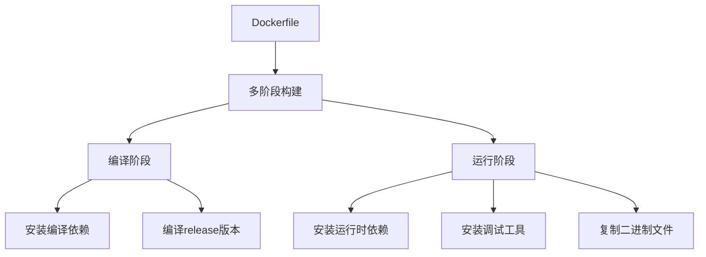

**Diagram sources**
- [Dockerfile](file://docker/Dockerfile#L12-L115)

**Section sources**
- [Dockerfile](file://docker/Dockerfile#L1-L305)

### 构建脚本
项目提供了`build.sh`脚本用于构建Docker镜像，该脚本会检查必要的文件并执行构建命令。

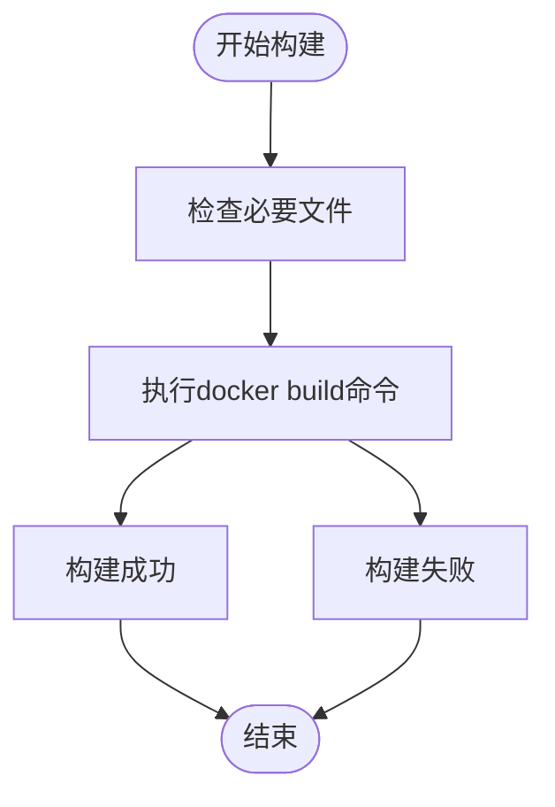

**Diagram sources**
- [build.sh](file://docker/scripts/build.sh#L1-L21)

**Section sources**
- [build.sh](file://docker/scripts/build.sh#L1-L21)

## Docker Compose配置
Docker Compose配置文件定义了RCoder服务的运行环境，包括端口映射、环境变量和卷挂载。

### docker-compose.yml分析
docker-compose.yml文件配置了RCoder服务的关键参数，包括镜像名称、端口映射、环境变量和卷挂载。

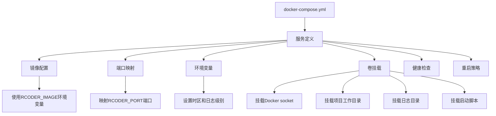

**Diagram sources**
- [docker-compose.yml](file://docker/docker-compose.yml#L1-L37)

**Section sources**
- [docker-compose.yml](file://docker/docker-compose.yml#L1-L37)

### 部署脚本
`deploy.sh`脚本自动化了部署流程，包括检查必要文件、构建镜像和启动服务。

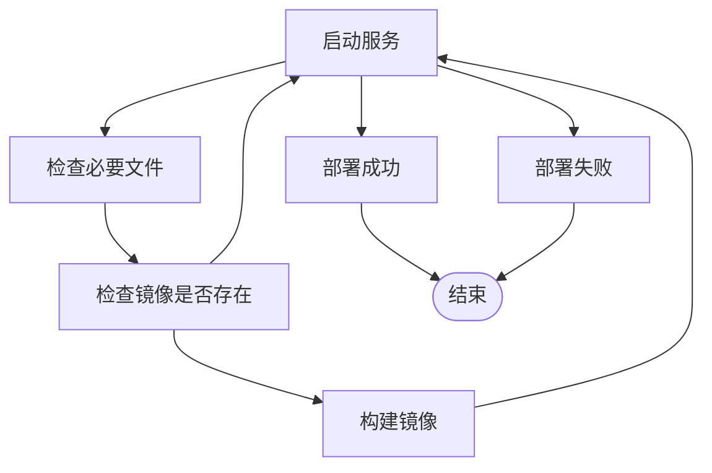

**Diagram sources**
- [deploy.sh](file://docker/scripts/deploy.sh#L1-L42)

**Section sources**
- [deploy.sh](file://docker/scripts/deploy.sh#L1-L42)

## 生产环境配置
生产环境配置涉及多个方面，包括配置文件、环境变量和安全设置。

### 配置文件
`config.yml`文件包含了RCoder服务的主要配置选项，包括默认代理类型、项目工作目录、端口设置和Docker配置。

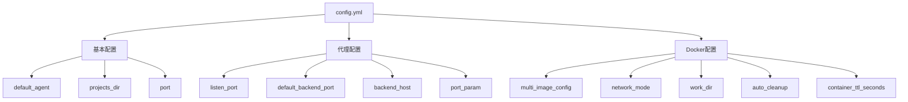

**Diagram sources**
- [config.yml](file://config.yml#L1-L161)

**Section sources**
- [config.yml](file://config.yml#L1-L161)

### 环境变量
RCoder服务支持通过环境变量覆盖配置文件中的设置，提供了灵活的配置方式。

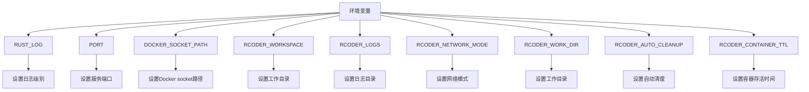

**Section sources**
- [main.rs](file://crates/rcoder/src/main.rs#L49-L53)
- [config.rs](file://crates/rcoder/src/config.rs#L214-L236)

### 启动脚本
`start-rcoder.sh`脚本负责启动RCoder服务，设置了必要的环境变量并创建了所需的目录。

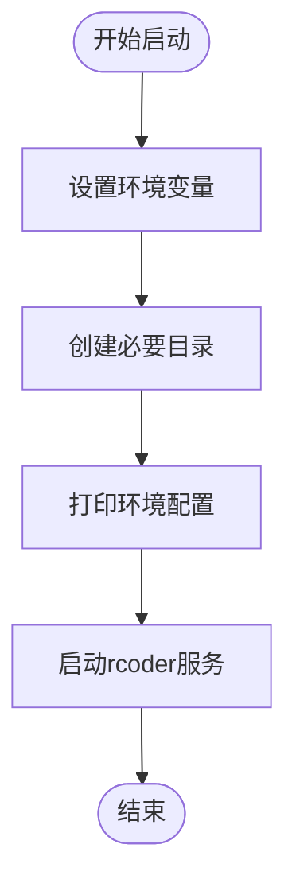

**Diagram sources**
- [start-rcoder.sh](file://docker/start-rcoder.sh#L1-L23)

**Section sources**
- [start-rcoder.sh](file://docker/start-rcoder.sh#L1-L23)

## systemd服务实现
systemd服务实现通过`rcoder-service.sh`脚本提供，支持启动、停止、重启和状态查询等操作。

### 服务管理脚本
`rcoder-service.sh`脚本提供了完整的服务管理功能，包括依赖检查、PID管理、日志记录和信号处理。

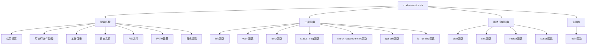

**Diagram sources**
- [rcoder-service.sh](file://rcoder-service.sh#L1-L328)

**Section sources**
- [rcoder-service.sh](file://rcoder-service.sh#L1-L328)

### 服务控制流程
服务控制流程包括启动、停止、重启和状态查询四个主要操作，每个操作都有详细的错误处理和日志记录。

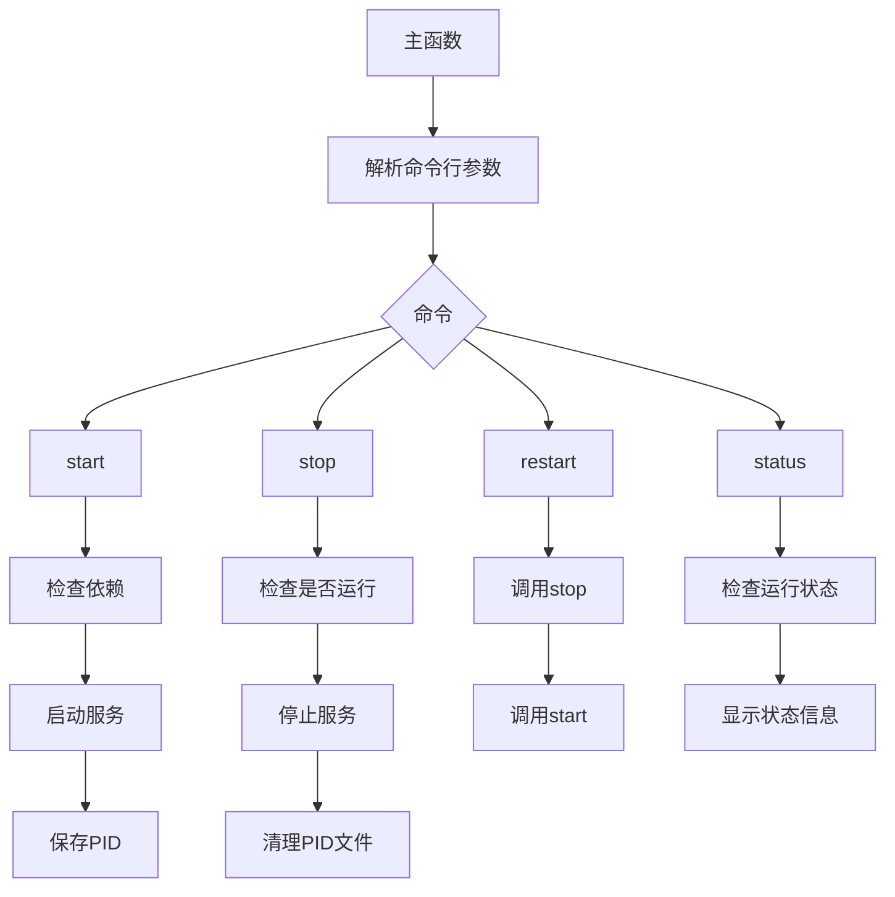

**Section sources**
- [rcoder-service.sh](file://rcoder-service.sh#L289-L327)

## 常见问题及解决方案
本节列出了部署过程中可能遇到的常见问题及其解决方案。

### Docker socket权限问题
当容器无法访问Docker socket时，会出现权限错误。

**问题表现**：
- 服务启动失败
- 日志中出现"Permission denied"错误
- 无法创建或管理容器

**解决方案**：
1. 确保Docker服务正在运行
2. 检查Docker socket文件是否存在
3. 确保用户在docker组中
4. 在docker-compose.yml中正确挂载Docker socket

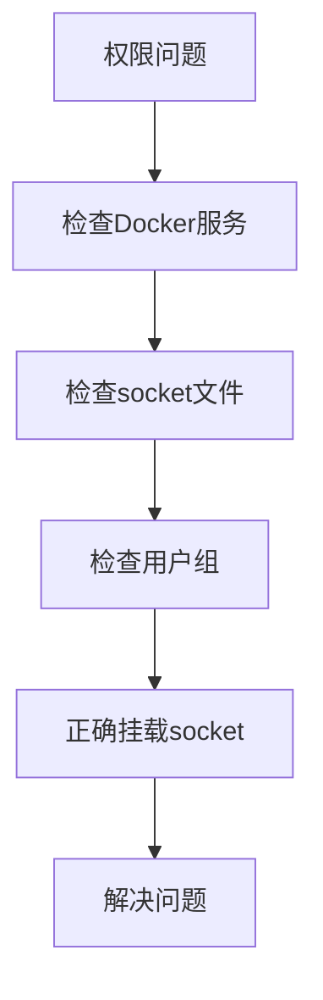

**Section sources**
- [main.rs](file://crates/rcoder/src/main.rs#L49-L53)
- [docker-compose.yml](file://docker/docker-compose.yml#L11-L15)

### 配置文件加载问题
当配置文件不存在或格式错误时，服务可能无法正常启动。

**问题表现**：
- 服务启动失败
- 日志中出现"Failed to load config"错误
- 使用默认配置而非自定义配置

**解决方案**：
1. 检查配置文件是否存在
2. 验证YAML格式是否正确
3. 确保配置文件路径正确
4. 检查文件权限

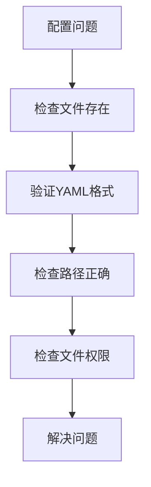

**Section sources**
- [config.rs](file://crates/rcoder/src/config.rs#L255-L272)

### 网络隔离配置
`setup-network-isolation.sh`脚本用于配置Docker容器的网络隔离规则，防止容器访问内网地址。

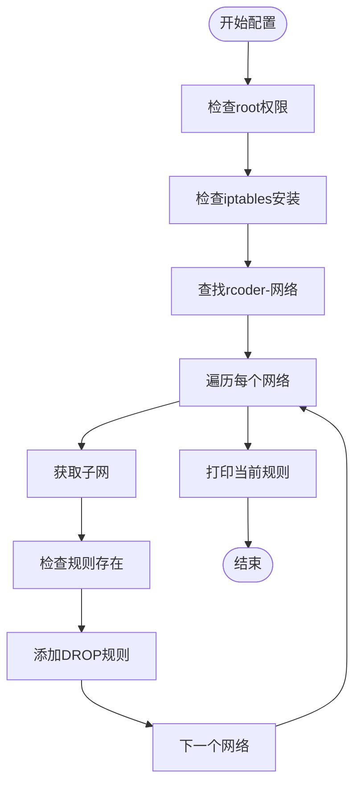

**Diagram sources**
- [setup-network-isolation.sh](file://scripts/setup-network-isolation.sh#L1-L112)

**Section sources**
- [setup-network-isolation.sh](file://scripts/setup-network-isolation.sh#L1-L112)

## 总结
本部署指南详细介绍了RCoder项目的部署流程，涵盖了Docker部署、Docker Compose配置、生产环境配置和systemd服务实现。通过本指南，用户可以全面了解RCoder的部署架构和配置选项，解决常见问题，并根据实际需求进行定制化部署。文档提供了足够的技术深度，既适合初学者快速上手，也为经验丰富的开发人员提供了详细的参考。