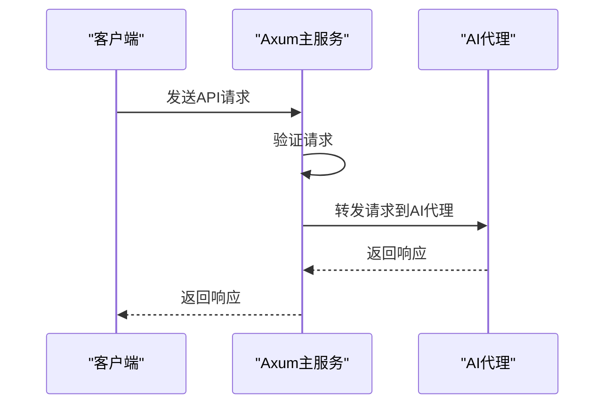
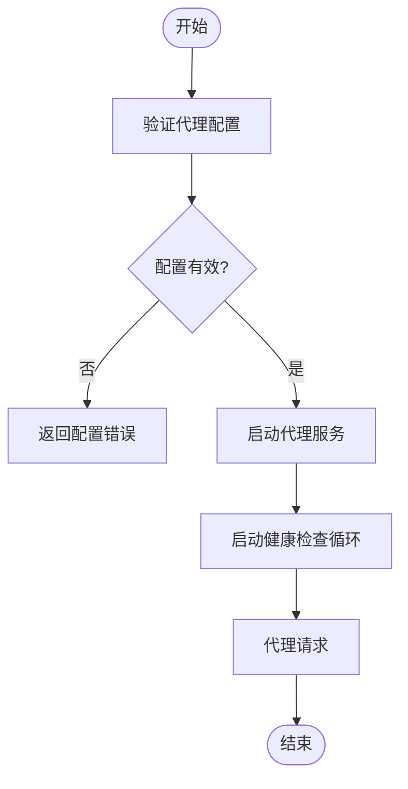
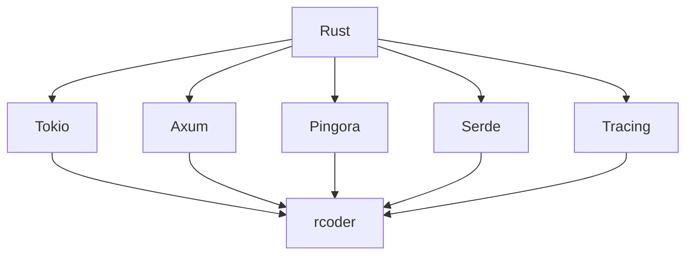

# 部署指南

<cite>
**本文档引用的文件**  
- [config.yml](file://config.yml)
- [README.md](file://README.md)
- [Dockerfile](file://Dockerfile)
- [docker-compose.yml](file://docker-compose.yml)
- [rcoder.service](file://rcoder.service)
- [crates/rcoder/src/main.rs](file://crates/rcoder/src/main.rs)
- [crates/rcoder/src/config.rs](file://crates/rcoder/src/config.rs)
- [crates/pingora-proxy/src/service.rs](file://crates/pingora-proxy/src/service.rs)
</cite>

## 目录
1. [简介](#简介)
2. [项目结构](#项目结构)
3. [核心组件](#核心组件)
4. [架构概述](#架构概述)
5. [详细组件分析](#详细组件分析)
6. [依赖分析](#依赖分析)
7. [性能考虑](#性能考虑)
8. [故障排除指南](#故障排除指南)
9. [结论](#结论)
10. [附录](#附录)（如有必要）

## 简介
本文档旨在为用户提供在不同环境中部署rcoder服务的详细操作手册。文档涵盖了Docker容器化部署的完整流程，包括Dockerfile解析、镜像构建命令和容器运行参数设置。同时说明了docker-compose.yml的配置要点，如何定义服务依赖和网络设置。此外，文档还提供了生产环境部署的最佳实践，包括资源分配（CPU/内存）、持久化存储配置、安全策略（防火墙、TLS）和高可用部署方案。系统服务管理方法，如使用systemd进行进程守护，以及性能调优建议，如Tokio运行时线程数配置和连接池设置，也包含在内。最后，文档描述了健康检查和滚动更新的实施策略。

## 项目结构
rcoder项目采用Rust工作区（workspace）结构，主要由多个crates组成，每个crate负责不同的功能模块。项目根目录包含配置文件、脚本文件和文档文件。crates目录下包含多个子模块，如acp_adapter、claude-code-agent、codex-acp-agent、nuwax_parser、pingora-proxy、rcoder和shared_types。其中，rcoder是主应用模块，负责Axum路由、业务逻辑、配置管理和代理启动；pingora-proxy是Pingora代理封装模块，负责配置、服务和服务器管理；其他crates则负责协议适配、代理实现、工具和共享类型。

**Section sources**
- [README.md](file://README.md#L378-L438)

## 核心组件
rcoder的核心组件包括主应用模块（rcoder）、Pingora代理模块（pingora-proxy）和多个AI代理模块（如claude-code-agent、codex-acp-agent）。主应用模块基于Axum框架构建，提供HTTP API接口和SSE进度流；Pingora代理模块集成Cloudflare Pingora，实现高性能端口路由；AI代理模块通过ACP协议与多种AI代理进行统一交互。这些组件共同构成了一个现代化的AI驱动开发平台。

**Section sources**
- [README.md](file://README.md#L0-L12)

## 架构概述
rcoder采用模块化设计，基于Rust 2024 Edition构建，使用Tokio作为异步运行时，Axum作为HTTP框架，Pingora作为反向代理，ACP作为AI代理通信协议。平台提供简洁的HTTP API接口，让开发者能够轻松集成和管理AI辅助开发功能。架构图展示了客户端与Axum主服务和Pingora代理的交互关系，以及主服务与AI代理的工作流程。

```mermaid
graph TB
A[Client] --> B[Axum HTTP Server]
A --> C[Pingora Proxy]
B --> D[API Routes]
B --> E[Agent Worker (LocalSet)]
C --> F[Backends: 127.0.0.1:{port}]
```

**Diagram sources**
- [README.md](file://README.md#L0-L12)

## 详细组件分析
### 主应用模块分析
主应用模块（rcoder）是整个平台的核心，负责处理所有业务逻辑和API请求。它基于Axum框架构建，提供REST API和SSE进度流。模块通过配置文件、环境变量和命令行参数进行配置，支持多层配置优先级。主应用模块还负责启动Pingora代理服务，并管理AI代理的生命周期。

#### 对于API/服务组件：


**Diagram sources**
- [crates/rcoder/src/main.rs](file://crates/rcoder/src/main.rs#L45-L102)

### Pingora代理模块分析
Pingora代理模块（pingora-proxy）是平台的高性能反向代理组件，负责处理所有代理请求。模块基于Cloudflare Pingora构建，支持路径前缀形式的端口路由，如`/proxy/{port}/{path}`。代理服务独立于主应用服务运行，确保两者互不阻塞。模块还支持健康检查、负载均衡和统计信息收集等功能。

#### 对于复杂逻辑组件：


**Diagram sources**
- [crates/pingora-proxy/src/service.rs](file://crates/pingora-proxy/src/service.rs#L515-L538)

## 依赖分析
rcoder项目依赖于多个外部库和工具，包括Rust标准库、Tokio、Axum、Pingora、Serde、Tracing等。这些依赖通过Cargo.toml文件进行管理，确保版本兼容性和构建一致性。项目还依赖于外部AI代理工具，如Claude Code CLI和OpenAI Codex，这些工具需要单独安装和配置。



**Diagram sources**
- [Cargo.toml](file://Cargo.toml)

## 性能考虑
在生产环境中部署rcoder服务时，需要考虑多个性能因素。首先，合理分配CPU和内存资源，确保服务稳定运行。其次，配置持久化存储，避免数据丢失。此外，实施安全策略，如防火墙规则和TLS加密，保护服务安全。对于高可用部署，可以采用负载均衡和集群方案，提高服务可用性和容错能力。

## 故障排除指南
在部署和运行rcoder服务时，可能会遇到各种问题。常见问题包括端口被占用、AI代理连接失败、配置文件错误等。解决这些问题的方法包括检查日志输出、验证配置文件格式、确保外部工具正确安装等。对于更复杂的问题，可以查看项目文档、搜索现有问题或创建新的问题报告。

**Section sources**
- [README.md](file://README.md#L600-L651)

## 结论
本文档提供了在不同环境中部署rcoder服务的详细操作手册，涵盖了Docker容器化部署、生产环境最佳实践、系统服务管理、性能调优和故障排除等多个方面。通过遵循本文档的指导，用户可以成功部署和管理rcoder服务，充分利用其AI驱动的开发功能。

## 附录
### Docker部署示例
```dockerfile
# Dockerfile
FROM rust:1.75 as builder

WORKDIR /app
COPY . .
RUN cargo build --release

FROM debian:bookworm-slim

RUN apt-get update && apt-get install -y \
    ca-certificates \
    libssl3 \
    && rm -rf /var/lib/apt/lists/*

COPY --from=builder /app/target/release/rcoder /usr/local/bin/rcoder
COPY --from=builder /app/config.yml.example /app/config.yml

WORKDIR /app
EXPOSE 3000

CMD ["rcoder"]
```

### Docker Compose配置示例
```yaml
# docker-compose.yml
version: '3.8'

services:
  rcoder:
    build: .
    ports:
      - "3000:3000"
    environment:
      - RCODER_PORT=3000
      - RUST_LOG=info
    volumes:
      - ./projects:/app/projects
      - ./config.yml:/app/config.yml
    restart: unless-stopped

  # 可选：添加 nginx 反向代理
  nginx:
    image: nginx:alpine
    ports:
      - "80:80"
    volumes:
      - ./nginx.conf:/etc/nginx/nginx.conf
    depends_on:
      - rcoder
```

### systemd服务配置示例
```bash
# 使用 systemd 管理服务
sudo tee /etc/systemd/system/rcoder.service > /dev/null <<EOF
[Unit]
Description=RCoder AI Development Platform
After=network.target

[Service]
Type=simple
User=rcoder
WorkingDirectory=/opt/rcoder
ExecStart=/opt/rcoder/target/release/rcoder --port 3000
Restart=always
RestartSec=5
Environment=RUST_LOG=info
Environment=RCODER_PORT=3000

[Install]
WantedBy=multi-user.target
EOF

sudo systemctl enable rcoder
sudo systemctl start rcoder
```