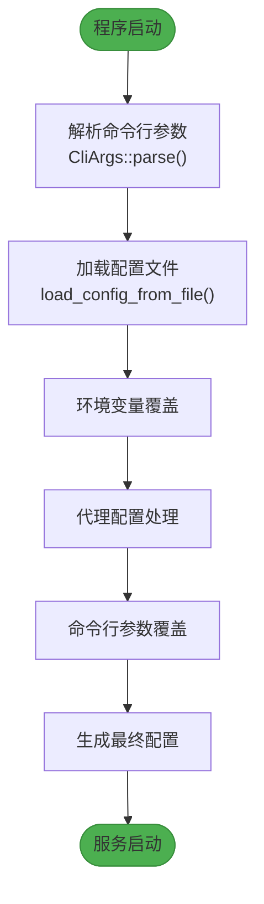
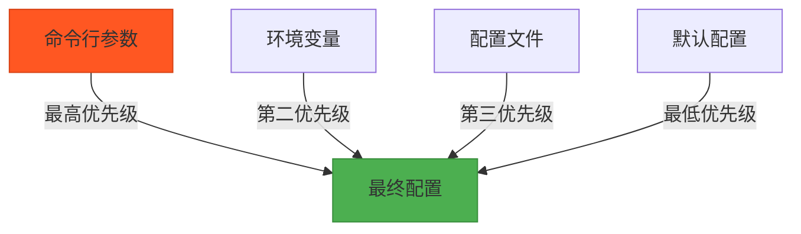

# 命令行参数

<cite>
**Referenced Files in This Document**   
- [main.rs](file://crates/rcoder/src/main.rs)
- [config.rs](file://crates/rcoder/src/config.rs)
- [config.yml](file://config.yml)
</cite>

## 目录
1. [命令行参数列表](#命令行参数列表)
2. [参数解析逻辑](#参数解析逻辑)
3. [启动示例](#启动示例)
4. [配置优先级](#配置优先级)
5. [参数验证与错误处理](#参数验证与错误处理)

## 命令行参数列表

rcoder支持以下命令行参数，用于在启动时快速配置应用行为。这些参数通过clap库进行解析，具有明确的简写形式、数据类型和默认行为。

**Section sources**
- [config.rs](file://crates/rcoder/src/config.rs#L10-L35)

## 参数解析逻辑

rcoder的命令行参数解析逻辑在`main.rs`中实现，通过集成clap库完成。应用启动时，首先调用`CliArgs::parse()`方法解析命令行输入，然后将解析结果传递给`load_config_with_args`函数进行配置合并。clap库的集成方式简洁高效，通过`#[derive(Parser)]`宏自动为`CliArgs`结构体生成解析逻辑，并利用`#[arg]`属性定义每个参数的特性。

**Diagram sources**
- [main.rs](file://crates/rcoder/src/main.rs#L25-L30)
- [config.rs](file://crates/rcoder/src/config.rs#L106-L188)

**Section sources**
- [main.rs](file://crates/rcoder/src/main.rs#L25-L30)
- [config.rs](file://crates/rcoder/src/config.rs#L106-L188)

## 启动示例

以下是一些常用的命令行启动示例，展示如何通过参数快速覆盖配置文件设置：

- 使用默认配置启动：`cargo run`
- 指定自定义端口：`cargo run -- --port 8080`
- 指定项目目录：`cargo run -- --projects-dir /path/to/workspace`
- 同时指定端口和目录：`cargo run -- --port 8080 --projects-dir ./my_project`
- 启用反向代理：`cargo run -- --enable-proxy --proxy-port 9000`

这些命令行参数可以直接覆盖`config.yml`文件中的相应设置，无需修改配置文件。

**Section sources**
- [config.yml](file://config.yml#L1-L30)
- [config.rs](file://crates/rcoder/src/config.rs#L106-L188)

## 配置优先级

rcoder采用多层级配置系统，命令行参数具有最高优先级。配置优先级顺序为：命令行参数 > 环境变量 > 配置文件 > 默认配置。这种设计允许用户在不同场景下灵活调整配置。例如，当`config.yml`文件中设置`port: 3000`，但用户通过`--port 8080`启动时，服务将使用8080端口。这种覆盖机制确保了部署的灵活性和便捷性。

**Diagram sources**
- [config.rs](file://crates/rcoder/src/config.rs#L106-L188)

**Section sources**
- [config.rs](file://crates/rcoder/src/config.rs#L106-L188)

## 参数验证与错误处理

rcoder的参数验证流程在配置加载过程中实现。系统首先尝试从`config.yml`文件加载配置，如果文件不存在或解析失败，则自动创建默认配置文件并记录警告信息。对于环境变量，系统会进行类型验证，如`RCODER_PORT`必须能解析为有效的16位无符号整数，否则会记录警告并使用现有配置。命令行参数由clap库自动验证，确保数据类型正确。所有配置变更和错误信息都会通过tracing日志系统记录，便于用户排查问题。

**Section sources**
- [config.rs](file://crates/rcoder/src/config.rs#L106-L188)
- [main.rs](file://crates/rcoder/src/main.rs#L25-L30)