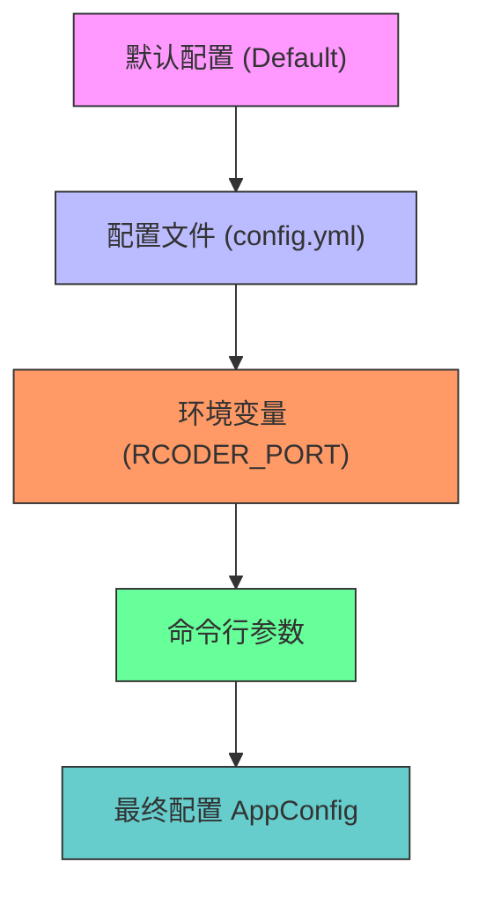
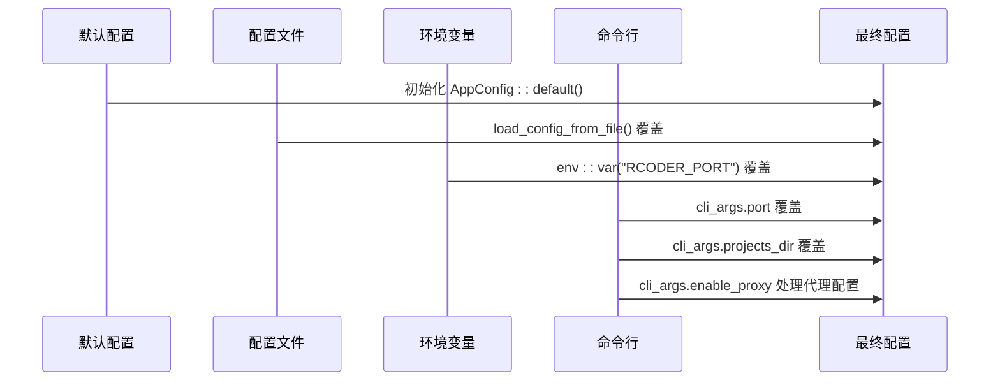
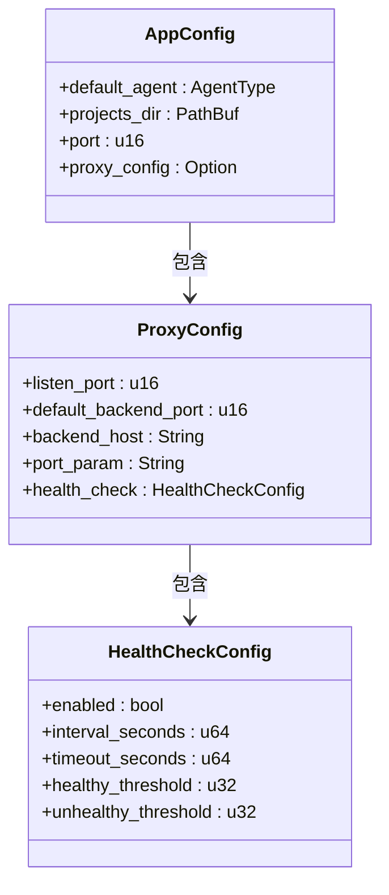
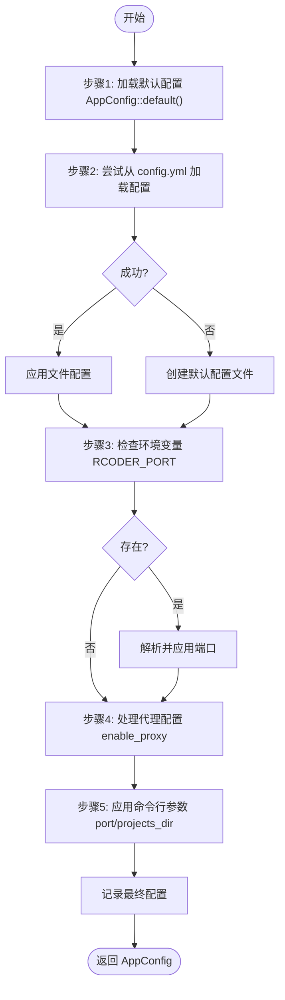
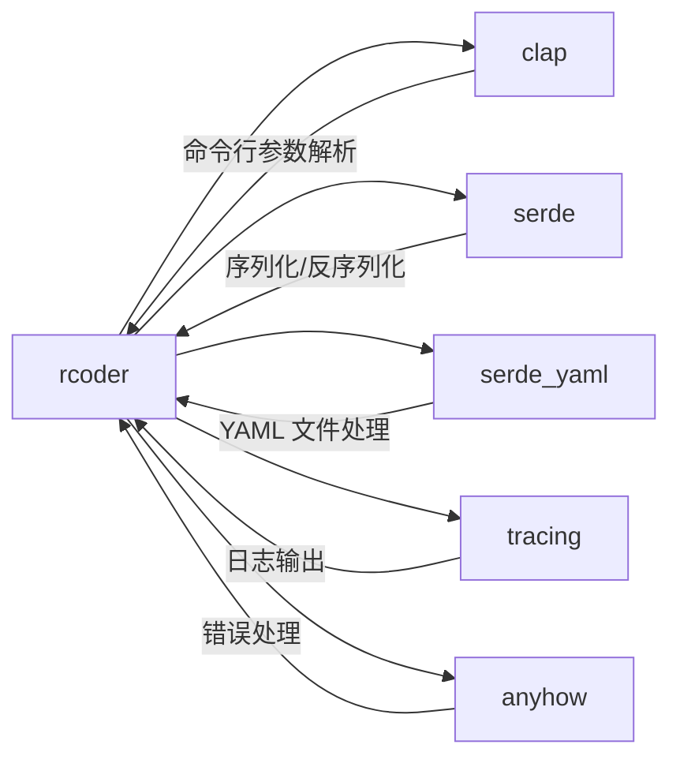

# 配置优先级规则

<cite>
**本文档中引用的文件**  
- [config.rs](file://crates/rcoder/src/config.rs)
- [config.yml](file://config.yml)
- [main.rs](file://crates/rcoder/src/main.rs)
</cite>

## 目录
1. [简介](#简介)
2. [项目结构](#项目结构)
3. [核心组件](#核心组件)
4. [架构概览](#架构概览)
5. [详细组件分析](#详细组件分析)
6. [依赖分析](#依赖分析)
7. [性能考虑](#性能考虑)
8. [故障排除指南](#故障排除指南)
9. [结论](#结论)

## 简介
本文档深入解析 `rcoder` 项目中多层级配置优先级的实现机制，重点阐述命令行参数 > 环境变量 > 配置文件 > 默认值的优先级规则。通过分析 `AppConfig` 结构体在运行时如何合并不同来源的配置值，揭示其背后的设计逻辑与实现细节。文档将详细说明优先级判断逻辑、各配置源的加载顺序和覆盖规则，并提供实际场景下的配置冲突解决案例。同时，还将探讨该设计模式的优势以及潜在的配置陷阱和最佳实践。

## 项目结构
`rcoder` 是一个基于 Rust 的 AI 驱动开发平台，其配置系统主要集中在 `crates/rcoder/src/config.rs` 文件中。整个项目采用模块化设计，其中配置管理是核心功能之一，支持从多个层级加载和合并配置信息。

**图示来源**  
- [config.rs](file://crates/rcoder/src/config.rs#L106-L188)

**本节来源**  
- [config.rs](file://crates/rcoder/src/config.rs#L1-L266)
- [config.yml](file://config.yml#L1-L30)

## 核心组件
`rcoder` 的配置系统由 `AppConfig` 结构体和 `load_config_with_args` 函数构成，实现了多层级配置的加载与合并。该系统遵循明确的优先级规则：命令行参数 > 环境变量 > 配置文件 > 默认值。

**本节来源**  
- [config.rs](file://crates/rcoder/src/config.rs#L37-L48)
- [config.rs](file://crates/rcoder/src/config.rs#L106-L188)

## 架构概览
`rcoder` 的配置加载流程是一个逐步覆盖的过程，从最低优先级的默认值开始，依次被更高优先级的配置源覆盖。这种设计确保了灵活性和可移植性，允许用户在不同环境中轻松定制服务行为。

**图示来源**  
- [config.rs](file://crates/rcoder/src/config.rs#L106-L188)

## 详细组件分析

### AppConfig 结构体分析
`AppConfig` 是 `rcoder` 的核心配置结构体，包含默认代理类型、项目目录、服务端口及代理配置等关键字段。它实现了 `Default` trait，提供了一套合理的默认值。

**图示来源**  
- [config.rs](file://crates/rcoder/src/config.rs#L37-L48)
- [config.rs](file://crates/rcoder/src/config.rs#L50-L104)

### 配置加载流程分析
`load_config_with_args` 函数实现了完整的配置加载逻辑，按照预定义的优先级顺序依次处理各个配置源。

**图示来源**  
- [config.rs](file://crates/rcoder/src/config.rs#L106-L188)

**本节来源**  
- [config.rs](file://crates/rcoder/src/config.rs#L106-L188)
- [config.rs](file://crates/rcoder/src/config.rs#L202-L211)
- [config.rs](file://crates/rcoder/src/config.rs#L213-L265)

## 依赖分析
`rcoder` 的配置系统依赖于多个外部库，包括 `clap` 用于命令行解析，`serde` 和 `serde_yaml` 用于配置文件的序列化与反序列化，`tracing` 用于日志记录。这些依赖共同支撑了多层级配置机制的实现。

**图示来源**  
- [config.rs](file://crates/rcoder/src/config.rs#L1-L10)

**本节来源**  
- [config.rs](file://crates/rcoder/src/config.rs#L1-L266)

## 性能考虑
配置加载发生在应用启动阶段，属于一次性操作，因此对运行时性能影响较小。但由于涉及文件 I/O 和环境变量读取，建议避免在频繁重启的场景下使用复杂的配置文件结构。此外，日志输出有助于调试配置加载过程中的问题。

## 故障排除指南
当配置未按预期生效时，应首先检查日志输出，确认各配置源的加载顺序和覆盖情况。常见问题包括配置文件路径错误、环境变量拼写错误或命令行参数格式不正确。确保 `config.yml` 位于执行目录下，并使用 `--help` 查看正确的命令行选项。

**本节来源**  
- [config.rs](file://crates/rcoder/src/config.rs#L106-L188)
- [main.rs](file://crates/rcoder/src/main.rs#L45-L76)

## 结论
`rcoder` 的多层级配置优先级机制通过清晰的代码结构和合理的加载顺序，实现了高度灵活的配置管理。该设计不仅提升了服务的可移植性和环境适配能力，还为用户提供了丰富的定制选项。通过理解其内部实现逻辑，开发者可以更有效地利用这一机制进行服务配置和优化。