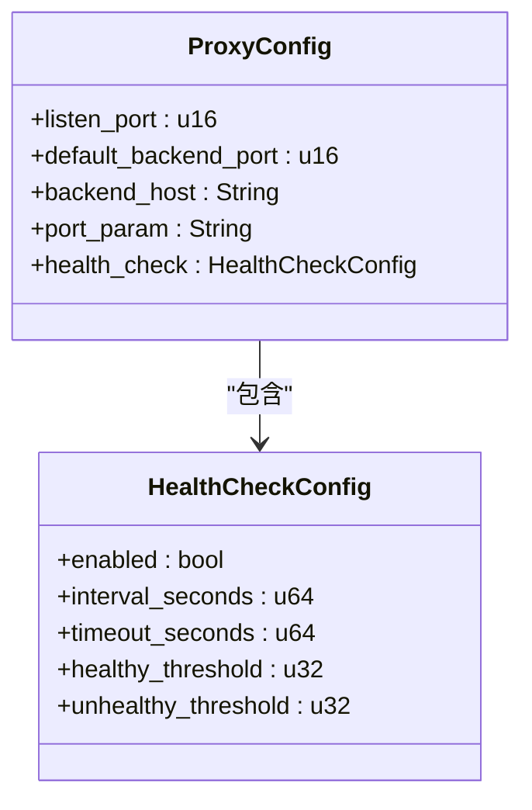
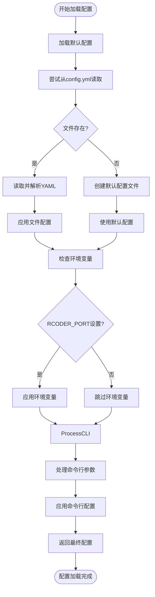

# 配置文件

<cite>
**本文档中引用的文件**   
- [config.yml](file://config.yml)
- [config.rs](file://crates/rcoder/src/config.rs)
- [agent_model.rs](file://crates/rcoder/src/model/agent_model.rs)
</cite>

## 目录
1. [配置文件结构概述](#配置文件结构概述)
2. [核心配置项详解](#核心配置项详解)
3. [嵌套配置对象结构](#嵌套配置对象结构)
4. [配置加载机制](#配置加载机制)
5. [完整配置模板](#完整配置模板)

## 配置文件结构概述

`config.yml` 是 rcoder 应用的核心配置文件，采用 YAML 格式定义应用的运行参数。该文件在首次启动时自动生成，并包含默认配置值。配置文件定义了应用的基本行为，包括默认 AI 代理类型、项目工作目录、服务端口以及反向代理配置等关键参数。

配置文件采用分层结构，顶层包含基础配置项，而 `proxy_config` 字段则引入了嵌套的代理配置对象。这种结构设计使得配置既保持了简洁性，又能支持复杂的嵌套配置需求。

**Section sources**
- [config.yml](file://config.yml#L1-L30)
- [config.rs](file://crates/rcoder/src/config.rs#L37-L48)

## 核心配置项详解

### default_agent
**作用**：指定系统默认使用的 AI 代理类型。该配置决定了在没有明确指定代理的情况下，系统将调用哪种 AI 服务进行处理。

**合法取值范围**：
- `Codex`：使用 OpenAI Codex 代理
- `Claude`：使用 Claude Code 代理

**默认值**：`Codex`

此配置项对应 `AppConfig` 结构体中的 `default_agent` 字段，其类型为 `AgentType` 枚举。

### projects_dir
**作用**：定义项目工作的根目录路径。该路径作为所有项目相关操作的基础目录，所有项目文件都将存储在此目录下。

**合法取值范围**：有效的文件系统路径字符串，可以是相对路径或绝对路径。

**默认值**：`./project_workspace`

该配置项对应 `AppConfig` 结构体中的 `projects_dir` 字段，其类型为 `PathBuf`。

### port
**作用**：设置主服务监听的端口号。该端口用于接收来自客户端的主要 HTTP 请求。

**合法取值范围**：1-65535 之间的有效端口号。

**默认值**：`3000`

此配置项对应 `AppConfig` 结构体中的 `port` 字段，其类型为 `u16`。

### proxy_config
**作用**：控制是否启用反向代理功能。当设置为 `null` 或省略时，禁用代理功能；当包含配置对象时，启用代理功能。

**合法取值范围**：
- `null`：禁用代理
- 包含代理配置的对象：启用代理

该配置项对应 `AppConfig` 结构体中的 `proxy_config` 字段，其类型为 `Option<ProxyConfig>`，表示这是一个可选配置。

**Section sources**
- [config.rs](file://crates/rcoder/src/config.rs#L37-L48)
- [agent_model.rs](file://crates/rcoder/src/model/agent_model.rs#L21-L28)

## 嵌套配置对象结构

### ProxyConfig 结构
`proxy_config` 字段包含一个嵌套的配置对象，用于定义反向代理的具体参数：



**Diagram sources**
- [config.rs](file://crates/rcoder/src/config.rs#L59-L72)

#### listen_port
**作用**：代理服务监听的端口，用于接收外部请求。

**合法取值范围**：1-65535 之间的有效端口号。

**默认值**：`8080`

#### default_backend_port
**作用**：当请求未指定目标端口时使用的默认后端服务端口。

**合法取值范围**：1-65535 之间的有效端口号。

**默认值**：`3000`

#### backend_host
**作用**：后端服务的主机地址。

**合法取值范围**：有效的 IP 地址或主机名字符串。

**默认值**：`127.0.0.1`

#### port_param
**作用**：URL 中用于指定目标端口的参数名称。

**合法取值范围**：有效的 URL 参数名称字符串。

**默认值**：`port`

### HealthCheckConfig 结构
健康检查配置子对象，用于监控后端服务的可用性：

#### enabled
**作用**：是否启用健康检查功能。

**合法取值范围**：`true` 或 `false`。

**默认值**：`true`

#### interval_seconds
**作用**：健康检查的执行间隔（秒）。

**合法取值范围**：正整数。

**默认值**：`5`

#### timeout_seconds
**作用**：健康检查请求的超时时间（秒）。

**合法取值范围**：正整数。

**默认值**：`1`

#### healthy_threshold
**作用**：将服务标记为健康的连续成功检查次数阈值。

**合法取值范围**：正整数。

**默认值**：`2`

#### unhealthy_threshold
**作用**：将服务标记为不健康的连续失败检查次数阈值。

**合法取值范围**：正整数。

**默认值**：`3`

**Section sources**
- [config.rs](file://crates/rcoder/src/config.rs#L50-L57)
- [config.rs](file://crates/rcoder/src/config.rs#L59-L72)

## 配置加载机制

### 配置加载路径与优先级
rcoder 采用多层级配置加载机制，配置优先级从高到低如下：

1. **命令行参数**：最高优先级，可覆盖其他所有配置
2. **环境变量**：次高优先级，主要用于部署环境配置
3. **配置文件**：存储在项目根目录的 `config.yml`
4. **默认配置**：最低优先级，提供安全的默认值

配置文件默认在项目根目录下查找，文件名为 `config.yml`。如果文件不存在，系统会自动创建一个包含默认值的配置文件。

### 配置解析过程
配置解析通过 `serde_yaml` 库实现反序列化，主要流程如下：



**Diagram sources**
- [config.rs](file://crates/rcoder/src/config.rs#L106-L188)

**Section sources**
- [config.rs](file://crates/rcoder/src/config.rs#L75-L265)

## 完整配置模板

```yaml
# rcoder 配置文件
# 该文件在首次启动时自动生成

# 默认使用的 AI 代理类型 (Codex/Claude/Proxy)
default_agent: Codex

# 项目工作目录
projects_dir: ./project_workspace

# 主服务端口
port: 3000

# Pingora 反向代理配置
proxy_config:
  # 代理服务监听端口 (用于接收外部请求)
  listen_port: 8080
  # 默认后端服务端口 (当请求未指定端口时使用)
  default_backend_port: 3000
  # 后端服务主机地址
  backend_host: "127.0.0.1"
  # URL 中端口参数的名称 (用于从路径中提取端口号)
  port_param: "port"
  # 健康检查配置
  health_check:
    enabled: true
    interval_seconds: 5
    timeout_seconds: 1
    healthy_threshold: 2
    unhealthy_threshold: 3
```

**Section sources**
- [config.yml](file://config.yml#L1-L30)
- [config.rs](file://crates/rcoder/src/config.rs#L213-L265)