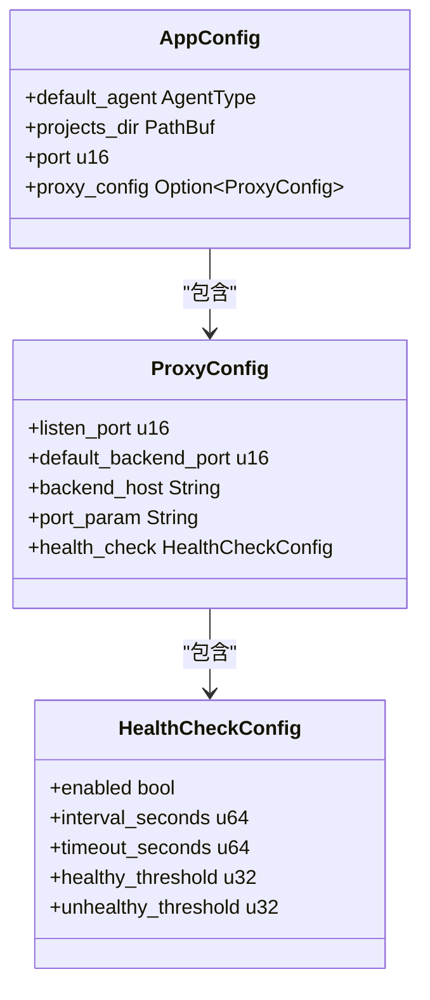
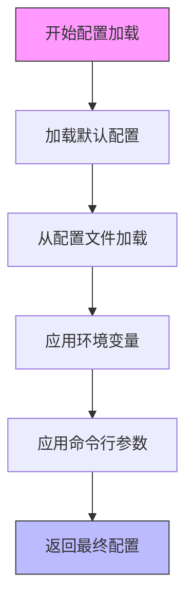
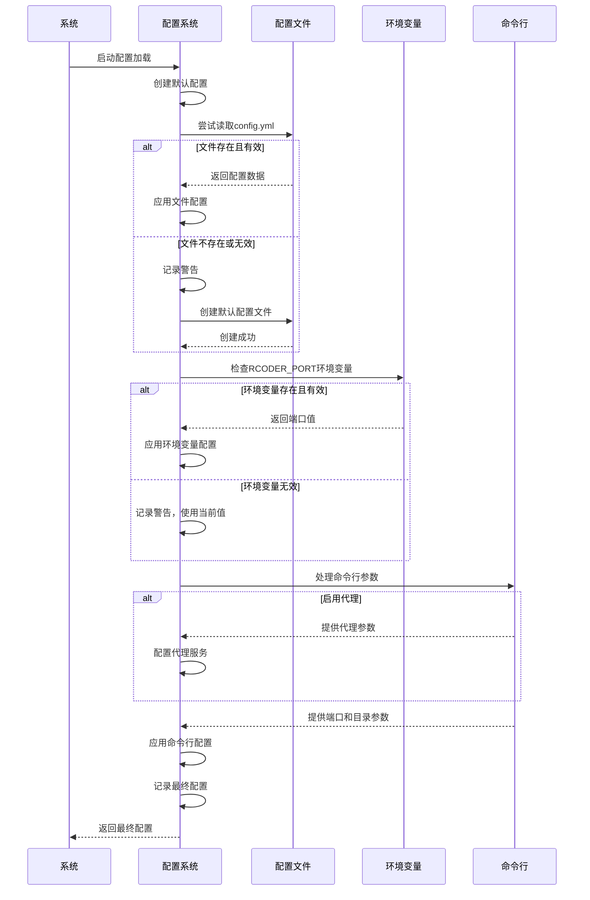

# 配置管理

<cite>
**Referenced Files in This Document**   
- [config.rs](file://crates/rcoder/src/config.rs)
- [config.yml](file://config.yml)
</cite>

## 目录
1. [配置系统概述](#配置系统概述)
2. [配置结构设计](#配置结构设计)
3. [配置优先级规则](#配置优先级规则)
4. [配置文件详解](#配置文件详解)
5. [配置解析流程](#配置解析流程)
6. [错误处理与验证](#错误处理与验证)
7. [最佳实践](#最佳实践)

## 配置系统概述

rcoder的配置管理系统采用多层级配置机制，为系统管理员提供了灵活的配置选项。系统通过`AppConfig`结构体定义了应用的完整配置，包括服务端口、代理设置、项目目录等关键参数。配置系统设计遵循"约定优于配置"的原则，在首次启动时会自动生成带有详细注释的`config.yml`配置文件，帮助用户快速理解各项配置的含义和用法。

该配置系统支持四种配置来源，按照优先级从高到低分别为：命令行参数、环境变量、配置文件和默认值。这种设计使得系统既能在生产环境中通过配置文件进行稳定部署，又能在开发和调试时通过命令行参数快速调整配置，满足不同场景的需求。

**Section sources**
- [config.rs](file://crates/rcoder/src/config.rs#L37-L48)
- [config.yml](file://config.yml#L1-L30)

## 配置结构设计

rcoder的配置结构采用模块化设计，主要由`AppConfig`主配置结构体和其嵌套的子配置结构体组成。`AppConfig`定义了应用的核心配置项，包括默认AI代理类型、项目工作目录和主服务端口等。其中，代理配置通过`ProxyConfig`结构体进行封装，实现了关注点分离。

`ProxyConfig`结构体进一步包含`HealthCheckConfig`健康检查配置，形成了清晰的配置层次。这种嵌套结构不仅使配置更加有组织，还便于未来扩展新的配置项。所有配置结构体均实现了`Debug`、`Clone`、`Serialize`和`Deserialize`等trait，支持配置的序列化、反序列化和日志输出。



**Diagram sources**
- [config.rs](file://crates/rcoder/src/config.rs#L37-L57)

**Section sources**
- [config.rs](file://crates/rcoder/src/config.rs#L37-L57)

## 配置优先级规则

rcoder实现了明确的配置优先级规则：命令行参数 > 环境变量 > 配置文件 > 默认值。这一规则确保了配置的灵活性和可覆盖性，允许用户在不同层级上调整配置。

### 优先级层级说明

1. **命令行参数**：优先级最高，用于临时覆盖配置，适合调试和一次性运行
2. **环境变量**：优先级次之，适合在容器化部署中动态配置
3. **配置文件**：持久化配置，适合长期稳定的环境设置
4. **默认值**：最低优先级，提供系统的基本运行能力

### 覆盖行为示例

当用户通过命令行指定端口时，该值将覆盖环境变量、配置文件和默认值中的端口设置。同样，环境变量中的配置会覆盖配置文件和默认值，但会被命令行参数覆盖。这种层级关系确保了最具体的配置（通常是用户明确指定的）能够生效。



**Diagram sources**
- [config.rs](file://crates/rcoder/src/config.rs#L106-L188)

**Section sources**
- [config.rs](file://crates/rcoder/src/config.rs#L106-L188)

## 配置文件详解

### config.yml文件结构

`config.yml`是rcoder的主要配置文件，采用YAML格式，具有良好的可读性和结构化特性。文件包含详细的注释，解释了每个配置项的用途和可能的取值。

```yaml
# rcoder 配置文件
# 该文件在首次启动时自动生成

# 默认使用的 AI 代理类型 (Codex/Claude/Proxy)
default_agent: Codex

# 项目工作目录
projects_dir: ./project_workspace

# 主服务端口
port: 3000

# Pingora 反向代理配置
proxy_config:
  # 代理服务监听端口 (用于接收外部请求)
  listen_port: 8080
  # 默认后端服务端口 (当请求未指定端口时使用)
  default_backend_port: 3000
  # 后端服务主机地址
  backend_host: "127.0.0.1"
  # URL 中端口参数的名称 (用于从路径中提取端口号)
  port_param: "port"
  # 健康检查配置
  health_check:
    enabled: true
    interval_seconds: 5
    timeout_seconds: 1
    healthy_threshold: 2
    unhealthy_threshold: 3
```

### 关键配置项说明

| 配置项 | 类型 | 默认值 | 说明 |
|-------|------|-------|------|
| `default_agent` | 枚举 | Codex | 默认使用的AI代理类型，可选值包括Codex、Claude和Proxy |
| `projects_dir` | 字符串 | ./project_workspace | 项目工作目录的路径，相对或绝对路径均可 |
| `port` | 整数 | 3000 | 主服务监听端口 |
| `proxy_config.listen_port` | 整数 | 8080 | 代理服务监听端口 |
| `proxy_config.default_backend_port` | 整数 | 3000 | 默认后端服务端口 |
| `proxy_config.backend_host` | 字符串 | 127.0.0.1 | 后端服务主机地址 |
| `proxy_config.port_param` | 字符串 | port | URL中端口参数的名称 |
| `health_check.enabled` | 布尔值 | true | 是否启用健康检查 |
| `health_check.interval_seconds` | 整数 | 5 | 健康检查间隔时间（秒） |
| `health_check.timeout_seconds` | 整数 | 1 | 健康检查超时时间（秒） |
| `health_check.healthy_threshold` | 整数 | 2 | 健康状态阈值 |
| `health_check.unhealthy_threshold` | 整数 | 3 | 不健康状态阈值 |

**Section sources**
- [config.yml](file://config.yml#L1-L30)
- [config.rs](file://crates/rcoder/src/config.rs#L213-L265)

## 配置解析流程

配置解析过程由`load_config_with_args`函数实现，遵循严格的加载顺序。首先，系统创建一个包含默认值的`AppConfig`实例。然后，尝试从当前目录读取`config.yml`文件并覆盖默认配置。如果配置文件不存在或读取失败，系统会自动创建一个带有注释的默认配置文件。

接下来，系统检查环境变量，特别是`RCODER_PORT`，并用其值覆盖现有配置。随后，根据命令行参数决定是否启用反向代理，并相应地配置代理参数。最后，命令行参数中的端口和项目目录设置会覆盖之前所有层级的配置，形成最终的配置。

整个解析过程通过`tracing`日志系统记录关键步骤，便于调试和监控配置加载过程。最终配置的详细信息也会被记录，帮助管理员确认实际生效的配置。



**Diagram sources**
- [config.rs](file://crates/rcoder/src/config.rs#L106-L188)

**Section sources**
- [config.rs](file://crates/rcoder/src/config.rs#L106-L188)

## 错误处理与验证

配置系统内置了完善的错误处理机制。当无法读取配置文件时，系统不会直接失败，而是使用默认配置继续运行，并记录警告日志。同时，系统会尝试创建默认配置文件，为用户提供参考。

在解析YAML配置文件时，系统使用`serde_yaml`库进行反序列化，并对可能的解析错误进行捕获和处理。环境变量的值在应用前会进行类型验证，无效的值会被忽略并记录警告，确保系统稳定性。

配置验证主要通过Rust的类型系统实现。配置结构体的字段具有明确的类型定义，如`u16`表示端口号，`bool`表示开关状态等。这种静态类型检查在编译时就能捕获大部分配置错误。对于更复杂的验证逻辑，如路径有效性检查，可以在配置加载后添加额外的验证步骤。

## 最佳实践

### 安全配置建议

1. **避免在配置文件中存储敏感信息**：API密钥、数据库密码等敏感信息应通过环境变量注入，而不是写入配置文件
2. **限制配置文件权限**：确保`config.yml`文件的权限设置合理，避免不必要的读写权限
3. **使用HTTPS**：在生产环境中，建议通过反向代理配置HTTPS，而不是在应用层直接处理

### 性能调优参数

1. **健康检查配置**：根据服务的实际响应时间调整`timeout_seconds`，避免误判
2. **代理端口规划**：合理规划`listen_port`和`default_backend_port`，避免端口冲突
3. **项目目录位置**：将`projects_dir`设置在高速存储设备上，提高文件操作性能

### 生产环境配置模板

```yaml
# 生产环境配置
default_agent: Codex
projects_dir: /var/lib/rcoder/projects
port: 3000

proxy_config:
  listen_port: 80
  default_backend_port: 3000
  backend_host: "127.0.0.1"
  port_param: "port"
  health_check:
    enabled: true
    interval_seconds: 10
    timeout_seconds: 3
    healthy_threshold: 2
    unhealthy_threshold: 3
```

此模板适用于典型的生产部署，使用标准HTTP端口80，并适当增加了健康检查的超时时间以适应生产环境的网络状况。

**Section sources**
- [config.yml](file://config.yml#L1-L30)
- [config.rs](file://crates/rcoder/src/config.rs#L37-L188)