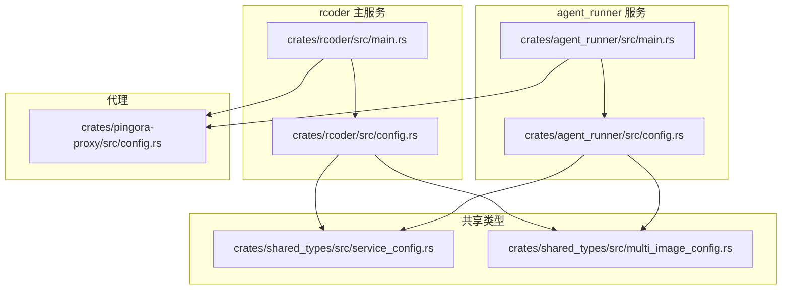
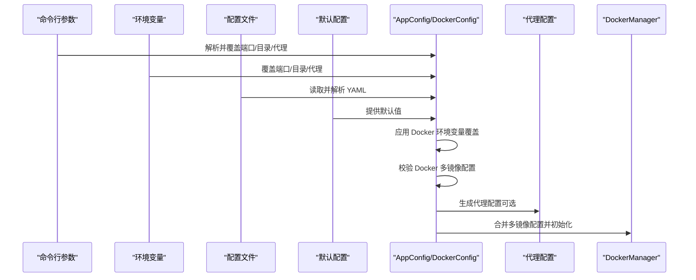
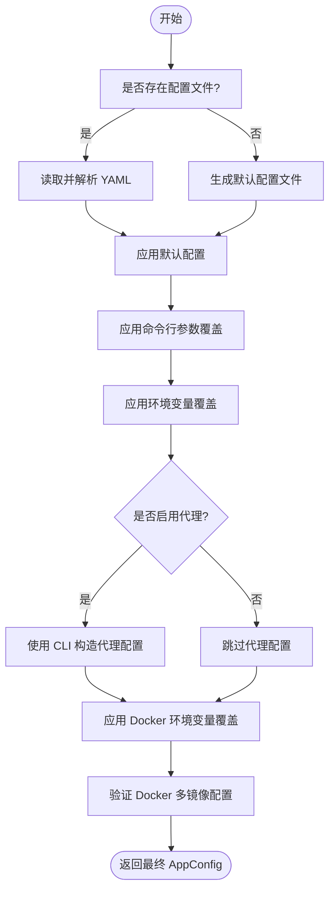
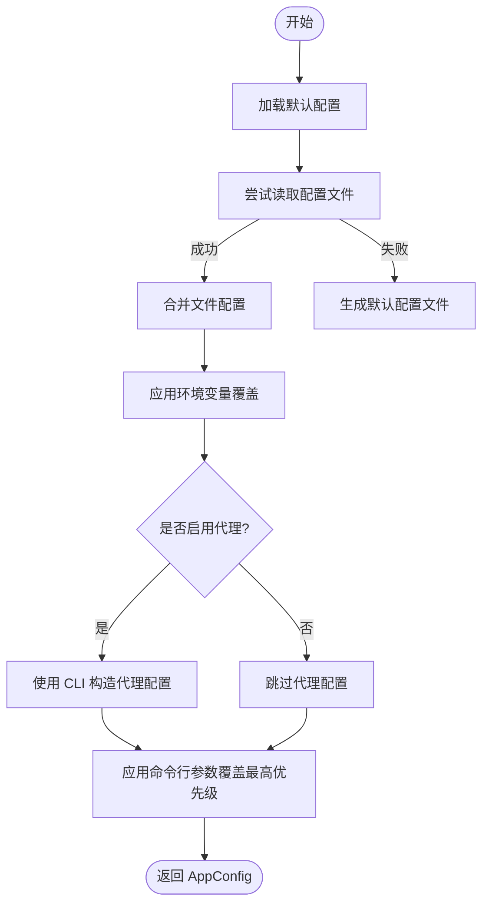
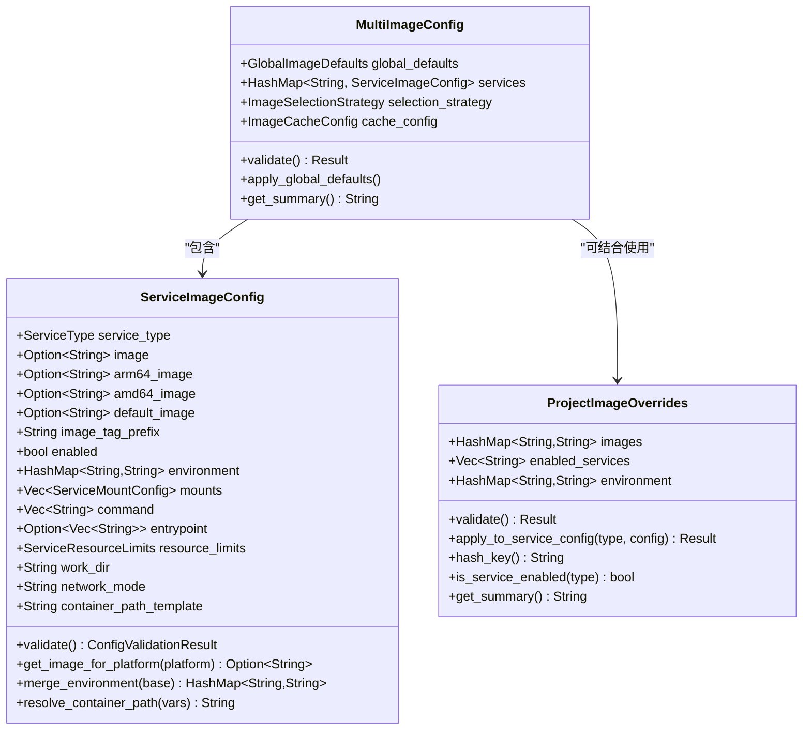
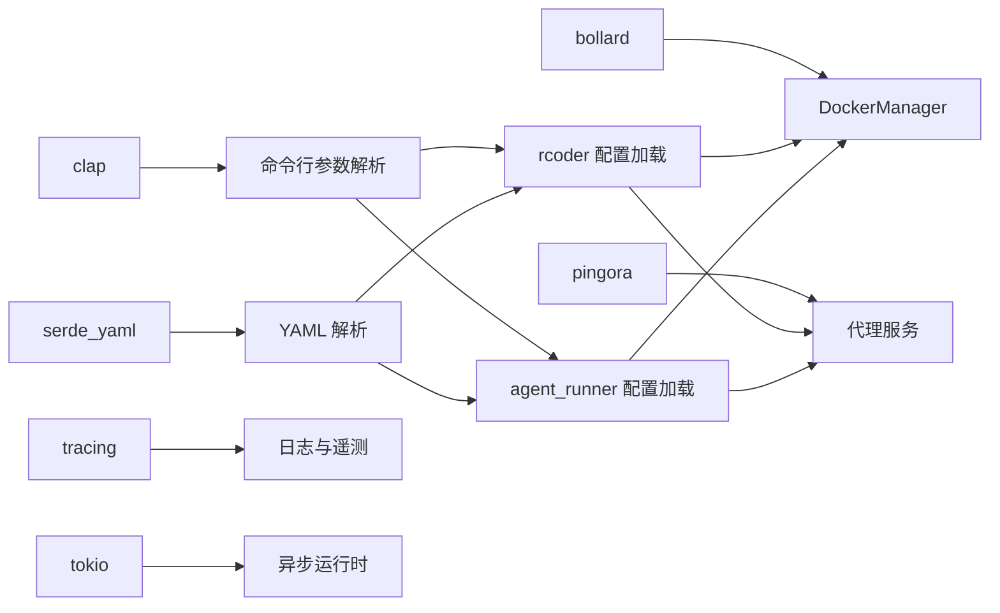

# 配置系统

<cite>
**本文引用的文件**
- [config.rs](file://crates/rcoder/src/config.rs)
- [config.rs](file://crates/agent_runner/src/config.rs)
- [config.rs](file://crates/pingora-proxy/src/config.rs)
- [service_config.rs](file://crates/shared_types/src/service_config.rs)
- [multi_image_config.rs](file://crates/shared_types/src/multi_image_config.rs)
- [main.rs](file://crates/rcoder/src/main.rs)
- [main.rs](file://crates/agent_runner/src/main.rs)
- [rcoder_default.yml](file://crates/rcoder/src/rcoder_default.yml)
- [config.yml](file://config.yml)
- [Cargo.toml](file://Cargo.toml)
</cite>

## 目录
1. [简介](#简介)
2. [项目结构](#项目结构)
3. [核心组件](#核心组件)
4. [架构总览](#架构总览)
5. [详细组件分析](#详细组件分析)
6. [依赖关系分析](#依赖关系分析)
7. [性能考量](#性能考量)
8. [故障排查指南](#故障排查指南)
9. [结论](#结论)
10. [附录](#附录)

## 简介
本文件系统化阐述本项目的配置体系，涵盖配置优先级、配置文件、环境变量与命令行参数的实现细节与交互关系。文档以代码为依据，提供面向初学者的循序讲解与面向资深工程师的技术深度，包括数据模型、处理流程、错误处理与常见问题的解决方案。

## 项目结构
配置系统主要分布在以下模块：
- rcoder 主服务：负责加载配置、解析命令行参数、应用环境变量覆盖、校验 Docker 多镜像配置，并将最终配置注入到运行时。
- agent_runner 服务：同样遵循“命令行 > 环境变量 > 配置文件 > 默认”的优先级，生成自身配置。
- 共享类型模块：提供多镜像配置、服务镜像配置、挂载点与资源限制等结构，以及配置验证逻辑。
- Pingora 代理：提供独立的代理配置结构，用于端口反向代理场景。

图表来源
- [main.rs](file://crates/rcoder/src/main.rs#L1-L272)
- [config.rs](file://crates/rcoder/src/config.rs#L1-L403)
- [main.rs](file://crates/agent_runner/src/main.rs#L1-L179)
- [config.rs](file://crates/agent_runner/src/config.rs#L1-L270)
- [service_config.rs](file://crates/shared_types/src/service_config.rs#L1-L513)
- [multi_image_config.rs](file://crates/shared_types/src/multi_image_config.rs#L1-L604)
- [config.rs](file://crates/pingora-proxy/src/config.rs#L1-L95)

章节来源
- [main.rs](file://crates/rcoder/src/main.rs#L1-L272)
- [config.rs](file://crates/rcoder/src/config.rs#L1-L403)
- [main.rs](file://crates/agent_runner/src/main.rs#L1-L179)
- [config.rs](file://crates/agent_runner/src/config.rs#L1-L270)
- [service_config.rs](file://crates/shared_types/src/service_config.rs#L1-L513)
- [multi_image_config.rs](file://crates/shared_types/src/multi_image_config.rs#L1-L604)
- [config.rs](file://crates/pingora-proxy/src/config.rs#L1-L95)

## 核心组件
- 配置优先级（rcoder 主服务）：命令行参数 > 环境变量 > 配置文件 > 默认配置；Docker 配置还支持环境变量覆盖。
- 配置文件：YAML 格式，默认文件由嵌入资源生成；运行时可读取并解析为结构化配置。
- 环境变量：用于覆盖端口、项目目录、Docker 网络模式、工作目录、自动清理、容器存活时间等。
- 命令行参数：使用 Clap 定义，支持端口、项目目录、代理开关与端口等。
- Docker 多镜像配置：集中管理服务镜像、环境变量、挂载点、资源限制、选择策略与缓存配置，并提供验证与摘要。

章节来源
- [config.rs](file://crates/rcoder/src/config.rs#L253-L332)
- [config.rs](file://crates/agent_runner/src/config.rs#L110-L192)
- [rcoder_default.yml](file://crates/rcoder/src/rcoder_default.yml#L1-L175)
- [config.yml](file://config.yml#L1-L161)
- [service_config.rs](file://crates/shared_types/src/service_config.rs#L1-L513)
- [multi_image_config.rs](file://crates/shared_types/src/multi_image_config.rs#L1-L604)

## 架构总览
下图展示了配置加载与覆盖的总体流程，以及与 Docker 多镜像配置、代理配置的交互。

图表来源
- [config.rs](file://crates/rcoder/src/config.rs#L253-L332)
- [main.rs](file://crates/rcoder/src/main.rs#L84-L129)
- [multi_image_config.rs](file://crates/shared_types/src/multi_image_config.rs#L97-L161)
- [service_config.rs](file://crates/shared_types/src/service_config.rs#L93-L165)

## 详细组件分析

### rcoder 主服务配置加载流程
- 优先级顺序：命令行参数 > 环境变量 > 配置文件 > 默认配置；Docker 配置支持额外的环境变量覆盖。
- 关键行为：
  - 若配置文件不存在，生成默认配置文件（嵌入资源）。
  - 代理启用时，使用命令行参数构造代理配置。
  - 对 Docker 配置应用环境变量覆盖，并执行多镜像配置验证。
  - 输出最终配置摘要，便于排障。

图表来源
- [config.rs](file://crates/rcoder/src/config.rs#L253-L332)
- [config.rs](file://crates/rcoder/src/config.rs#L347-L403)

章节来源
- [config.rs](file://crates/rcoder/src/config.rs#L253-L332)
- [config.rs](file://crates/rcoder/src/config.rs#L347-L403)
- [main.rs](file://crates/rcoder/src/main.rs#L84-L129)

### agent_runner 服务配置加载流程
- 优先级顺序：默认配置 → 配置文件 → 环境变量 → 命令行参数（命令行优先级最高）。
- 关键行为：
  - 首次启动若无配置文件，生成带注释的默认配置文件。
  - 代理启用时，使用命令行参数构造代理配置。
  - 输出最终配置摘要。

图表来源
- [config.rs](file://crates/agent_runner/src/config.rs#L110-L192)
- [config.rs](file://crates/agent_runner/src/config.rs#L206-L270)

章节来源
- [config.rs](file://crates/agent_runner/src/config.rs#L110-L192)
- [config.rs](file://crates/agent_runner/src/config.rs#L206-L270)

### Docker 多镜像配置与服务镜像配置
- 多镜像配置（MultiImageConfig）：
  - 全局默认镜像配置、服务映射、选择策略（当前为 ServiceOnly）、缓存配置。
  - 提供验证：全局前缀、缓存 TTL/条目数、服务启用数量等。
  - 支持全局默认镜像应用到各服务。
- 服务镜像配置（ServiceImageConfig）：
  - 服务类型、镜像选择（通用/架构特定/默认回退）、环境变量、挂载点、命令、入口点、资源限制、工作目录、网络模式、容器路径模板。
  - 提供验证：至少一个镜像、镜像名称格式、挂载点路径与类型、容器路径模板变量替换。
- 项目级镜像覆盖（ProjectImageOverrides）：
  - 支持按服务覆盖镜像与追加环境变量，提供校验与摘要。

图表来源
- [multi_image_config.rs](file://crates/shared_types/src/multi_image_config.rs#L1-L604)
- [service_config.rs](file://crates/shared_types/src/service_config.rs#L1-L513)

章节来源
- [multi_image_config.rs](file://crates/shared_types/src/multi_image_config.rs#L1-L604)
- [service_config.rs](file://crates/shared_types/src/service_config.rs#L1-L513)

### 代理配置（Pingora）
- 结构：监听端口、默认后端端口、后端主机、端口参数名、配置文件路径、详细日志开关。
- 行为：提供默认值与有效性校验（端口非零、主机非空、参数名非空）。

章节来源
- [config.rs](file://crates/pingora-proxy/src/config.rs#L1-L95)

### 配置选项、参数与返回值
- rcoder 主服务配置选项（AppConfig）：
  - default_agent：默认 AI 代理类型（枚举）。
  - projects_dir：项目工作目录（PathBuf）。
  - port：主服务端口（u16）。
  - proxy_config：可选代理配置（ProxyConfig）。
  - docker_config：可选 Docker 配置（DockerConfig）。
- Docker 配置（DockerConfig）：
  - multi_image_config：可选多镜像配置。
  - network_mode、work_dir、auto_cleanup、container_ttl_seconds：可选覆盖项。
  - apply_env_overrides：应用环境变量覆盖。
  - validate_multi_image_config：验证多镜像配置。
  - get_summary：获取配置摘要。
- 代理配置（ProxyConfig）：
  - listen_port、default_backend_port、backend_host、port_param、config_file、verbose。
- 返回值：
  - load_config_with_args/load_config 返回 AppConfig。
  - DockerConfig.apply_env_overrides 返回 Result。
  - 多镜像配置验证返回 Result。

章节来源
- [config.rs](file://crates/rcoder/src/config.rs#L37-L96)
- [config.rs](file://crates/rcoder/src/config.rs#L148-L251)
- [config.rs](file://crates/rcoder/src/config.rs#L253-L332)
- [config.rs](file://crates/agent_runner/src/config.rs#L38-L74)
- [config.rs](file://crates/agent_runner/src/config.rs#L110-L192)
- [config.rs](file://crates/pingora-proxy/src/config.rs#L8-L47)

## 依赖关系分析
- 依赖库：
  - 命令行解析：clap（含 env 功能）。
  - YAML 解析：serde_yaml。
  - 日志与遥测：tracing、tracing-subscriber、opentelemetry。
  - 异步运行时：tokio。
  - 代理：pingora。
  - Docker 管理：bollard。
- 组件耦合：
  - rcoder/agent_runner 通过 AppConfig/DockerConfig 与共享类型解耦。
  - DockerManager 通过全局配置初始化，避免直接耦合具体服务。
  - 代理配置独立于业务配置，通过 rcoder/agent_runner 的启动逻辑注入。

图表来源
- [Cargo.toml](file://Cargo.toml#L51-L205)
- [main.rs](file://crates/rcoder/src/main.rs#L84-L129)
- [main.rs](file://crates/agent_runner/src/main.rs#L80-L121)

章节来源
- [Cargo.toml](file://Cargo.toml#L51-L205)
- [main.rs](file://crates/rcoder/src/main.rs#L84-L129)
- [main.rs](file://crates/agent_runner/src/main.rs#L80-L121)

## 性能考量
- 配置加载：
  - YAML 解析与序列化开销较小，建议将配置文件放置在本地磁盘，避免远程网络 IO。
  - 首次启动若无配置文件会写入默认配置，注意磁盘写入开销。
- Docker 多镜像配置：
  - 缓存配置（ttl_seconds、max_entries）影响镜像拉取与选择性能，合理设置可减少重复拉取。
  - 选择策略为 ServiceOnly，避免跨服务模糊匹配带来的额外判断成本。
- 代理配置：
  - 健康检查间隔与超时需权衡探测频率与系统负载。
- 日志与遥测：
  - 控制日志级别与输出目标，避免过多 I/O 影响性能。

[本节为通用指导，无需列出章节来源]

## 故障排查指南
- 配置文件缺失或损坏：
  - rcoder 会在首次启动时生成默认配置文件；若解析失败，会回退到默认配置并记录警告。
  - 排查：确认配置文件路径、权限与 YAML 格式。
- 环境变量覆盖无效：
  - rcoder 主服务支持 RCODER_PORT、RCODER_PROJECTS_DIR、RCODER_NETWORK_MODE、RCODER_WORK_DIR、RCODER_AUTO_CLEANUP、RCODER_CONTAINER_TTL。
  - agent_runner 服务支持 RCODER_PORT（覆盖端口）。
  - 排查：确认环境变量名拼写与数值格式（如端口为 u16）。
- Docker 配置验证失败：
  - 多镜像配置会校验全局前缀、缓存 TTL/条目数、服务启用数量、服务镜像与挂载点等。
  - 排查：检查镜像名称、挂载路径、网络模式、资源限制等。
- 代理配置异常：
  - 监听端口、默认后端端口、后端主机、端口参数名不能为空且需为有效值。
  - 排查：确认端口范围与主机可达性。
- 启动时 Docker 路径解析失败：
  - rcoder 主服务在启动时会初始化宿主机路径解析器，若失败会给出详细帮助信息与建议。
  - 排查：确认 Docker socket 路径、挂载与权限。

章节来源
- [config.rs](file://crates/rcoder/src/config.rs#L253-L332)
- [config.rs](file://crates/agent_runner/src/config.rs#L110-L192)
- [multi_image_config.rs](file://crates/shared_types/src/multi_image_config.rs#L97-L161)
- [service_config.rs](file://crates/shared_types/src/service_config.rs#L93-L165)
- [config.rs](file://crates/pingora-proxy/src/config.rs#L48-L69)
- [main.rs](file://crates/rcoder/src/main.rs#L50-L83)

## 结论
本项目的配置系统采用清晰的优先级与模块化设计：rcoder/agent_runner 分别加载自身配置，Docker 多镜像配置集中管理镜像、环境变量与挂载点，并提供严格的验证与摘要能力。通过命令行参数、环境变量与配置文件的组合，系统既满足开发调试的灵活性，又能在生产环境中保证一致性与可观测性。

[本节为总结性内容，无需列出章节来源]

## 附录

### 配置优先级一览
- rcoder 主服务：命令行参数 > 环境变量 > 配置文件 > 默认配置；Docker 额外支持环境变量覆盖。
- agent_runner 服务：默认配置 → 配置文件 → 环境变量 → 命令行参数（命令行最高优先级）。

章节来源
- [config.rs](file://crates/rcoder/src/config.rs#L253-L332)
- [config.rs](file://crates/agent_runner/src/config.rs#L110-L192)

### Docker 环境变量覆盖清单（rcoder）
- RCODER_NETWORK_MODE：网络模式
- RCODER_WORK_DIR：工作目录
- RCODER_AUTO_CLEANUP：自动清理（布尔）
- RCODER_CONTAINER_TTL：容器存活时间（秒）

章节来源
- [config.rs](file://crates/rcoder/src/config.rs#L212-L239)

### 默认配置参考
- rcoder 默认配置文件（嵌入资源）：包含默认代理、Docker 多镜像配置、端口、项目目录等。
- 顶层 config.yml：顶层配置文件，包含 rcoder 与 agent-runner 的 Docker 服务镜像、环境变量、命令、资源限制、挂载点等。

章节来源
- [rcoder_default.yml](file://crates/rcoder/src/rcoder_default.yml#L1-L175)
- [config.yml](file://config.yml#L1-L161)