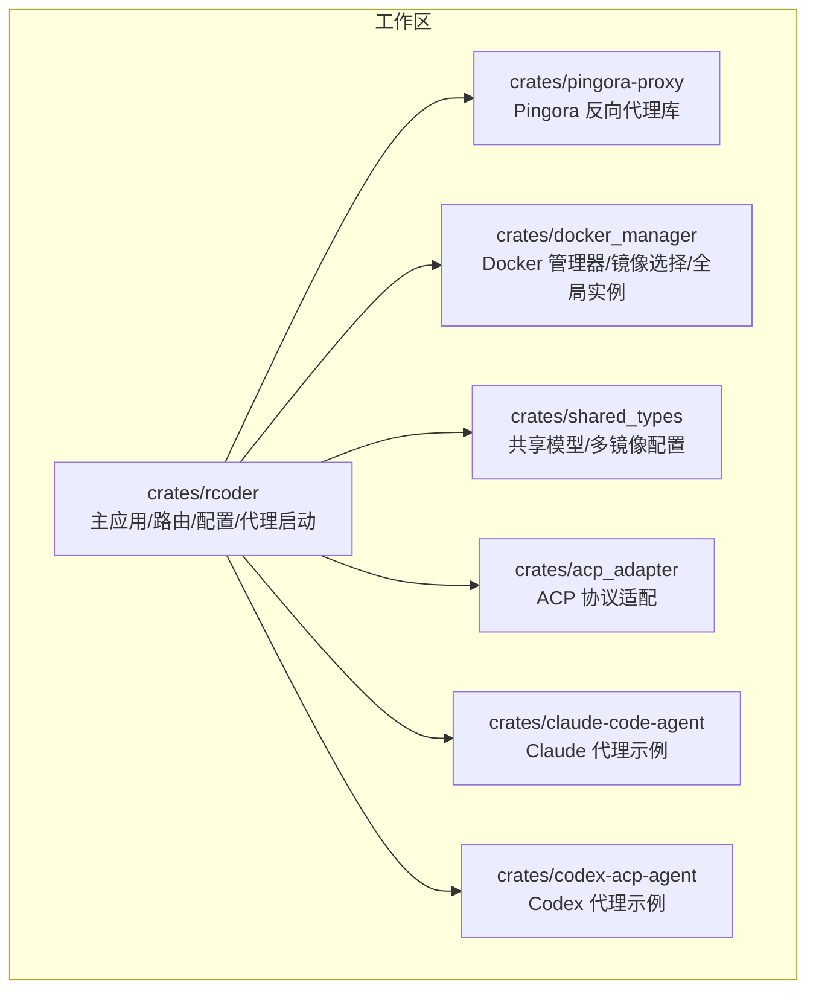
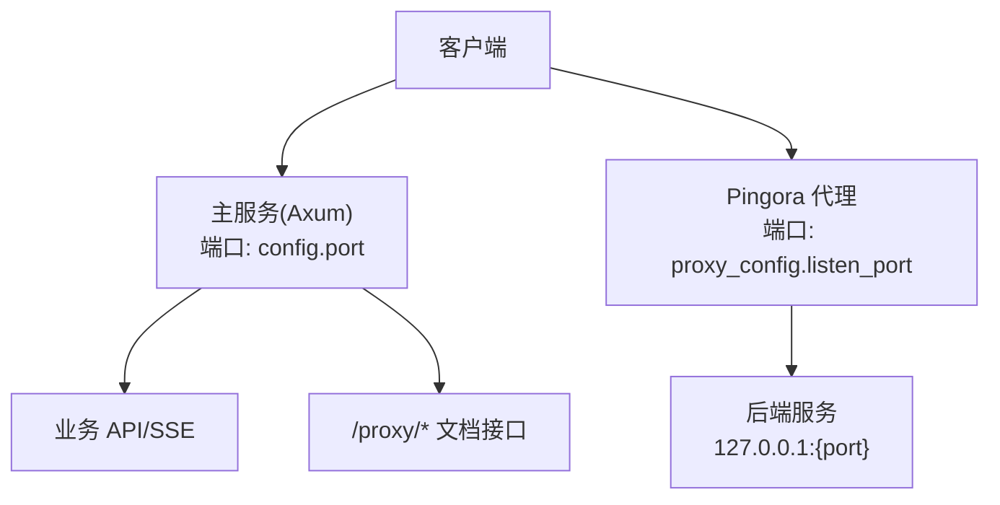
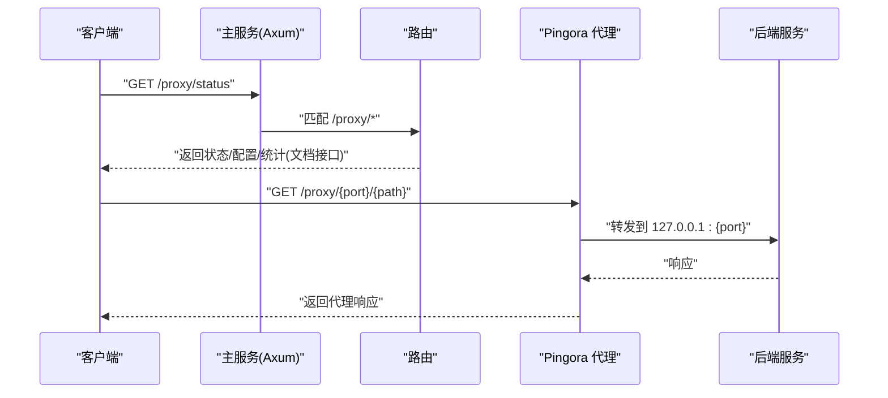
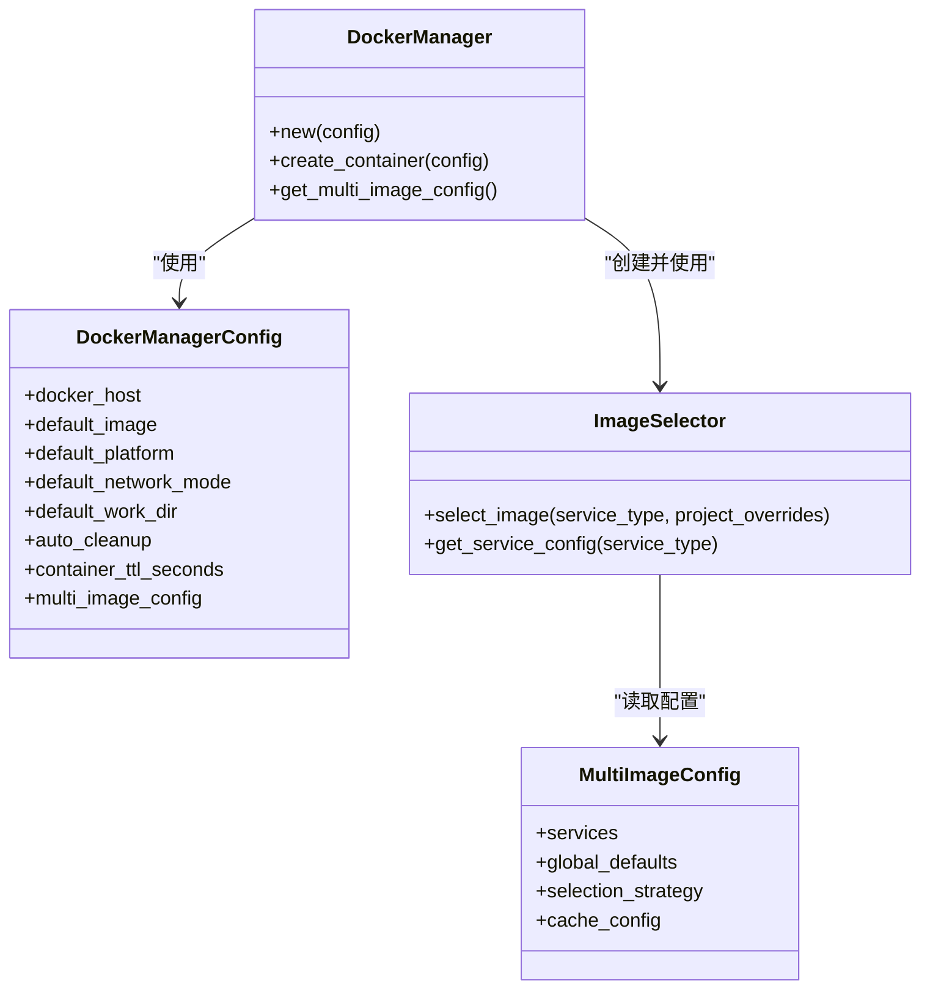
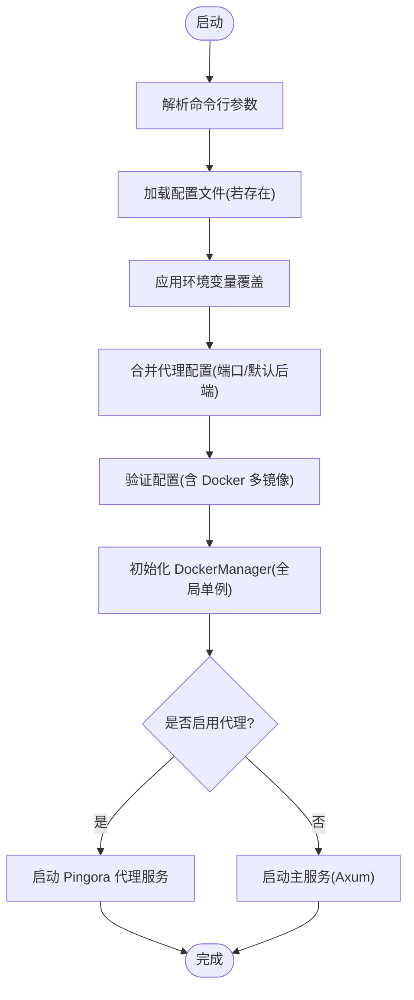
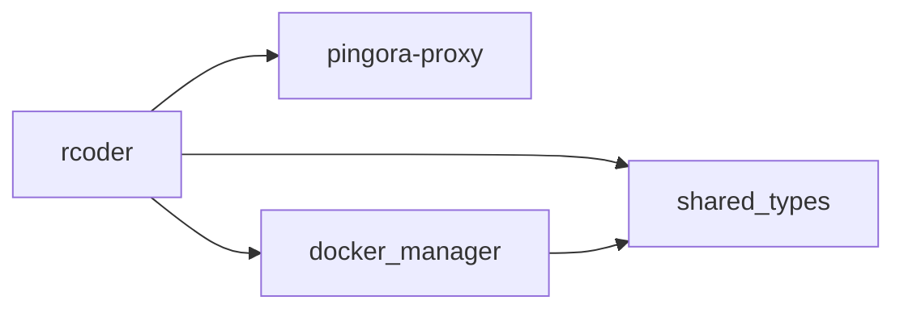

# 变更日志

<cite>
**本文引用的文件**
- [README.md](file://README.md)
- [Cargo.toml](file://Cargo.toml)
- [crates/rcoder/src/main.rs](file://crates/rcoder/src/main.rs)
- [crates/rcoder/src/config.rs](file://crates/rcoder/src/config.rs)
- [crates/rcoder/src/router.rs](file://crates/rcoder/src/router.rs)
- [crates/rcoder/src/handler/proxy_api.rs](file://crates/rcoder/src/handler/proxy_api.rs)
- [crates/pingora-proxy/src/lib.rs](file://crates/pingora-proxy/src/lib.rs)
- [crates/pingora-proxy/src/config.rs](file://crates/pingora-proxy/src/config.rs)
- [crates/docker_manager/src/lib.rs](file://crates/docker_manager/src/lib.rs)
- [crates/docker_manager/src/types.rs](file://crates/docker_manager/src/types.rs)
- [specs/multi-docker-image-design.md](file://specs/multi-docker-image-design.md)
</cite>

## 目录
1. [简介](#简介)
2. [项目结构](#项目结构)
3. [核心组件](#核心组件)
4. [架构总览](#架构总览)
5. [详细组件分析](#详细组件分析)
6. [依赖关系分析](#依赖关系分析)
7. [性能考量](#性能考量)
8. [故障排查指南](#故障排查指南)
9. [结论](#结论)
10. [附录](#附录)

## 简介
本文件旨在系统化梳理 RCoder 项目在版本迭代中的变更，围绕功能更新、缺陷修复与架构演进，结合代码库中的实际实现，解释变更日志在版本控制、升级路径与向后兼容性中的作用，并提供升级评估与问题排查的最佳实践。由于仓库未包含 CHANGELOG.md 文件，本文将基于现有 README 与源码，对 v0.1.0 版本的现状与关键特性进行总结，并给出面向未来的变更日志模板与生成建议，以便团队在后续版本中持续完善。

## 项目结构
RCoder 采用多 crate 的工作区组织，核心模块包括：
- 主应用与路由：rcodes/rcoder
- Pingora 反向代理封装：crates/pingora-proxy
- Docker 容器管理：crates/docker_manager
- 共享类型与协议：crates/shared_types
- 代理适配器与示例：acp_adapter、claude-code-agent、codex-acp-agent 等

图表来源
- [Cargo.toml](file://Cargo.toml#L1-L20)
- [README.md](file://README.md#L269-L378)

章节来源
- [Cargo.toml](file://Cargo.toml#L1-L20)
- [README.md](file://README.md#L269-L378)

## 核心组件
- 主应用与配置系统：命令行参数、环境变量、配置文件三段式优先级，支持代理与 Docker 配置的加载与覆盖。
- Pingora 反向代理：Axum + Pingora 的双服务架构，主服务提供 API/SSE，Pingora 独立监听代理端口，路径前缀路由到目标后端。
- Docker 管理器：全局单例、镜像选择策略、容器生命周期管理、清理任务与网络/挂载配置。
- 共享类型：多镜像配置结构、服务类型枚举、镜像选择器与缓存策略。

章节来源
- [crates/rcoder/src/config.rs](file://crates/rcoder/src/config.rs#L1-L120)
- [crates/rcoder/src/main.rs](file://crates/rcoder/src/main.rs#L160-L210)
- [crates/pingora-proxy/src/lib.rs](file://crates/pingora-proxy/src/lib.rs#L1-L120)
- [crates/docker_manager/src/lib.rs](file://crates/docker_manager/src/lib.rs#L140-L211)
- [specs/multi-docker-image-design.md](file://specs/multi-docker-image-design.md#L40-L120)

## 架构总览
RCoder 采用“主服务 + Pingora 代理”的双服务架构：
- 主服务（Axum）：提供健康检查、聊天、SSE 实时进度、代理状态/配置/统计等接口。
- Pingora 代理：独立监听代理端口，按路径前缀 /proxy/{port}/{path} 转发到指定后端，支持动态后端发现与健康检查。

图表来源
- [README.md](file://README.md#L133-L206)
- [crates/rcoder/src/router.rs](file://crates/rcoder/src/router.rs#L52-L84)
- [crates/rcoder/src/main.rs](file://crates/rcoder/src/main.rs#L168-L209)

章节来源
- [README.md](file://README.md#L133-L206)
- [crates/rcoder/src/router.rs](file://crates/rcoder/src/router.rs#L52-L84)
- [crates/rcoder/src/main.rs](file://crates/rcoder/src/main.rs#L168-L209)

## 详细组件分析

### 变更日志模板与生成建议
为保证变更日志的可追溯性与可维护性，建议采用如下模板（示例，非仓库既有内容）：
- 版本号：vX.Y.Z
- 发布日期：YYYY-MM-DD
- 关键变更
  - 新增：新增 API 端点、代理支持类型扩展、配置系统优化、可观测性增强等
  - 修复：缺陷修复、兼容性问题修正、性能回归修复等
  - 变更：架构调整、依赖升级、行为变更、弃用项等
- 升级指引：影响范围、破坏性变更、迁移步骤、兼容性说明
- 问题排查：常见问题、诊断方法、相关日志位置

说明：本仓库未包含 CHANGELOG.md 文件，本文基于现有 README 与源码总结 v0.1.0 的现状与关键特性，作为后续版本变更日志的参考。

章节来源
- [README.md](file://README.md#L627-L652)

### v0.1.0 版本要点（基于现有 README 与源码）
- 新增功能
  - 基于 ACP 协议的 AI 代理统一管理（Codex、Claude Code）
  - HTTP API 接口与统一 SSE 进度流
  - 多层配置系统（命令行 > 环境变量 > 配置文件 > 默认）
  - OpenTelemetry 集成与分布式追踪
  - Swagger UI API 文档
  - 项目文件解析器（Nuwax Parser）
- 技术特性
  - 基于 Rust 2024 Edition
  - 异步架构（Tokio）
  - 模块化设计（Workspace Crates）
  - 实时通信（SSE）
  - 结构化日志（Tracing）

章节来源
- [README.md](file://README.md#L627-L652)

### Pingora 反向代理能力与变更要点
- 能力概述
  - 独立监听代理端口，路径前缀路由到目标后端
  - 支持动态后端发现与健康检查
  - 提供状态、配置、统计等查询接口（Axum 文档接口）
- 关键实现
  - 主应用在启动时根据配置创建 Pingora 服务器管理器，并在后台启动
  - 路由中提供 /proxy/* 文档接口，真实代理请求需直接发送到 Pingora 端口
  - 代理库提供便捷函数与错误类型，支持快速启动与错误处理

图表来源
- [crates/rcoder/src/main.rs](file://crates/rcoder/src/main.rs#L168-L209)
- [crates/rcoder/src/router.rs](file://crates/rcoder/src/router.rs#L67-L79)
- [crates/rcoder/src/handler/proxy_api.rs](file://crates/rcoder/src/handler/proxy_api.rs#L1-L120)
- [crates/pingora-proxy/src/lib.rs](file://crates/pingora-proxy/src/lib.rs#L1-L120)

章节来源
- [crates/rcoder/src/main.rs](file://crates/rcoder/src/main.rs#L168-L209)
- [crates/rcoder/src/router.rs](file://crates/rcoder/src/router.rs#L67-L79)
- [crates/rcoder/src/handler/proxy_api.rs](file://crates/rcoder/src/handler/proxy_api.rs#L1-L120)
- [crates/pingora-proxy/src/lib.rs](file://crates/pingora-proxy/src/lib.rs#L1-L120)

### Docker 容器管理与镜像选择能力
- 能力概述
  - 全局 DockerManager 单例，支持自动检测平台、镜像选择与缓存
  - 多镜像配置结构，支持服务类型（rcoder/agent-runner）与架构（arm64/amd64）选择
  - 项目级镜像覆盖与环境变量注入
- 关键实现
  - DockerManagerConfig 默认配置与全局初始化
  - ImageSelector 选择策略（ServiceOnly），支持缓存与校验
  - 容器生命周期管理、清理任务与网络/挂载配置

图表来源
- [crates/docker_manager/src/lib.rs](file://crates/docker_manager/src/lib.rs#L140-L211)
- [crates/docker_manager/src/types.rs](file://crates/docker_manager/src/types.rs#L175-L233)
- [specs/multi-docker-image-design.md](file://specs/multi-docker-image-design.md#L120-L200)

章节来源
- [crates/docker_manager/src/lib.rs](file://crates/docker_manager/src/lib.rs#L140-L211)
- [crates/docker_manager/src/types.rs](file://crates/docker_manager/src/types.rs#L175-L233)
- [specs/multi-docker-image-design.md](file://specs/multi-docker-image-design.md#L120-L200)

### 配置系统与升级影响评估
- 配置优先级
  - 命令行参数 > 环境变量 > 配置文件 > 默认配置
- 代理配置
  - 主应用根据命令行与配置文件决定是否启用 Pingora 代理及其监听端口、默认后端端口等
- 升级影响评估
  - 若新增代理端口参数或健康检查配置项，需确保命令行与环境变量覆盖逻辑一致
  - Docker 配置新增字段时，应提供默认值与校验逻辑，避免破坏性变更

图表来源
- [crates/rcoder/src/config.rs](file://crates/rcoder/src/config.rs#L253-L332)
- [crates/rcoder/src/main.rs](file://crates/rcoder/src/main.rs#L168-L209)

章节来源
- [crates/rcoder/src/config.rs](file://crates/rcoder/src/config.rs#L253-L332)
- [crates/rcoder/src/main.rs](file://crates/rcoder/src/main.rs#L168-L209)

## 依赖关系分析
- 工作区与依赖
  - 工作区包含多个 crate，主应用默认成员包含 rcoder、agent_runner、shared_types、docker_manager、acp_adapter、claude-code-agent、pingora-proxy
  - 依赖包括 axum、tokio、clap、utoipa、pingora、bollard 等
- 组件耦合
  - rcoder 依赖 pingora-proxy 与 docker_manager，通过配置与全局实例进行解耦
  - 共享类型在 rcoder 与 docker_manager 之间传递，避免重复定义

图表来源
- [Cargo.toml](file://Cargo.toml#L1-L20)

章节来源
- [Cargo.toml](file://Cargo.toml#L1-L20)

## 性能考量
- 双服务架构
  - 主服务与 Pingora 代理并行运行，互不阻塞，提高吞吐与隔离性
- 代理性能
  - 基于 Rust 异步 I/O 的高性能代理，支持动态后端发现与健康检查
- 观测性
  - OpenTelemetry 与 Tracing 集成，便于定位性能瓶颈与异常

章节来源
- [README.md](file://README.md#L133-L206)
- [crates/pingora-proxy/src/lib.rs](file://crates/pingora-proxy/src/lib.rs#L1-L120)

## 故障排查指南
- 代理请求未转发
  - 确认请求是否发送到 Pingora 监听端口，而非主服务端口
  - 检查路径前缀是否符合 /proxy/{port}/{path}
- 后端不可达
  - 确认目标后端端口已启动且可访问
- Docker 相关
  - 检查 Docker socket 路径、权限与挂载
  - 查看全局 DockerManager 初始化日志与清理任务输出

章节来源
- [README.md](file://README.md#L193-L206)
- [crates/rcoder/src/main.rs](file://crates/rcoder/src/main.rs#L322-L351)

## 结论
- v0.1.0 版本已具备核心能力：统一 AI 代理接入、HTTP API 与 SSE、Pingora 反向代理、Docker 容器管理与多镜像配置、可观测性与文档化。
- 变更日志应聚焦于功能新增、缺陷修复与架构变更，并提供升级指引与兼容性说明。
- 建议在后续版本中补充 CHANGELOG.md，并建立自动化生成与校验流程，确保变更可追溯、可审计。

## 附录

### 变更日志生成最佳实践
- 自动化生成
  - 使用 Git 标签与提交信息生成候选条目
  - 通过 CI 校验变更类型（feat/fix/refactor/chore）与语义化版本
- 人工审核
  - 评审破坏性变更与迁移成本
  - 补充升级指引与兼容性说明
- 模板字段
  - 版本号、发布日期、变更类型、影响范围、修复问题、相关 PR/Issue

### 代码级变更示例（基于现有实现）
- 代理端口与默认后端端口
  - 主应用根据配置创建 Pingora 服务器管理器并启动
  - 路由提供 /proxy/* 文档接口，真实代理请求需直接发送到 Pingora 端口
- Docker 镜像选择
  - ImageSelector 采用 ServiceOnly 策略，优先使用服务特定镜像，支持缓存与校验
  - DockerManagerConfig 默认配置与全局初始化，支持项目级镜像覆盖

章节来源
- [crates/rcoder/src/main.rs](file://crates/rcoder/src/main.rs#L168-L209)
- [crates/rcoder/src/router.rs](file://crates/rcoder/src/router.rs#L67-L79)
- [specs/multi-docker-image-design.md](file://specs/multi-docker-image-design.md#L250-L415)