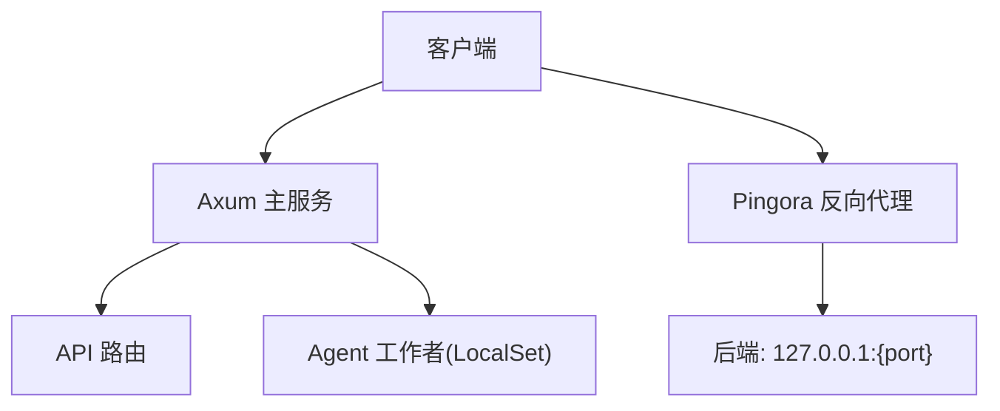
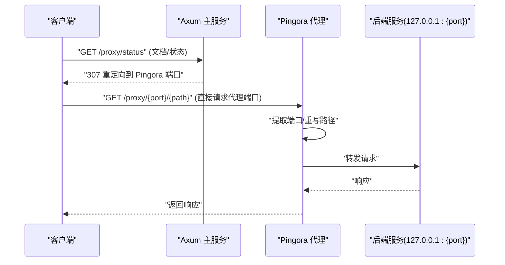
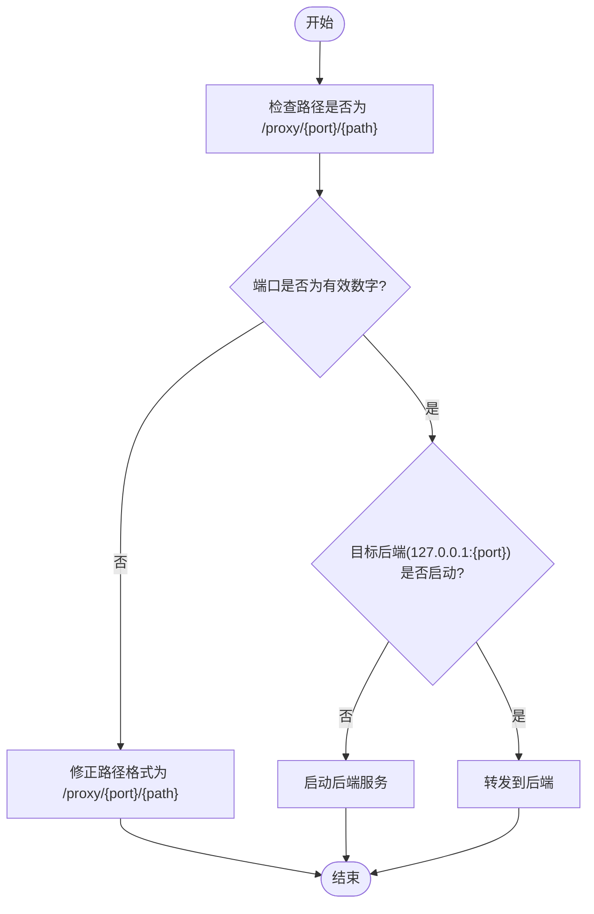
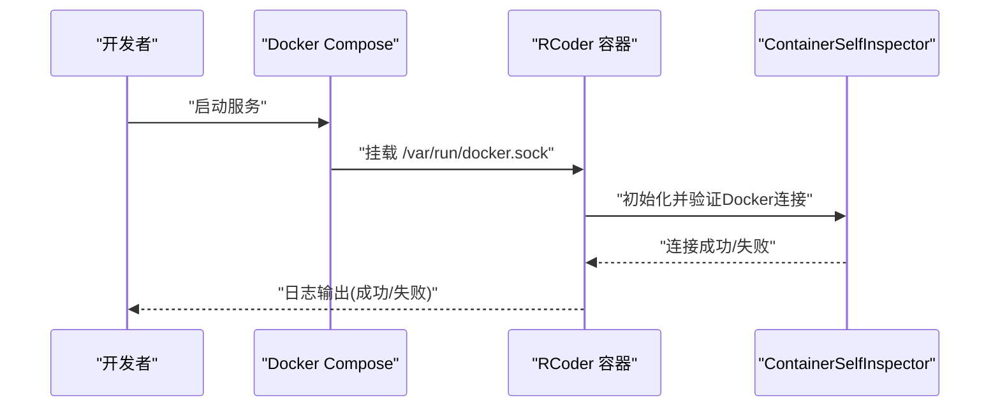
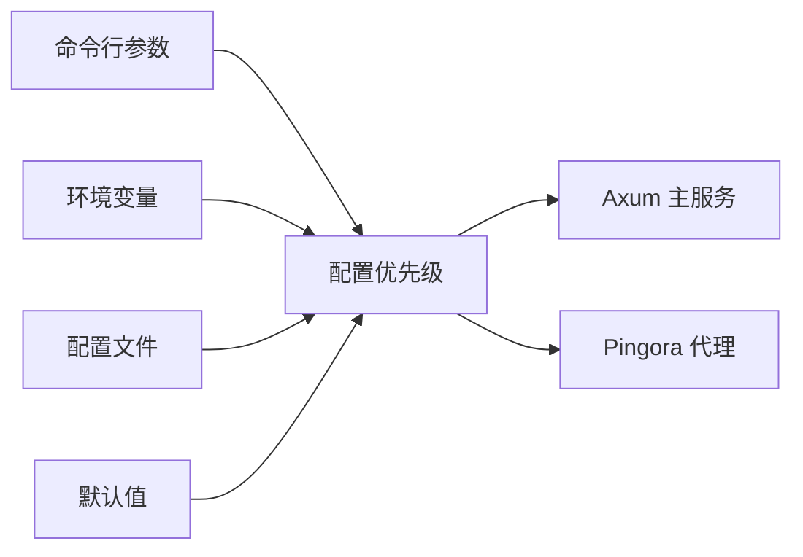
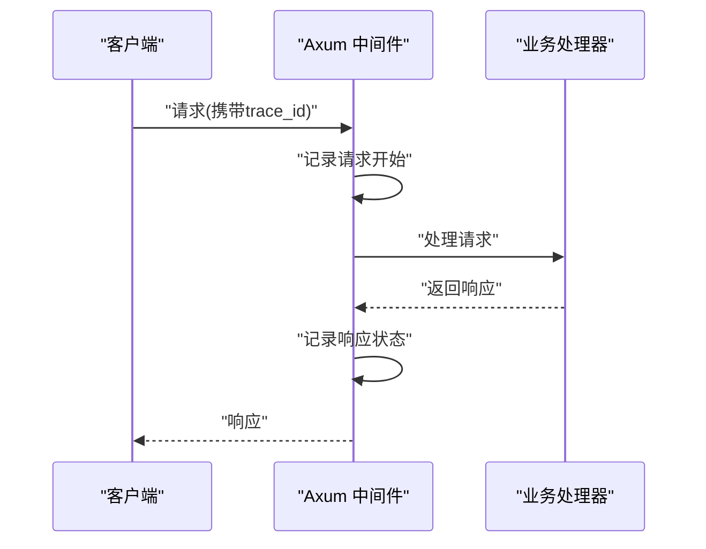

# 常见问题解答

<cite>
**本文引用的文件**
- [README.md](file://README.md)
- [CLAUDE.md](file://CLAUDE.md)
- [docker-compose.yml](file://docker/docker-compose.yml)
- [config.yml](file://config.yml)
- [tracing_middleware.rs](file://crates/rcoder/src/middleware/tracing_middleware.rs)
- [container_self_inspector.rs](file://crates/docker_manager/src/container_self_inspector.rs)
- [service.rs](file://crates/pingora-proxy/src/service.rs)
- [proxy_api.rs](file://crates/rcoder/src/handler/proxy_api.rs)
- [docker_container_agent.rs](file://crates/rcoder/src/proxy_agent/docker_container_agent.rs)
- [app_error.rs](file://crates/shared_types/src/model/app_error.rs)
</cite>

## 目录
1. [简介](#简介)
2. [项目结构](#项目结构)
3. [核心组件](#核心组件)
4. [架构总览](#架构总览)
5. [详细组件分析](#详细组件分析)
6. [依赖关系分析](#依赖关系分析)
7. [性能考量](#性能考量)
8. [故障排查指南](#故障排查指南)
9. [结论](#结论)
10. [附录](#附录)

## 简介
本FAQ面向初学者与专家用户，围绕安装配置、AI代理集成、反向代理路由、SSE进度流中断等高频问题，结合代码库中的实际实现，提供现象、根因、解决方案与预防措施，并给出可复现的排查步骤与日志分析技巧。文档同时整合跨组件问题（如配置优先级冲突导致的行为异常），帮助快速定位与修复。

## 项目结构
- 主应用（Axum）负责业务API、会话管理与SSE进度流
- Pingora代理独立监听端口，按路径前缀“/proxy/{port}/{path}”转发到指定后端
- 两者并行运行，互不阻塞；Axum中的“/proxy/...”路由仅作文档与重定向到Pingora

图表来源
- [README.md](file://README.md#L16-L30)

章节来源
- [README.md](file://README.md#L16-L30)

## 核心组件
- 配置系统：命令行 > 环境变量 > 配置文件 > 默认值，优先级明确
- 反向代理：Pingora提供端口路由、路径重写、指标统计与健康检查
- 观测性：Tracing + OpenTelemetry，统一注入trace_id，便于跨服务串联
- 容器化：DockerManager动态创建容器，内部网络通信，自动路径解析与挂载
- SSE：统一的实时进度流接口，便于前端消费

章节来源
- [README.md](file://README.md#L386-L439)
- [CLAUDE.md](file://CLAUDE.md#L108-L114)
- [docker-compose.yml](file://docker/docker-compose.yml#L1-L37)
- [config.yml](file://config.yml#L1-L30)

## 架构总览
- 主服务与代理并行：Axum提供REST API与SSE；Pingora独立监听代理端口
- 代理请求必须发送到Pingora监听端口，路径前缀“/proxy/{port}/{path}”
- 代理模式下不支持查询参数提取端口（遵循“代理端口提取规则”）

图表来源
- [README.md](file://README.md#L133-L206)
- [service.rs](file://crates/pingora-proxy/src/service.rs#L253-L354)

章节来源
- [README.md](file://README.md#L133-L206)

## 详细组件分析

### 反向代理路由失败
- 现象
  - 请求误发到Axum主服务端口的“/proxy/...”路由，收到307重定向
  - 收到JSON演示响应而非真实转发
  - 端口提取失败（路径非“/proxy/{port}/{path}”或端口非法）
- 根因
  - 代理模式仅支持路径前缀提取端口，不解析查询参数
  - 未指定目标后端端口或端口不可达
- 解决方案
  - 直接请求Pingora监听端口，路径格式为“/proxy/{port}/{path}”
  - 确认目标后端服务已在本机启动且端口有效
- 预防措施
  - 在客户端或网关层统一走Pingora端口
  - 使用代理状态/配置/统计接口辅助排障

图表来源
- [README.md](file://README.md#L168-L198)
- [service.rs](file://crates/pingora-proxy/src/service.rs#L357-L399)

章节来源
- [README.md](file://README.md#L168-L198)
- [service.rs](file://crates/pingora-proxy/src/service.rs#L357-L399)

### SSE进度流中断
- 现象
  - 客户端SSE连接断开，无法持续接收进度事件
- 根因
  - 代理层或上游服务超时、连接中断、NAT/防火墙丢弃空闲连接
  - 客户端未正确处理长连接或网络波动
- 解决方案
  - 保持客户端长连接，合理设置心跳与重连策略
  - 在代理层开启健康检查与负载均衡，避免后端不稳定导致中断
- 预防措施
  - 使用代理统计接口观察活跃连接数与失败率
  - 在主服务侧确保SSE通道稳定，避免阻塞

章节来源
- [proxy_api.rs](file://crates/rcoder/src/handler/proxy_api.rs#L119-L156)
- [service.rs](file://crates/pingora-proxy/src/service.rs#L582-L596)

### Docker权限问题
- 现象
  - 容器创建失败、镜像拉取失败、无法获取容器日志
- 根因
  - Docker socket权限不足或未挂载
  - 容器内无法访问宿主机路径映射
- 解决方案
  - 确保Docker socket挂载到容器并具备读写权限
  - 在compose中设置正确的环境变量（如DOCKER_SOCKET_PATH）
  - 使用容器自检测器进行socket连通性与容器ID解析验证
- 预防措施
  - 启动时先验证Docker连接，再执行容器操作
  - 在CI/本地开发环境统一挂载策略

图表来源
- [docker-compose.yml](file://docker/docker-compose.yml#L1-L37)
- [container_self_inspector.rs](file://crates/docker_manager/src/container_self_inspector.rs#L258-L269)

章节来源
- [docker-compose.yml](file://docker/docker-compose.yml#L1-L37)
- [container_self_inspector.rs](file://crates/docker_manager/src/container_self_inspector.rs#L258-L269)

### AI代理集成（Claude Code代理无法启动）
- 现象
  - Claude Code代理启动失败或无法连接
- 根因
  - Claude Code CLI未安装或环境变量未配置
  - 容器内网络隔离导致外部服务不可达
  - 容器内路径解析失败，挂载映射不正确
- 解决方案
  - 安装并配置Claude Code CLI，设置API密钥与模型
  - 使用内部网络通信，避免宿主机端口映射带来的复杂性
  - 通过容器自检测器校验挂载点与宿主机路径映射
- 预防措施
  - 在配置文件中明确镜像与资源限制
  - 启动后检查容器健康状态与日志

章节来源
- [CLAUDE.md](file://CLAUDE.md#L116-L133)
- [docker_container_agent.rs](file://crates/rcoder/src/proxy_agent/docker_container_agent.rs#L132-L242)
- [container_self_inspector.rs](file://crates/docker_manager/src/container_self_inspector.rs#L63-L136)

### 配置优先级冲突导致的行为异常
- 现象
  - 端口、代理监听端口、默认后端端口与期望不一致
  - 环境变量覆盖配置文件但被命令行参数再次覆盖
- 根因
  - 配置来源优先级顺序：命令行 > 环境变量 > 配置文件 > 默认值
- 解决方案
  - 明确各层配置来源，必要时显式指定命令行参数
  - 在启动脚本中统一设置环境变量，避免遗漏
- 预防措施
  - 在CI/本地开发环境固化配置来源，减少歧义

章节来源
- [README.md](file://README.md#L386-L439)
- [CLAUDE.md](file://CLAUDE.md#L108-L114)
- [config.yml](file://config.yml#L1-L30)

## 依赖关系分析
- 配置来源与优先级
  - 命令行参数最高优先级，环境变量次之，配置文件再次之，最后为默认值
- 代理与后端
  - Pingora代理负责端口提取与路径重写，后端映射动态维护
- 观测性
  - Tracing中间件统一注入trace_id，便于跨服务日志关联

图表来源
- [README.md](file://README.md#L386-L439)
- [CLAUDE.md](file://CLAUDE.md#L108-L114)

章节来源
- [README.md](file://README.md#L386-L439)
- [CLAUDE.md](file://CLAUDE.md#L108-L114)

## 性能考量
- 代理层指标
  - 总请求数、成功率、平均响应时间、按端口统计、活跃连接数
- 负载均衡
  - 支持轮询与健康检查，定期探测后端可达性
- 容器化
  - 内部网络通信，避免端口映射带来的额外开销

章节来源
- [proxy_api.rs](file://crates/rcoder/src/handler/proxy_api.rs#L119-L156)
- [service.rs](file://crates/pingora-proxy/src/service.rs#L582-L596)

## 故障排查指南

### 通过tracing_middleware日志定位请求失败原因
- 步骤
  - 启用详细日志：设置RUST_LOG为debug或指定模块
  - 观察请求进入与退出日志，定位trace_id
  - 在Axum中间件层记录请求开始/结束与状态码
- 建议
  - 在客户端携带trace_id或x-request-id，便于跨服务串联
  - 使用代理统计接口查看失败率与平均响应时间

图表来源
- [tracing_middleware.rs](file://crates/rcoder/src/middleware/tracing_middleware.rs#L71-L130)

章节来源
- [tracing_middleware.rs](file://crates/rcoder/src/middleware/tracing_middleware.rs#L71-L130)

### 通过container_self_inspector诊断容器状态
- 步骤
  - 初始化ContainerSelfInspector，验证Docker socket连接
  - 获取当前容器ID与挂载信息，核对容器内路径到宿主机路径映射
  - 若未找到挂载信息，列出所有挂载点辅助定位
- 建议
  - 在容器启动脚本中先验证Docker连接与挂载权限
  - 使用compose挂载/var/run/docker.sock并设置环境变量

章节来源
- [container_self_inspector.rs](file://crates/docker_manager/src/container_self_inspector.rs#L258-L269)
- [container_self_inspector.rs](file://crates/docker_manager/src/container_self_inspector.rs#L63-L136)
- [docker-compose.yml](file://docker/docker-compose.yml#L1-L37)

### 代理端口提取失败排查
- 步骤
  - 确认请求路径为“/proxy/{port}/{path}”，端口为有效数字
  - 如未指定端口，确认默认后端端口配置
  - 使用代理状态/配置/统计接口查看后端映射与健康状态
- 建议
  - 在客户端统一走Pingora端口，避免误发到Axum主服务端口

章节来源
- [README.md](file://README.md#L168-L198)
- [service.rs](file://crates/pingora-proxy/src/service.rs#L357-L399)
- [proxy_api.rs](file://crates/rcoder/src/handler/proxy_api.rs#L63-L118)

### SSE进度流中断排查
- 步骤
  - 检查代理统计接口，关注活跃连接数与失败率
  - 确认上游服务健康状态与响应时间
  - 在客户端侧增加重连与心跳机制
- 建议
  - 使用代理健康检查循环，定期探测后端可达性

章节来源
- [proxy_api.rs](file://crates/rcoder/src/handler/proxy_api.rs#L119-L156)
- [service.rs](file://crates/pingora-proxy/src/service.rs#L582-L596)

### 容器内路径解析失败
- 步骤
  - 使用容器自检测器检测容器ID与挂载点
  - 核对容器内路径到宿主机路径映射是否正确
  - 在配置文件中明确挂载路径并进行变量替换
- 建议
  - 在启动脚本中统一挂载策略，避免相对路径与容器内绝对路径混淆

章节来源
- [docker_container_agent.rs](file://crates/rcoder/src/proxy_agent/docker_container_agent.rs#L244-L295)
- [container_self_inspector.rs](file://crates/docker_manager/src/container_self_inspector.rs#L138-L166)

## 结论
- 代理请求必须直接发送到Pingora监听端口，路径前缀“/proxy/{port}/{path}”
- 配置优先级清晰，命令行最高，环境变量次之，配置文件再次之
- 观测性与容器化能力完善，建议结合Tracing与代理统计进行问题定位
- Docker权限与路径解析是容器化部署的关键，务必在启动阶段验证

## 附录
- 常用命令与接口
  - 健康检查：/health
  - 代理状态：/proxy/status
  - 代理配置：/proxy/config
  - 代理统计：/proxy/stats
  - 实时进度流：/agent/progress/{session_id}

章节来源
- [README.md](file://README.md#L209-L268)