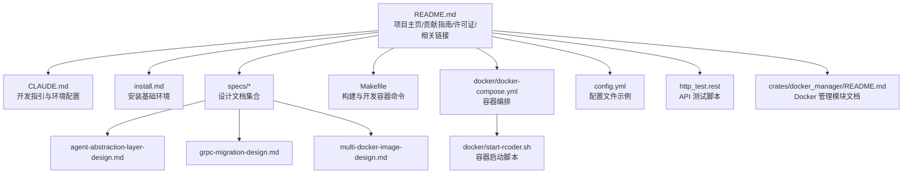
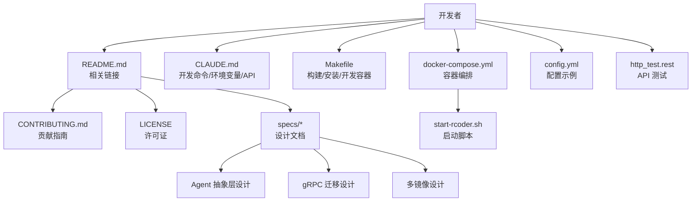
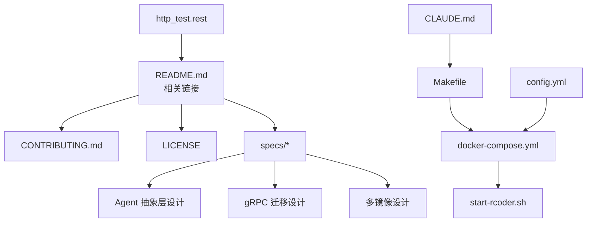

# 相关链接

<cite>
**本文引用的文件**
- [README.md](file://README.md)
- [CLAUDE.md](file://CLAUDE.md)
- [install.md](file://install.md)
- [Makefile](file://Makefile)
- [http_test.rest](file://http_test.rest)
- [specs/agent-abstraction-layer-design.md](file://specs/agent-abstraction-layer-design.md)
- [specs/grpc-migration-design.md](file://specs/grpc-migration-design.md)
- [specs/multi-docker-image-design.md](file://specs/multi-docker-image-design.md)
- [docker/docker-compose.yml](file://docker/docker-compose.yml)
- [docker/start-rcoder.sh](file://docker/start-rcoder.sh)
- [config.yml](file://config.yml)
- [crates/docker_manager/README.md](file://crates/docker_manager/README.md)
</cite>

## 目录
1. [简介](#简介)
2. [项目结构](#项目结构)
3. [核心组件](#核心组件)
4. [架构总览](#架构总览)
5. [详细组件分析](#详细组件分析)
6. [依赖分析](#依赖分析)
7. [性能考量](#性能考量)
8. [故障排除指南](#故障排除指南)
9. [结论](#结论)
10. [附录](#附录)

## 简介
本章节聚焦于项目中的“相关链接”，即 README.md 中列出的项目主页、贡献指南、许可证文件、设计文档（specs/目录下）以及其他关键文档（如 CLAUDE.md、install.md）。我们将解释这些文档的作用、访问方式，并给出实际使用场景示例，帮助开发者在开发、部署与故障排除中高效集成这些资源。同时，针对常见问题（如链接失效、文档版本不匹配）提供解决方案，并建议性能优化措施（如本地文档镜像、自动化文档索引）。

## 项目结构
围绕“相关链接”的组织方式，项目提供了如下关键入口与配套资源：
- 顶层文档：README.md、CLAUDE.md、install.md
- 设计文档：specs/agent-abstraction-layer-design.md、specs/grpc-migration-design.md、specs/multi-docker-image-design.md
- 部署与脚本：Makefile、docker/docker-compose.yml、docker/start-rcoder.sh
- 配置与测试：config.yml、http_test.rest
- 子模块文档：crates/docker_manager/README.md

图表来源
- [README.md](file://README.md#L585-L620)
- [CLAUDE.md](file://CLAUDE.md#L1-L60)
- [install.md](file://install.md#L1-L9)
- [specs/agent-abstraction-layer-design.md](file://specs/agent-abstraction-layer-design.md#L1-L60)
- [specs/grpc-migration-design.md](file://specs/grpc-migration-design.md#L1-L40)
- [specs/multi-docker-image-design.md](file://specs/multi-docker-image-design.md#L1-L40)
- [Makefile](file://Makefile#L1-L40)
- [docker/docker-compose.yml](file://docker/docker-compose.yml#L1-L37)
- [docker/start-rcoder.sh](file://docker/start-rcoder.sh#L1-L22)
- [config.yml](file://config.yml#L1-L40)
- [http_test.rest](file://http_test.rest#L1-L20)
- [crates/docker_manager/README.md](file://crates/docker_manager/README.md#L1-L40)

章节来源
- [README.md](file://README.md#L585-L620)
- [Makefile](file://Makefile#L1-L40)
- [docker/docker-compose.yml](file://docker/docker-compose.yml#L1-L37)
- [docker/start-rcoder.sh](file://docker/start-rcoder.sh#L1-L22)
- [config.yml](file://config.yml#L1-L40)
- [http_test.rest](file://http_test.rest#L1-L20)
- [crates/docker_manager/README.md](file://crates/docker_manager/README.md#L1-L40)

## 核心组件
- 项目主页与贡献指南：位于 README.md 的“相关链接”区域，提供仓库地址、问题跟踪、贡献指南与变更日志入口。
- 许可证文件：位于 README.md 的“许可证”区域，说明采用 MIT 或 Apache-2.0 双许可证。
- 设计文档（specs/）：包含 Agent 抽象层、gRPC 迁移、多镜像设计等，指导架构演进与实现。
- 开发与安装文档：CLAUDE.md 提供开发命令、环境变量、API 接口与调试方法；install.md 提供安装基础依赖的指引。
- 构建与部署：Makefile 提供本地编译、安装、Docker 镜像构建与开发容器的快捷命令；docker/docker-compose.yml 与 docker/start-rcoder.sh 提供容器化运行与健康检查。
- 配置与测试：config.yml 展示默认配置项与代理配置；http_test.rest 提供 API 测试脚本，便于手动验证接口行为。

章节来源
- [README.md](file://README.md#L585-L620)
- [CLAUDE.md](file://CLAUDE.md#L27-L120)
- [install.md](file://install.md#L1-L9)
- [Makefile](file://Makefile#L1-L40)
- [docker/docker-compose.yml](file://docker/docker-compose.yml#L1-L37)
- [docker/start-rcoder.sh](file://docker/start-rcoder.sh#L1-L22)
- [config.yml](file://config.yml#L1-L40)
- [http_test.rest](file://http_test.rest#L1-L20)

## 架构总览
“相关链接”在整体架构中的作用是为开发者提供从入门到深入实现的路径图。通过 README 的“相关链接”导航到贡献指南与设计文档，再结合 CLAUDE.md 的开发命令与 Makefile 的构建流程，最终落地到 docker-compose 与启动脚本完成部署与运行。

图表来源
- [README.md](file://README.md#L585-L620)
- [specs/agent-abstraction-layer-design.md](file://specs/agent-abstraction-layer-design.md#L1-L60)
- [specs/grpc-migration-design.md](file://specs/grpc-migration-design.md#L1-L40)
- [specs/multi-docker-image-design.md](file://specs/multi-docker-image-design.md#L1-L40)
- [CLAUDE.md](file://CLAUDE.md#L27-L120)
- [Makefile](file://Makefile#L1-L40)
- [docker/docker-compose.yml](file://docker/docker-compose.yml#L1-L37)
- [docker/start-rcoder.sh](file://docker/start-rcoder.sh#L1-L22)
- [config.yml](file://config.yml#L1-L40)
- [http_test.rest](file://http_test.rest#L1-L20)

## 详细组件分析

### README.md 的“相关链接”与“许可证”
- 项目主页与问题追踪：提供仓库地址与 Issues 页面，便于提交问题与跟踪进展。
- 贡献指南与变更日志：CONTRIBUTING.md 与 CHANGELOG.md 提供贡献流程与版本演进记录。
- 许可证：LICENSE 文件说明采用 MIT 或 Apache-2.0 双许可证，明确使用范围与分发条件。
- 使用场景示例：
  - 开发者在遇到问题时，先查阅 FAQ（README 的“问题排查”区域），再搜索 Issues，最后在 Issues 中补充详细信息。
  - 贡献者在提交 PR 前，先阅读 CONTRIBUTING.md 的流程与规范。

章节来源
- [README.md](file://README.md#L585-L620)

### 设计文档（specs/）的作用与访问方式
- agent-abstraction-layer-design.md：定义 Agent 抽象层、Agent Trait、Launcher、Supervisor 与配置管理，指导多 Agent 支持与扩展。
- grpc-migration-design.md：规划从 HTTP+SSE 迁移到 gRPC 的接口契约与模块改造计划，统一通信协议与类型安全。
- multi-docker-image-design.md：设计双镜像配置系统，支持 rcoder 与 agent-runner 两类服务类型，兼顾向后兼容与未来扩展。
- 使用场景示例：
  - 架构师在评估新 Agent 集成时，参考 agent-abstraction-layer-design.md 的抽象接口与生命周期管理。
  - 团队在讨论通信协议升级时，参考 grpc-migration-design.md 的 Proto 定义与实施步骤。
  - 在引入新服务类型时，参考 multi-docker-image-design.md 的镜像选择策略与容器创建接口。

章节来源
- [specs/agent-abstraction-layer-design.md](file://specs/agent-abstraction-layer-design.md#L1-L120)
- [specs/grpc-migration-design.md](file://specs/grpc-migration-design.md#L1-L60)
- [specs/multi-docker-image-design.md](file://specs/multi-docker-image-design.md#L1-L120)

### CLAUDE.md 的开发命令与环境配置
- 开发命令：提供本地构建、安装、Docker 镜像构建与开发容器的常用命令，便于快速迭代。
- 环境变量：列举服务端口、Docker socket、代理密钥等关键环境变量，确保开发与调试一致性。
- API 接口：列出核心端点与响应格式，便于前后端联调与测试。
- 使用场景示例：
  - 新成员入职时，先按 install.md 安装基础依赖，再参考 CLAUDE.md 的开发命令搭建本地环境。
  - 调试阶段，通过 CLAUDE.md 的日志配置与容器调试命令快速定位问题。

章节来源
- [CLAUDE.md](file://CLAUDE.md#L27-L120)
- [CLAUDE.md](file://CLAUDE.md#L116-L170)
- [CLAUDE.md](file://CLAUDE.md#L139-L190)

### install.md 的安装基础环境
- 提供安装 Claude Code ACP 与 Claude Code CLI 的命令，确保 AI 代理相关能力可用。
- 使用场景示例：
  - 在首次运行前，先执行 install.md 中的安装步骤，避免后续代理调用失败。

章节来源
- [install.md](file://install.md#L1-L9)

### Makefile 的构建与开发容器命令
- 本地编译、安装、卸载二进制与安装 agent 的命令，便于快速构建与分发。
- Docker 镜像构建与开发容器的一键流程，支持快速重启与日志查看。
- 使用场景示例：
  - 本地开发：make dev-build 后 make dev-up 启动开发容器；修改代码后 make dev-restart 快速重启。
  - CI/CD：make docker-build 构建镜像，配合 docker/docker-compose.yml 进行部署。

章节来源
- [Makefile](file://Makefile#L1-L40)
- [Makefile](file://Makefile#L75-L120)
- [Makefile](file://Makefile#L122-L166)

### docker/docker-compose.yml 与 docker/start-rcoder.sh
- docker-compose.yml：定义服务名称、端口映射、环境变量、卷挂载与健康检查，确保容器化运行稳定。
- start-rcoder.sh：在容器内初始化必要目录、导出环境变量并启动 rcoder 主程序。
- 使用场景示例：
  - 通过 docker-compose.yml 的 healthcheck 验证服务可用性。
  - 使用 make dev-logs 查看容器日志，定位启动与运行问题。

章节来源
- [docker/docker-compose.yml](file://docker/docker-compose.yml#L1-L37)
- [docker/start-rcoder.sh](file://docker/start-rcoder.sh#L1-L22)

### config.yml 的配置示例与代理配置
- 展示默认代理配置（listen_port、default_backend_port、backend_host、port_param）与健康检查参数。
- 使用场景示例：
  - 在本地或生产环境中，根据实际网络与端口策略调整 proxy_config，确保代理请求正确转发。

章节来源
- [config.yml](file://config.yml#L1-L40)
- [config.yml](file://config.yml#L31-L80)

### http_test.rest 的 API 测试脚本
- 提供 chat、SSE 进度流、取消任务、停止 Agent 等接口的测试用例，支持 REST Client 插件的动态变量。
- 使用场景示例：
  - 在开发阶段，使用 http_test.rest 快速验证聊天、取消与停止等核心流程。
  - 在回归测试中，复用该脚本进行端到端验证。

章节来源
- [http_test.rest](file://http_test.rest#L1-L40)
- [http_test.rest](file://http_test.rest#L41-L109)

### crates/docker_manager/README.md 的 Docker 管理模块
- 介绍 Docker Manager 的功能特性、核心组件与使用场景，指导如何为项目创建独立运行环境。
- 使用场景示例：
  - 在需要为每个项目创建隔离容器时，参考该文档的配置与最佳实践。

章节来源
- [crates/docker_manager/README.md](file://crates/docker_manager/README.md#L1-L60)
- [crates/docker_manager/README.md](file://crates/docker_manager/README.md#L135-L170)

## 依赖分析
“相关链接”在项目中的依赖关系体现为：README 的“相关链接”作为导航入口，串联起贡献指南、设计文档与许可证；CLAUDE.md 与 Makefile 为开发与部署提供具体命令；docker-compose.yml 与启动脚本负责容器化运行；config.yml 与 http_test.rest 则分别提供配置与测试支撑。

图表来源
- [README.md](file://README.md#L585-L620)
- [specs/agent-abstraction-layer-design.md](file://specs/agent-abstraction-layer-design.md#L1-L60)
- [specs/grpc-migration-design.md](file://specs/grpc-migration-design.md#L1-L40)
- [specs/multi-docker-image-design.md](file://specs/multi-docker-image-design.md#L1-L40)
- [CLAUDE.md](file://CLAUDE.md#L27-L120)
- [Makefile](file://Makefile#L1-L40)
- [docker/docker-compose.yml](file://docker/docker-compose.yml#L1-L37)
- [docker/start-rcoder.sh](file://docker/start-rcoder.sh#L1-L22)
- [config.yml](file://config.yml#L1-L40)
- [http_test.rest](file://http_test.rest#L1-L20)

## 性能考量
- 文档访问性能优化建议：
  - 本地文档镜像：在开发机或 CI 机器上维护一份本地文档镜像，减少对外部链接的依赖，提高加载速度与稳定性。
  - 自动化文档索引：通过脚本定期抓取并生成索引页，便于快速定位设计文档与 API 文档。
  - 缓存策略：对频繁访问的文档（如 README、设计文档）启用浏览器缓存或静态站点缓存，降低带宽消耗。
- 部署与运行性能优化建议：
  - 使用 Makefile 的开发容器命令进行快速迭代，减少编译与打包时间。
  - 在 docker-compose.yml 中合理设置资源限制与健康检查，确保容器稳定运行。

[本节为通用建议，不直接分析具体文件]

## 故障排除指南
- 常见问题与解决方案：
  - 链接失效：当 README 中的仓库地址或外部文档链接不可用时，优先检查仓库是否迁移或私有化；在内部知识库中同步更新链接。
  - 文档版本不匹配：设计文档（specs/）与当前实现可能存在差异。建议在 PR 中同步更新相关文档，并在 README 的“更新日志”中标注变更。
  - 代理配置错误：检查 config.yml 中的 proxy_config，确保 listen_port、default_backend_port 与 backend_host 配置正确。
  - 容器启动失败：通过 docker-compose.yml 的 healthcheck 与 make dev-logs 查看日志，确认端口冲突、卷挂载权限或镜像拉取问题。
  - API 测试失败：使用 http_test.rest 的动态变量功能，逐步验证 chat、SSE、取消与停止等流程，定位具体环节的问题。

章节来源
- [README.md](file://README.md#L612-L652)
- [config.yml](file://config.yml#L14-L30)
- [docker/docker-compose.yml](file://docker/docker-compose.yml#L24-L30)
- [http_test.rest](file://http_test.rest#L1-L40)

## 结论
“相关链接”是开发者从入门到深入实现的重要桥梁。通过 README 的导航、CLAUDE.md 的开发命令、Makefile 的构建流程、docker-compose.yml 的容器化运行以及 config.yml 与 http_test.rest 的配置与测试，开发者可以高效地完成开发、部署与故障排除。建议在团队内部维护本地文档镜像与自动化索引，以提升文档访问效率与一致性。

[本节为总结性内容，不直接分析具体文件]

## 附录
- 实际使用场景示例（路径引用）：
  - 快速定位部署脚本：docker/docker-compose.yml、docker/start-rcoder.sh
  - 构建工具：Makefile
  - API 测试：http_test.rest
  - 设计文档：specs/agent-abstraction-layer-design.md、specs/grpc-migration-design.md、specs/multi-docker-image-design.md
  - 开发与安装：CLAUDE.md、install.md
  - 配置参考：config.yml
  - Docker 管理：crates/docker_manager/README.md

章节来源
- [docker/docker-compose.yml](file://docker/docker-compose.yml#L1-L37)
- [docker/start-rcoder.sh](file://docker/start-rcoder.sh#L1-L22)
- [Makefile](file://Makefile#L1-L40)
- [http_test.rest](file://http_test.rest#L1-L40)
- [specs/agent-abstraction-layer-design.md](file://specs/agent-abstraction-layer-design.md#L1-L120)
- [specs/grpc-migration-design.md](file://specs/grpc-migration-design.md#L1-L60)
- [specs/multi-docker-image-design.md](file://specs/multi-docker-image-design.md#L1-L120)
- [CLAUDE.md](file://CLAUDE.md#L27-L120)
- [install.md](file://install.md#L1-L9)
- [config.yml](file://config.yml#L1-L40)
- [crates/docker_manager/README.md](file://crates/docker_manager/README.md#L1-L60)