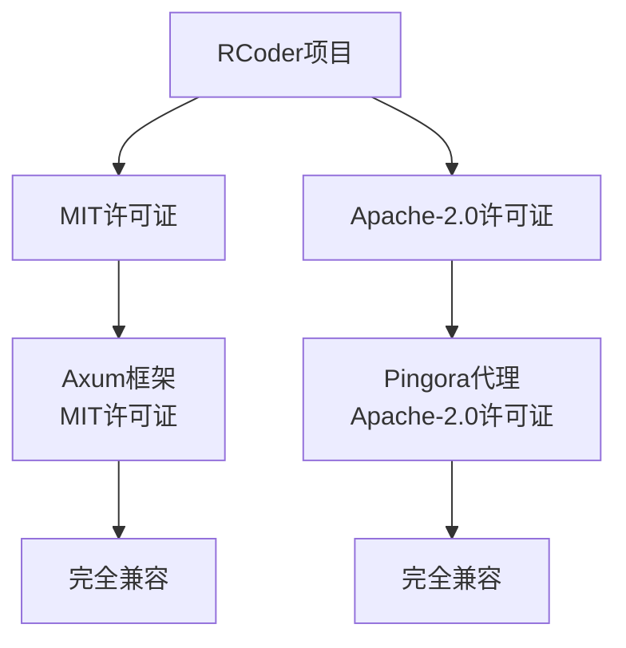

# 许可证

<cite>
**本文档引用的文件**  
- [Cargo.toml](file://Cargo.toml#L31)
- [README.md](file://README.md#L597)
- [crates/pingora-proxy/Cargo.toml](file://crates/pingora-proxy/Cargo.toml)
- [crates/agent_runner/Cargo.toml](file://crates/agent_runner/Cargo.toml)
- [tmp/rust-sdk/LICENSE](file://tmp/rust-sdk/LICENSE)
- [tmp/tonic/LICENSE](file://tmp/tonic/LICENSE)
</cite>

## 目录
1. [项目许可证概述](#项目许可证概述)
2. [许可证类型详解](#许可证类型详解)
3. [用户权利与义务](#用户权利与义务)
4. [贡献者指南](#贡献者指南)
5. [第三方依赖兼容性分析](#第三方依赖兼容性分析)
6. [商业使用与静态链接](#商业使用与静态链接)
7. [衍生作品发布](#衍生作品发布)
8. [常见问题解答](#常见问题解答)

## 项目许可证概述

本项目采用MIT或Apache-2.0双许可证模式，为用户提供灵活的使用选择。项目根目录下的`Cargo.toml`文件明确声明了许可证类型为"MIT OR Apache-2.0"，这一信息也在`README.md`文件中得到确认。这种双许可证策略允许用户根据自身需求选择最适合的许可证条款进行使用、修改和分发。

项目采用Rust语言开发，基于工作区（workspace）结构组织多个功能模块，包括AI代理适配器、Docker管理器、Pingora代理等组件。每个组件的许可证均继承自工作区配置，确保了整个项目许可证的一致性。尽管项目根目录下未找到独立的LICENSE文件，但通过`Cargo.toml`中的声明和`README.md`的说明，许可证信息已得到充分披露。

**Section sources**
- [Cargo.toml](file://Cargo.toml#L31)
- [README.md](file://README.md#L597)

## 许可证类型详解

本项目采用MIT与Apache-2.0双重许可证，用户可选择其中任一许可证的条款来使用本软件。

MIT许可证是一种宽松的开源许可证，主要要求包括：
- 保留原始版权声明和许可声明
- 在软件和文档中包含许可证副本
- 不提供任何担保，作者不对使用本软件造成的损害负责

Apache-2.0许可证也是一种宽松的开源许可证，但相比MIT许可证提供了更全面的保护，其主要特点包括：
- 明确的专利授权：贡献者自动授予用户必要的专利许可
- 详细的归属要求：修改文件必须有显著说明
- 专利报复条款：如果用户对项目发起专利诉讼，则其专利许可自动终止
- 兼容性良好：与GPLv3等主要开源许可证兼容

用户可以根据具体使用场景选择最适合的许可证。对于简单的集成和使用，MIT许可证的简洁性更具吸引力；而对于企业级应用和专利敏感的环境，Apache-2.0许可证提供的专利保护更为有利。

**Section sources**
- [Cargo.toml](file://Cargo.toml#L31)
- [README.md](file://README.md#L597)

## 用户权利与义务

### 再分发权利
用户有权以源代码或编译后的二进制形式再分发本项目，无论是否进行了修改。再分发时必须遵守所选许可证的具体要求：

对于MIT许可证：
- 必须在所有副本或实质性部分中包含原始版权声明和许可声明
- 不需要公开修改后的源代码
- 可以用于商业目的，无需支付许可费用

对于Apache-2.0许可证：
- 必须在所有副本或实质性部分中包含原始版权声明、专利声明、商标声明和归属声明
- 修改的文件必须有显著说明，指出哪些部分被修改
- 必须随分发物提供NOTICE文件的副本（如果存在）

### 修改权利
用户有权修改本项目的源代码以满足特定需求。修改后的作品被视为衍生作品，再分发时需要遵守相应的许可证要求。建议在修改文件的头部添加注释，说明修改内容和日期，这虽然不是强制要求，但有助于代码维护和合规性。

### 专利授权
选择Apache-2.0许可证的用户将获得明确的专利授权。每个贡献者都授予用户一项永久的、全球性的、非独占的、免版税的专利许可，用于实施与项目相关的专利权利要求。这一条款为企业用户提供了重要的法律保护，降低了专利侵权风险。

### 归属要求
无论选择哪种许可证，都必须保留原始的版权声明和许可声明。建议在项目的文档或"关于"页面中提及本项目及其许可证信息，这不仅是法律要求，也是对开源社区的尊重。

**Section sources**
- [Cargo.toml](file://Cargo.toml#L31)
- [README.md](file://README.md#L597)

## 贡献者指南

### 贡献流程
本项目欢迎外部贡献。贡献者应遵循以下流程：
1. Fork项目仓库
2. 创建特性分支
3. 提交更改
4. 推送分支
5. 创建Pull Request

贡献者在提交代码时，默认同意其贡献遵循项目的双许可证模式。这意味着贡献者的代码也将以MIT或Apache-2.0许可证发布，用户可以选择其中任一许可证使用。

### 代码归属
贡献者保留其贡献代码的版权，但通过提交贡献，授予项目维护者和其他用户使用、修改和分发其代码的权利。这种模式是开源社区的常规做法，确保了项目的持续发展和广泛使用。

### 贡献者协议
虽然本项目目前没有要求签署正式的贡献者许可协议（CLA），但建议贡献者在首次贡献时明确声明其同意项目的许可证条款。对于重大贡献，项目维护者可能会要求贡献者确认其贡献的许可条款。

**Section sources**
- [README.md](file://README.md#L603)

## 第三方依赖兼容性分析

### Axum框架兼容性
本项目使用Axum作为HTTP框架，Axum本身采用MIT许可证，与本项目的双许可证完全兼容。MIT许可证的宽松性确保了与本项目的无缝集成，用户在使用本项目时无需担心Axum的许可证限制。

Axum作为Rust生态中流行的Web框架，其MIT许可证允许：
- 无限制的商业使用
- 私有修改和分发
- 与其他许可证的代码静态链接
- 无需公开衍生作品的源代码

### Pingora代理兼容性
本项目集成了Pingora作为反向代理，Pingora采用Apache-2.0许可证。由于本项目也提供Apache-2.0许可证选项，两者完全兼容。用户选择Apache-2.0许可证时，可以合法地使用和分发包含Pingora的完整系统。

Pingora的Apache-2.0许可证提供了：
- 明确的专利授权，保护用户免受专利诉讼
- 详细的归属要求，确保适当的信用归属
- 与本项目相同的许可证选项，简化了合规性管理

**Diagram sources**
- [Cargo.toml](file://Cargo.toml#L60)
- [crates/pingora-proxy/Cargo.toml](file://crates/pingora-proxy/Cargo.toml#L22)

**Section sources**
- [Cargo.toml](file://Cargo.toml#L60)
- [crates/pingora-proxy/Cargo.toml](file://crates/pingora-proxy/Cargo.toml)
- [README.md](file://README.md#L36)

## 商业使用与静态链接

### 商业使用
本项目的双许可证模式完全支持商业使用。无论是MIT还是Apache-2.0许可证，都允许将本项目集成到商业产品和服务中，无需支付许可费用或提供源代码。这对于希望利用AI代理功能的企业用户来说是一个重要优势。

商业用户可以根据自身需求选择合适的许可证：
- 选择MIT许可证：适用于希望最小化法律义务的简单集成
- 选择Apache-2.0许可证：适用于需要专利保护的企业级应用

### 静态链接合规性
本项目采用Rust语言开发，通常会生成静态链接的二进制文件。两种许可证对静态链接都有明确的规定：

MIT许可证：完全允许静态链接，无特殊要求，只需保留版权声明和许可声明。

Apache-2.0许可证：允许静态链接，但要求：
- 在文档或"关于"页面中包含NOTICE文件的内容（如果存在）
- 对修改的文件进行适当标记
- 保留所有原始版权声明

对于本项目，由于采用工作区结构，所有组件都遵循相同的许可证策略，静态链接后的二进制文件被视为一个整体，只需遵守所选许可证的总体要求即可。

**Section sources**
- [Cargo.toml](file://Cargo.toml#L31)
- [README.md](file://README.md#L597)

## 衍生作品发布

当用户基于本项目创建衍生作品时，需要遵守以下准则：

### 源代码分发
如果以源代码形式分发衍生作品，必须：
- 包含原始的LICENSE文件或其内容
- 在修改的文件中添加适当的修改说明
- 保留所有原始版权声明

### 二进制分发
如果以编译后的二进制形式分发衍生作品，必须：
- 在文档或"关于"页面中包含原始版权声明和许可声明
- 如果选择了Apache-2.0许可证，还需包含NOTICE文件的内容
- 提供获取源代码的方式说明（虽然不是强制要求，但推荐）

### 许可证选择
衍生作品的发布者可以选择：
- 继续使用MIT或Apache-2.0双许可证模式
- 仅选择其中一种许可证
- 在Apache-2.0许可证下，还可以选择更宽松的许可证，但不能增加限制

建议在衍生作品中明确说明其与原始项目的关系，这有助于建立透明的开源生态。

**Section sources**
- [Cargo.toml](file://Cargo.toml#L31)
- [README.md](file://README.md#L597)

## 常见问题解答

### 商业使用是否受限？
不受限。本项目的双许可证模式完全允许商业使用，无需支付许可费用或提供源代码。

### 静态链接是否合规？
合规。两种许可证都允许静态链接，只需遵守相应的归属要求。

### 是否需要公开修改后的源代码？
不需要。无论是MIT还是Apache-2.0许可证，都不要求公开修改后的源代码。

### 如何正确归属？
在软件和文档中包含原始的版权声明和许可声明。如果选择了Apache-2.0许可证，还需包含NOTICE文件的内容。

### 可以将许可证更改为其他类型吗？
不可以。衍生作品必须遵守原始项目的许可证条款，但可以选择MIT或Apache-2.0中的一种。

### 专利风险如何？
选择Apache-2.0许可证的用户将获得明确的专利授权，大大降低了专利侵权风险。

**Section sources**
- [Cargo.toml](file://Cargo.toml#L31)
- [README.md](file://README.md#L597)