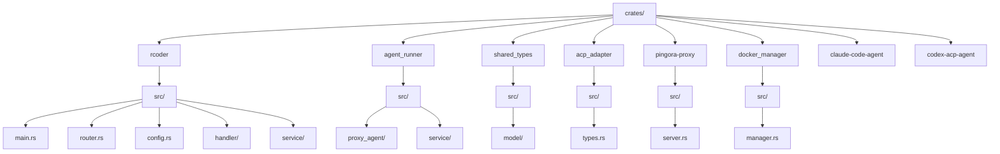
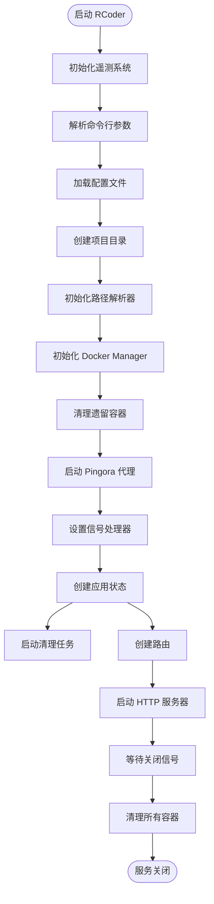
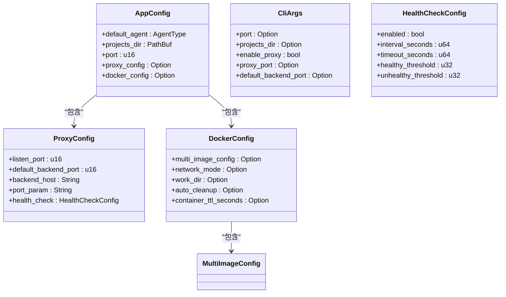
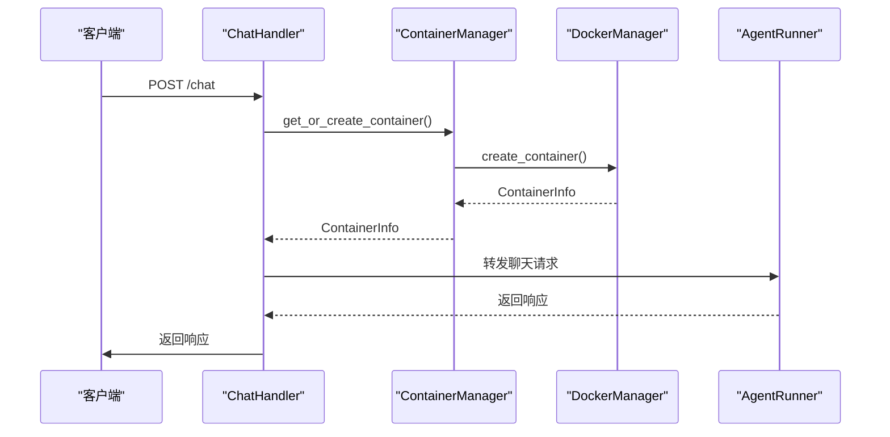
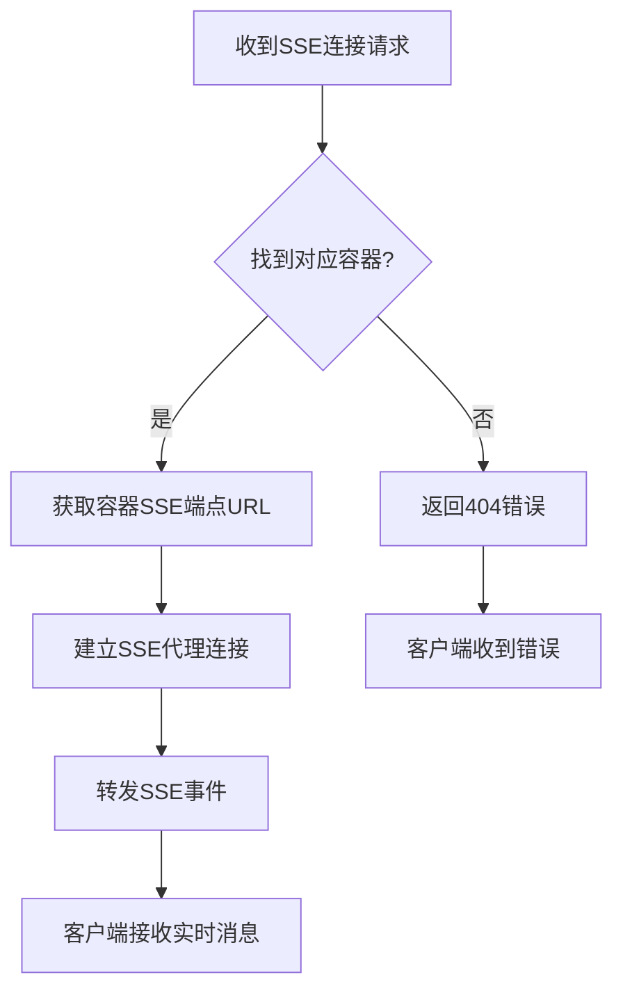
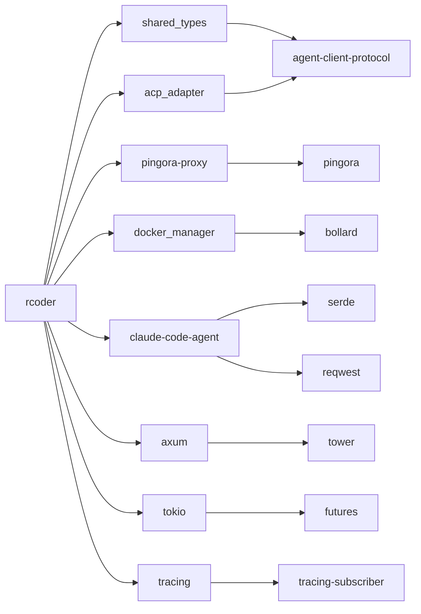
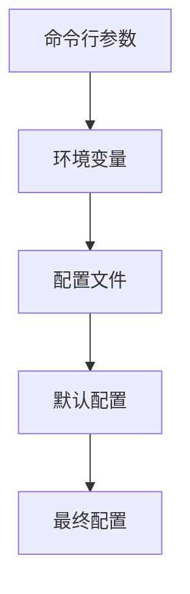

# 项目概述

<cite>
**本文档引用的文件**   
- [README.md](file://README.md)
- [Cargo.toml](file://Cargo.toml)
- [crates/rcoder/Cargo.toml](file://crates/rcoder/Cargo.toml)
- [crates/rcoder/src/main.rs](file://crates/rcoder/src/main.rs)
- [crates/rcoder/src/lib.rs](file://crates/rcoder/src/lib.rs)
- [crates/rcoder/src/router.rs](file://crates/rcoder/src/router.rs)
- [crates/rcoder/src/config.rs](file://crates/rcoder/src/config.rs)
- [crates/pingora-proxy/src/lib.rs](file://crates/pingora-proxy/src/lib.rs)
- [crates/acp_adapter/src/lib.rs](file://crates/acp_adapter/src/lib.rs)
- [crates/rcoder/src/handler/chat_handler.rs](file://crates/rcoder/src/handler/chat_handler.rs)
- [crates/rcoder/src/handler/agent_session_notification.rs](file://crates/rcoder/src/handler/agent_session_notification.rs)
- [crates/shared_types/src/model/agent_model.rs](file://crates/shared_types/src/model/agent_model.rs)
- [crates/shared_types/src/service_config.rs](file://crates/shared_types/src/service_config.rs)
- [crates/docker_manager/src/lib.rs](file://crates/docker_manager/src/lib.rs)
</cite>

## 目录
1. [简介](#简介)
2. [项目结构](#项目结构)
3. [核心组件](#核心组件)
4. [架构概览](#架构概览)
5. [详细组件分析](#详细组件分析)
6. [依赖关系分析](#依赖关系分析)
7. [配置系统](#配置系统)
8. [API接口](#api接口)
9. [使用示例](#使用示例)
10. [故障排除](#故障排除)

## 简介

RCoder 是一个基于 Rust 构建的现代化 AI 驱动开发平台，通过 ACP (Agent Client Protocol) 协议实现与多种 AI 代理的统一交互。平台提供简洁的 HTTP API 接口，让开发者能够轻松集成和管理 AI 辅助开发功能。

RCoder 采用模块化设计，通过 Rust 的 Workspace 特性组织多个功能组件，包括主应用、代理运行器、Docker 管理器、Pingora 反向代理等。平台支持多种 AI 代理，如 Codex 和 Claude Code，并通过反向代理机制实现高性能的端口路由。

**本文档引用的文件**
- [README.md](file://README.md#L1-L652)
- [Cargo.toml](file://Cargo.toml#L1-L205)

## 项目结构

RCoder 项目采用 Rust Workspace 结构，将不同功能模块分离到独立的 crate 中，实现高内聚低耦合的设计。



**图表来源**
- [README.md](file://README.md#L269-L377)

**本文档引用的文件**
- [README.md](file://README.md#L269-L377)
- [Cargo.toml](file://Cargo.toml#L1-L205)

## 核心组件

RCoder 的核心组件包括主应用、代理适配器、反向代理和 Docker 管理器。这些组件协同工作，提供完整的 AI 代理管理功能。

主应用（rcoder）负责处理 HTTP 请求、管理会话状态和协调各个组件。代理适配器（acp_adapter）提供与 ACP 协议兼容的通信功能。反向代理（pingora-proxy）基于 Cloudflare Pingora 实现高性能的端口路由。Docker 管理器（docker_manager）负责容器的生命周期管理。

**本文档引用的文件**
- [crates/rcoder/src/main.rs](file://crates/rcoder/src/main.rs#L1-L451)
- [crates/acp_adapter/src/lib.rs](file://crates/acp_adapter/src/lib.rs#L1-L13)
- [crates/pingora-proxy/src/lib.rs](file://crates/pingora-proxy/src/lib.rs#L1-L250)
- [crates/docker_manager/src/lib.rs](file://crates/docker_manager/src/lib.rs#L1-L211)

## 架构概览

RCoder 采用分层架构设计，各组件职责明确，通过清晰的接口进行通信。

```mermaid
graph TB
A[Client] --> B[Axum HTTP Server]
A --> C[Pingora Proxy]
B --> D[API Routes]
B --> E[Agent Worker (LocalSet)]
C --> F[Backends: 127.0.0.1:{port}]
D --> G[Handler Modules]
G --> H[Container Manager]
H --> I[Docker Manager]
I --> J[Docker Engine]
G --> K[Session Cache]
G --> L[Config Manager]
```

**图表来源**
- [README.md](file://README.md#L18-L25)

**本文档引用的文件**
- [README.md](file://README.md#L16-L25)
- [crates/rcoder/src/main.rs](file://crates/rcoder/src/main.rs#L31-L451)

## 详细组件分析

### 主应用分析

主应用是 RCoder 的核心，负责启动服务、处理请求和协调各个组件。

#### 主函数分析


**图表来源**
- [crates/rcoder/src/main.rs](file://crates/rcoder/src/main.rs#L31-L451)

**本文档引用的文件**
- [crates/rcoder/src/main.rs](file://crates/rcoder/src/main.rs#L31-L451)
- [crates/rcoder/src/config.rs](file://crates/rcoder/src/config.rs#L1-L403)

#### 配置系统分析


**图表来源**
- [crates/rcoder/src/config.rs](file://crates/rcoder/src/config.rs#L38-L109)

**本文档引用的文件**
- [crates/rcoder/src/config.rs](file://crates/rcoder/src/config.rs#L1-L403)
- [crates/shared_types/src/service_config.rs](file://crates/shared_types/src/service_config.rs#L1-L513)

### 聊天处理器分析

聊天处理器负责处理用户发送的聊天消息，并将其转发到相应的 AI 代理。



**图表来源**
- [crates/rcoder/src/handler/chat_handler.rs](file://crates/rcoder/src/handler/chat_handler.rs#L1-L431)

**本文档引用的文件**
- [crates/rcoder/src/handler/chat_handler.rs](file://crates/rcoder/src/handler/chat_handler.rs#L1-L431)
- [crates/rcoder/src/service/container_manager.rs](file://crates/rcoder/src/service/container_manager.rs)

### SSE 通知处理器分析

SSE 通知处理器负责处理 Server-Sent Events (SSE) 连接，实现实时进度流。



**图表来源**
- [crates/rcoder/src/handler/agent_session_notification.rs](file://crates/rcoder/src/handler/agent_session_notification.rs#L1-L378)

**本文档引用的文件**
- [crates/rcoder/src/handler/agent_session_notification.rs](file://crates/rcoder/src/handler/agent_session_notification.rs#L1-L378)
- [crates/rcoder/src/proxy_agent/docker_container_agent.rs](file://crates/rcoder/src/proxy_agent/docker_container_agent.rs)

## 依赖关系分析

RCoder 项目采用依赖注入和模块化设计，各组件之间的依赖关系清晰。



**图表来源**
- [Cargo.toml](file://Cargo.toml#L1-L205)
- [crates/rcoder/Cargo.toml](file://crates/rcoder/Cargo.toml#L1-L91)

**本文档引用的文件**
- [Cargo.toml](file://Cargo.toml#L1-L205)
- [crates/rcoder/Cargo.toml](file://crates/rcoder/Cargo.toml#L1-L91)
- [crates/agent_runner/Cargo.toml](file://crates/agent_runner/Cargo.toml#L1-L79)

## 配置系统

RCoder 提供灵活的配置系统，支持多种配置方式，优先级从高到低为：命令行参数 > 环境变量 > 配置文件 > 默认配置。

### 配置优先级


### 配置文件结构
```yaml
# rcoder 配置文件

# 默认使用的 AI 代理类型
# 可选值: "Codex", "Claude" 
default_agent: Codex

# 项目工作的根目录
projects_dir: "./project_workspace"

# 服务端口
port: 3000

# 反向代理配置
proxy_config:
  listen_port: 8088
  default_backend_port: 8086
  backend_host: "127.0.0.1"
  port_param: "port"
  health_check:
    enabled: true
    interval_seconds: 5
    timeout_seconds: 1
    healthy_threshold: 2
    unhealthy_threshold: 3

# Docker 配置
docker_config:
  multi_image_config:
    services:
      rcoder:
        image: null
        arm64_image: "registry.yichamao.com/rcoder:latest-arm64"
        amd64_image: "registry.yichamao.com/rcoder:latest-amd64"
        default_image: "registry.yichamao.com/rcoder:latest"
        image_tag_prefix: "rcoder"
        enabled: true
        environment:
          RUST_LOG: "info"
          SERVICE_MODE: "full"
          API_PORT: "8086"
        mounts: []
        command:
          - "/app/bin/agent_runner"
          - "--port"
          - "8086"
        entrypoint: null
        resource_limits:
          memory_limit: 2147483648
          cpu_limit: 2
          swap_limit: 4294967296
          disk_limit: null
          process_limit: null
        work_dir: "/app"
        network_mode: "bridge"
        container_path_template: "/app/project_workspace/{project_id}"
      agent-runner:
        image: null
        arm64_image: "registry.yichamao.com/rcoder-agent-runner:latest-arm64"
        amd64_image: "registry.yichamao.com/rcoder-agent-runner:latest-amd64"
        default_image: "registry.yichamao.com/rcoder-agent-runner:latest"
        image_tag_prefix: "rcoder-agent-runner"
        enabled: false
        environment:
          RUST_LOG: "debug"
          SERVICE_MODE: "agent-only"
          AGENT_PORT: "8086"
        mounts: []
        command:
          - "/app/bin/agent_runner"
          - "--port"
          - "8086"
        entrypoint: null
        resource_limits:
          memory_limit: 4294967296
          cpu_limit: 3
          swap_limit: 8589934592
          disk_limit: null
          process_limit: null
        work_dir: "/app"
        network_mode: "bridge"
        container_path_template: "/app/project_workspace/{project_id}"
    global_defaults:
      image: null
      arm64_image: null
      amd64_image: null
      default_image: null
      registry_prefix: null
    selection_strategy: ServiceOnly
    cache_config:
      enabled: true
      ttl_seconds: 3600
      max_entries: 100
  network_mode: "bridge"
  work_dir: "/app"
  auto_cleanup: true
  container_ttl_seconds: 3600
```

**本文档引用的文件**
- [crates/rcoder/src/config.rs](file://crates/rcoder/src/config.rs#L1-L403)
- [crates/rcoder/src/rcoder_default.yml](file://crates/rcoder/src/rcoder_default.yml)

## API接口

RCoder 提供 RESTful API 接口，支持健康检查、聊天交互、进度流等功能。

### 核心端点
| 端点 | 方法 | 说明 |
|------|------|------|
| `/health` | GET | 健康检查 |
| `/chat` | POST | 发送聊天消息给 AI 代理 |
| `/agent/progress/{session_id}` | GET (SSE) | 获取统一实时进度流 |
| `/agent/session/cancel` | POST | 取消正在执行的任务 |
| `/agent/stop` | POST | 停止当前 Agent |
| `/agent/status/{project_id}` | GET | 查询 Agent 状态 |
| `/api/docs` | GET | Swagger UI API 文档 |

### Pingora 代理相关端点
| 端点 | 方法 | 说明 |
|------|------|------|
| `/proxy/status` | GET | 查看代理服务状态 |
| `/proxy/config` | GET | 查看代理配置 |
| `/proxy/stats` | GET | 查看代理统计信息 |
| `/proxy/{port}/{path}` | GET | 代理到指定端口的服务 |

**本文档引用的文件**
- [README.md](file://README.md#L209-L227)
- [crates/rcoder/src/router.rs](file://crates/rcoder/src/router.rs#L52-L84)

## 使用示例

### 启动服务
```bash
# 使用默认端口 3000
cargo run --bin rcoder

# 指定端口和项目目录
cargo run --bin rcoder -- --port 8087 --projects-dir ./my-projects

# 启用并运行 Pingora 反向代理
cargo run --bin rcoder -- --enable-proxy --proxy-port 8080

# 指定默认后端端口
cargo run --bin rcoder -- --enable-proxy --proxy-port 8080 --default-backend-port 3000
```

### API 调用示例
```bash
# 健康检查
curl -X GET http://localhost:3000/health

# 发送聊天消息
curl -X POST http://localhost:3000/chat \
  -H "Content-Type: application/json" \
  -d '{
    "prompt": "你好，请帮我创建一个 Rust Web API 项目",
    "project_id": "my-rust-project"
  }'

# 获取实时进度流
curl -X GET http://localhost:3000/agent/progress/your-session-id \
  -H "Accept: text/event-stream"

# 代理请求示例
curl "http://127.0.0.1:8080/proxy/5173/page/1977625137029189632/prod/"
```

**本文档引用的文件**
- [README.md](file://README.md#L61-L198)
- [http_test.rest](file://http_test.rest)

## 故障排除

### 常见问题
- **端口被占用**: 使用 `--port` 参数指定其他端口
- **AI 代理连接失败**: 检查 API 密钥和网络连接
- **配置文件错误**: 检查 YAML 格式和字段名称
- **容器自检测失败**: 检查 Docker socket 路径和权限

### Docker 配置帮助
```bash
# 确保 docker-compose.yml 包含以下配置
services:
  rcoder:
    environment:
      - DOCKER_SOCKET_PATH=/var/run/docker.sock
    volumes:
      - /var/run/docker.sock:/var/run/docker.sock:ro
      - ./data/rcoder/project_workspace:/app/project_workspace
```

**本文档引用的文件**
- [README.md](file://README.md#L611-L626)
- [crates/rcoder/src/main.rs](file://crates/rcoder/src/main.rs#L322-L350)