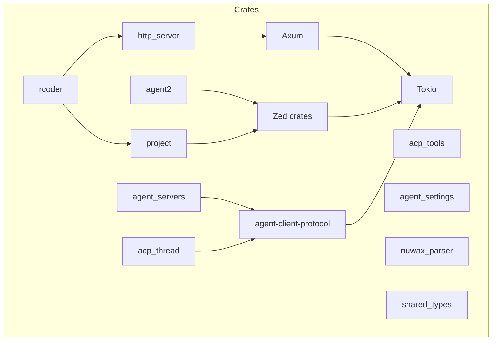
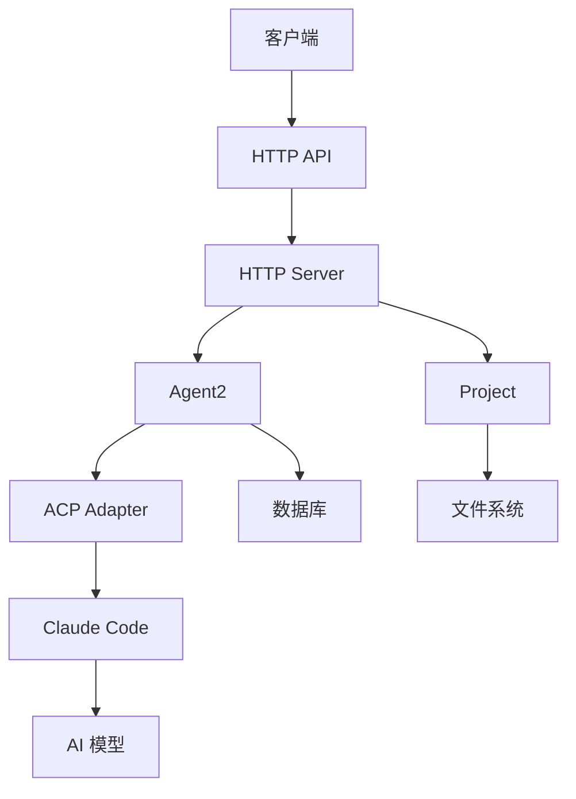
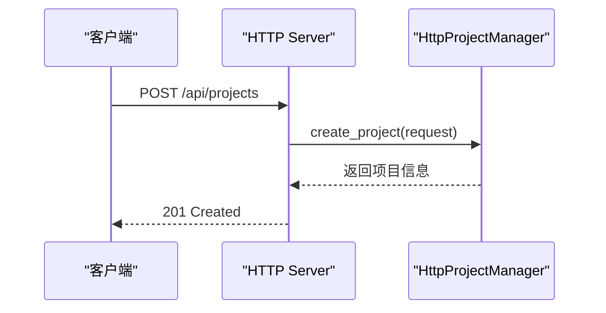
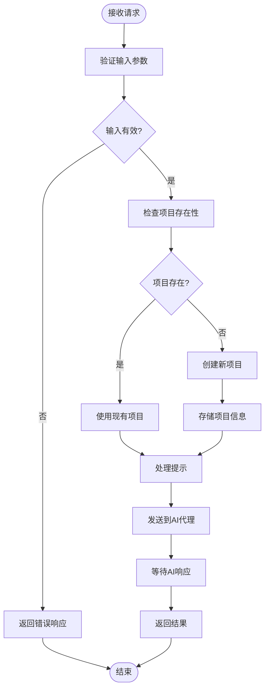
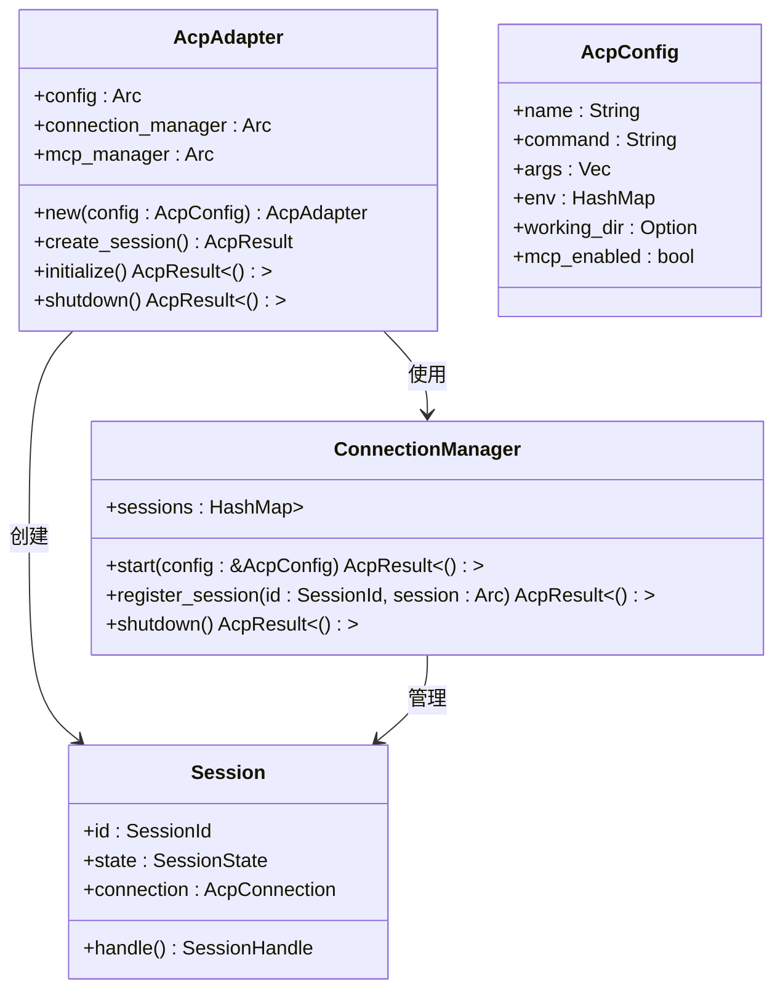
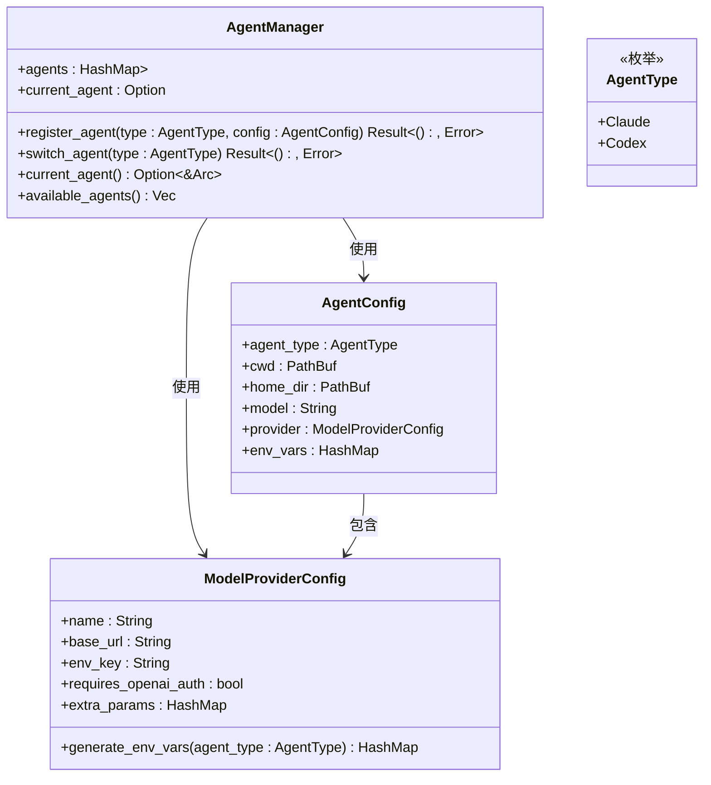
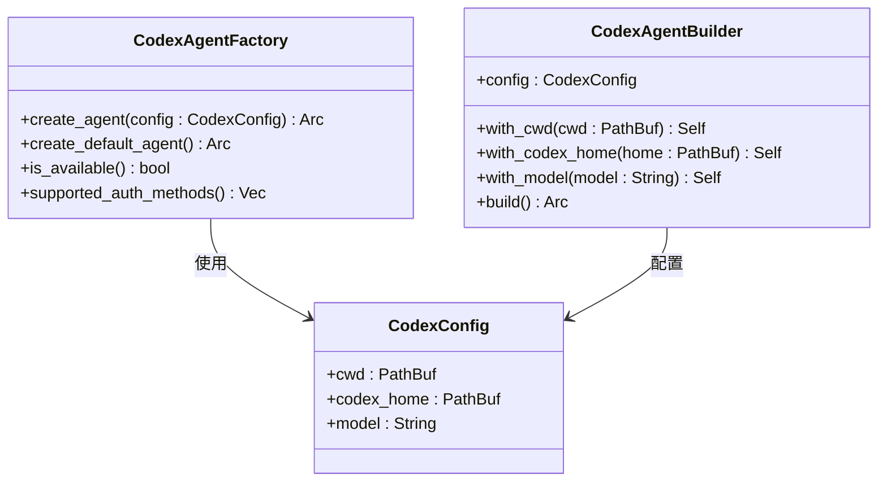
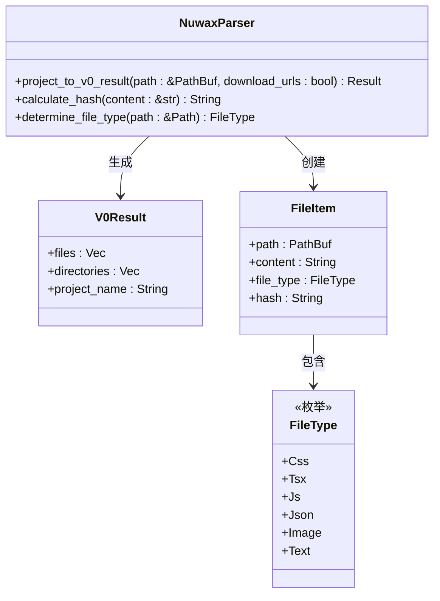
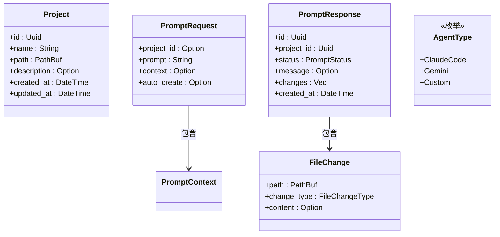
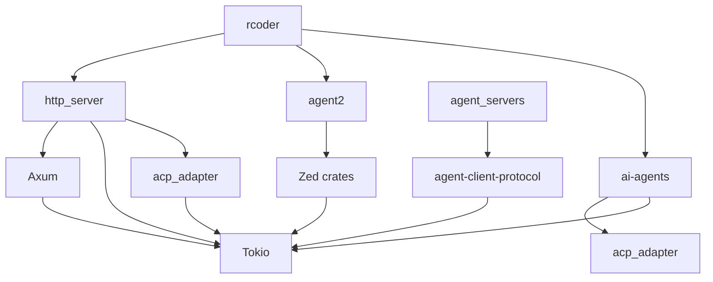

# 项目概述

<cite>
**本文档中引用的文件**
- [main.rs](file://crates/rcoder/src/main.rs)
- [Cargo.toml](file://Cargo.toml)
- [lib.rs](file://crates/http_server/src/lib.rs)
- [handlers.rs](file://crates/http_server/src/handlers.rs)
- [http_interface.rs](file://crates/http_server/src/http_interface.rs)
- [README.md](file://README.md)
- [acp_adapter/src/lib.rs](file://crates/acp_adapter/src/lib.rs)
- [ai-agents/src/lib.rs](file://crates/ai-agents/src/lib.rs)
- [claude/src/lib.rs](file://crates/claude/src/lib.rs)
- [codex/src/lib.rs](file://crates/codex/src/lib.rs)
- [nuwax_parser/src/lib.rs](file://crates/nuwax_parser/src/lib.rs)
- [shared_types/src/lib.rs](file://crates/shared_types/src/lib.rs)
</cite>

## 更新摘要
**已更新内容**
- 根据代码库最新结构更新了项目结构和核心组件描述
- 新增了 `acp_adapter`、`ai-agents`、`nuwax_parser` 等核心模块的详细分析
- 更新了架构概述图以反映最新的组件依赖关系
- 修正了HTTP服务器和主应用程序的分析内容
- 添加了对 `shared_types` 模块的描述
- 移除了已删除的 MIGRATION_SUMMARY.md 文件引用

## 目录
1. [简介](#简介)
2. [项目结构](#项目结构)
3. [核心组件](#核心组件)
4. [架构概述](#架构概述)
5. [详细组件分析](#详细组件分析)
6. [依赖分析](#依赖分析)
7. [性能考虑](#性能考虑)
8. [故障排除指南](#故障排除指南)
9. [结论](#结论)

## 简介
RCoder 是一个基于 ACP (Agent Client Protocol) 的 AI 驱动开发平台，旨在通过简单的 HTTP 请求实现软件项目的创建、管理和开发。该项目利用 Rust 语言的高性能特性、Tokio 异步运行时和 Axum Web 框架，构建了一个高效且可扩展的服务端架构。RCoder 的核心目标是将 AI 代理（如 Claude Code）深度集成到开发流程中，支持智能代码生成、文件操作和项目管理等关键功能。平台采用模块化设计，通过多个独立的 crates 实现职责分离，确保系统的可维护性和扩展性。

**章节来源**
- [README.md](file://README.md#L1-L287)

## 项目结构
RCoder 项目采用 Cargo 工作区模式组织代码，包含多个独立的 crates，每个 crate 负责特定的功能模块。这种模块化设计使得各个组件可以独立开发、测试和维护，同时通过工作区共享依赖和配置。项目根目录下的 `Cargo.toml` 文件定义了工作区的成员 crates 和全局依赖，确保所有子模块使用一致的版本和配置。

**图示来源**
- [Cargo.toml](file://Cargo.toml#L1-L185)
- [README.md](file://README.md#L1-L287)

**章节来源**
- [Cargo.toml](file://Cargo.toml#L1-L185)
- [README.md](file://README.md#L1-L287)

## 核心组件
RCoder 的核心组件包括 `http_server`、`agent2`、`project`、`acp_adapter`、`ai-agents` 和 `nuwax_parser` 等 crates，它们共同构成了平台的基础架构。`http_server` 负责提供 RESTful API 接口，处理客户端请求；`ai-agents` 实现了与多种 AI 代理的统一管理；`acp_adapter` 提供了通用的 ACP 协议适配器；`nuwax_parser` 负责文件解析和同步。这些组件通过清晰的接口定义和依赖关系协同工作，实现了从用户请求到 AI 响应的完整流程。

**章节来源**
- [README.md](file://README.md#L1-L287)
- [Cargo.toml](file://Cargo.toml#L1-L185)

## 架构概述
RCoder 的架构设计遵循分层原则，从底层的异步运行时到上层的 HTTP 服务，再到与 AI 代理的集成，形成了一个清晰的技术栈。系统以 Tokio 作为异步运行时，Axum 作为 Web 框架，构建了高性能的 HTTP 服务。通过 ACP 协议与 Claude Code 等 AI 代理进行通信，实现了智能代码生成和项目管理功能。整个架构强调模块化和可扩展性，允许开发者轻松添加新的 AI 代理或功能模块。

**图示来源**
- [README.md](file://README.md#L1-L287)
- [lib.rs](file://crates/http_server/src/lib.rs#L1-L64)

## 详细组件分析

### HTTP 服务器分析
`http_server` crate 是 RCoder 的入口点，负责处理所有 HTTP 请求。它使用 Axum 框架定义路由和处理器，通过 Tower 中间件提供 CORS 和日志记录等功能。服务器启动时初始化 `HttpClaudeManager` 和 `HttpProjectManager`，并将它们作为共享状态注入到路由处理器中。这种设计确保了跨请求的状态一致性，同时利用 Arc 和 RwLock 实现了线程安全的共享数据访问。

#### 对于 API/服务组件：

**图示来源**
- [lib.rs](file://crates/http_server/src/lib.rs#L1-L64)
- [handlers.rs](file://crates/http_server/src/handlers.rs#L1-L259)

#### 对于复杂逻辑组件：

**图示来源**
- [handlers.rs](file://crates/http_server/src/handlers.rs#L1-L259)
- [http_interface.rs](file://crates/http_server/src/http_interface.rs#L1-L179)

**章节来源**
- [lib.rs](file://crates/http_server/src/lib.rs#L1-L64)
- [handlers.rs](file://crates/http_server/src/handlers.rs#L1-L259)
- [http_interface.rs](file://crates/http_server/src/http_interface.rs#L1-L179)

### 主应用程序分析
`rcoder` crate 是整个系统的启动入口，负责初始化所有核心组件并启动 HTTP 服务器。`main.rs` 文件中的 `main` 函数首先配置日志系统，然后创建 `HttpProjectManager` 和 `HttpClaudeManager` 实例，最后调用 `run_server` 启动服务。这种集中式的初始化流程确保了系统各组件的正确配置和依赖注入。

**章节来源**
- [main.rs](file://crates/rcoder/src/main.rs#L1-L47)

### ACP 适配器分析
`acp_adapter` crate 提供了通用的 ACP (Agent Client Protocol) 适配器实现，是系统与 AI 代理通信的核心组件。该模块实现了连接管理、会话生命周期、消息处理和 MCP 集成等关键功能。`AcpAdapter` 结构体作为主入口，负责管理连接和会话，通过 `create_session` 方法创建新会话，并通过 `initialize` 方法启动进程和建立连接。

**图示来源**
- [acp_adapter/src/lib.rs](file://crates/acp_adapter/src/lib.rs#L1-L174)

**章节来源**
- [acp_adapter/src/lib.rs](file://crates/acp_adapter/src/lib.rs#L1-L174)

### AI 代理管理分析
`ai-agents` crate 提供了统一的接口来管理不同的 AI 代理（Claude、Codex 等），通过 Agent Client Protocol (ACP) 提供透明的访问。`AgentManager` 结构体作为统一的代理管理器，支持注册、切换和管理不同类型的 AI 代理。`AgentConfig` 结构体定义了代理配置，包括代理类型、工作目录、模型提供商等。

**图示来源**
- [ai-agents/src/lib.rs](file://crates/ai-agents/src/lib.rs#L1-L597)

**章节来源**
- [ai-agents/src/lib.rs](file://crates/ai-agents/src/lib.rs#L1-L597)

### Claude 代理分析
`claude` crate 提供了基于 Claude Code 的 AI 代理服务，通过 ACP 协议实现与 Claude Code CLI 工具的集成。`ClaudeAgentFactory` 作为代理工厂，提供了创建和管理 Claude 代理实例的方法。`ClaudeAgentBuilder` 提供了构建器模式来配置代理参数。

**图示来源**
- [claude/src/lib.rs](file://crates/claude/src/lib.rs#L1-L137)

**章节来源**
- [claude/src/lib.rs](file://crates/claude/src/lib.rs#L1-L137)

### Codex 代理分析
`codex` crate 提供了基于 OpenAI Codex 的 AI 代理服务，通过 ACP 协议实现与 OpenAI API 的集成。`CodexAgentFactory` 作为代理工厂，提供了创建和管理 Codex 代理实例的方法。`CodexAgentBuilder` 提供了构建器模式来配置代理参数。

**图示来源**
- [codex/src/lib.rs](file://crates/codex/src/lib.rs#L1-L155)

**章节来源**
- [codex/src/lib.rs](file://crates/codex/src/lib.rs#L1-L155)

### Nuwax 解析器分析
`nuwax_parser` crate 是一个高性能的 Rust 文件解析和同步工具包，专为 Nuwax 平台设计，支持前端和后端系统之间的无缝文件同步。该模块内置支持哈希验证、URL文件下载和隐藏目录过滤功能。

**图示来源**
- [nuwax_parser/src/lib.rs](file://crates/nuwax_parser/src/lib.rs#L1-L56)

**章节来源**
- [nuwax_parser/src/lib.rs](file://crates/nuwax_parser/src/lib.rs#L1-L56)

### 共享类型分析
`shared_types` crate 定义了系统中各组件之间共享的数据类型，包括项目、提示请求、文件变更等。这些类型通过 Serde 实现序列化，便于在不同组件之间传递数据。

**图示来源**
- [shared_types/src/lib.rs](file://crates/shared_types/src/lib.rs#L1-L84)

**章节来源**
- [shared_types/src/lib.rs](file://crates/shared_types/src/lib.rs#L1-L84)

## 依赖分析
RCoder 的依赖关系清晰地反映了其架构设计理念。工作区级别的依赖定义确保了所有 crates 使用一致的版本，避免了版本冲突。核心依赖包括 Tokio（异步运行时）、Axum（Web 框架）、SQLx（数据库访问）和 Serde（序列化）。此外，项目大量使用了来自 Zed 编辑器的 crates，如 `project`、`language` 和 `lsp`，这些依赖提供了强大的项目管理和语言服务功能。

**图示来源**
- [Cargo.toml](file://Cargo.toml#L1-L185)
- [crates/rcoder/Cargo.toml](file://crates/rcoder/Cargo.toml#L1-L23)

**章节来源**
- [Cargo.toml](file://Cargo.toml#L1-L185)
- [crates/http_server/Cargo.toml](file://crates/http_server/Cargo.toml#L1-L23)
- [crates/agent2/Cargo.toml](file://crates/agent2/Cargo.toml#L1-L102)
- [crates/project/Cargo.toml](file://crates/project/Cargo.toml#L1-L114)

## 性能考虑
RCoder 在性能方面进行了多项优化。首先，使用 Tokio 异步运行时确保了高并发下的性能表现，能够有效处理大量并发请求。其次，通过 Arc 和 RwLock 实现了共享状态的高效访问，减少了锁竞争。此外，项目利用 SQLx 进行异步数据库操作，避免了阻塞 I/O 对性能的影响。日志系统采用 tracing 和 tracing-subscriber，提供了灵活的日志级别控制和高性能的日志记录。

**章节来源**
- [Cargo.toml](file://Cargo.toml#L1-L185)
- [main.rs](file://crates/rcoder/src/main.rs#L1-L47)

## 故障排除指南
当遇到问题时，建议按照以下步骤进行排查：首先检查日志输出，特别是 `RUST_LOG=debug` 级别的详细日志；其次验证环境变量配置是否正确，如 `PORT`、`DATABASE_URL` 等；然后确认 Claude Code CLI 是否正确安装并可执行；最后检查项目目录权限和数据库文件是否存在。对于常见的 HTTP 错误，可以根据状态码进行针对性排查，如 404 错误通常表示资源不存在，500 错误则需要查看服务器日志获取详细信息。

**章节来源**
- [README.md](file://README.md#L1-L287)
- [main.rs](file://crates/rcoder/src/main.rs#L1-L47)

## 结论
RCoder 作为一个 AI 驱动的开发平台，通过精心设计的架构和模块化实现，成功地将 AI 代理集成到软件开发流程中。项目利用 Rust 语言的优势，结合 Tokio 和 Axum 构建了高性能的 HTTP 服务，同时通过 ACP 协议实现了与 AI 代理的深度交互。这种设计不仅提高了开发效率，还为未来的扩展和定制提供了坚实的基础。对于初学者，RCoder 提供了清晰的学习路径和文档支持；对于高级开发者，则展示了丰富的系统扩展点和定制化能力。