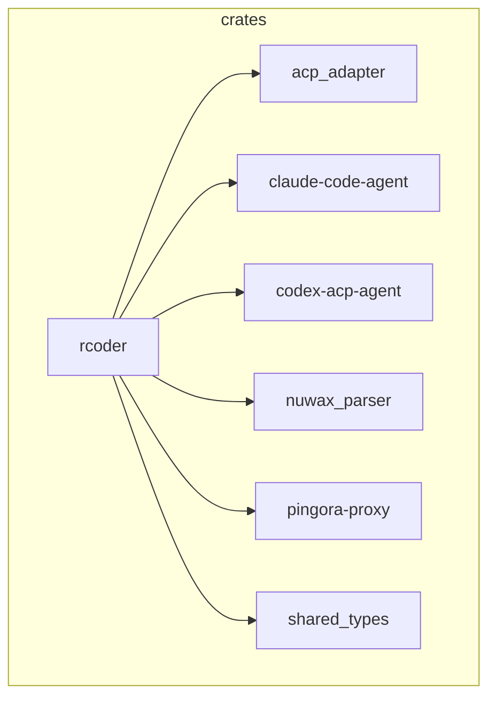
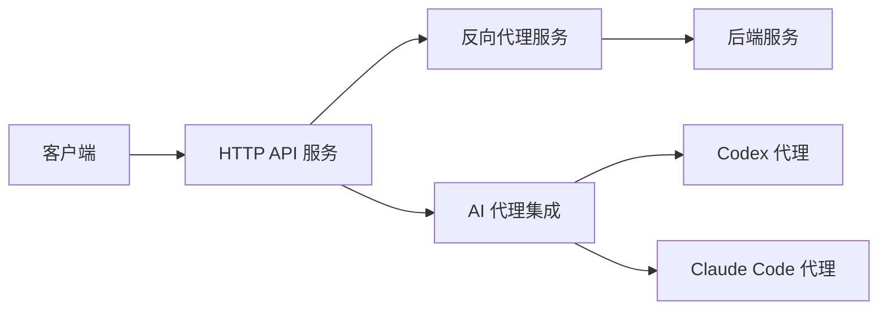
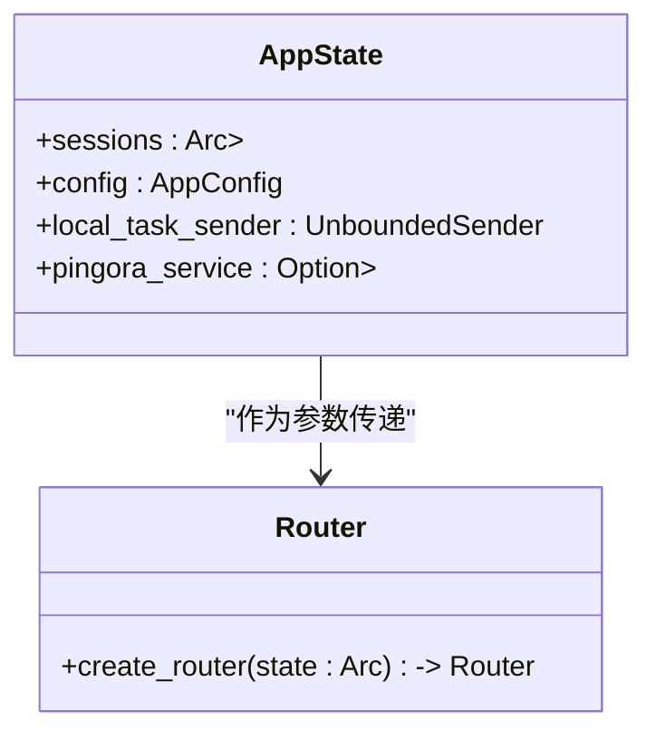
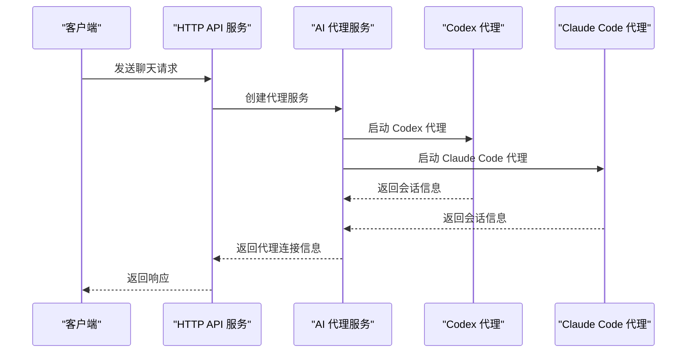
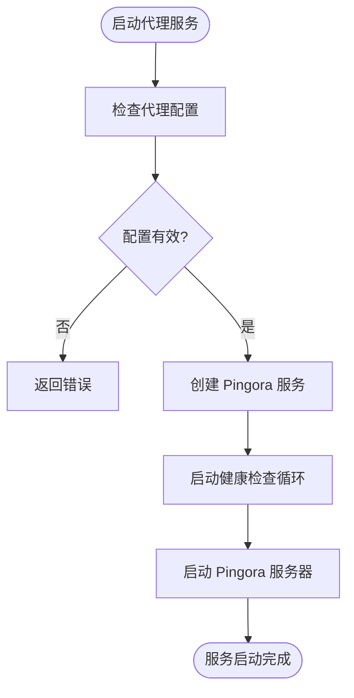
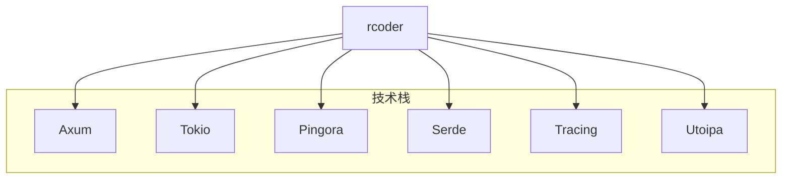

# 项目概述

<cite>
**本文档引用的文件**  
- [main.rs](file://crates/rcoder/src/main.rs)
- [router.rs](file://crates/rcoder/src/router.rs)
- [chat_handler.rs](file://crates/rcoder/src/handler/chat_handler.rs)
- [agent_session_notification.rs](file://crates/rcoder/src/handler/agent_session_notification.rs)
- [agent_model.rs](file://crates/rcoder/src/model/agent_model.rs)
- [agent_service.rs](file://crates/rcoder/src/proxy_agent/agent_service.rs)
- [codex_agent.rs](file://crates/rcoder/src/proxy_agent/codex_agent.rs)
- [claude_code_agent.rs](file://crates/rcoder/src/proxy_agent/claude_code_agent.rs)
- [channel_utils.rs](file://crates/rcoder/src/proxy_agent/channel_utils.rs)
- [agent_stop_handle.rs](file://crates/rcoder/src/proxy_agent/agent_stop_handle.rs)
</cite>

## 目录
1. [简介](#简介)
2. [项目结构](#项目结构)
3. [核心组件](#核心组件)
4. [架构概览](#架构概览)
5. [详细组件分析](#详细组件分析)
6. [依赖分析](#依赖分析)
7. [性能考量](#性能考量)
8. [故障排除指南](#故障排除指南)
9. [结论](#结论)

## 简介
rcoder 是一个基于 Rust 的 AI 驱动开发平台，旨在为开发者提供统一的 AI 代理管理框架。该项目通过 ACP（Agent Client Protocol）协议与多种 AI 代理（如 Codex、Claude Code）进行交互，支持实时通信、异步处理和高性能反向代理服务。系统采用模块化设计，利用 Rust 的异步编程模型和内存安全特性，确保高并发场景下的稳定性和性能。

## 项目结构
rcoder 项目采用 Rust Workspace 架构，包含多个独立的 crates，每个 crate 负责特定的功能模块。这种模块化设计提高了代码的可维护性和复用性。

**图示来源**  
- [Cargo.toml](file://Cargo.toml)

**本节来源**  
- [Cargo.toml](file://Cargo.toml)

## 核心组件
rcoder 的核心组件包括 HTTP API 服务、反向代理服务、AI 代理集成和配置管理。这些组件协同工作，提供完整的 AI 开发体验。

**本节来源**  
- [main.rs](file://crates/rcoder/src/main.rs)
- [router.rs](file://crates/rcoder/src/router.rs)

## 架构概览
rcoder 的架构设计围绕着异步 I/O 和事件驱动模型展开，使用 Axum 作为 Web 框架，Tokio 作为异步运行时，Pingora 作为高性能反向代理服务器。系统通过 ACP 协议与 AI 代理通信，支持实时消息推送和任务取消。

**图示来源**  
- [main.rs](file://crates/rcoder/src/main.rs)
- [router.rs](file://crates/rcoder/src/router.rs)

## 详细组件分析
### HTTP API 服务
HTTP API 服务是 rcoder 的入口点，负责处理客户端请求并返回响应。它使用 Axum 框架构建，支持 RESTful API 和 SSE（Server-Sent Events）实时通信。

#### 路由配置

**图示来源**  
- [router.rs](file://crates/rcoder/src/router.rs)

**本节来源**  
- [router.rs](file://crates/rcoder/src/router.rs)

### AI 代理集成
AI 代理集成模块负责与外部 AI 代理（如 Codex、Claude Code）进行通信。它通过 ACP 协议封装了与代理的交互逻辑，支持异步消息传递和状态管理。

#### 代理服务启动流程

**图示来源**  
- [main.rs](file://crates/rcoder/src/main.rs)
- [codex_agent.rs](file://crates/rcoder/src/proxy_agent/codex_agent.rs)
- [claude_code_agent.rs](file://crates/rcoder/src/proxy_agent/claude_code_agent.rs)

**本节来源**  
- [main.rs](file://crates/rcoder/src/main.rs)
- [codex_agent.rs](file://crates/rcoder/src/proxy_agent/codex_agent.rs)
- [claude_code_agent.rs](file://crates/rcoder/src/proxy_agent/claude_code_agent.rs)

### 反向代理服务
反向代理服务基于 Cloudflare Pingora 构建，提供高性能的流量转发和负载均衡功能。它支持动态端口路由和健康检查，能够自动发现和代理后端服务。

#### 代理配置

**图示来源**  
- [main.rs](file://crates/rcoder/src/main.rs)
- [pingora_proxy/src/lib.rs](file://crates/pingora-proxy/src/lib.rs)

**本节来源**  
- [main.rs](file://crates/rcoder/src/main.rs)
- [pingora_proxy/src/lib.rs](file://crates/pingora-proxy/src/lib.rs)

## 依赖分析
rcoder 项目依赖于多个关键的 Rust 库和技术组件，这些依赖共同构成了系统的基石。

**图示来源**  
- [Cargo.toml](file://Cargo.toml)

**本节来源**  
- [Cargo.toml](file://Cargo.toml)

## 性能考量
rcoder 在设计时充分考虑了性能优化，采用了多种技术手段来提升系统的响应速度和吞吐量。

- **异步 I/O**：使用 Tokio 异步运行时，确保高并发场景下的高效处理。
- **无锁数据结构**：利用 `DashMap` 等无锁数据结构，减少线程竞争。
- **日志滚动**：通过 `tracing-appender` 实现按天滚动的日志文件，避免单个日志文件过大。
- **资源管理**：通过 `AgentLifecycleGuard` 实现 RAII 原则的资源管理，确保资源的及时释放。

**本节来源**  
- [main.rs](file://crates/rcoder/src/main.rs)
- [agent_stop_handle.rs](file://crates/rcoder/src/proxy_agent/agent_stop_handle.rs)

## 故障排除指南
### 常见问题
1. **代理服务启动失败**：检查 `proxy_config` 是否正确配置，确保监听端口未被占用。
2. **AI 代理连接超时**：确认网络连接正常，检查 AI 代理服务是否运行。
3. **SSE 连接中断**：检查客户端是否正确处理心跳消息，确保连接保持活跃。

### 日志分析
- **日志位置**：日志文件保存在 `logs/` 目录下，按天滚动。
- **关键日志**：
  - `Tracing 初始化成功`：表示遥测系统正常启动。
  - `Agent worker stopped`：表示代理工作线程已停止，可能需要重启服务。

**本节来源**  
- [main.rs](file://crates/rcoder/src/main.rs)
- [agent_session_notification.rs](file://crates/rcoder/src/handler/agent_session_notification.rs)

## 结论
rcoder 作为一个基于 Rust 的 AI 驱动开发平台，通过模块化设计和先进的异步编程模型，提供了高效、稳定的 AI 代理管理解决方案。其核心优势在于统一的 ACP 协议支持、高性能的反向代理服务以及灵活的配置管理。未来可以通过扩展更多 AI 代理类型和优化资源管理策略，进一步提升系统的适用性和性能。