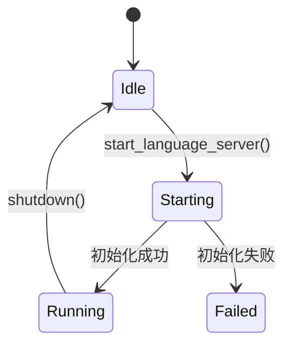
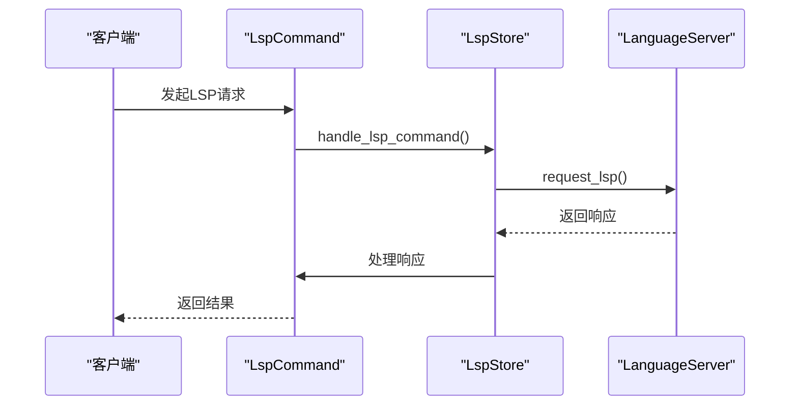
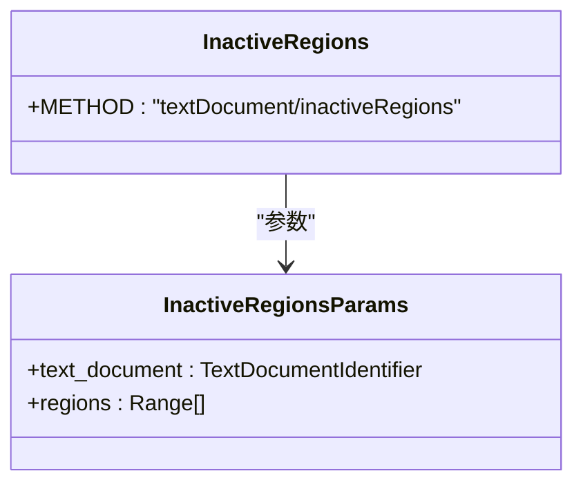
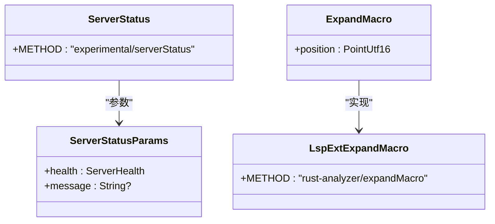
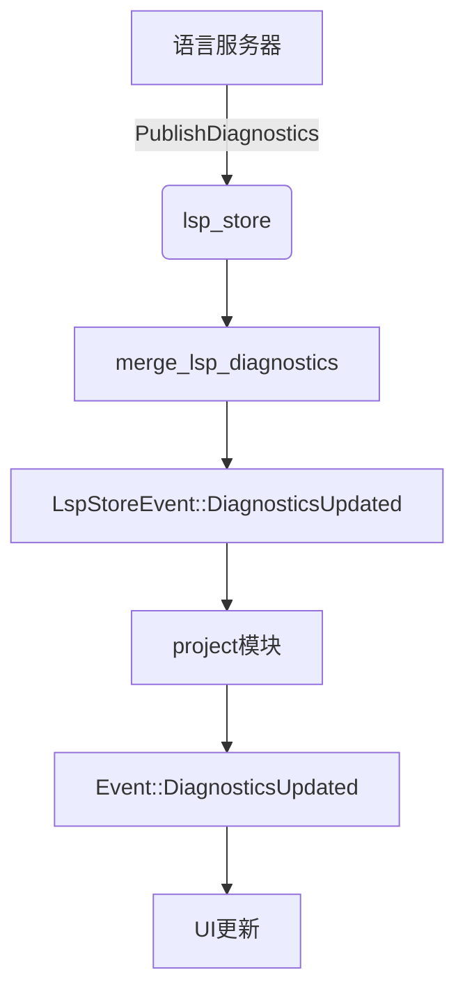

# LSP集成

<cite>
**本文档中引用的文件**  
- [lsp_store.rs](file://crates/project/src/lsp_store.rs)
- [lsp_command.rs](file://crates/project/src/lsp_command.rs)
- [clangd_ext.rs](file://crates/project/src/lsp_store/clangd_ext.rs)
- [rust_analyzer_ext.rs](file://crates/project/src/lsp_store/rust_analyzer_ext.rs)
- [lsp_ext_command.rs](file://crates/project/src/lsp_store/lsp_ext_command.rs)
- [project.rs](file://crates/project/src/project.rs)
</cite>

## 目录
1. [引言](#引言)
2. [LSP存储架构与生命周期管理](#lsp存储架构与生命周期管理)
3. [LSP命令处理机制](#lsp命令处理机制)
4. [语言服务器扩展功能分析](#语言服务器扩展功能分析)
5. [诊断信息与代码操作传递路径](#诊断信息与代码操作传递路径)
6. [会话恢复与性能优化策略](#会话恢复与性能优化策略)
7. [结论](#结论)

## 引言
本文档系统阐述了LSP（语言服务器协议）集成架构，重点解析`lsp_store`对多语言服务器的生命周期管理、`lsp_command`的请求封装机制，以及针对`clangd`和`rust-analyzer`的扩展功能实现。文档还详细描述了诊断信息收集、语法错误标记和代码操作建议的传递路径，并提供LSP会话恢复机制和性能调优建议。

## LSP存储架构与生命周期管理

`lsp_store`模块是LSP集成的核心，负责统一管理语言服务器的生命周期。该模块分为本地（`LocalLspStore`）和远程（`RemoteLspStore`）两种模式，其中本地模式负责语言服务器的启动、连接和状态维护。

语言服务器的启动由`start_language_server`方法驱动，该方法根据工作区配置和语言适配器创建并初始化语言服务器实例。服务器启动后，通过`running_language_server_for_id`方法可查询其运行状态。服务器的启动过程包括获取二进制路径、配置初始化参数、建立WebSocket连接等步骤。

服务器状态通过`LanguageServerState`枚举管理，包含`Starting`和`Running`两种状态。在`Starting`状态时，系统会异步等待服务器初始化完成；一旦成功，状态将切换为`Running`，并开始处理LSP请求。

**Diagram sources**
- [lsp_store.rs](file://crates/project/src/lsp_store.rs#L14-L15)

**Section sources**
- [lsp_store.rs](file://crates/project/src/lsp_store.rs#L11169-L11188)

## LSP命令处理机制

`lsp_command`模块定义了LSP请求的封装和处理机制。所有LSP命令均实现`LspCommand` trait，该trait定义了命令的显示名称、能力检查、参数转换、响应处理等核心方法。

LSP请求的处理流程由`handle_lsp_command`异步函数统一管理。该函数接收一个类型化的信封（`TypedEnvelope`），提取缓冲区ID，获取对应的缓冲区句柄，然后将请求转发给目标语言服务器。处理完成后，响应被转换为协议格式并返回。

各类LSP功能（如代码补全、跳转定义、悬停提示）均通过具体的命令结构体实现。例如，`GetDefinitions`结构体用于处理“跳转到定义”请求，`GetHover`用于处理悬停提示请求。每个命令都实现了`to_lsp`方法将内部参数转换为LSP协议参数，并通过`response_from_lsp`方法将LSP响应转换为应用内部格式。

**Diagram sources**
- [lsp_command.rs](file://crates/project/src/lsp_command.rs#L8004-L8044)

**Section sources**
- [lsp_command.rs](file://crates/project/src/lsp_command.rs#L8004-L8044)

## 语言服务器扩展功能分析

### Clangd扩展功能

`clangd_ext`模块为`clangd`语言服务器提供了特定扩展功能。其核心功能是处理`textDocument/inactiveRegions`通知，该通知用于标记代码中的非活动区域（如被`#if 0`包围的代码块）。

当`clangd`发送`inactiveRegions`通知时，系统会将这些区域转换为具有特定严重性（信息级）和来源（clangd）的诊断信息。`is_inactive_region`函数用于判断一个诊断是否为非活动区域诊断，从而在UI中进行特殊渲染。

**Diagram sources**
- [clangd_ext.rs](file://crates/project/src/lsp_store/clangd_ext.rs#L1-L103)

**Section sources**
- [clangd_ext.rs](file://crates/project/src/lsp_store/clangd_ext.rs#L1-L103)

### Rust Analyzer扩展功能

`rust_analyzer_ext`模块为`rust-analyzer`提供了丰富的扩展功能，包括宏展开、文档跳转、父模块跳转和可运行项（runnables）支持。

`rust-analyzer`通过`experimental/serverStatus`通知向客户端报告服务器健康状态（正常、警告、错误）。该状态通过`register_notifications`函数注册监听器进行处理，并通过`LspStoreEvent::LanguageServerUpdate`事件向应用层广播。

此外，该模块还实现了`flycheck`相关的控制命令，如`run_flycheck`、`cancel_flycheck`和`clear_flycheck`，允许用户手动触发、取消或清除飞行检查。

**Diagram sources**
- [rust_analyzer_ext.rs](file://crates/project/src/lsp_store/rust_analyzer_ext.rs#L1-L272)

**Section sources**
- [rust_analyzer_ext.rs](file://crates/project/src/lsp_store/rust_analyzer_ext.rs#L1-L272)

## 诊断信息与代码操作传递路径

诊断信息的传递路径始于语言服务器的`PublishDiagnostics`通知。`lsp_store`通过`setup_lsp_messages`方法注册通知处理器，当收到诊断信息时，调用`merge_lsp_diagnostics`方法将诊断信息合并到项目状态中。

诊断信息的更新通过`LspStoreEvent::DiagnosticsUpdated`事件向外广播，`project`模块监听该事件并触发`Event::DiagnosticsUpdated`，最终由UI组件更新显示。对于工作区级别的诊断刷新，`pull_workspace_diagnostics_for_buffer`方法会向所有相关语言服务器发送刷新信号。

代码操作建议（如重命名、代码动作）通过`lsp_command`机制处理。例如，`PerformRename`命令会触发LSP的`textDocument/rename`请求，服务器返回的`WorkspaceEdit`被反序列化为`ProjectTransaction`，然后应用到所有相关缓冲区。

**Diagram sources**
- [lsp_store.rs](file://crates/project/src/lsp_store.rs#L11169-L11188)
- [project.rs](file://crates/project/src/project.rs#L2940-L3043)

**Section sources**
- [lsp_store.rs](file://crates/project/src/lsp_store.rs#L11169-L11188)
- [project.rs](file://crates/project/src/project.rs#L2940-L3043)

## 会话恢复与性能优化策略

### 会话恢复机制

LSP会话恢复机制依赖于`lsp_store`对服务器状态的持久化管理。当项目重新打开时，`lsp_store`会根据工作区配置重新启动之前运行的语言服务器。服务器的初始化参数（如`workspaceFolders`）会被重新发送，确保服务器恢复到之前的工作状态。

对于缓冲区级别的会话，系统通过`language_server_ids_for_buffer`方法确定哪些语言服务器需要为特定缓冲区提供服务，并在服务器启动后重新注册这些缓冲区。

### 性能优化策略

性能优化主要体现在以下几个方面：

1. **消息批处理**：通过`workspace_refresh_task`机制，将多个诊断刷新请求合并为一个，减少与语言服务器的通信次数。
2. **网络延迟优化**：使用异步任务和通道（`mpsc`）进行非阻塞通信，避免UI线程被阻塞。
3. **能力检查**：在发送LSP请求前，通过`check_capabilities`方法检查服务器是否支持该功能，避免无效请求。
4. **缓存机制**：对语言服务器适配器、初始化参数等进行缓存，减少重复计算。

此外，系统还实现了`SERVER_PROGRESS_THROTTLE_TIMEOUT`（100毫秒）来节流进度报告，防止过于频繁的UI更新。

## 结论

本文档详细解析了LSP集成架构的核心组件和工作机制。`lsp_store`模块通过统一的接口管理多语言服务器的生命周期，`lsp_command`模块提供了一套灵活的请求封装和处理机制。针对`clangd`和`rust-analyzer`的扩展功能实现了语言服务器特有的高级功能。诊断信息和代码操作的传递路径清晰可靠，会话恢复和性能优化策略确保了系统的稳定性和响应速度。整体架构设计合理，具备良好的可扩展性和维护性。