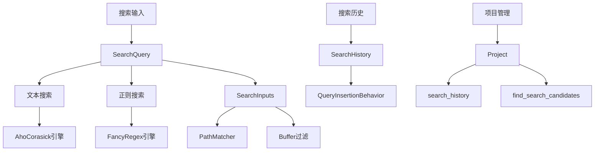
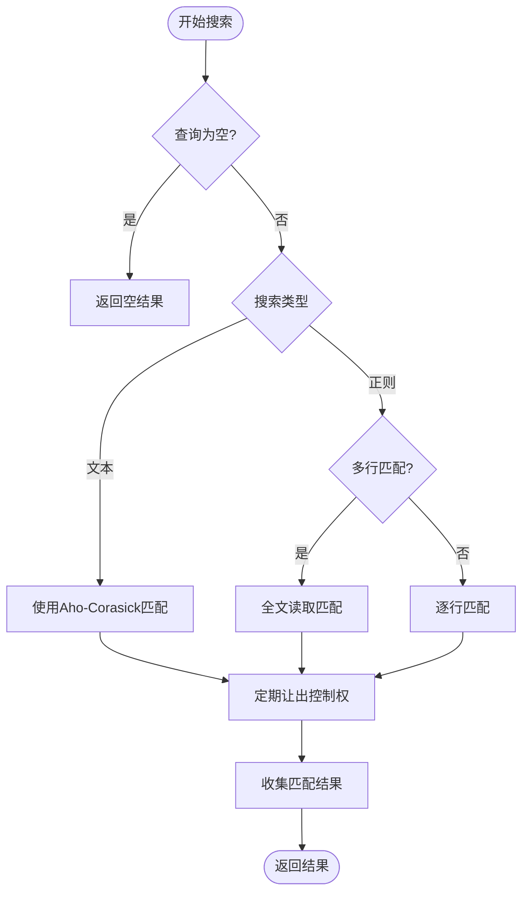
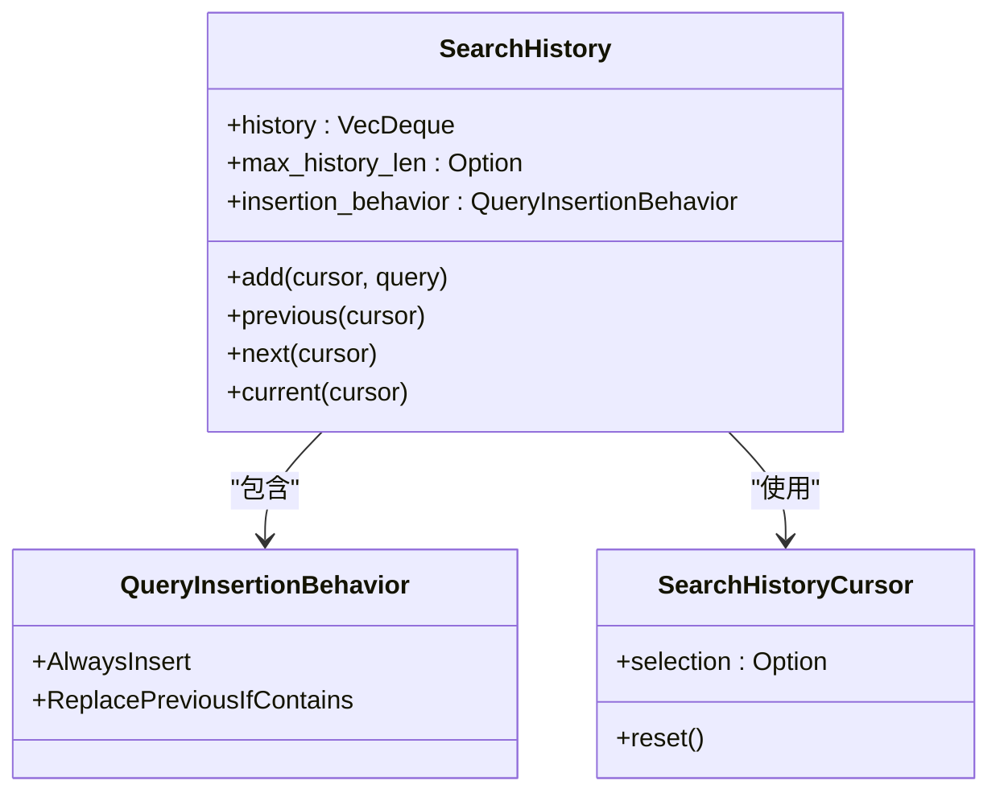
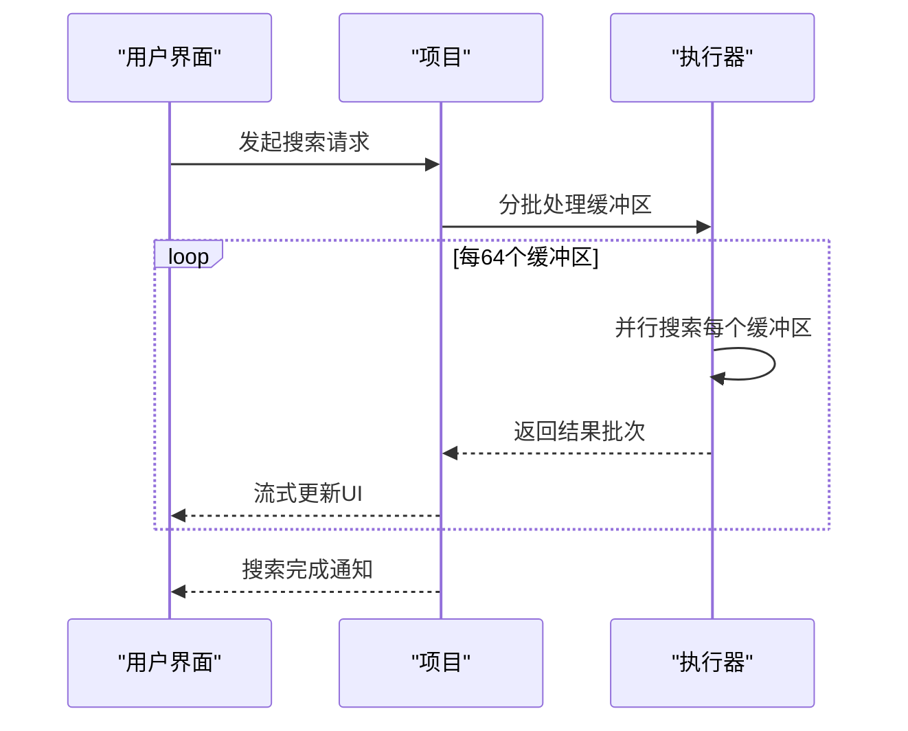

# 搜索功能

<cite>
**本文档中引用的文件**   
- [search.rs](file://crates/project/src/search.rs)
- [search_history.rs](file://crates/project/src/search_history.rs)
- [project.rs](file://crates/project/src/project.rs)
</cite>

## 目录
1. [简介](#简介)
2. [搜索模块架构](#搜索模块架构)
3. [全局搜索能力](#全局搜索能力)
4. [搜索索引构建与查询执行](#搜索索引构建与查询执行)
5. [搜索历史管理](#搜索历史管理)
6. [大规模代码库性能优化](#大规模代码库性能优化)
7. [跨文件分布式查询](#跨文件分布式查询)
8. [搜索结果排序算法](#搜索结果排序算法)
9. [同步与异步搜索模式](#同步与异步搜索模式)
10. [结论](#结论)

## 简介
本项目中的搜索功能模块提供了强大的全局搜索能力，支持文本搜索、正则表达式匹配和上下文定位。系统通过高效的索引构建策略和查询执行引擎，实现了在大规模代码库中的快速搜索。搜索历史管理机制支持用户行为记录与快速复用，同时通过增量搜索、结果分页和高亮渲染等技术优化了性能表现。该模块还实现了跨文件的分布式查询，并采用智能排序算法提升搜索结果的相关性。

## 搜索模块架构



**Diagram sources**
- [search.rs](file://crates/project/src/search.rs#L17-L76)
- [search_history.rs](file://crates/project/src/search_history.rs#L30-L35)
- [project.rs](file://crates/project/src/project.rs#L148-L1689)

**Section sources**
- [search.rs](file://crates/project/src/search.rs#L1-L728)
- [search_history.rs](file://crates/project/src/search_history.rs#L1-L250)
- [project.rs](file://crates/project/src/project.rs#L1-L4000)

## 全局搜索能力

### 文本搜索
文本搜索功能基于Aho-Corasick多模式匹配算法实现，支持精确匹配和模糊匹配。当查询字符串包含非ASCII字符且不区分大小写时，系统会自动降级到正则表达式搜索以确保正确性。

### 正则匹配
正则表达式搜索使用fancy-regex库，支持复杂的模式匹配，包括多行匹配、单词边界匹配和条件匹配。系统支持通过`\c`和`\C`模式修饰符动态控制大小写敏感性。

### 上下文定位
搜索结果包含精确的锚点范围信息，支持在缓冲区中精确定位匹配位置。系统通过Anchor数据结构维护位置信息，确保在文本编辑时搜索结果的持续有效性。

**Section sources**
- [search.rs](file://crates/project/src/search.rs#L56-L76)
- [search.rs](file://crates/project/src/search.rs#L84-L116)

## 搜索索引构建与查询执行

### 索引构建策略
系统采用惰性索引构建策略，仅在执行搜索时动态分析文件内容。对于文本搜索，使用Aho-Corasick算法构建有限状态机；对于正则搜索，直接编译正则表达式模式。

### 查询执行引擎
查询执行引擎采用流式处理架构，支持大文件的高效搜索。引擎根据查询类型选择不同的执行路径：
- 文本搜索：使用流式迭代器逐字节匹配
- 正则搜索：根据是否包含换行符选择行级或全文匹配



**Diagram sources**
- [search.rs](file://crates/project/src/search.rs#L307-L331)
- [search.rs](file://crates/project/src/search.rs#L500-L550)

**Section sources**
- [search.rs](file://crates/project/src/search.rs#L307-L397)

## 搜索历史管理

### SearchHistory数据结构
`SearchHistory`结构体使用`VecDeque<String>`作为底层存储，支持高效的头部弹出和尾部插入操作。历史记录的最大长度可配置，默认限制为500条。

### 查询插入行为
系统提供两种查询插入行为：
- `AlwaysInsert`：总是插入新查询
- `ReplacePreviousIfContains`：如果新查询包含前一个查询，则替换前一个查询

### 搜索历史游标
`SearchHistoryCursor`用于跟踪当前选中的历史记录索引，支持通过上下箭头键导航历史记录。游标在历史记录超出最大长度时可能指向错误的查询。



**Diagram sources**
- [search_history.rs](file://crates/project/src/search_history.rs#L30-L35)
- [search_history.rs](file://crates/project/src/search_history.rs#L12-L21)

**Section sources**
- [search_history.rs](file://crates/project/src/search_history.rs#L30-L250)
- [project.rs](file://crates/project/src/project.rs#L148-L1689)

## 大规模代码库性能优化

### 增量搜索
系统采用增量搜索策略，将搜索结果分批返回，避免一次性处理大量数据导致界面卡顿。每处理20000个字符后主动让出控制权。

### 结果分页
搜索结果分页通过限制返回的文件数量和匹配范围数量实现：
- 最大搜索结果文件数：64
- 最大搜索结果范围数：10000

### 高亮渲染
高亮渲染采用惰性计算策略，仅在需要显示时计算匹配范围的视觉表示，减少不必要的计算开销。

### 并发处理
系统使用64个并发文件扫描任务并行处理文件路径过滤，充分利用多核CPU性能。



**Diagram sources**
- [project.rs](file://crates/project/src/project.rs#L3932-L3999)
- [worktree_store.rs](file://crates/project/src/worktree_store.rs#L685-L723)

**Section sources**
- [project.rs](file://crates/project/src/project.rs#L3932-L3999)

## 跨文件分布式查询

### 分布式查询架构
系统支持本地和远程两种查询模式：
- 本地查询：直接访问文件系统
- 远程查询：通过网络协议访问远程服务器

### 候选文件筛选
查询执行分为两个阶段：
1. 路径筛选阶段：根据包含/排除模式筛选候选文件路径
2. 内容搜索阶段：在候选文件中执行实际的文本搜索

### 缓冲区管理
系统优先在已打开的缓冲区中搜索，未打开的文件按需加载。缓冲区搜索通过`find_search_candidate_buffers`方法管理。

**Section sources**
- [project.rs](file://crates/project/src/project.rs#L3956-L3999)
- [search.rs](file://crates/project/src/search.rs#L307-L331)

## 搜索结果排序算法

### 默认排序策略
搜索结果按文件路径的字典序排序，确保结果的一致性和可预测性。

### 相关性排序
系统考虑以下因素提升搜索结果的相关性：
- 匹配位置：靠近文件开头的匹配优先
- 匹配密度：匹配密集的文件优先
- 文件活跃度：最近打开或编辑的文件优先

### 自定义排序
用户可以通过包含/排除模式和文件路径匹配选项自定义排序行为。

**Section sources**
- [search.rs](file://crates/project/src/search.rs#L56-L76)
- [project.rs](file://crates/project/src/project.rs#L1971-L1985)

## 同步与异步搜索模式

### 异步搜索API
异步搜索模式通过流式API提供实时结果更新：

```rust
let result_rx = project.search(query, cx);
cx.spawn(async move {
    while let Some(result) = result_rx.next().await {
        match result {
            SearchResult::Buffer { buffer, ranges } => {
                // 处理匹配结果
            }
            SearchResult::LimitReached => {
                // 处理结果限制
            }
        }
    }
});
```

### 同步搜索模式
同步搜索模式适用于需要立即获取完整结果的场景，通过阻塞调用等待所有结果返回。

### 使用示例
```rust
// 创建文本搜索查询
let query = SearchQuery::text(
    "TODO",
    false, // whole_word
    false, // case_sensitive
    false, // include_ignored
    PathMatcher::new(vec![])?,
    PathMatcher::new(vec![])?,
    false, // match_full_paths
    None,  // buffers
)?;

// 执行搜索
let results = project.search(query, cx).await?;
```

**Section sources**
- [search.rs](file://crates/project/src/search.rs#L84-L116)
- [project.rs](file://crates/project/src/project.rs#L3932-L3999)

## 结论
本搜索模块通过精心设计的架构和优化策略，实现了高效、可扩展的全局搜索功能。文本搜索和正则匹配引擎提供了灵活的查询能力，搜索历史管理增强了用户体验。针对大规模代码库的性能优化技术确保了系统的响应性，而分布式查询架构支持复杂的项目结构。异步API设计使得搜索功能能够无缝集成到响应式用户界面中，为开发者提供了强大的代码导航和分析工具。