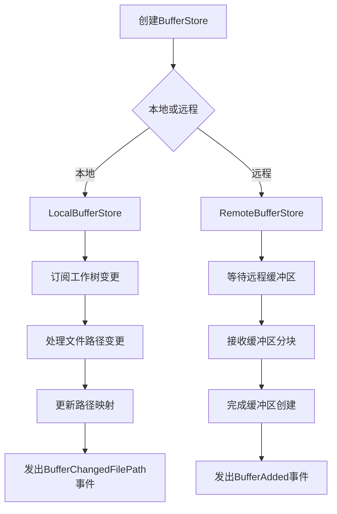
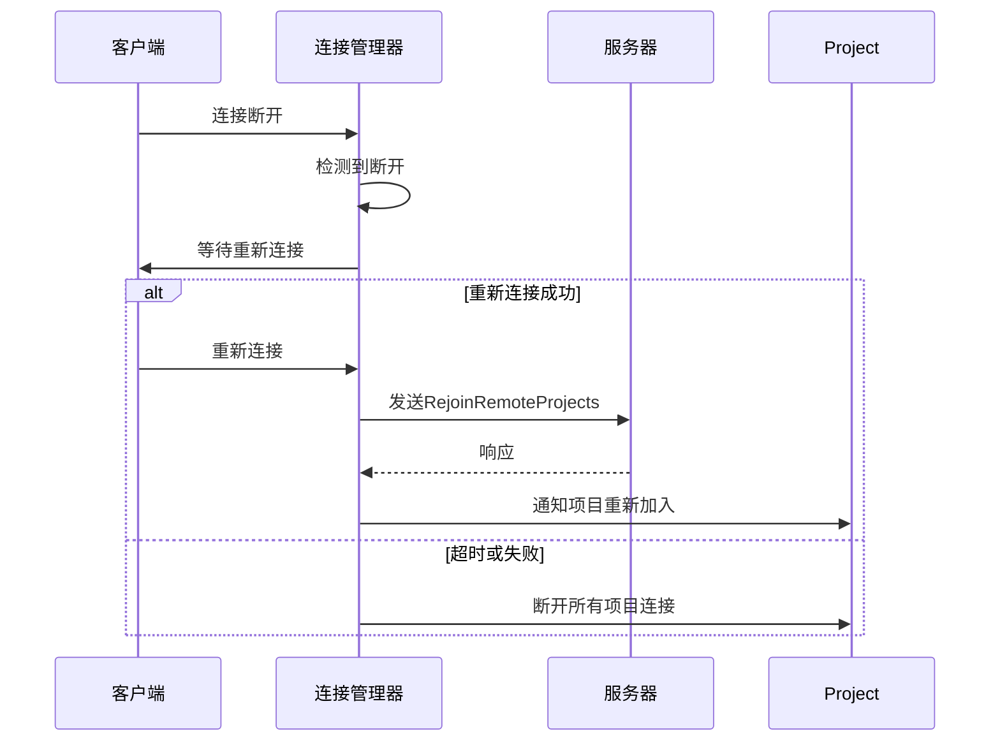

# 文件与缓冲区管理

<cite>
**本文档中引用的文件**  
- [buffer_store.rs](file://crates/project/src/buffer_store.rs)
- [connection_manager.rs](file://crates/project/src/connection_manager.rs)
- [debounced_delay.rs](file://crates/project/src/debounced_delay.rs)
</cite>

## 目录
1. [引言](#引言)
2. [缓冲区存储架构](#缓冲区存储架构)
3. [内存管理与生命周期](#内存管理与生命周期)
4. [异步文件同步机制](#异步文件同步机制)
5. [多客户端并发访问协调](#多客户端并发访问协调)
6. [字符编码与增量更新](#字符编码与增量更新)
7. [大文件加载优化](#大文件加载优化)
8. [内存使用监控](#内存使用监控)
9. [完整数据流示例](#完整数据流示例)
10. [结论](#结论)

## 引言
本文件详细说明 `buffer_store` 模块在文本编辑器系统中的核心作用，涵盖缓冲区的创建、更新、生命周期管理以及与底层文件系统的异步同步机制。重点分析 `debounced_delay` 在防抖写入中的应用，`connection_manager` 如何协调多客户端对同一缓冲区的并发访问，并探讨字符编码处理、增量更新传播和冲突解决策略。同时提供大文件加载优化方案和内存使用监控机制的实现细节，通过实际代码路径演示从文件打开到内容修改再到保存的完整数据流。

## 缓冲区存储架构
`BufferStore` 是管理一组打开缓冲区的核心结构，支持本地和远程两种模式。其状态由 `BufferStoreState` 枚举表示，包含 `Local` 和 `Remote` 两种变体，分别对应 `LocalBufferStore` 和 `RemoteBufferStore` 结构体。`BufferStore` 维护了多个哈希映射，用于跟踪加载中的缓冲区、已打开的缓冲区、路径到缓冲区ID的映射、共享缓冲区以及不可搜索的缓冲区。

**Section sources**
- [buffer_store.rs](file://crates/project/src/buffer_store.rs#L1-L1735)

## 内存管理与生命周期
`BufferStore` 通过 `loading_buffers` 哈希表管理正在加载的缓冲区任务，确保每个项目路径的缓冲区只被加载一次。当缓冲区被添加时，`BufferStore` 会发出 `BufferAdded` 事件，通知其他组件如 `Project`、`LspStore` 和 `GitStore` 进行相应的处理。缓冲区的生命周期由 `OpenBuffer` 枚举管理，它可以是已完成的缓冲区引用或待应用的操作列表。当缓冲区被关闭或删除时，`BufferStore` 会发出 `BufferDropped` 事件，清理相关资源。



**Diagram sources**
- [buffer_store.rs](file://crates/project/src/buffer_store.rs#L1-L1735)

**Section sources**
- [buffer_store.rs](file://crates/project/src/buffer_store.rs#L1-L1735)

## 异步文件同步机制
`BufferStore` 通过 `debounced_delay` 模块实现防抖写入，避免频繁的磁盘I/O操作。`DebouncedDelay` 结构体允许在指定延迟后执行函数，如果在延迟期间再次调用 `fire_new`，则会取消之前的任务并重新开始计时。这种机制确保了在用户连续输入时不会立即触发保存操作，而是在用户暂停输入一段时间后才执行，从而提高性能和用户体验。

```mermaid
classDiagram
class DebouncedDelay~E~ {
-task : Option<Task<()>>
-cancel_channel : Option<Sender<()>>
+fire_new(delay : Duration, cx : &mut Context~E~, func : F)
}
DebouncedDelay~E~ --> Task : "包含"
DebouncedDelay~E~ --> Sender : "用于取消"
```

**Diagram sources**
- [debounced_delay.rs](file://crates/project/src/debounced_delay.rs#L1-L55)

**Section sources**
- [debounced_delay.rs](file://crates/project/src/debounced_delay.rs#L1-L55)

## 多客户端并发访问协调
`connection_manager` 模块负责维护与远程项目的连接，并在连接丢失后尝试重新连接。`Manager` 结构体跟踪所有项目，并在连接断开时通知它们。当客户端重新连接时，`reconnected` 方法会向服务器发送 `RejoinRemoteProjects` 请求，重新加入之前加入的项目。`maintain_connection` 异步函数监听客户端状态变化，一旦检测到连接断开，就会启动重连逻辑，最多尝试3次，每次间隔30秒。



**Diagram sources**
- [connection_manager.rs](file://crates/project/src/connection_manager.rs#L1-L224)

**Section sources**
- [connection_manager.rs](file://crates/project/src/connection_manager.rs#L1-L224)

## 字符编码与增量更新
`BufferStore` 支持通过 `proto::UpdateBuffer` 消息进行增量更新，将操作分批发送给远程客户端。`split_operations` 函数将大的操作列表分割成较小的块，以避免单个消息过大。当接收到 `CreateBufferForPeer` 消息时，`RemoteBufferStore` 会先创建一个空的缓冲区，然后逐步应用操作块，直到收到最后一个块才完成缓冲区的创建。这种方式确保了即使在网络不稳定的情况下，也能正确地同步缓冲区状态。

**Section sources**
- [buffer_store.rs](file://crates/project/src/buffer_store.rs#L1294-L1334)
- [buffer_store.rs](file://crates/project/src/buffer_store.rs#L1580-L1615)

## 大文件加载优化
对于大文件，`BufferStore` 采用分块加载策略，避免一次性加载整个文件导致内存占用过高。当打开一个大文件时，`open_buffer` 方法会启动一个后台任务，逐步加载文件内容并应用到缓冲区。同时，`loading_buffers` 哈希表确保同一文件不会被重复加载。对于远程缓冲区，`wait_for_remote_buffer` 方法允许其他组件等待缓冲区完全加载完成后再进行操作，保证了数据的一致性。

**Section sources**
- [buffer_store.rs](file://crates/project/src/buffer_store.rs#L924-L959)
- [buffer_store.rs](file://crates/project/src/buffer_store.rs#L1682-L1733)

## 内存使用监控
`BufferStore` 通过 `opened_buffers` 和 `path_to_buffer_id` 哈希表监控内存使用情况，跟踪所有已打开的缓冲区及其路径映射。`non_searchable_buffers` 集合用于标记不可搜索的缓冲区，减少不必要的索引开销。此外，`forget_shared_buffers` 方法允许清除所有共享缓冲区，释放内存资源。通过定期清理不再使用的缓冲区和监听工作树变更，`BufferStore` 能够有效管理内存，防止内存泄漏。

**Section sources**
- [buffer_store.rs](file://crates/project/src/buffer_store.rs#L1-L1735)

## 完整数据流示例
从文件打开到内容修改再到保存的完整数据流如下：用户请求打开文件 → `BufferStore` 检查是否已存在 → 若不存在则创建新缓冲区 → 加载文件内容 → 发出 `BufferAdded` 事件 → 用户修改内容 → 缓冲区记录操作 → `debounced_delay` 触发防抖保存 → `save_buffer` 方法被调用 → 写入文件系统 → 更新文件元数据 → 发出 `BufferSaved` 事件。整个过程涉及 `buffer_store`、`connection_manager` 和 `debounced_delay` 多个模块的协同工作，确保了数据的一致性和系统的响应性。

**Section sources**
- [buffer_store.rs](file://crates/project/src/buffer_store.rs#L1-L1735)
- [connection_manager.rs](file://crates/project/src/connection_manager.rs#L1-L224)
- [debounced_delay.rs](file://crates/project/src/debounced_delay.rs#L1-L55)

## 结论
`buffer_store` 模块通过精心设计的内存管理和异步同步机制，实现了高效、可靠的文本缓冲区管理。结合 `connection_manager` 的连接维护和 `debounced_delay` 的防抖写入，系统能够在多客户端环境下稳定运行，支持大文件的流畅编辑。未来可进一步优化内存使用监控和冲突解决策略，提升用户体验和系统性能。