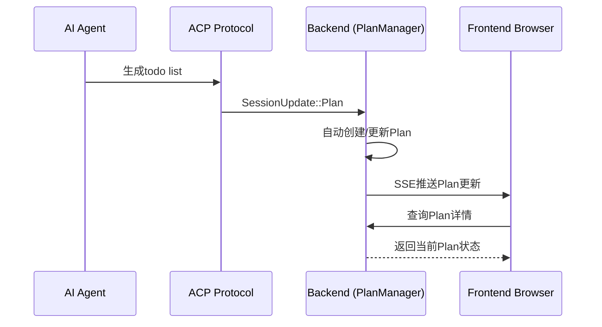

# Plan功能ACP协议集成说明

## 概述

基于你的反馈，Plan功能已经正确设计为agent自动生成、后端维护、通过SSE推送给前端的架构。

## 🔄 Plan生命周期流程



## 📡 ACP协议集成点

### 1. Agent生成Plan
- Agent在处理任务时自动生成todo list
- 通过`SessionUpdate::Plan`事件发送给客户端
- 无需前端手动创建

### 2. Plan自动维护
```rust
// 在connection.rs中处理ACP协议的Plan更新
SessionUpdate::Plan(plan) => {
    let internal_plan = crate::plan::PlanConverter::from_acp_plan(plan);
    Some(StreamUpdate::Plan {
        session_id: SessionId(uuid::Uuid::new_v4().to_string().into()),
        plan: serde_json::to_value(&internal_plan).unwrap_or_default(),
    })
}
```

### 3. PlanManager自动处理
- 接收来自ACP的Plan更新
- 自动管理Plan的生命周期
- 计算统计信息和状态变更

## 🌐 前端API设计

### 可用端点（只读和监听）
```
GET  /api/plans/{session_id}        - 查询Plan详情
GET  /api/plans/stats               - 查询所有Plan统计  
GET  /api/plans/{session_id}/updates - SSE实时更新流
```

### 已移除的端点（不需要）
```
❌ PUT  /api/plans/{session_id}/status   - 状态由agent自动更新
❌ POST /api/plans/{session_id}/cleanup  - 后端自动清理
❌ POST /api/plans/{session_id}/demo     - 不需要手动创建
```

## 📊 数据结构增强

### Plan结构支持
- ✅ 时间跟踪（创建、开始、完成时间）
- ✅ 进度管理（百分比进度）
- ✅ 优先级和依赖关系
- ✅ 标签和分类支持
- ✅ 丰富的元数据
- ✅ 统计信息计算

### Plan条目状态流转
```
Pending → InProgress → Completed
    ↓         ↓           ↓
 Cancelled  Failed   (自动清理)
```

## 🔄 实时更新机制

### SSE事件类型
```typescript
interface PlanUpdateEvent {
  session_id: string;
  update_type: 'FullUpdate' | 'EntryStatusUpdate' | 'StatsUpdate';
  plan?: Plan;
  stats?: PlanStats;
  timestamp: number;
}
```

### 前端监听示例
```javascript
const eventSource = new EventSource('/api/plans/session123/updates');
eventSource.addEventListener('plan-update', (event) => {
  const update = JSON.parse(event.data);
  // 更新UI显示Plan状态
  updatePlanDisplay(update.plan, update.stats);
});
```

## 🎯 使用场景

### 1. Agent生成Plan
Agent在执行任务时：
- 分析用户需求
- 自动生成todo list
- 通过ACP协议发送Plan更新
- 前端实时收到Plan展示

### 2. Plan状态跟踪
Agent执行任务过程中：
- 自动更新条目状态（Pending → InProgress → Completed）
- 计算实际耗时
- 更新进度百分比
- 推送状态变更给前端

### 3. 前端展示
前端浏览器：
- 通过SSE实时接收Plan更新
- 查询API获取完整Plan详情
- 展示统计信息和进度
- 无需手动操作Plan

## ✅ 设计优势

1. **职责分离**：Agent负责生成，后端负责管理，前端负责展示
2. **实时性**：SSE推送确保前端实时更新
3. **简洁性**：前端只需要查询和监听，无需复杂操作
4. **可扩展性**：丰富的Plan数据结构支持未来功能扩展
5. **ACP兼容**：完全符合ACP协议的设计理念

## 🚀 部署状态

- ✅ PlanManager集成到主服务器
- ✅ ACP协议Plan转换器
- ✅ SSE实时推送端点
- ✅ Plan查询API端点
- ✅ 统计信息API端点
- ✅ 服务器成功启动并运行

现在agent生成的todo list可以完美地通过ACP协议获取，并实时推送给前端展示！🎉