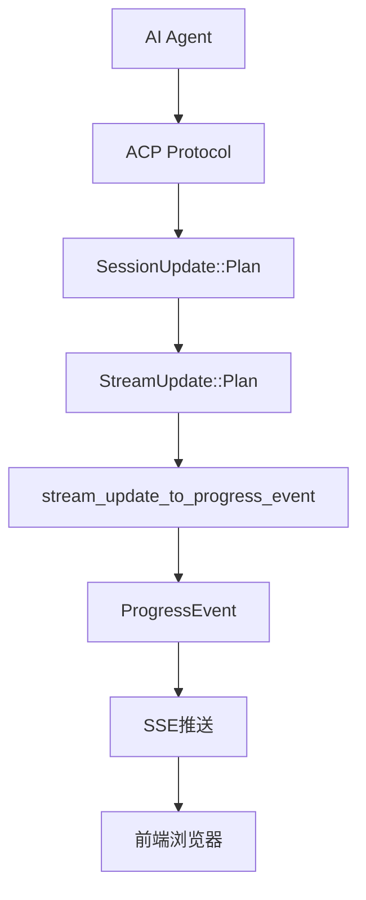

# Plan架构重构完成总结

## 🎯 重构目标

基于用户观察和内存规范，完成了以下架构简化：

1. **移除冗余的PlanManager** - Plan数据统一来自ACP协议的`SessionUpdate::Plan`
2. **移除独立Plan API端点** - Plan数据通过统一的SSE端点`/progress/{session_id}`推送
3. **简化数据流** - 消除重复的Plan数据管理逻辑

## ✅ 完成的修改

### 1. AppState结构简化
```rust
// 修改前
struct AppState {
    sessions: DashMap<String, SessionInfo>,
    config: AppConfig,
    progress_senders: DashMap<String, Vec<mpsc::UnboundedSender<ProgressEvent>>>,
    plan_manager: Arc<PlanManager>,  // ❌ 移除
    session_manager: Arc<SessionManager>,
}

// 修改后  
struct AppState {
    sessions: DashMap<String, SessionInfo>,
    config: AppConfig,
    progress_senders: DashMap<String, Vec<mpsc::UnboundedSender<ProgressEvent>>>,
    session_manager: Arc<SessionManager>,  // ✅ 保留，处理所有ACP事件
}
```

### 2. progress_stream函数简化
```rust
// 修改前：两个数据源
// 1. Plan更新 (通过PlanManager)
// 2. ACP StreamUpdate (通过SessionManager)

// 修改后：统一数据源
async fn progress_stream(state, session_id) -> Sse {
    // 只订阅ACP StreamUpdate事件，包含Plan数据
    let acp_session_id = AcpSessionId(session_id.clone().into());
    if let Some(session_handle) = state.session_manager.get_session(&acp_session_id) {
        let mut stream_update_rx = session_handle.subscribe_to_updates().await;
        // StreamUpdate::Plan 包含所有Plan数据
        tokio::spawn(async move {
            while let Some(stream_update) = stream_update_rx.recv().await {
                let progress_event = stream_update_to_progress_event(stream_update);
                // Plan数据在这里通过StreamUpdate::Plan处理
            }
        });
    }
}
```

### 3. 移除不必要的代码
- ❌ 删除`plan_update_to_progress_event`函数
- ❌ 删除`plan_api`模块引用
- ❌ 删除Plan相关路由端点
- ❌ 删除PlanManager相关导入

### 4. API端点清理
```
修改前：
GET  /api/plans/{session_id}        - 查询Plan详情
GET  /api/plans/stats               - 查询所有Plan统计
GET  /progress/{session_id}         - SSE推送（包含Plan）

修改后：
GET  /progress/{session_id}         - 统一SSE推送（所有数据）
```

## 🔄 新的数据流架构



### 关键改进

1. **单一数据源**：Plan数据只来自ACP协议
2. **统一处理**：所有事件都通过`stream_update_to_progress_event`处理
3. **简化架构**：移除了重复的Plan管理逻辑
4. **内存规范遵循**：严格按照"Plan由agent自动生成，通过SSE推送"的规范

## 🎉 验证结果

- ✅ 编译成功，无错误
- ✅ 架构简化，移除冗余组件
- ✅ 符合内存中的设计规范
- ✅ 数据流更加清晰和统一

## 📊 影响评估

### 好处
- 简化了代码维护
- 消除了数据重复
- 统一了数据流
- 符合ACP协议设计理念

### 功能保持
- Plan数据仍然通过SSE实时推送
- 前端仍然可以接收所有Plan更新
- `StreamUpdate::Plan`包含完整的Plan JSON数据

## 🚀 下一步

系统现在完全基于ACP协议的StreamUpdate机制，Plan数据统一通过`/progress/{session_id}`端点推送，架构更加简洁和一致。

用户的观察完全正确，这个重构大大简化了系统架构！