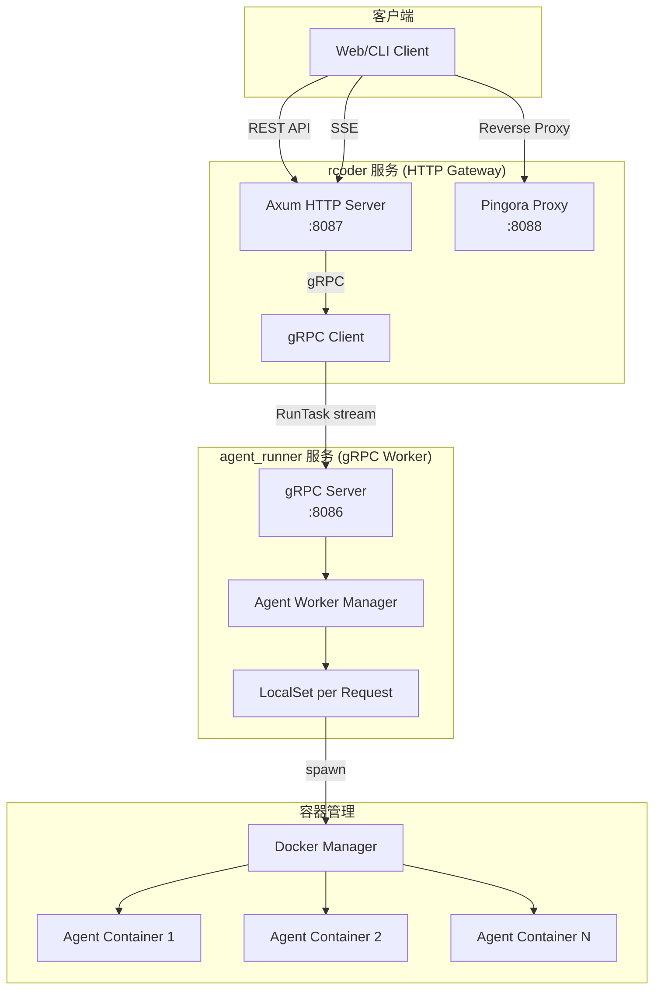
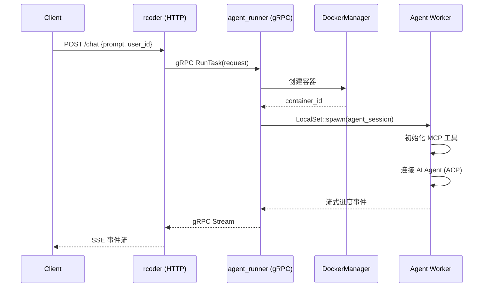

# RCoder 项目架构解析

> **生成时间**: 2026-01-12  
> **目标受众**: 开发者、架构师  
> **版本**: 基于 `Cargo.toml` v0.1.0

---

## 1. 项目概述

**RCoder** 是一个基于 Rust 构建的 **AI 驱动开发平台**，通过 **ACP (Agent Client Protocol)** 协议实现与多种 AI 代理（如 Claude Code、Codex）的统一交互。

### 核心价值
- **统一代理接入**: 通过 ACP 协议抽象，一套 API 对接多种 AI Agent。
- **容器化隔离**: 每个 Agent 会话运行在独立的 Docker 容器中，确保安全性和资源隔离。
- **高性能异步**: 基于 Tokio 异步运行时，支持高并发请求处理。
- **可观测性**: 内置 OpenTelemetry 和 Prometheus 指标，支持全链路追踪。

---

## 2. 架构图



---

## 3. Crate 模块说明

| Crate | 职责 | 关键技术 |
|-------|------|----------|
| **rcoder** | HTTP 网关，对外暴露 REST API 和 SSE 进度流 | Axum, utoipa (Swagger) |
| **agent_runner** | gRPC 服务，执行 Agent 任务，管理 Worker 线程 | tonic (gRPC), LocalSet |
| **docker_manager** | Docker 容器生命周期管理 (创建/启动/停止/删除) | bollard (Docker API) |
| **shared_types** | 跨 crate 共享的类型定义和 Protobuf 生成代码 | prost, tonic-build |
| **rcoder-proxy** | Pingora 高性能反向代理封装 | pingora |
| **acp_adapter** | ACP 协议适配层，将 HTTP 请求转换为 ACP 消息 | agent-client-protocol |
| **agent_config** | Agent 配置管理，定义 MCP 工具和 Agent 参数 | serde, config |
| **agent_abstraction** | Agent 抽象层，定义通用 Agent 接口 | async-trait |
| **duckdb_manager** | DuckDB 数据库管理（分析数据存储） | duckdb |
| **rcoder-telemetry** | 遥测模块，统一 tracing 和 OTEL 配置 | tracing-opentelemetry |

---

## 4. 核心流程

### 4.1 会话创建流程



### 4.2 请求处理模型

- **rcoder (HTTP)**: 无状态网关，接收请求后通过 gRPC 转发给 `agent_runner`。
- **agent_runner (gRPC)**: 
  - 使用 **多线程 Tokio 运行时**。
  - 每个请求在独立的 **LocalSet** 中运行（因为 ACP 连接不是 `Send`）。
  - Worker 由 `AgentWorkerManager` 管理，支持自动重启和健康监控。

---

## 5. 配置体系

### 5.1 配置优先级
1. **命令行参数** (最高)
2. **环境变量**
3. **配置文件** (`config.yml`)
4. **默认值** (最低)

### 5.2 关键配置项

| 配置项 | 环境变量 | 说明 |
|--------|---------|------|
| `port` | `RCODER_PORT` | HTTP 服务端口 (默认 8087) |
| `grpc_port` | `GRPC_PORT` | gRPC 服务端口 (默认 8086) |
| `proxy_port` | `PROXY_PORT` | Pingora 代理端口 (默认 8088) |
| `docker.image` | `DOCKER_IMAGE` | Agent 容器镜像 |
| `agent.default` | `DEFAULT_AGENT` | 默认 Agent 类型 |

---

## 6. 容器化部署

### 6.1 镜像结构

```
rcoder/
├── docker/
│   ├── rcoder-master/
│   │   ├── Dockerfile       # rcoder HTTP 服务镜像
│   │   └── Dockerfile.base  # 基础镜像 (系统依赖)
│   └── rcoder-agent-runner/
│       ├── Dockerfile       # agent_runner 服务镜像
│       └── Dockerfile.base  # 基础镜像 (Chromium, Python 等)
```

### 6.2 Docker Compose 服务

| 服务 | 端口 | 职责 |
|------|------|------|
| `rcoder` | 8087, 8088 | HTTP 网关 + Pingora 代理 |
| `agent_runner` | 8086 | gRPC Worker |
| Spawned Containers | 动态 | 每个 Agent 会话的隔离容器 |

---

## 7. 可观测性

### 7.1 日志
- 使用 `tracing` crate 实现结构化日志。
- 日志级别通过 `RUST_LOG` 环境变量控制。
- 容器日志输出到 `/app/logs/` 并挂载到宿主机。

### 7.2 分布式追踪
- 支持 **OpenTelemetry** 协议。
- 可通过 `--otel-endpoint` 配置 Jaeger/Zipkin 等收集端。

### 7.3 指标
- 通过 `metrics-exporter-prometheus` 暴露 Prometheus 指标。
- 端点: `/metrics`

---

## 8. 开发命令速查

```bash
# 构建整个工作空间
cargo build --workspace

# 运行 rcoder HTTP 服务
cargo run --bin rcoder

# 运行 agent_runner gRPC 服务
cargo run --bin agent_runner

# Docker 开发模式（推荐）
make dev-build    # 构建镜像
make dev-up       # 启动服务
make dev-restart  # 代码修改后重启
make dev-logs     # 查看日志

# 代码质量
cargo fmt         # 格式化
cargo clippy      # Lint
```

---

## 9. 扩展阅读

- [README.md](README.md) - 快速开始指南
- [GEMINI.md](GEMINI.md) - Gemini 上下文配置
- [docker/LOCAL_TEST.md](docker/LOCAL_TEST.md) - 本地 Docker 测试指南
- [docker/ROOT_CAUSE_ANALYSIS.md](docker/ROOT_CAUSE_ANALYSIS.md) - 并发阻塞问题根因分析

---

*由 Antigravity 自动生成*
