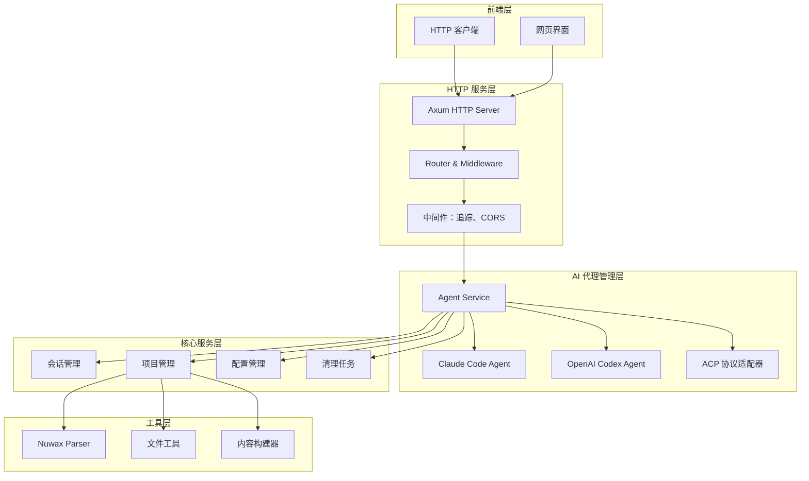

# RCoder - AI驱动的开发平台

RCoder 是一个基于 Rust 构建的现代化 AI 驱动开发平台，通过 ACP (Agent Client Protocol) 协议实现与多种 AI 代理的统一交互。平台提供简洁的 HTTP API 接口，让开发者能够轻松集成和管理 AI 辅助开发功能。

## ✨ 核心特性

- 🤖 **多 AI 代理支持**: 统一接入 Claude Code、OpenAI Codex 等多种 AI 代理
- 🌐 **HTTP API**: 简洁易用的 RESTful API 接口
- ⚡ **异步架构**: 基于 Tokio 的高性能异步处理
- 🔧 **命令行工具**: 灵活的命令行参数配置
- 📝 **配置管理**: YAML 配置文件 + 环境变量 + 命令行参数的多层配置
- 🔄 **实时通信**: 基于 ACP 协议的实时 AI 代理通信
- 📊 **可观测性**: 集成 OpenTelemetry 的完整链路追踪

## 🏠 架构概览



### 🛠️ 技术栈

| 组件类型 | 技术选型 | 说明 |
|----------|---------|------|
| **编程语言** | Rust 2024 Edition | 现代化系统编程语言 |
| **HTTP 框架** | Axum + Tower | 高性能异步 Web 框架 |
| **异步运行时** | Tokio | Rust 生态最成熟的异步运行时 |
| **AI 协议** | ACP (Agent Client Protocol) | 统一的 AI 代理通信协议 |
| **序列化** | Serde + JSON/YAML | 数据序列化和配置管理 |
| **日志系统** | Tracing + OpenTelemetry | 结构化日志和分布式追踪 |
| **命令行** | clap | 现代化命令行参数解析 |
| **文档** | utoipa + Swagger UI | 自动 API 文档生成 |

## 🚀 快速开始

### 📝 环境要求

- **Rust**: 1.75+ (支持 2024 Edition)
- **Claude Code CLI**: 可选，用于 Claude 代理
- **OpenAI Codex**: 可选，用于 Codex 代理

### 🛠️ 安装步骤

1. **克隆仓库**
```bash
git clone https://github.com/your-org/rcoder.git
cd rcoder
```

2. **构建项目**
```bash
# 开发模式
cargo build

# 生产模式
cargo build --release
```

3. **运行服务**
```bash
# 使用默认配置
cargo run --bin rcoder

# 指定端口和项目目录
cargo run --bin rcoder -- --port 8080 --projects-dir ./my-projects
```

服务将在 `http://localhost:3000` 启动。

### 💻 命令行参数

| 参数 | 短参数 | 说明 | 示例 |
|------|--------|------|------|
| `--port` | `-p` | 设置服务端口 | `--port 8080` |
| `--projects-dir` | `-d` | 设置项目工作目录 | `--projects-dir ./projects` |
| `--help` | `-h` | 显示帮助信息 | `--help` |
| `--version` | `-V` | 显示版本信息 | `--version` |

```bash
# 查看所有可用参数
cargo run --bin rcoder -- --help

# 基本启动
cargo run --bin rcoder -- --port 8080

# 完整配置
cargo run --bin rcoder -- --port 8080 --projects-dir /path/to/projects
```

### 🌍 AI 代理配置

#### Claude Code Agent

需要安装 Claude Code CLI：

```bash
# 使用 npm 安装
npm install -g @anthropic-ai/claude-code

# 或者使用 pip 安装
pip install claude-dev
```

配置环境变量：
```bash
export ANTHROPIC_API_KEY="your-api-key"
export ANTHROPIC_MODEL="claude-3-sonnet-20240229"
```

#### OpenAI Codex Agent

需要配置 Codex 相关设置，参考 [Codex 文档](https://github.com/openai/codex)。

## 📚 API 文档

### 🏥 核心端点

| 端点 | 方法 | 说明 |
|------|------|------|
| `/health` | GET | 健康检查 |
| `/chat` | POST | 发送聊天消息给 AI 代理 |
| `/progress/{session_id}` | GET (SSE) | 获取实时进度流 |
| `/api/docs` | GET | Swagger UI API 文档 |

### 🚑 健康检查

```bash
curl -X GET http://localhost:3000/health
```

响应：
```json
{
  "status": "ok",
  "timestamp": "2024-01-01T00:00:00Z"
}
```

### 💬 聊天接口

```bash
curl -X POST http://localhost:3000/chat \
  -H "Content-Type: application/json" \
  -d '{
    "message": "你好，请帮我创建一个 Rust Web API 项目",
    "session_id": "optional-session-id"
  }'
```

### 📊 实时进度流

```bash
curl -X GET http://localhost:3000/progress/your-session-id \
  -H "Accept: text/event-stream"
```

SSE 事件格式：
```
data: {"type": "progress", "content": "正在处理您的请求..."}

data: {"type": "result", "content": "项目创建完成"}
```

## 📁 项目结构

```
rcoder/
├── crates/                    # Rust Workspace Crates
│   ├── rcoder/                # 主应用程序
│   │   ├── src/
│   │   │   ├── handler/       # HTTP 请求处理器
│   │   │   ├── model/         # 数据模型
│   │   │   ├── proxy_agent/   # AI 代理代理服务
│   │   │   ├── service/       # 业务服务层
│   │   │   ├── utils/         # 工具函数
│   │   │   ├── config.rs      # 配置管理
│   │   │   ├── main.rs        # 主程序入口
│   │   │   └── router.rs      # 路由配置
│   │   └── Cargo.toml
│   ├── acp_adapter/           # ACP 协议适配器
│   ├── claude-code-agent/     # Claude Code 代理
│   ├── codex-acp-agent/       # OpenAI Codex 代理
│   ├── nuwax_parser/          # 文件解析器
│   └── shared_types/          # 共享类型定义
├── config.yml                 # 配置文件
├── config.yml.example         # 配置文件示例
├── Cargo.toml                 # Workspace 配置
└── README.md                  # 项目说明
```

### 🔍 核心组件说明

| 组件 | 说明 | 责任 |
|------|------|------|
| **rcoder** | 主应用程序 | HTTP 服务器、路由、中间件、业务逻辑 |
| **acp_adapter** | ACP 协议适配器 | 统一 AI 代理通信接口 |
| **claude-code-agent** | Claude 代理 | Claude Code CLI 集成 |
| **codex-acp-agent** | Codex 代理 | OpenAI Codex 集成 |
| **nuwax_parser** | 文件解析器 | 项目文件分析和处理 |
| **shared_types** | 共享类型 | 跨 crate 数据结构定义 |

## 配置

### 配置优先级

RCoder 支持多种配置方式，优先级从高到低为：

1. **命令行参数** - 最高优先级
2. **环境变量** - 中等优先级
3. **配置文件** - 较低优先级
4. **默认配置** - 最低优先级

### 配置文件

RCoder 支持通过 `config.yml` 文件进行配置。在首次启动时，系统会自动在当前目录下创建默认配置文件。

```yaml
# rcoder 配置文件

# 默认使用的 AI 代理类型
# 可选值: "Codex", "Claude" 
default_agent: Codex

# 项目工作的根目录
projects_dir: "./project_workspace"

# 服务端口
port: 3000
```

### 环境变量

以下环境变量会覆盖配置文件设置（但会被命令行参数覆盖）：

- `RCODER_PORT`: 服务器端口 (覆盖 config.yml 中的 port 设置)
- `DATABASE_URL`: 数据库连接字符串 (默认: sqlite:///./rcoder.db)
- `CLAUDE_CODE_PATH`: Claude Code CLI 路径 (默认: claude)
- `RUST_LOG`: 日志级别 (默认: info)

### 使用示例

```bash
# 使用命令行参数设置端口和项目目录
cargo run --bin rcoder -- --port 8080 --projects-dir /tmp/projects

# 使用环境变量覆盖端口
RCODER_PORT=8080 cargo run --bin rcoder

# 同时使用环境变量和命令行参数（命令行参数优先）
RCODER_PORT=8080 cargo run --bin rcoder -- --port 9000

# 使用自定义配置文件
cp config.yml.example config.yml
# 编辑 config.yml 并运行
cargo run --bin rcoder
```

### 配置文件

创建 `.env` 文件（可选）：

```env
RUST_LOG=debug
DATABASE_URL=sqlite:///./rcoder.db
CLAUDE_CODE_PATH=claude
```

## 🔧 开发指南

### 运行测试

```bash
# 运行所有测试
cargo test

# 运行特定模块测试
cargo test --package rcoder

# 运行集成测试
cargo test --test integration
```

### 代码质量

```bash
# 代码格式化
cargo fmt

# 代码检查
cargo clippy

# 全面检查
cargo clippy -- -D warnings
```

### 本地开发

```bash
# 启动开发服务器
RUST_LOG=debug cargo run --bin rcoder -- --port 8080

# 监视文件变化并自动重启
cargo install cargo-watch
cargo watch -x "run --bin rcoder"
```

## 🚀 部署指南

### Docker 部署

```dockerfile
# Dockerfile
FROM rust:1.75 as builder

WORKDIR /app
COPY . .
RUN cargo build --release

FROM debian:bookworm-slim

RUN apt-get update && apt-get install -y \
    ca-certificates \
    libssl3 \
    && rm -rf /var/lib/apt/lists/*

COPY --from=builder /app/target/release/rcoder /usr/local/bin/rcoder
COPY --from=builder /app/config.yml.example /app/config.yml

WORKDIR /app
EXPOSE 3000

CMD ["rcoder"]
```

```bash
# 构建镜像
docker build -t rcoder:latest .

# 运行容器
docker run -p 3000:3000 \
  -e RCODER_PORT=3000 \
  -v $(pwd)/projects:/app/projects \
  rcoder:latest
```

### Docker Compose

```yaml
# docker-compose.yml
version: '3.8'

services:
  rcoder:
    build: .
    ports:
      - "3000:3000"
    environment:
      - RCODER_PORT=3000
      - RUST_LOG=info
    volumes:
      - ./projects:/app/projects
      - ./config.yml:/app/config.yml
    restart: unless-stopped

  # 可选：添加 nginx 反向代理
  nginx:
    image: nginx:alpine
    ports:
      - "80:80"
    volumes:
      - ./nginx.conf:/etc/nginx/nginx.conf
    depends_on:
      - rcoder
```

### 生产环境配置

```bash
# 使用 systemd 管理服务
sudo tee /etc/systemd/system/rcoder.service > /dev/null <<EOF
[Unit]
Description=RCoder AI Development Platform
After=network.target

[Service]
Type=simple
User=rcoder
WorkingDirectory=/opt/rcoder
ExecStart=/opt/rcoder/target/release/rcoder --port 3000
Restart=always
RestartSec=5
Environment=RUST_LOG=info
Environment=RCODER_PORT=3000

[Install]
WantedBy=multi-user.target
EOF

sudo systemctl enable rcoder
sudo systemctl start rcoder
```

## 🔗 相关链接

- **项目仓库**: [GitHub](https://github.com/your-org/rcoder)
- **问题追踪**: [Issues](https://github.com/your-org/rcoder/issues)
- **贡献指南**: [CONTRIBUTING.md](CONTRIBUTING.md)
- **变更日志**: [CHANGELOG.md](CHANGELOG.md)
- **ACP 协议**: [Agent Client Protocol](https://github.com/zed-industries/zed/tree/main/crates/agent_client_protocol)
- **Claude Code**: [Anthropic Claude Code](https://docs.anthropic.com/claude/docs)
- **OpenAI Codex**: [OpenAI Codex Documentation](https://github.com/openai/codex)

## 📝 许可证

本项目采用 MIT 或 Apache-2.0 双许可证。详见 [LICENSE](LICENSE) 文件。

## 🤝 贡献

欢迎贡献！请阅读 [CONTRIBUTING.md](CONTRIBUTING.md) 了解如何参与开发。

### 贡献指南

1. Fork 项目
2. 创建特性分支 (`git checkout -b feature/amazing-feature`)
3. 提交更改 (`git commit -m 'Add amazing feature'`)
4. 推送到分支 (`git push origin feature/amazing-feature`)
5. 开启 Pull Request

## 🐛 问题排查

如果你遇到问题或有建议，请：

1. 查看 [FAQ](docs/FAQ.md)
2. 搜索现有的 [Issues](https://github.com/your-org/rcoder/issues)
3. 查看日志输出 (`RUST_LOG=debug cargo run`)
4. 创建新的 Issue 并提供详细信息

### 常见问题

- **端口被占用**: 使用 `--port` 参数指定其他端口：`cargo run --bin rcoder -- --port 8087`
- **AI 代理连接失败**: 检查 API 密钥和网络连接
- **配置文件错误**: 检查 YAML 格式和字段名称
- **Workspace 项目**: 在 workspace 项目中必须使用 `--bin rcoder` 指定二进制名称

## 📈 更新日志

### v0.1.0 (当前版本)

#### 新增功能
- ✅ 初始版本发布
- ✅ 基于 ACP 协议的 AI 代理统一管理
- ✅ HTTP API 接口支持
- ✅ Claude Code 和 OpenAI Codex 代理集成
- ✅ YAML 配置文件支持
- ✅ 命令行参数支持
- ✅ 多层配置系统（命令行 > 环境变量 > 配置文件 > 默认）
- ✅ OpenTelemetry 集成和分布式追踪
- ✅ Swagger UI API 文档
- ✅ 项目文件解析器 (Nuwax Parser)

#### 技术特性
- ✅ 基于 Rust 2024 Edition
- ✅ 异步架构 (Tokio)
- ✅ 模块化设计 (Workspace Crates)
- ✅ 实时通信 (SSE)
- ✅ 结构化日志 (Tracing)

---

💫 **由 RCoder 团队精心打造，致力于推进 AI 驱动的现代化开发体验。**