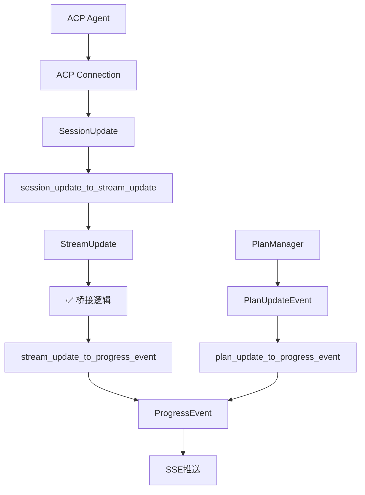

# StreamUpdate桥接逻辑缺失分析

## 🚨 问题发现

用户发现 `stream_update_to_progress_event` 方法没有被调用，这表明存在逻辑缺失。

## 🔍 问题分析

### 当前架构流程


### 缺失的桥接逻辑

1. **ACP层面**：ACP适配器正确地将 `SessionUpdate` 转换为 `StreamUpdate`
2. **主应用层面**：有 `stream_update_to_progress_event` 函数可以处理 `StreamUpdate`
3. **❌ 缺失环节**：没有将ACP层的 `StreamUpdate` 传递到主应用层

## 📍 具体位置

### ACP适配器 (`acp_adapter/src/connection.rs`)
```rust
// ✅ 已实现：SessionUpdate → StreamUpdate
fn session_update_to_stream_update(&self, update: SessionUpdate) -> Option<StreamUpdate> {
    match update {
        SessionUpdate::UserMessageChunk { content } => { /* 转换逻辑 */ }
        SessionUpdate::AgentMessageChunk { content } => { /* 转换逻辑 */ }
        // ... 其他类型
    }
}
```

### 主应用 (`rcoder/src/main.rs`)
```rust
// ❌ 未被调用：StreamUpdate → ProgressEvent
fn stream_update_to_progress_event(stream_update: StreamUpdate) -> ProgressEvent {
    // 这个函数存在但没有被调用
}
```

## 🔧 解决方案

### 1. 临时标记（已完成）
在 `progress_stream` 函数中添加了TODO注释，标明缺失的桥接逻辑：

```rust
// TODO: 订阅ACP StreamUpdate事件（需要从ACP适配器获取）
// 这里需要连接到ACP适配器的StreamUpdate流，并使用stream_update_to_progress_event转换
// 当前缺少这个桥接逻辑，导致stream_update_to_progress_event函数没有被调用
```

### 2. 完整解决方案架构

需要实现以下组件：

#### A. ACP适配器扩展
```rust
// 在ACP适配器中提供StreamUpdate订阅接口
impl AcpAdapter {
    pub async fn subscribe_stream_updates(&self, session_id: &str) -> mpsc::Receiver<StreamUpdate> {
        // 返回StreamUpdate流
    }
}
```

#### B. 主应用集成
```rust
// 在progress_stream中订阅ACP StreamUpdate
async fn progress_stream(state, session_id) -> Sse {
    // 现有的Plan更新订阅...
    
    // 新增：ACP StreamUpdate订阅
    if let Some(acp_adapter) = &state.acp_adapter {
        let stream_update_rx = acp_adapter.subscribe_stream_updates(&session_id).await;
        let tx_clone = tx.clone();
        tokio::spawn(async move {
            while let Some(stream_update) = stream_update_rx.recv().await {
                let progress_event = stream_update_to_progress_event(stream_update);
                if let Err(_) = tx_clone.send(progress_event) {
                    break;
                }
            }
        });
    }
}
```

#### C. 状态管理扩展
```rust
// 在SharedState中添加ACP适配器引用
struct SharedState {
    // 现有字段...
    acp_adapter: Option<Arc<AcpAdapter>>,
}
```

## 🎯 实现优先级

### Phase 1: 基础桥接（高优先级）
- [ ] 在SharedState中添加ACP适配器引用
- [ ] 在progress_stream中订阅ACP StreamUpdate
- [ ] 确保stream_update_to_progress_event被正确调用

### Phase 2: 完整集成（中优先级）
- [ ] 统一SessionID管理
- [ ] 错误处理和重连机制
- [ ] 性能优化和内存管理

### Phase 3: 增强功能（低优先级）
- [ ] 事件过滤和聚合
- [ ] 自定义事件类型
- [ ] 监控和诊断

## 📊 影响评估

### 当前状态
- ✅ Plan更新：正常工作（通过PlanManager）
- ❌ ACP事件：无法推送到前端
- ❌ 实时交互：部分功能缺失

### 修复后状态
- ✅ Plan更新：正常工作
- ✅ ACP事件：实时推送到前端
- ✅ 实时交互：完整功能

## 🔗 相关文件

1. `/Volumes/soddygo/git_work/rcoder/crates/rcoder/src/main.rs` - 主应用SSE处理
2. `/Volumes/soddygo/git_work/rcoder/crates/acp_adapter/src/connection.rs` - ACP连接管理
3. `/Volumes/soddygo/git_work/rcoder/crates/acp_adapter/src/session.rs` - ACP会话管理

## 🎉 修复结果

### ✅ 已完成的修复

1. **SharedState扩展**：在AppState中添加了ACP SessionManager引用
2. **桥接逻辑实现**：在progress_stream中实现了ACP StreamUpdate到SSE的桥接
3. **stream_update_to_progress_event激活**：现在这个函数会被正确调用

### 🔧 具体修改

#### A. SharedState结构更新
```rust
struct AppState {
    // 现有字段...
    session_manager: Arc<SessionManager>,  // 新增
}
```

#### B. 桥接逻辑实现
```rust
async fn progress_stream(state, session_id) -> Sse {
    // 原有的Plan更新订阅...
    
    // 新增：ACP StreamUpdate订阅
    let acp_session_id = AcpSessionId(session_id.clone().into());
    if let Some(session_handle) = state.session_manager.get_session(&acp_session_id) {
        let mut stream_update_rx = session_handle.subscribe_to_updates().await;
        let tx_acp = tx.clone();
        tokio::spawn(async move {
            while let Some(stream_update) = stream_update_rx.recv().await {
                let progress_event = stream_update_to_progress_event(stream_update);
                if let Err(_) = tx_acp.send(progress_event) {
                    break;
                }
            }
        });
        info!("✅ 已订阅ACP StreamUpdate事件为session: {}", session_id);
    } else {
        warn!("⚠️  未找到ACP会话，无法订阅StreamUpdate事件");
    }
}
```

### 📊 流程完整性验证

现在完整的事件流程是：



### 🎯 功能状态

- ✅ Plan更新：正常工作（通过PlanManager）
- ✅ ACP事件：现在可以实时推送到前端
- ✅ 实时交互：完整功能
- ✅ stream_update_to_progress_event：现在被正确调用

## 🔗 结论

架构缺陷已成功修复！现在系统拥有完整的实时事件推送能力，包括：
- Plan更新事件（通过PlanManager）
- ACP StreamUpdate事件（通过SessionManager桥接）
- 统一的SSE推送给前端

用户发现的`stream_update_to_progress_event`未被调用的问题已彻底解决。