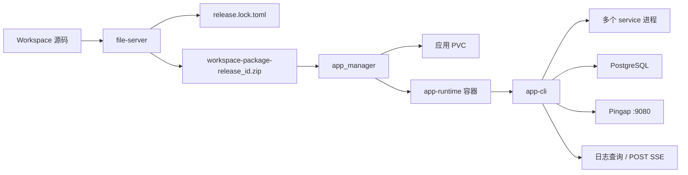

# 应用管理服务 v2 设计

> 本文描述 UserApp 当前采用的应用管理、Workspace 构建、版本化发布、容器内编排、
> Pingap 反向代理和多服务日志架构。
>
> 旧版“用户提供任意业务镜像，RCoder 直接启动单个服务”的模型已经不再是 UserApp
> 的目标架构。当前模型是：**一个 `app_id` 对应一个 workspace；一个 workspace 可以包含
> 多个不同语言的服务；整个 workspace 作为构建、发布和回滚的原子单位。**
>
> Manifest 和开发者使用说明以
> [`userapp-development-design.md`](./userapp-development-design.md) 及
> [`userapp-workspace/`](./userapp-workspace/) 为准。本文重点说明平台侧组件边界、运行时、
> 发布事务和仍需完成的工作。

---

## 1. 业务目标与边界

### 1.1 业务目标

用户在强制的 workspace 目录中开发一个网页应用。一个 workspace 可以包含：

- Next.js 单体前后端；
- React/Vue 前端加 Go、Java、Python、Rust 或 Node 后端；
- 多个后端服务；
- 不对外提供 HTTP 的 worker；
- workspace 内共享的 PostgreSQL 数据库；
- managed、extend 或 custom 模式的 Pingap 配置。

平台需要提供完整链路：

1. 发现并严格校验 workspace 和子项目 Manifest；
2. 分别构建各语言项目；
3. 生成不可变 `release.lock.toml`；
4. 组装完整 workspace 版本包；
5. 下载、校验、保存、激活和回滚版本包；
6. 在一个 UserApp 容器内启动多个服务；
7. 通过 Pingap 对外暴露网页应用；
8. 聚合查询多个服务、多个日志源的文件日志；
9. 保留最近若干成功版本，并支持显式回滚；
10. 删除计算资源时默认保护应用数据。

### 1.2 核心领域模型

| 概念 | 定义 |
|---|---|
| `app_id` | 平台应用稳定 ID，对应一个 workspace 和一套持久存储 |
| workspace | 用户源码和多个一级子项目的集合 |
| service | workspace 内一个可独立构建、启动和产生日志的子项目 |
| `service_id` | service 的稳定身份；不依赖目录名，workspace 内唯一 |
| release | 某次完整 workspace 构建的不可变版本 |
| app-runtime | 平台维护的统一 UserApp 运行时镜像 |
| app-cli | app-runtime 内的多服务进程、健康、Pingap 和日志编排器 |

以下不再成立：

- 一个 `app_id` 只对应一个业务进程；
- 用户通过应用管理接口自由指定每个业务服务的容器镜像；
- 每个语言或服务单独创建一个 Pod；
- 日志只来自容器 stdout/stderr；
- 发布只上传并覆盖 `/app/code`，没有版本记录；
- RCoder 内置 Pingora 是 UserApp 内部前后端路由的权威配置。

### 1.3 组件权威边界



- **Java 业务服务**：保存应用业务元数据、部署策略、租户关系和发布流程状态。
- **file-server**：解析 Manifest v1、执行构建、生成 release lock 和完整版本包。
- **app_manager**：管理计算资源、应用 PVC、版本包、激活、确认、回滚和清理。
- **app-cli**：只读取 release lock，编排当前 release 的服务、健康检查、Pingap 和日志。
- **Pingap**：UserApp 容器统一应用入口，固定监听 `0.0.0.0:9080`，同时支持公网和内网访问。
- **PostgreSQL/pgweb**：由 app-runtime 提供；数据库数据位于应用持久卷。

Java 仍是业务 desired state 的权威。workspace TOML 是 workspace 拓扑、服务和 Pingap
配置的唯一权威。`release.lock.toml` 是某个 release 的不可变运行时权威。

---

## 2. 关键架构决策

### 2.1 Workspace 是发布原子

一个 `app_id` 下可以有多个 service，但不支持单独发布或回滚其中一个 service。

原因：

- 前后端路由和服务依赖需要一致；
- 数据库迁移需要与整套代码协调；
- Pingap 有效配置依赖全部 service 的端口和路由；
- 单服务回滚容易产生跨版本协议不兼容。

因此构建、发布、激活、确认、回滚和版本保留全部以 workspace 为单位。

### 2.2 不引入 UserApp CRD

当前继续使用命令式、无状态的应用资源管理：

- K8s 后端直接管理 Deployment、Service、ConfigMap、Secret 和 PVC；
- Docker 后端直接管理 container、network 和 bind mount；
- 资源使用稳定 label 标识；
- RCoder 重启后从运行时现场重建 observed state；
- Java 持久化业务 desired state。

暂不引入 CRD/controller，避免形成第二份 desired state，也保持 Docker/K8s 后端语义一致。
只有将来需要持续对账、复杂蓝绿/金丝雀、集群内持久 App status 时才重新评估。

### 2.3 运行时镜像是平台策略

UserApp 发布包只包含 workspace 代码、Manifest 和 release lock，不包含运行时镜像选择。

- `workspace.manifest.toml` 不保存镜像、CPU/内存、Secret、PVC 大小或版本保留数；
- Java 创建计算资源时使用平台当前允许的 app-runtime 镜像；
- release lock 的 Manifest v1 兼容字段 `runtime_image_digest` 记录与 Chart 版本绑定的完整
  app-runtime 镜像引用；不解析 registry manifest digest；
- app-cli 启动时复核实际运行时身份与 release lock；
- 用户代码发布不通过 `POST /apps/{id}/update` 更换业务镜像。

现有 `CreateAppRequest.image/command/ports` 是通用计算资源接口遗留能力。UserApp 调用链应把
这些字段视为平台内部参数，不能直接暴露给普通开发者自由选择。后续宜新增专用
`CreateUserAppRuntimeRequest` 或在服务层强制平台镜像白名单。

### 2.4 HTTP 只使用 GET 和 POST

部署链路仅使用 GET/POST：

- 读取使用 GET；
- 写操作使用 POST，动词放在 path；
- 复杂查询使用 POST body，避免 URL 编码和长度限制；
- SSE 日志也使用 POST，以便携带多 service/source selector 和大 cursor。

---

## 3. Manifest v1 与构建契约

### 3.1 自动发现

workspace 根必须包含 `workspace.manifest.toml`。只有一级子目录中存在正式
`project.manifest.toml` 的项目才参与构建。

`project.manifest.draft.toml` 仅用于已有项目导入确认，不参与构建。

### 3.2 稳定身份与严格校验

- `schema_version = 1` 必填；
- 未知字段、未知 enum 和旧格式直接失败；
- `service_id` 必填、DNS-1123 合规、workspace 内唯一；
- `build.command`、`run.command` 和 `run.migrate` 使用 argv；
- 空 argv、依赖缺失、依赖环、重复路由、多个 `/` catch-all 立即失败；
- worker 不允许声明代理路由；
- 保留运行时环境变量不允许由项目覆盖；
- glob 和路径不允许绝对路径、`..` 或符号链接逃逸。

不兼容旧的 `[[projects]]`、`build.cmd`、目录排序端口、`start.sh` 和无版本 Manifest。

### 3.3 Release lock

file-server 构建成功后生成 `release.lock.toml`，至少锁定：

- release ID；
- workspace 名称；
- service 稳定身份、目录和依赖顺序；
- enabled 状态和确定性内部端口；
- run/migrate/health/proxy/logs/env；
- Pingap mode、精确版本和 commit；
- 最低 app-cli 版本；
- 平台版本化 app-runtime 镜像引用。

app-cli 运行时只读 release lock，不重新扫描源 Manifest，也不重新推导端口和依赖顺序。

### 3.4 构建产物

```text
workspace-package-<release_id>.zip
├── workspace.manifest.toml
├── release.lock.toml
├── pingap/                         # extend/custom 时存在
└── <service directories>/
```

file-server 接口：

```text
POST /api/v1/userapp/build
POST /api/v1/userapp/projects/detect
POST /api/v1/userapp/projects/confirm
GET  /api/v1/userapp/static/{app_id}/{path}
```

构建响应包含 `release_id`、`schema_version`、文件名、SHA-256 和字节数。

detect 只读取常见项目描述文件，不执行项目脚本；确认前不能生成正式 Manifest。

---

## 4. 应用存储与目录

### 4.1 容器内固定目录

```text
/app/
├── code/                           # 当前激活 release
├── data/                           # PG 和用户持久数据
├── logs/<service_id>/              # 每个 service 独立日志目录
└── releases/
    ├── index.json
    ├── packages/<release_id>.zip
    ├── .incoming/
    ├── .staging/
    ├── .rollback/
    └── .operation.lock
```

长期只保存版本 zip，不保存 15 份解压目录。

### 4.2 K8s 持久化

每个 app 使用独立 CephFS PVC/subvolume，整卷挂载到 `/app`，不使用 `subPath`。

RCoder 需要跨应用执行上传、版本管理和存储操作时，通过 CephFS 根聚合挂载，根据
per-app PVC 对应 PV 的 `subvolumePath` 定位应用根目录。

上线前必须验证：

- cephfs-root 静态 PV 与集群 `clusterID/fsName/secret/rootPath` 一致；
- per-app PV 暴露 `subvolumePath` 或兼容的 `rootPath`；
- rcoder Pod 能挂载聚合根；
- per-app PVC 能正确创建、扩容、清空和销毁。

### 4.3 数据删除语义

当前接口语义：

- `purge=false`：删除计算资源，保留整个应用 PVC 内容；
- `purge=true`：删除计算资源并清空 PVC 内容，但保留 PVC/subvolume；
- `storage/clear`：应用已停止并删除后，清空内容但保留 PVC；
- `storage/destroy`：显式销毁 PVC/subvolume，需要 `confirm == app_id`。

`purge=true` 不是物理销毁存储。释放 Ceph 配额必须调用 `storage/destroy`。

---

## 5. 版本化发布

### 5.1 API

```text
POST /api/v1/userapp/{app_id}/releases/prepare
POST /api/v1/userapp/{app_id}/releases/{release_id}/activate
POST /api/v1/userapp/{app_id}/releases/{release_id}/confirm
GET  /api/v1/userapp/{app_id}/releases
POST /api/v1/userapp/{app_id}/releases/{release_id}/delete
```

### 5.2 状态

| 状态 | 含义 |
|---|---|
| `Prepared` | 版本包已下载、校验并持久保存 |
| `PendingStart` | `/app/code` 已切换，等待平台确认 readiness |
| `Active` | 已确认健康，是当前权威版本 |
| `Failed` | 激活或 readiness 确认失败 |

### 5.3 Prepare

prepare 的步骤：

1. 校验 `app_id/release_id/sha256/retention`；
2. 获取 PVC 上的 `.operation.lock`；
3. 下载到 `.incoming/<release_id>.zip.part`；
4. 校验大小、SHA-256 和 zip；
5. 校验根目录存在 `release.lock.toml`，且 lock 中 release ID 匹配；
6. 原子移动到 `packages/<release_id>.zip`；
7. 更新 `index.json`。

相同 release ID、摘要和大小重复 prepare 是幂等成功；ID 相同但摘要或大小不同返回冲突。

### 5.4 Activate 与回滚

activate 可以指定任意已保留 release，因此激活旧 release 就是回滚。

当前实现是短暂停机整组切换：

1. 解压到 `.staging/<release_id>`；
2. 校验 workspace manifest 和 release lock；
3. 若计算资源存在，先 stop workspace；
4. 将原 `/app/code` 原子移动到 `.rollback/code`；
5. 将 staging 原子移动为 `/app/code`；
6. 重新 start workspace；
7. 进入 `PendingStart`。

如果代码目录替换或 start 失败，恢复旧 code 并尽力重启旧版本。

### 5.5 Confirm

平台轮询 app-cli `/health` 和应用运行时 readiness：

- 健康：`confirm { healthy: true }`，release 变为 `Active`；
- 不健康或超时：`confirm { healthy: false, message }`，恢复旧 code，标记失败。

相同结果的 confirm 可安全重试：已经 Active 的 release 再次确认健康、已经 Failed 的
release 再次确认不健康，均返回当前 release，不重复执行切换或回滚。

注意：当前 `ActivateReleaseRequest.readinessTimeoutSeconds` 已存在于模型，但 handler 尚未使用；
120 秒 readiness 由 app-cli 和外部发布编排共同完成。后续应把超时所有权统一到一个组件，
避免 Java、app_manager 和 app-cli 各自维护不同计时器。

### 5.6 保留策略

- 默认保留最近 15 个成功/可用版本；
- 单应用可配置范围 2–平台最大值；
- 平台默认最大值 100；
- 当前 active 始终保护；
- 成功 confirm 后才清理；
- 失败包和临时目录不计入成功版本；
- 删除 active 或 pending release 直接失败。

环境变量：

```text
RCODER_APP_RELEASE_RETENTION_DEFAULT=15
RCODER_APP_RELEASE_RETENTION_MAX=100
```

数据库只回滚代码，不自动执行 down migration。模板迁移必须幂等，数据库变更遵守
expand/contract。

---

## 6. app-cli 运行时编排

### 6.1 启动顺序

app-cli 当前启动流程：

1. 读取并严格解析 `/app/code/release.lock.toml`；
2. 校验最低 app-cli 版本；
3. 校验 Pingap 版本/commit 和版本化 runtime image reference；
4. 等待 PostgreSQL ready；
5. 按 release lock 的拓扑顺序执行每个 service 的 migrate；
6. 启动 enabled service；
7. 编译并验证 Pingap 配置；
8. 启动 `pingap --autoreload`；
9. 等待所有声明 proxy 的 web service readiness；
10. 将 app-cli `/health` 切换为 ready。

任意 migration、service 启动、Pingap 校验或必需 readiness 失败，workspace 不进入 ready。

### 6.2 进程与环境变量

每个 service：

- 工作目录为 `/app/code/<locked service dir>`；
- `PORT` 使用 release lock 的确定性端口；
- `HOSTNAME=0.0.0.0`；
- `APP_LOG_DIR=/app/logs/<service_id>`；
- `APP_SERVICE_ID=<service_id>`；
- 使用独立进程组启动。

停止时先向所有进程组发送 SIGTERM，等待 workspace 最大
`shutdown_timeout_seconds`，超时后 SIGKILL。

当前任一 service 或 Pingap 退出会触发整组退出，由容器级 supervisor 重启整个 app-cli
和 workspace。这符合 workspace 原子原则，但还不是“单 service 独立重启”。

### 6.3 管理端口

app-cli 管理 API 默认监听 `0.0.0.0:3010`，不内置鉴权，不限制来源 IP、内网域名、
公网域名或 HTTP 访问。平台生成的 managed Pingap 配置默认不为该端口创建应用路由；
是否经外层网络或自定义代理暴露由私有化部署方决定。

```text
GET  /health
GET  /openapi.json
POST /v1/logs/sources/query
POST /v1/logs/query
POST /v1/logs/stream
POST /v1/proxy/validate
POST /v1/proxy/reload
GET  /v1/proxy/status
GET  /v1/proxy/effective-config
GET  /v1/proxy/upstreams
```

---

## 7. Pingap 反向代理

### 7.1 权威边界

UserApp 内前端、后端和多服务路由由 app-cli 管理的 Pingap 负责。RCoder 自身的 Pingora
代理仍可用于通用容器端口代理，但不应再作为 workspace 内部拓扑的配置权威。

外层 K8s Service/Gateway 只需把应用流量转到 app-runtime 的 `9080`。

### 7.2 三种模式

#### managed

app-cli 根据 release lock 中每个 web service 的 `[proxy]` 生成 server、location 和 upstream。

#### extend

平台仍管理拓扑。用户配置只允许增加 `plugins` 和 `storages`，项目 Manifest 通过
`plugins` 和 `upstream_includes` 引用。名称冲突直接失败，不做字段级覆盖。

#### custom

用户提供完整原生 Pingap 单文件或多文件配置。workspace service 使用逻辑地址：

```toml
[upstreams.backend]
addrs = ["rcoder://backend-go"]
```

app-cli 将其解析为 `127.0.0.1:<locked_port>`。不存在、disabled 或非法 service 引用失败。

### 7.3 编译与护栏

app-cli：

1. 加载 managed/extend/custom；
2. 检查冲突和模式边界；
3. 解析 `rcoder://service_id`；
4. 调用 `PingapConfig::validate()`；
5. 执行 `pingap -t`；
6. 写入 `/run/app-cli/pingap/<release_id>/pingap.toml`；
7. 文件权限设为 `0600`；
8. 原子替换后由 Pingap autoreload 生效。

护栏：

- 必须存在且只能存在平台统一入口 `0.0.0.0:9080`，不限制客户端来源 IP；
- 其它 listener 只能监听 loopback；
- `9080` 使用 HTTP，不强制用户具备 HTTPS 或公网域名；需要 TLS 时由外层平台终止；
- Admin 关闭；
- 配置最多 2 MiB；
- 每类 server/location/upstream/plugin/certificate/storage 最多 256；
- 文件路径限制在 `/app/code`、`/app/data`、`/app/logs` 和 `/run/app-cli`；
- 禁止代理已知云元数据和 link-local 地址；
- Pingap binary 和 `pingap-config` 必须来自相同精确版本/commit。

`GET /v1/proxy/effective-config` 会返回完整有效 TOML，必须只授予平台或开发者权限，且调用方
不得把内容写入普通业务日志。

---

## 8. 多服务文件日志

### 8.1 日志来源

正式应用日志由各语言模板使用成熟日志框架写入：

```text
/app/logs/<service_id>/
```

每个 source 的 glob 在 `project.manifest.toml` 声明，并在 release lock 中锁定。查询接口只接受
`service_id/source_ids`，不接受客户端提供文件路径或 glob。

app-cli 同时捕获 service stdout/stderr 到：

```text
runtime.out.log
runtime.err.log
```

当前 stdout/stderr 捕获采用 10 MiB 单文件、3 个备份。业务模板声明的 application/access
日志仍由应用自己的日志框架负责轮转；app-cli 不替业务日志执行轮转。

### 8.2 外部与内部 API

外部：

```text
POST /api/v1/userapp/{app_id}/logs/sources/query
POST /api/v1/userapp/{app_id}/logs/query
POST /api/v1/userapp/{app_id}/logs/stream
```

内部：

```text
POST /v1/logs/sources/query
POST /v1/logs/query
POST /v1/logs/stream
```

stream 返回 `Content-Type: text/event-stream`。浏览器使用 `fetch + ReadableStream`，不使用
原生 EventSource。

### 8.3 查询语义

```json
{
  "selectors": [
    {
      "service_id": "backend-go",
      "source_ids": ["application", "access"]
    }
  ],
  "levels": ["WARN", "ERROR"],
  "keyword": "timeout",
  "since": "2026-07-29T10:00:00+08:00",
  "until": "2026-07-29T12:00:00+08:00",
  "tail": 100,
  "cursor": null
}
```

- selectors 为空：全部 enabled service 的全部声明 source；
- service 有值、source_ids 为空：该 service 的全部 source；
- tail 按 source 计算；
- cursor 优先于 tail；
- selector 非法时整个请求返回 400；
- 合法 source 的文件缺失或读取失败不阻断其它 source；
- 快照按时间排序，同时间按 service/source/file/offset 稳定排序。

### 8.4 SSE 事件与 cursor

事件：

- `log`
- `source_error`
- `source_recovered`
- `cursor_reset`
- `checkpoint`
- `heartbeat`

cursor 是 opaque 值，包含 boot ID 和各 source 的文件身份/offset。客户端断线后，把最近
checkpoint 放入下一次 POST body，不使用 `Last-Event-ID`。

app-cli 重启后 boot ID 改变，旧 cursor 必须失效。快照响应返回 `cursorReset=true`，SSE
显式发送 `cursor_reset`，随后从新的 cursor 继续。客户端仍应按
service/source/file/offset 对断线窗口内的日志做幂等去重。

限制：

- 最多 64 个 service selector；
- 最多 128 个 source；
- tail 每 source 最大 10,000；
- keyword 最大 256 字节；
- cursor 最大 64 KiB；
- 每 source 最多匹配 128 个文件；
- 单行最大 1 MiB；
- heartbeat 15 秒。

---

## 9. 应用管理 API

### 9.1 计算资源生命周期

```text
POST /api/v1/userapp
POST /api/v1/userapp/query
GET  /api/v1/userapp/runtime
GET  /api/v1/userapp/{app_id}
POST /api/v1/userapp/{app_id}/update
POST /api/v1/userapp/{app_id}/delete
POST /api/v1/userapp/{app_id}/start
POST /api/v1/userapp/{app_id}/stop
POST /api/v1/userapp/{app_id}/restart
POST /api/v1/userapp/{app_id}/recycle-policy
```

RCoder 不持久化 name/image/env 等业务元数据。后续 GET 返回 observed
`AppRuntimeInfo`；Java 使用自己的 desired state 与 observed state 合并。

K8s update 使用 `resourceVersion` 乐观锁和 SSA；Docker 模式当前为 last-write-wins。

对于 UserApp：

- create 负责创建 app-runtime 计算资源；
- start/stop/restart 操作整个 workspace 容器；
- update 只用于平台运行时镜像、资源或基础设施配置变更；
- recycle-policy 动态修改闲置回收策略（免费↔付费 tier 变更），见 [§9.5](#95-闲置自动回收与流量唤醒)；
- 用户代码升级和回滚必须使用 release API。

### 9.2 查询与诊断

```text
GET /api/v1/userapp/{app_id}/health
GET /api/v1/userapp/{app_id}/stats
GET /api/v1/userapp/{app_id}/events
```

`GET /apps/runtime` 是 RCoder/Java 重启后的运行时对账入口。

### 9.3 文件和存储

```text
POST /api/v1/userapp/{app_id}/upload
POST /api/v1/userapp/{app_id}/upload-from-url
GET  /api/v1/userapp/{app_id}/files
POST /api/v1/userapp/{app_id}/files/delete

GET  /api/v1/userapp/{app_id}/storage
POST /api/v1/userapp/{app_id}/storage/clear
POST /api/v1/userapp/{app_id}/storage/destroy
POST /api/v1/userapp/storage/query
```

文件路径一律是 app 根相对路径。禁止绝对路径、`..` 和符号链接逃逸。

常规发布不得再通过 upload 覆盖 `/app/code`；release API 是代码版本的唯一发布入口。
upload 只保留给开发、导入和显式文件管理场景。

### 9.4 数据库

```text
POST /api/v1/userapp/{app_id}/db/reset-password
POST /api/v1/userapp/{app_id}/db/create-database
```

接口通过容器 exec 调用本地 psql，只适用于带 PostgreSQL 的 app-runtime。普通数据操作由
pgweb 或业务迁移完成。

### 9.5 闲置自动回收与流量唤醒

#### 业务场景

UserApp 长期运行占用 K8s 算力，但很多 app（demo、低频内部工具、预览站）长时间无人访问。
平台需要：

1. **自动回收**：闲置超过阈值的 app → scale replicas → 0（回收算力，**不删任何资源**：
   Deployment/Service/NodePort/PVC/pingora 路由全保留）。
2. **流量唤醒**：stopped app 收到 HTTP 请求 → 自动 scale → 1，等 Ready 后代理。
3. **免费/付费分层**：默认所有 app 可回收（免费）；付费 app 可经注解 opt-out 永不回收。

#### 架构

```
客户端 ──HTTP──► Pingora (NodePort)
                   request_filter:
                     ① touch(app_id)           [更新 last_accessed,5s 节流]
                     ② if stopped → ensure_running
                          hold-and-wait ≤60s → Ready → 代理
                          超时 → 503 + Retry-After:15
                   upstream_peer → app_backends[(app_id,port)] → Service → Pod

回收扫描器(后台 interval 1h):
  list_deployments → decide_recycle → recycle_app(scale0, wakeable)

AppActivityRegistry (in-memory, rcoder 单实例):
  last_accessed / stopped / wake_blocked / waking / recycling
```

三个组件共享 `AppActivityRegistry`（内存态）：
- **访问追踪**：Pingora `request_filter` 对 `/proxy/userapp/prod/{user_id}/{id}/...` 路由调 `touch(app_id)`，
  5s 节流写入 `last_accessed`。
- **回收扫描器**：后台 `tokio::time::interval` 循环，枚举 Running app，比对 `last_accessed`
  与阈值，命中 → `recycle_app(scale0)` + `mark_recycled`。判定逻辑抽纯函数 `decide_recycle`
  便于单测覆盖全部分支。
- **流量唤醒**：Pingora `request_filter` 检测 `is_stopped(app_id)` → `ensure_running`
  （scale→1 + 轮询 Ready），并发请求经 `tokio::sync::watch` 合流为一次 scale-up。

#### 配置

全局配置（`UserAppRecycleConfig`，env / config.yml / helm values）：

| 参数 | 默认值 | env | 说明 |
|---|---|---|---|
| `enabled` | `true` | `RCODER_USERAPP_RECYCLE_ENABLED` | 总开关（免费用户默认回收） |
| `idle_timeout_seconds` | `432000`(5天) | `RCODER_USERAPP_IDLE_TIMEOUT_SECONDS` | 闲置超此值触发回收 |
| `scan_interval_seconds` | `3600`(1h) | `RCODER_USERAPP_SCAN_INTERVAL_SECONDS` | 扫描间隔 |
| `wake_timeout_seconds` | `60` | `RCODER_USERAPP_WAKE_TIMEOUT_SECONDS` | 唤醒 hold-and-wait 上限 |
| `protection_seconds` | `300`(5min) | `RCODER_USERAPP_PROTECTION_SECONDS` | 新建 app 最小保护期 |

per-app 覆盖（Deployment 注解，由 `CreateAppRequest`/`UpdateAppRequest`/`recycle-policy` 设置）：

| 注解 | 含义 |
|---|---|
| `rcoder.io/recycle-enabled` | `true`/absent = 可回收（免费默认）；`false` = 永不回收（付费） |
| `rcoder.io/idle-timeout-seconds` | per-app 覆盖全局闲置阈值 |
| `rcoder.io/wake-on-traffic` | `true`=闲置回收，可由流量唤醒；`false`=用户主动停止/发布切换，不得自动唤醒 |

#### 动态回收策略端点

```text
POST /api/v1/userapp/{app_id}/recycle-policy
```

```json
{
  "recycle_enabled": false,
  "idle_timeout_seconds": 86400
}
```

- 两字段皆 `Option`，`None` = 不改该键；至少一个 `Some`（皆 None → 400 `ERR_VALIDATION`）。
- K8s：strategic-merge `metadata.annotations`（**不碰 pod template → 不触发 rollout**），下个
  扫描 tick 生效。
- Docker：内存态 `DashMap` 存储（dev 模式，重启丢失，与 `pingora_ports` 同架构）。
- 供计费侧免费↔付费 tier 变更使用（比 `update` 轻：不需 image、不走全量 SSA）。

#### 行为矩阵

| 场景 | 回收 | 唤醒 | 客户端 |
|---|---|---|---|
| Running + 频繁访问 | 不回收 | 不触发 | 正常 200 |
| Running + 闲置 > 阈值 | scale→0 | — | — |
| Stopped + 来请求 | — | scale→1 → Ready → 代理 | hold-and-wait 后 200（≤60s） |
| Stopped + 来请求 + 60s 未 Ready | — | 超时 | 503 + Retry-After:15（app 后台继续起） |
| Stopped + 并发多请求 | — | 合流一次 scale-up | 共享唤醒结果 |
| 注解 recycle-enabled=false | 跳过 | — | 常驻 Running |
| Gateway 模式 | 不适用（无访问信号） | 不适用 | 已知限制 |

#### 语义边界

- 回收 = scale-to-zero，**不删 PVC**（数据零风险；销毁存储仍只走 `storage/destroy`）。
- stopped app 改 recycle 策略 → **不会自动拉起**；只影响"要不要回收"，不影响"要不要常驻"。
- wake-on-traffic 与 recycle 策略**独立**：因闲置回收而停止的 app 来流量总唤醒；用户主动
  stop 或发布切换产生的 scale0 不允许流量唤醒。
- rcoder 单实例：in-memory `AppActivityRegistry` 一致；多副本需上 DB/注解（v2）。
- rcoder 重启：`rebuild_stopped_apps` 从 K8s 重建内存态；`replicas==0` 时结合
  `rcoder.io/wake-on-traffic` 恢复为可唤醒或手动停止，Running app 种
  `last_accessed=now`（给完整 grace 周期）。
- **Gateway 模式不支持**：HTTPRoute 绕过 rcoder，pingora 无法记录访问 / 触发唤醒。

---

## 10. 并发、幂等与失败恢复

### 10.1 发布锁

release 操作使用 PVC 上的文件锁 `.operation.lock`，保证同一 app 的跨进程互斥。

- 不允许同时存在两个 pending release；
- prepare 使用 `.part` 文件和原子 rename；
- index 使用临时文件和原子 rename；
- active/pending release 禁止手工删除；
- 不依赖仅存在于 RCoder 内存中的锁作为唯一保护。

### 10.2 失败恢复

| 失败点 | 行为 |
|---|---|
| 下载/摘要/大小失败 | 删除 `.incoming` 临时文件，不写成功 release |
| zip/lock 校验失败 | 拒绝 prepare 或 activate |
| staging 解压失败 | 删除 staging，保留当前 code |
| code 切换失败 | 尝试恢复 rollback code |
| 新版本 start 失败 | 恢复旧 code 并重启旧版本 |
| readiness confirm 失败 | 回滚旧 code，新 release 标记 Failed |
| Pingap 校验失败 | app-cli not-ready，workspace 不对外服务 |
| 单日志源失败 | 返回 `source_error`，其它 source 继续 |

### 10.3 数据库迁移

migrate 在 service 启动前执行。任意 migration 失败会使整组启动失败。

必须遵守：

- 可重复执行；
- 新旧代码短时间都能兼容同一 schema；
- 先 expand，再发布代码，最后 contract；
- 代码回滚不执行自动 down migration。

---

## 11. 安全和平台护栏

- Manifest 和 release lock 使用 `deny_unknown_fields`；
- 运行命令使用 argv，不隐式拼接 shell；
- Secret 不进入 workspace Manifest；
- workspace TOML 中的明文会进入源码和最近保留的 release 包；
- app-cli 不主动打印完整 Pingap TOML；
- app-cli 管理端口、PG 和 pgweb 不通过用户自定义 Pingap 应用路由暴露；
- 发布包、上传文件和 Agent 下载 URL 允许 HTTP、内网 IP、localhost、集群域名及公网域名；
- release URL、摘要、大小和 ID全部校验；
- 日志查询不能读取未在 release lock 声明的路径；
- storage destroy 必须二次确认；
- Rust 生产代码不使用 `unwrap()`、`expect()` 或 `unsafe`；
- HTTP 接口使用 utoipa 维护 OpenAPI。

仍需加强：

- effective-config 的权限和脱敏审计；
- release 包最大大小、解压后总大小和文件数上限统一；
- custom Pingap 保留云元数据/link-local 精确地址保护，但不限制普通内网 IP、HTTP 或内网域名；
- release 包签名或平台侧可信来源校验。

---

## 12. 当前实现状态

### 12.1 已落地

- Manifest v1 严格解析、自动发现、拓扑校验和确定性端口；
- `workspace-manifest` 已拆分为 types/discovery/validation/release_lock/error；
- file-server workspace 构建、版本包和已有项目 detect/confirm；
- app_manager prepare/activate/confirm/list/delete release；
- PVC 版本目录、摘要校验、文件锁、原子切换、回滚和保留清理；
- app-cli release lock 单一运行时输入；
- 多 service migrate/start、进程组优雅关闭和整组 supervision；
- Pingap managed/extend/custom 编译、`rcoder://` 解析、护栏和 `pingap -t`；
- app-cli proxy 管理 API；
- 多 service/source 文件日志快照和 POST SSE；
- cursor、source_error/recovered、checkpoint 和 heartbeat；
- 外部 app_manager 日志接口转发到 app-cli；
- per-app PVC、存储 clear/destroy 及数据库管理接口；
- 闲置自动回收 + 流量唤醒（scale-to-zero + wake-on-traffic + `POST /apps/{id}/recycle-policy`）；
- per-app 回收策略注解（`rcoder.io/recycle-enabled` / `idle-timeout-seconds`）+ Docker 内存态支持；
- AppActivityRegistry 内存态（last_accessed/stopped/waking）+ `tokio::sync::watch` 并发去重 + `ensure_running` 拆分分发。

### 12.2 尚需补齐或验证

1. **真实 K8s E2E**：验证 cephfs-root、per-app PVC、app-runtime、PG、pgweb、app-cli、
   Pingap 9080、日志和回滚完整链路。
2. **发布编排归属**：统一 activate 后 120 秒 readiness 和 confirm 的责任组件。
3. **激活前深度校验**：app_manager 当前只做 release 文件存在和 ID 基础校验；完整
   release lock、Pingap 和运行时兼容验证主要发生在 app-cli。
4. **首次发布事务**：明确 `prepare → activate → create_app → readiness → confirm` 的失败补偿，
   并由 Java 保存可恢复状态。
5. **UserApp 专用 create 契约**：避免普通用户控制 app-runtime image/command/系统端口。
6. **Pingap reload 确认**（已完成）：app-cli 启动 pingap 时经 env 注入 loopback admin（随机凭证，
   仅作只读确认通道，TOML 仍是唯一配置权威）；compile 时本地计算期望 config_hash
   （pingap-config 同算法 CRC32）；reload/启动后经 `GET /api/basic` 轮询比对 config_hash
   确认生效，超时/不匹配自动回切 `pingap.toml.prev` 并 best-effort 二次确认。
   实现位置：app-cli `proxy/admin_probe.rs`、`proxy/compiler.rs`、`supervisor.rs`、`api/proxy.rs`。
7. **ProcessSupervisor 拆分**：当前 supervisor 仍较集中，后续按
   ProcessSupervisor/HealthManager/ProxyController/LogService/RuntimeStatusService 分离。
8. **日志轮转一致性**：语言模板补齐 JSONL、100 MiB、按天和 14 天保留；明确
   `runtime.*.log` 是否自动注册为默认 source。
9. **disabled service 语义**：supervisor 启动/migrate 和 managed Pingap 生成必须统一跳过
   `enabled=false`；当前部分路径仍会处理 disabled service。
10. **cursor reset 事件**（已完成）：boot ID 变化时已显式发送 `cursor_reset` 事件。实现位置：app-cli `log/service.rs` boot_id 每次启动重新生成、`decode_cursor` 检测旧 boot_id 返回 `cursor_reset`、`api/mod.rs` SSE 显式 yield `cursor_reset` 事件（含 query 出错兜底）。
11. **日志取消传播**：确认外部客户端取消后 reqwest 和 app-cli SSE tail 任务立即结束。
12. **导入准确性**：补齐各语言检测矩阵和误判保护。
13. **运行时升级预检**：新 app-runtime/Pingap 上线前批量验证 active extend/custom 配置。
14. **版本包供应链**：增加包大小/文件数限制、签名和可信下载来源策略。

---

## 13. 测试与验收

### 13.1 单元和集成测试

- Manifest：schema、未知字段、重复 ID、disabled、依赖环、路由冲突；
- Build：多语言产物、release lock、端口稳定性、损坏产物、超时；
- Release：幂等、冲突、并发、首次发布、升级、旧版本回滚、失败恢复、第 16 版清理；
- Pingap：三模式、service URI、冲突、插件、路径和 listener 护栏；
- Logs：多 service/source、轮转、copytruncate、JSONL、文本、POST SSE 和 cursor；
- Storage：保留、clear、destroy、确认值和运行中拒绝；
- Import：draft 不参与构建、确认、误判保护。

### 13.2 K8s E2E

至少覆盖：

- Next.js 单体；
- React + Go；
- Vue + Java；
- 多后端和 worker；
- PostgreSQL migration；
- managed/extend/custom Pingap；
- prepare/activate/confirm；
- readiness 失败自动回滚；
- 多 service 日志和 SSE 重连；
- 保留 15 版及旧版本回滚；
- 删除计算面后数据保留；
- PVC 销毁和配额释放；
- 节点无缓存时拉取 app-runtime；
- 节点已预拉取时快速启动。

---

## 14. 非目标与演进

当前阶段不做：

- 单 workspace 内蓝绿双版本同时运行；
- 单 service 独立发布和回滚；
- 自动数据库 down migration；
- 用户在运行时安装任意 Pingap binary；
- Pingap Admin 持久修改；
- 不经过 workspace 的任意项目直接发布；
- CRD/controller 持续对账。

闲置回收的已知限制：

- **Gateway 模式不支持**：HTTPRoute → Envoy 绕过 rcoder，pingora 无法记录访问 / 触发唤醒；
  当前 Pingora 模式（默认）全支持。切 Gateway 需 Envoy 级钩子（v2）。
- **rcoder 单实例**：in-memory `AppActivityRegistry` 不支持多副本；多副本需上 DB/注解（v2）。
- **Docker 模式**：回收策略用内存态，rcoder 重启丢失（dev 模式可接受）。

后续演进顺序：

1. 完成真实容器与 K8s E2E；
2. 稳定 UserApp 专用部署契约；
3. 完成日志模板和取消传播；
4. 增加运行时升级预检与 release 供应链安全；
5. 再评估零停机整组切换；
6. 只有持续对账需求明确后才评估 CRD。

---

## 15. 相关文档

- [`userapp-development-design.md`](./userapp-development-design.md)
- [`userapp-auto-recycle-design.md`](./userapp-auto-recycle-design.md)
- [`userapp-workspace/01-quick-start.md`](./userapp-workspace/01-quick-start.md)
- [`userapp-workspace/02-manifest-reference.md`](./userapp-workspace/02-manifest-reference.md)
- [`userapp-workspace/03-pingap.md`](./userapp-workspace/03-pingap.md)
- [`userapp-workspace/04-logs.md`](./userapp-workspace/04-logs.md)
- [`userapp-workspace/05-releases.md`](./userapp-workspace/05-releases.md)
- [`userapp-workspace/06-import-troubleshooting.md`](./userapp-workspace/06-import-troubleshooting.md)
