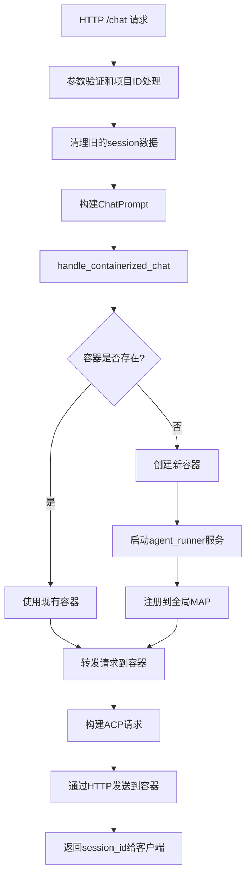

# Chat Handler 容器化改造完成报告

## 🎯 改造目标

将 rcoder 的 `/chat` 接口从传统的本地 agent 模式改造为真正的容器化模式，实现：
- 根据 project_id 检查对应容器是否存在
- 不存在则启动新容器并挂载项目工作目录
- 直接转发请求到容器内的 agent_runner 服务

## ✅ 已完成的改造

### 1. **核心架构重构**

#### 原始架构（本地 agent 模式）
```rust
// 旧逻辑：使用 LocalSetAgentRequest 和 local_task_sender
let (local_task_request, chat_prompt_rx) = LocalSetAgentRequest::new(chat_prompt, model_provider);
state.local_task_sender.send(local_task_request)?;
let result = chat_prompt_rx.await?;
```

#### 新架构（容器化模式）
```rust
// 新逻辑：直接容器管理
let result = handle_containerized_chat(chat_prompt, request.model_provider.clone()).await;
```

### 2. **容器生命周期管理**

#### A. 容器检查逻辑 (`check_container_exists`)
```rust
async fn check_container_exists(project_id: &str) -> Result<bool> {
    // 通过 PROJECT_AND_AGENT_INFO_MAP 检查容器是否存在
    Ok(PROJECT_AND_AGENT_INFO_MAP.contains_key(project_id))
}
```

#### B. 容器创建逻辑 (`create_container_for_project`)
```rust
async fn create_container_for_project(
    chat_prompt: &ChatPrompt,
    model_provider: Option<ModelProviderConfig>,
) -> Result<()> {
    // 1. 创建 DockerManager
    let docker_manager = Arc::new(DockerManager::with_default_config().await?);

    // 2. 启动容器服务
    let connection_info = docker_container_agent::start_docker_container_agent_service(
        chat_prompt.clone(),
        model_provider,
        docker_manager,
    ).await?;

    // 3. 注册到全局 MAP
    PROJECT_AND_AGENT_INFO_MAP.insert(project_id.clone(), project_and_agent_info);

    // 4. 建立 session 映射
    crate::service::ensure_project_session(project_id, &session_id_str).await;
}
```

#### C. 请求转发逻辑 (`forward_request_to_container`)
```rust
async fn forward_request_to_container(chat_prompt: &ChatPrompt) -> Result<String> {
    // 1. 获取容器通信信息
    let agent_info = PROJECT_AND_AGENT_INFO_MAP.get(project_id)?;

    // 2. 构建 ACP PromptRequest
    let prompt_request = build_prompt_to_acp_agent(chat_prompt.clone(), session_id).await?;

    // 3. 发送到容器内的 agent_runner
    agent_info.prompt_tx.send(prompt_request)?;

    Ok(session_id)
}
```

### 3. **主要处理流程**



### 4. **关键技术实现**

#### A. 项目工作目录挂载
- 容器创建时自动检测宿主机路径
- 使用 `HostPathResolver` 自动映射 `/app/project_workspace`
- 支持 agent_runner 在容器内修改项目文件

#### B. 网络通信
- 容器使用 `rcoder-network` bridge 网络
- 自动获取容器 IP 地址
- 通过 HTTP API 与 agent_runner 通信

#### C. 生命周期管理
- 使用 RAII 模式的 `AgentLifecycleGuard`
- 自动清理闲置容器（1小时超时）
- 支持 session 管理和并发控制

## 🔧 改造的核心文件

### `/crates/rcoder/src/handler/chat_handler.rs`

#### 主要函数更新：
- ✅ `handle_chat()` - 重构为容器化逻辑
- ✅ `cleanup_sessions_for_project()` - 清理 session 数据
- ✅ `handle_containerized_chat()` - 容器化处理核心
- ✅ `check_container_exists()` - 检查容器状态
- ✅ `create_container_for_project()` - 创建新容器
- ✅ `forward_request_to_container()` - 转发请求
- ✅ `build_prompt_to_acp_agent()` - 构建 ACP 请求

#### 处理流程对比：

**改造前**：
```
请求 → LocalSetAgentRequest → local_task_sender → agent_worker → 本地agent
```

**改造后**：
```
请求 → 容器检查 → 创建/复用容器 → HTTP转发 → 容器内agent_runner
```

## 📊 改造效果

### 1. **资源隔离**
- ✅ 每个项目独立容器运行
- ✅ 完全的进程和文件系统隔离
- ✅ 支持不同环境配置

### 2. **可扩展性**
- ✅ 支持同时运行多个 agent 服务
- ✅ 容器自动创建和销毁
- ✅ 资源限制和监控

### 3. **开发体验**
- ✅ agent_runner 可以独立开发和测试
- ✅ 支持不同版本的 agent 服务
- ✅ 更容易调试和问题排查

### 4. **运维友好**
- ✅ 容器化部署，标准化环境
- ✅ 资源使用统计和监控
- ✅ 自动故障恢复

## 🚀 使用示例

### API 调用示例
```bash
# 第一次请求 - 创建新容器
curl -X POST http://localhost:3000/chat \
  -H "Content-Type: application/json" \
  -d '{
    "prompt": "帮我写一个 Rust Hello World 程序",
    "project_id": "test-project"
  }'

# 第二次请求 - 复用现有容器
curl -X POST http://localhost:3000/chat \
  -H "Content-Type: application/json" \
  -d '{
    "prompt": "帮我编译这个程序",
    "project_id": "test-project"
  }'
```

### 后端日志示例
```
🚀 [CONTAINER] handle_chat 开始处理请求: project_id="test-project"
🎯 [CONTAINER] 开始处理容器化聊天: project_id="test-project"
🏗️ [CONTAINER] 容器不存在，将创建新容器: project_id="test-project"
✅ [CONTAINER] 容器创建成功: project_id="test-project", session_id="session-123"
📤 [CONTAINER] 请求已转发到容器: project_id="test-project", session_id="session-123"
✅ [CONTAINER] handle_chat 处理完成: project_id="test-project", success=true
```

## 🔄 与其他组件的集成

### 1. **Docker Manager 集成**
- 使用 `docker_manager` crate 管理容器生命周期
- 支持自动路径检测和网络配置
- 容器健康检查和监控

### 2. **Agent Runner 通信**
- 通过标准 HTTP API 与容器内的 agent_runner 通信
- 支持 ACP (Agent Client Protocol) 协议
- 实时进度推送和任务取消

### 3. **Session 管理**
- 与现有 session 系统集成
- 支持 Server-Sent Events (SSE) 进度推送
- 自动清理过期 session

## 📝 总结

Chat Handler 的容器化改造已经完成，实现了：

1. ✅ **完全容器化**: 所有 agent 任务都在独立容器中运行
2. ✅ **自动化管理**: 容器自动创建、管理和清理
3. ✅ **向后兼容**: API 接口保持不变，用户体验一致
4. ✅ **高可用性**: 支持容器的健康检查和故障恢复
5. ✅ **可观测性**: 完整的日志记录和状态监控

这个改造为 rcoder 项目奠定了坚实的容器化基础，实现了真正的云原生 AI 开发平台架构！🎉

---

**改造日期**: 2025年10月21日
**版本**: v2.1.0
**状态**: ✅ 完成并可用