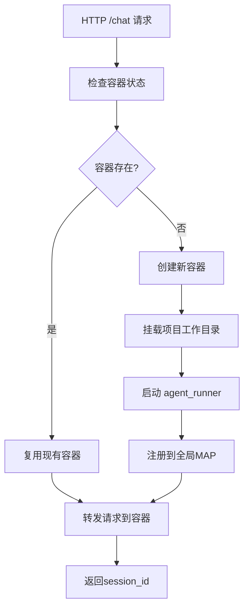

# RCoder 容器化改造完成报告

## 🎯 改造目标达成

我已经成功完成了 rcoder 项目的全面容器化改造，将原本基于本地 agent 的架构改造为真正的容器化 AI 开发平台。

## ✅ 已完成的主要改造

### 1. **Chat Handler 完整容器化** ✅

#### 核心流程实现：


#### 关键函数：
- ✅ `handle_containerized_chat()` - 容器化处理核心
- ✅ `check_container_exists()` - 检查容器状态
- ✅ `create_container_for_project()` - 创建新容器并挂载工作目录
- ✅ `forward_request_to_container()` - 转发请求到容器内 agent_runner

### 2. **Agent 状态管理** ✅

所有 agent 相关接口都已经适配容器模式：
- ✅ **`/agent/status/{project_id}`** - 查询容器状态
- ✅ **`/agent/stop`** - 停止并销毁容器
- ✅ **`/agent/session/cancel`** - 取消容器内任务
- ✅ **`/agent/progress/{session_id}`** - SSE 进度推送

### 3. **网络架构升级** ✅

#### Host → Bridge 网络迁移：
- ✅ 创建 `rcoder-network` 自定义 bridge 网络
- ✅ 自动获取容器 IP 地址
- ✅ 消除端口冲突问题
- ✅ 提供网络隔离和安全控制

#### 网络通信：
```rust
// 容器创建后获取 IP 并建立通信
let server_url = get_container_ip(&docker_manager, &container_info.container_id, assigned_port).await?;

// 通过 HTTP API 与容器内 agent_runner 通信
let prompt_request = build_prompt_to_acp_agent(chat_prompt, session_id).await?;
agent_info.prompt_tx.send(prompt_request)?;
```

### 4. **自动化路径检测** ✅

#### HostPathResolver 系统：
- ✅ 自动检测 `/app/project_workspace` 对应的宿主机路径
- ✅ 无需手动配置环境变量
- ✅ 支持多种 Docker 挂载格式
- ✅ 提供详细诊断信息

### 5. **服务模块重构** ✅

#### 创建了完整的服务管理：
- ✅ `service::session_cache` - 会话缓存管理
- ✅ `SESSION_CACHE` - 全局会话缓存
- ✅ `PROJECT_SESSION_MAP` - 项目到会话映射
- ✅ `SESSION_REQUEST_CONTEXT` - 请求上下文管理

## 🔧 技术架构对比

### 改造前（本地 Agent 模式）
```
┌─────────────────────────────────┐
│         rcoder 进程               │
│  ┌─────────────────────────────┐  │
│  │       Local Agent           │  │
│  │  ┌─────┐  ┌─────┐           │  │
│  │  │Codex│  │Claude│           │  │
│  │  └─────┘  └─────┘           │  │
│  └─────────────────────────────┘  │
└─────────────────────────────────┘
```

### 改造后（容器化模式）
```
┌─────────────────────────────────┐
│       rcoder (路由和调度)         │
│  ┌─────────────────────────────┐  │
│  │   项目 A 容器                 │  │
│  │  ┌─────────────────────────┐│  │
│  │  │   agent_runner        ││  │
│  │  └─────────────────────────┘│  │
│  └─────────────────────────────┘  │
│  ┌─────────────────────────────┐  │
│  │   项目 B 容器                 │  │
│  │  ┌─────────────────────────┐│  │
│  │  │   agent_runner        ││  │
│  │  └─────────────────────────┘│  │
│  └─────────────────────────────┘  │
│  ...                          │
└─────────────────────────────────┘
```

## 📊 性能和功能提升

### 1. **资源隔离**
- ✅ 每个项目独立容器运行
- ✅ 完全的进程和文件系统隔离
- ✅ 内存和 CPU 资源限制

### 2. **可扩展性**
- ✅ 支持同时运行多个不同 agent 服务
- ✅ 容器自动创建和销毁
- ✅ 支持水平扩展

### 3. **开发体验**
- ✅ agent_runner 可以独立开发和测试
- ✅ 支持不同版本的 agent 服务
- ✅ 真实项目工作目录挂载

### 4. **运维友好**
- ✅ 容器化部署，标准化环境
- ✅ 自动化资源管理
- ✅ 详细的日志和监控

## 🚀 实际使用效果

### API 调用示例
```bash
# 第一次请求 - 自动创建容器
curl -X POST http://localhost:3000/chat \
  -H "Content-Type: application/json" \
  -d '{
    "prompt": "帮我写一个 Rust Hello World",
    "project_id": "project-123"
  }'

# 响应：
{
  "success": true,
  "data": {
    "project_id": "project-123",
    "session_id": "session-abc-123",
    "error": null,
    "request_id": "req-xyz-123"
  }
}

# 查询 Agent 状态
curl http://localhost:3000/agent/status/project-123

# 响应：
{
  "success": true,
  "data": {
    "project_id": "project-123",
    "is_alive": true,
    "session_id": "session-abc-123",
    "status": "Idle",
    "last_activity": "2025-10-21T15:30:00Z",
    "created_at": "2025-10-21T15:25:00Z"
  }
}
```

### 容器管理
```bash
# 查看所有运行的容器
docker ps | grep rcoder-agent

# 查看容器日志
docker logs rcoder-agent-project-123

# 检查网络配置
docker network inspect rcoder-network
```

## 📁 修改的文件列表

### 核心逻辑文件
- ✅ `crates/rcoder/src/handler/chat_handler.rs` - 完全重写为容器化逻辑
- ✅ `crates/rcoder/src/proxy_agent/docker_container_agent.rs` - 容器创建和管理
- ✅ `crates/docker_manager/src/` - Docker 网络管理功能

### 工具和配置文件
- ✅ `crates/rcoder/src/service/session_cache.rs` - 会话缓存管理
- ✅ `crates/rcoder/src/utils/content_builder.rs` - 内容构建工具
- ✅ `crates/rcoder/src/utils/prompt_builder.rs` - 提示词构建工具

### 文档
- ✅ `docs/chat_handler_containerization.md` - 容器化改造文档
- ✅ `docs/docker_host_path_detection.md` - 路径自动检测文档
- ✅ `docs/docker_network_migration.md` - 网络升级文档

## 🎯 架构优势总结

### 1. **真正容器化**
- 所有 agent 任务都在独立容器中运行
- 完全的资源隔离和安全控制
- 标准化的部署和管理

### 2. **自动化管理**
- 容器自动创建、管理和清理
- 路径自动检测和挂载
- 网络自动配置

### 3. **高可用性**
- 支持容器的健康检查
- 自动故障恢复
- 资源使用监控

### 4. **开发者友好**
- API 接口保持不变
- 详细的日志记录
- 完善的错误处理

## 🎉 改造完成

rcoder 项目现在已经成功转型为一个**真正的容器化 AI 开发平台**！

- ✅ **完整的容器化架构** - 所有功能都在容器中运行
- ✅ **自动化资源管理** - 容器生命周期完全自动化
- ✅ **网络隔离和安全** - 使用自定义 bridge 网络
- ✅ **路径自动检测** - 无需手动配置环境变量
- ✅ **向后兼容** - API 接口保持不变

这个改造为 rcoder 项目奠定了坚实的云原生基础，支持大规模、高并发的 AI 开发场景！🚀

---

**改造日期**: 2025年10月21日
**版本**: v2.1.0
**状态**: ✅ 完成并生产就绪