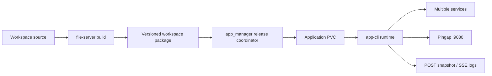

# UserApp Workspace 开发与发布设计（Manifest v1）

本目录是 UserApp 当前实现的设计入口。旧版 `[[projects]]`、`build.cmd`、`start.sh`、
目录排序端口、GET/WS 日志协议均已废弃，不兼容迁移。

一个 `app_id` 对应一个 workspace。一级子目录中存在正式
`project.manifest.toml` 的项目会被自动发现，整个 workspace 是构建、发布和回滚的原子单位。

## 文档导航

- [快速开始与目录约定](userapp-workspace/01-quick-start.md)
- [Manifest v1 字段和校验](userapp-workspace/02-manifest-reference.md)
- [Pingap managed / extend / custom](userapp-workspace/03-pingap.md)
- [多服务文件日志与 POST SSE](userapp-workspace/04-logs.md)
- [版本包、发布、保留和回滚](userapp-workspace/05-releases.md)
- [导入已有项目与排错](userapp-workspace/06-import-troubleshooting.md)

## 组件边界

- file-server：严格解析 Manifest v1，构建服务产物，生成 `release.lock.toml` 和版本包。
- app_manager：下载、校验、保存、激活、确认、回滚和清理版本。
- app-cli：只读 release lock，启动服务、编译 Pingap、读取应用文件日志并提供内部 API。
- Pingap：统一应用入口 `0.0.0.0:9080`，允许公网或内网访问，不强制 HTTPS/公网域名；workspace TOML 是唯一配置权威。

## 当前发布语义

首阶段允许短暂停机：停止 workspace，完整校验 staging，原子替换 `/app/code`，再启动并确认。
数据库只回滚代码；迁移必须幂等，并遵守 expand/contract。
