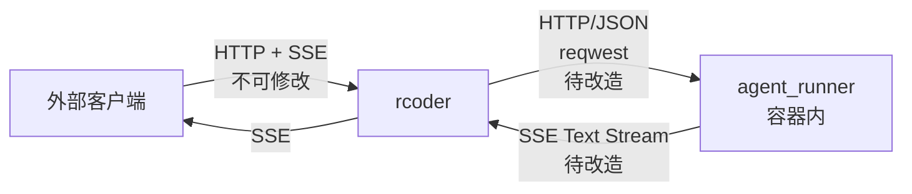
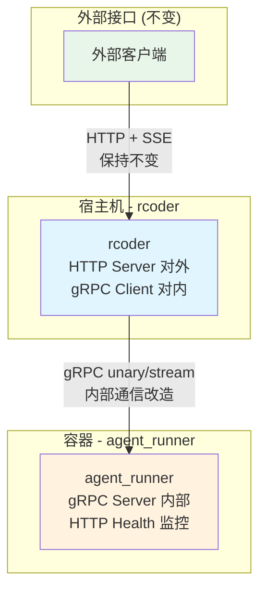

# rcoder ↔ agent_runner gRPC 通信改造技术方案

## 1. 背景与动机

### 1.1 当前架构



### 1.2 当前架构的核心问题

> [!WARNING]
> **核心矛盾**：`rcoder` 本质上只是做**纯转发**，但却需要完整的 HTTP + JSON 序列化/反序列化流程。

**问题详解**：

1. ~~**参数重复定义**~~ ✅ **已解决**
   - `agent_runner/src/model.rs` 现在完全从 `shared_types` 重新导出所有类型
   - 新增 `CancelNotificationRequestWrapper` 和 `CancelResult` 统一取消操作
   - 两端共享同一套类型定义，不再需要手工同步

2. **无意义的序列化开销** ⚠️ 待解决
   ```
   Client JSON → rcoder 反序列化 → 再序列化 JSON → agent_runner 反序列化
   ```
   rcoder 收到 JSON 后反序列化为 Rust 结构体，然后又序列化回 JSON 发给 agent_runner，这是**完全冗余的**。

3. **SSE 文本解析脆弱** ⚠️ 待解决
   - agent_runner 生成 SSE 事件（`data: {...}\n\n`）
   - rcoder 接收后需要手工解析 `event:`、`data:` 等文本标记
   - 再重新构造 SSE 事件发给 Client
   - 这种文本层面的"拆解-重组"极易出错

4. **类型约束缺失** ⚠️ 待解决
   - 两个模块通过 HTTP/JSON 通信，接口兼容性依赖运行时检查
   - 一方改了字段名或类型，另一方可能静默失败

**根本原因**：内部模块通信使用了设计给"外部调用"的 HTTP + JSON 协议，不适合紧密耦合的模块间通信场景。

> [!NOTE]
> **进展**：类型共享已通过 `shared_types` 模块实现，gRPC 改造将进一步解决序列化开销和 SSE 解析问题。

### 1.3 改造边界

> [!IMPORTANT]
> **关键约束**：`rcoder` 对外提供的 HTTP/SSE 接口**不可修改**，本次改造仅涉及 `rcoder ↔ agent_runner` 之间的**内部通信**。

| 接口 | 改造范围 | 说明 |
|------|----------|------|
| **rcoder → Client** | ❌ 不改动 | 对外 HTTP API，保持兼容 |
| **rcoder ↔ agent_runner** | ✅ 改造目标 | 内部模块通信：HTTP → gRPC |

### 1.3 当前通信方式问题

| 问题 | 描述 |
|------|------|
| **弱类型约束** | `reqwest` 发送 JSON，手工解析 `HttpResult<ChatResponse>`，类型安全依赖运行时检查 |
| **SSE 解析脆弱** | `agent_session_notification.rs` 手工解析 SSE 文本流，需处理 `event:`、`data:` 标记 |
| **性能开销** | JSON 序列化/反序列化、文本解析带来额外 CPU 开销 |
| **双端重复代码** | `ChatRequest`/`ChatResponse` 在 `rcoder` 和 `agent_runner` 分别定义 |

### 1.4 改造目标

1. **强类型契约**：使用 Protobuf 定义的 `AgentService` 确保内部接口一致性
2. **高效二进制传输**：Protobuf 编码比 JSON 更紧凑、解码更快
3. **Server Streaming 替代 SSE**：gRPC 原生流式支持，无需解析文本格式
4. **代码共享**：`shared_types` 提供统一的 gRPC client/server 代码

---

## 2. 可行性分析

### 2.1 现有基础设施 ✅

| 组件 | 状态 | 说明 |
|------|------|------|
| **tonic 0.14** | ✅ 已添加 | `shared_types/Cargo.toml` 已有依赖 |
| **Proto 定义** | ⚠️ 需扩展 | `proto/agent.proto` 定义了 `AgentService`，Attachment 需完善 |
| **生成代码** | ✅ 已生成 | `shared_types/src/grpc/agent.rs` 包含 Client/Server |

### 2.2 Proto 服务定义 (现有)

```protobuf
service AgentService {
  rpc Chat (ChatRequest) returns (ChatResponse);
  rpc SubscribeProgress (ProgressRequest) returns (stream ProgressEvent);
  rpc CancelSession (CancelRequest) returns (CancelResponse);
  rpc GetStatus (GetStatusRequest) returns (GetStatusResponse);
}
```

完全覆盖当前内部 HTTP 接口：

| agent_runner HTTP 接口 | gRPC 方法 | 类型 |
|------------------------|-----------|------|
| `POST /chat` | `Chat` | Unary |
| `GET /agent/progress/{session_id}` | `SubscribeProgress` | Server Streaming |
| `POST /agent/session/cancel` | `CancelSession` | Unary |
| `GET /agent/status/{project_id}` | `GetStatus` | Unary |

### 2.3 改造收益预估

| 方面 | HTTP/JSON | gRPC/Protobuf | 提升 |
|------|-----------|---------------|------|
| **编码性能** | ~5μs/msg | ~0.5μs/msg | ~10x |
| **消息体积** | ~1KB | ~400B | ~2.5x |
| **类型安全** | 运行时 | 编译时 | 显著 |
| **流式处理** | 手工解析 SSE | 原生 streaming | 简化 |

---

## 3. 架构设计

### 3.1 目标架构



### 3.2 端口规划

| 服务 | 端口 | 用途 | 改动 |
|------|------|------|------|
| **rcoder HTTP** | 3000 | 对外 HTTP API（Axum） | ❌ 不变 |
| **agent_runner gRPC** | 50051 | 容器内 gRPC 服务（Tonic） | ✅ 新增 |
| **agent_runner HTTP** | 8086 | 健康检查 `/health`（保留） | ⚠️ 移除业务接口 |

### 3.3 数据流变化

**改造前**：
```
Client → HTTP POST /chat → rcoder → reqwest POST → agent_runner HTTP
Client ← SSE ← rcoder ← SSE 文本解析 ← agent_runner SSE
```

**改造后**：
```
Client → HTTP POST /chat → rcoder → gRPC Chat() → agent_runner gRPC Server
Client ← SSE ← rcoder ← gRPC SubscribeProgress() → agent_runner gRPC Server
```

---

## 4. Proto 定义扩展

### 4.1 现有 Attachment 问题

当前 Proto 定义过于简化：

```protobuf
// 现有定义 - 过于简单
message Attachment {
    string name = 1;
    string kind = 2;      // "text", "image" 等，无法区分子结构
    string content = 3;   // 所有数据塞进一个字段
    string source = 4;    // "local", "url" 等
    optional string language = 5;
}
```

Rust 结构体（`shared_types/src/model/attachment.rs`）更丰富：
- **4 种附件类型**：Text / Image / Audio / Document
- **3 种数据源**：FilePath / Base64 / Url
- **类型特有字段**：dimensions、duration、size 等

### 4.2 扩展 Proto 定义

```protobuf
// === 附件数据源 ===
message AttachmentSource {
  oneof source {
    string file_path = 1;           // 文件路径
    Base64Data base64 = 2;          // Base64 编码数据
    string url = 3;                 // URL 链接
  }
}

message Base64Data {
  string data = 1;
  string mime_type = 2;
}

message CancelRequest {
  string session_id = 1;
  string reason = 2;
}

message CancelResponse {
  bool success = 1;
  CancelResultType result = 2;  // 新增：取消结果类型
  optional string message = 3;  // 新增：错误/描述信息
}

// 新增：取消结果枚举（对应 Rust CancelResult）
enum CancelResultType {
  CANCEL_RESULT_SUCCESS = 0;
  CANCEL_RESULT_FAILED = 1;
  CANCEL_RESULT_TIMEOUT = 2;
}

// === 附件类型定义 ===
message TextAttachment {
  string id = 1;
  AttachmentSource source = 2;
  optional string filename = 3;
  optional string description = 4;
  optional string language = 5;     // 编程语言（如 "rust", "python"）
}

message ImageAttachment {
  string id = 1;
  AttachmentSource source = 2;
  string mime_type = 3;             // "image/jpeg", "image/png"
  optional string filename = 4;
  optional string description = 5;
  optional ImageDimensions dimensions = 6;
}

message ImageDimensions {
  uint32 width = 1;
  uint32 height = 2;
}

message AudioAttachment {
  string id = 1;
  AttachmentSource source = 2;
  string mime_type = 3;             // "audio/mp3", "audio/wav"
  optional string filename = 4;
  optional string description = 5;
  optional double duration = 6;     // 时长（秒）
}

message DocumentAttachment {
  string id = 1;
  AttachmentSource source = 2;
  string mime_type = 3;             // "application/pdf", "text/plain"
  optional string filename = 4;
  optional string description = 5;
  optional uint64 size = 6;         // 文件大小（字节）
}

// === 附件枚举（使用 oneof） ===
message Attachment {
  oneof attachment_type {
    TextAttachment text = 1;
    ImageAttachment image = 2;
    AudioAttachment audio = 3;
    DocumentAttachment document = 4;
  }
}
```

### 4.3 类型映射表

| Rust 类型 | Proto 消息 | 说明 |
|-----------|------------|------|
| `Attachment::Text(TextAttachment)` | `Attachment.text` | oneof 分支 |
| `Attachment::Image(ImageAttachment)` | `Attachment.image` | oneof 分支 |
| `Attachment::Audio(AudioAttachment)` | `Attachment.audio` | oneof 分支 |
| `Attachment::Document(DocumentAttachment)` | `Attachment.document` | oneof 分支 |
| `AttachmentSource::FilePath { path }` | `AttachmentSource.file_path` | oneof 分支 |
| `AttachmentSource::Base64 { data, mime_type }` | `AttachmentSource.base64` | 嵌套消息 |
| `AttachmentSource::Url { url }` | `AttachmentSource.url` | oneof 分支 |

---

## 5. 模块改造详情

### 5.1 shared_types 模块

#### 5.1.1 更新 proto/agent.proto

按 4.2 节扩展 Attachment 定义。

#### 5.1.2 重新生成代码

```bash
cd crates/shared_types
cargo build  # 触发 build.rs 重新编译 proto
```

### 5.2 agent_runner 模块 (Server 端)

#### 5.2.1 新增文件结构
```
crates/agent_runner/src/
├── grpc/                     # 新增目录
│   ├── mod.rs
│   └── agent_service_impl.rs # AgentService trait 实现
└── main.rs                   # 修改：启动 gRPC + HTTP 双服务
```

#### 5.2.2 AgentService 实现

```rust
// crates/agent_runner/src/grpc/agent_service_impl.rs
use shared_types::grpc::{
    agent_service_server::AgentService,
    ChatRequest, ChatResponse, ProgressRequest, ProgressEvent,
    CancelRequest, CancelResponse, GetStatusRequest, GetStatusResponse,
};
use tokio_stream::wrappers::ReceiverStream;

pub struct AgentServiceImpl {
    // 复用现有 handler 逻辑
    app_state: Arc<AppState>,
}

#[tonic::async_trait]
impl AgentService for AgentServiceImpl {
    async fn chat(&self, request: Request<ChatRequest>) -> Result<Response<ChatResponse>, Status> {
        // 复用现有 handler::handle_chat 核心逻辑
        // Proto 类型 -> 内部类型 -> 调用业务逻辑 -> Proto 响应
    }

    type SubscribeProgressStream = ReceiverStream<Result<ProgressEvent, Status>>;
    
    async fn subscribe_progress(
        &self,
        request: Request<ProgressRequest>,
    ) -> Result<Response<Self::SubscribeProgressStream>, Status> {
        // 从内部事件总线读取进度，转换为 ProgressEvent 流
        // 使用 tokio::sync::mpsc channel
    }

    async fn cancel_session(&self, request: Request<CancelRequest>) -> Result<Response<CancelResponse>, Status> {
        // 复用现有取消逻辑
    }

    async fn get_status(&self, request: Request<GetStatusRequest>) -> Result<Response<GetStatusResponse>, Status> {
        // 复用现有状态查询逻辑
    }
}
```

#### 5.2.3 main.rs 修改

```rust
// 双协议启动
async fn main() -> Result<()> {
    // 1. 启动 gRPC Server (业务接口)
    let grpc_addr = "[::]:50051".parse()?;
    let grpc_service = AgentServiceServer::new(AgentServiceImpl::new(state.clone()));
    
    let grpc_server = Server::builder()
        .add_service(grpc_service)
        .serve(grpc_addr);

    // 2. 启动 HTTP Server (仅保留 /health)
    let http_router = Router::new()
        .route("/health", get(health_check));
    let http_addr = "0.0.0.0:8086".parse()?;
    let http_server = axum::serve(TcpListener::bind(http_addr).await?, http_router);

    // 3. 并行运行
    info!("🚀 agent_runner 启动: gRPC=50051, HTTP Health=8086");
    tokio::select! {
        r = grpc_server => r?,
        r = http_server => r?,
    }
    Ok(())
}
```

### 5.3 rcoder 模块 (Client 端)

> [!IMPORTANT]
> rcoder 对外 HTTP 接口**完全保持不变**，仅修改与 agent_runner 通信的内部实现。

#### 5.3.1 新增文件
```
crates/rcoder/src/
├── grpc/                    # 新增目录
│   ├── mod.rs
│   ├── channel_pool.rs      # gRPC Channel 连接池
│   └── converters.rs        # HTTP ↔ gRPC 类型转换
└── handler/
    ├── chat_handler.rs      # 内部改用 gRPC client
    └── agent_session_notification.rs  # 内部调用 SubscribeProgress
```

#### 5.3.2 chat_handler.rs 改造

```rust
// 改造前 (内部使用 HTTP)
async fn forward_request_to_container_service(
    request: &ChatRequest,
    container_info: &ContainerBasicInfo,
) -> Result<HttpResult<ChatResponse>, AppError> {
    let client = reqwest::Client::new();
    let chat_url = format!("{}/chat", container_info.service_url);
    let response = client.post(&chat_url).json(request).send().await?;
    // ... 手工解析 JSON
}

// 改造后 (内部使用 gRPC)
async fn forward_request_to_container_service(
    request: &ChatRequest,
    container_info: &ContainerBasicInfo,
    channel_pool: &GrpcChannelPool,
) -> Result<HttpResult<ChatResponse>, AppError> {
    // 构建 gRPC 地址
    let grpc_addr = format!("http://{}:50051", container_info.ip_address);
    let channel = channel_pool.get_or_create_channel(&grpc_addr).await?;
    
    // 类型转换：HTTP ChatRequest -> gRPC ChatRequest
    let grpc_request = converters::http_to_grpc_chat_request(request);
    
    // gRPC 调用
    let mut client = AgentServiceClient::new(channel);
    let response = client.chat(grpc_request).await
        .map_err(|e| AppError::internal_server_error(&format!("gRPC error: {}", e)))?;
    
    // 类型转换：gRPC ChatResponse -> HTTP ChatResponse
    converters::grpc_to_http_result(response.into_inner())
}
```

#### 5.3.3 agent_session_notification.rs 改造

```rust
// 改造前 (SSE 代理解析)
async fn create_sse_proxy_stream(
    sse_url: String,
    session_id: String,
) -> impl Stream<Item = Result<Event, Infallible>> {
    // 手工解析 SSE 文本流 "event:", "data:" 等
}

// 改造后 (gRPC Streaming → SSE 转发)
async fn create_sse_from_grpc_stream(
    container_addr: String,
    session_id: String,
    channel_pool: &GrpcChannelPool,
) -> impl Stream<Item = Result<Event, Infallible>> {
    let channel = channel_pool.get_or_create_channel(&container_addr).await.unwrap();
    let mut client = AgentServiceClient::new(channel);
    
    let request = ProgressRequest { session_id };
    let grpc_stream = client.subscribe_progress(request).await.unwrap().into_inner();
    
    // 将 gRPC ProgressEvent 转换为 Axum SSE Event (对外格式不变)
    grpc_stream.map(|result| {
        match result {
            Ok(event) => Ok(converters::progress_to_sse_event(event)),
            Err(status) => Ok(Event::default().data(format!("error: {}", status))),
        }
    })
}
```

---

## 6. 类型转换层

由于 rcoder 对外 HTTP 格式不变，需要在 `rcoder` 中实现类型转换：

```rust
// crates/rcoder/src/grpc/converters.rs

/// HTTP ChatRequest -> gRPC ChatRequest
pub fn http_to_grpc_chat_request(
    http_req: &crate::handler::ChatRequest,
) -> shared_types::grpc::ChatRequest {
    shared_types::grpc::ChatRequest {
        project_id: http_req.project_id.clone().unwrap_or_default(),
        session_id: http_req.session_id.clone().unwrap_or_default(),
        prompt: http_req.prompt.clone(),
        model_config: http_req.model_provider.as_ref().map(model_provider_to_grpc),
        attachments: http_req.attachments.iter().map(attachment_to_grpc).collect(),
        request_id: http_req.request_id.clone(),
    }
}

/// Rust Attachment -> gRPC Attachment
fn attachment_to_grpc(att: &shared_types::Attachment) -> shared_types::grpc::Attachment {
    // 使用 oneof 分支匹配
    match att {
        Attachment::Text(t) => { /* 构建 TextAttachment */ },
        Attachment::Image(i) => { /* 构建 ImageAttachment */ },
        // ...
    }
}

/// gRPC ProgressEvent -> Axum SSE Event (保持对外格式不变)
pub fn progress_to_sse_event(event: shared_types::grpc::ProgressEvent) -> axum::sse::Event {
    // 优先使用 json_payload 字段保持兼容
    // 或根据 oneof event 字段构建 SSE 事件
    Event::default()
        .event("message")
        .data(event.json_payload)
}
```

---

## 7. 实施计划

### 7.1 阶段划分

| 阶段 | 内容 | 工作量 | 风险 |
|------|------|--------|------|
| **Phase 1** | Proto Attachment 扩展 | 0.5天 | 低 |
| **Phase 2** | agent_runner gRPC Server | 2天 | 中 |
| **Phase 3** | rcoder gRPC Client (内部改造) | 2天 | 中 |
| **Phase 4** | 集成测试与清理 | 1天 | 低 |

### 7.2 Phase 1: Proto Attachment 扩展

- [ ] 更新 `shared_types/proto/agent.proto`，添加完整 Attachment 定义
- [ ] 运行 `cargo build -p shared_types` 验证生成代码
- [ ] 检查生成的 Rust 类型与现有类型的兼容性

### 7.3 Phase 2: agent_runner gRPC Server

- [ ] 创建 `src/grpc/mod.rs` 和 `agent_service_impl.rs`
- [ ] 实现 `AgentService` trait 四个方法
- [ ] 修改 `main.rs` 启动 gRPC + HTTP 双服务
- [ ] 移除 agent_runner 中的业务 HTTP 接口 (`/chat`, `/agent/*`)
- [ ] 保留 `/health` 健康检查接口
- [ ] 单元测试各 RPC 方法

### 7.4 Phase 3: rcoder gRPC Client

- [ ] 创建 `src/grpc/channel_pool.rs`
- [ ] 创建 `src/grpc/converters.rs` 实现类型转换
- [ ] 在 `AppState` 中添加 `GrpcChannelPool`
- [ ] 改造 `chat_handler.rs` 内部实现（对外接口保持不变）
- [ ] 改造 `agent_session_notification.rs` 内部实现
- [ ] 移除 reqwest SSE 解析代码

### 7.5 Phase 4: 集成测试与清理

- [ ] 端到端测试完整流程（Client → rcoder HTTP → gRPC → agent_runner）
- [ ] 验证对外 HTTP API 行为完全不变
- [ ] 验证 SSE 输出格式与改造前一致
- [ ] 更新文档

---

## 8. 验证计划

### 8.1 单元测试

```bash
# agent_runner gRPC 服务测试
cargo test -p agent_runner --lib grpc

# rcoder gRPC 客户端测试
cargo test -p rcoder --lib grpc
```

### 8.2 gRPC 接口测试

```bash
# 1. 启动容器化 agent_runner
docker run -p 50051:50051 -p 8086:8086 agent-runner:latest

# 2. 使用 grpcurl 测试 Chat (直接调用 gRPC)
grpcurl -plaintext -d '{"project_id":"test","session_id":"s1","prompt":"hello"}' \
  localhost:50051 agent.AgentService/Chat

# 3. 使用 grpcurl 测试 SubscribeProgress
grpcurl -plaintext -d '{"session_id":"s1"}' \
  localhost:50051 agent.AgentService/SubscribeProgress
```

### 8.3 端到端测试（验证对外接口不变）

```bash
# 启动 rcoder
cargo run -p rcoder

# 测试聊天 - 对外 HTTP 接口不变
curl -X POST http://localhost:3000/chat \
  -H "Content-Type: application/json" \
  -d '{"prompt":"test"}'

# 测试 SSE - 对外格式不变
curl -N http://localhost:3000/agent/progress/{session_id}
```

### 8.4 回归测试

确保以下场景行为与改造前一致：

| 测试用例 | 验证点 |
|----------|--------|
| 正常聊天请求 | 返回 `HttpResult<ChatResponse>` |
| 带附件的请求 | 附件正确传递到 agent_runner |
| SSE 订阅 | 事件格式、字段与改造前一致 |
| 会话取消 | 取消成功，SSE 流关闭 |
| 健康检查 | `GET /health` 返回 200 |

---

## 9. 回滚策略

### 9.1 Feature Flag 支持

```rust
// rcoder/Cargo.toml
[features]
default = ["grpc-internal"]
grpc-internal = []
http-legacy = []
```

```rust
// chat_handler.rs
#[cfg(feature = "grpc-internal")]
async fn forward_request(...) { /* gRPC 实现 */ }

#[cfg(feature = "http-legacy")]
async fn forward_request(...) { /* HTTP 实现 */ }
```

### 9.2 回滚方案

1. Git revert 到改造前 commit
2. 或切换 feature：`cargo build --no-default-features --features http-legacy`

---

## 10. 风险与缓解

| 风险 | 影响 | 缓解措施 |
|------|------|----------|
| gRPC 连接失败 | 内部请求中断 | 增加连接重试、健康检查 |
| Proto 定义变更 | 内部不兼容 | 严格 proto 版本管理 |
| 容器网络问题 | gRPC 不通 | 保留 HTTP health check |
| 流式中断 | 进度丢失 | 客户端重连机制 |
| 类型转换错误 | 数据丢失 | 完善单元测试覆盖 |

---

## 附录 A: 文件改动清单

| 模块 | 文件 | 改动类型 | 说明 |
|------|------|----------|------|
| shared_types | `proto/agent.proto` | 修改 | 扩展 Attachment 定义 |
| agent_runner | `src/grpc/mod.rs` | 新增 | gRPC 模块入口 |
| agent_runner | `src/grpc/agent_service_impl.rs` | 新增 | AgentService 实现 |
| agent_runner | `src/main.rs` | 修改 | 双协议启动 |
| agent_runner | `src/handler/*.rs` | 删除 | 移除业务 HTTP 接口 |
| rcoder | `src/grpc/mod.rs` | 新增 | gRPC 模块入口 |
| rcoder | `src/grpc/channel_pool.rs` | 新增 | 连接池管理 |
| rcoder | `src/grpc/converters.rs` | 新增 | 类型转换 |
| rcoder | `src/handler/chat_handler.rs` | 修改 | 内部改用 gRPC |
| rcoder | `src/handler/agent_session_notification.rs` | 修改 | gRPC Streaming |
| rcoder | `src/router.rs` | 不变 | 对外路由不变 |

---

## 附录 B: 依赖版本

```toml
# shared_types/Cargo.toml
tonic = { version = "0.14.2", features = ["tls-native-roots"] }
tonic-prost = "0.14"
prost = "0.14"
prost-types = "0.14"

# build-dependencies
tonic-prost-build = "0.14"
```

---

**文档版本**: v1.2  
**创建日期**: 2025-12-05  
**更新日期**: 2025-12-06  
**变更记录**:
- v1.2 (2025-12-06): 更新类型共享现状（已通过 shared_types 实现），新增 CancelResult 类型定义
- v1.1 (2025-12-05): 明确改造边界，扩展 Attachment Proto 定义
- v1.0 (2025-12-05): 初始版本
