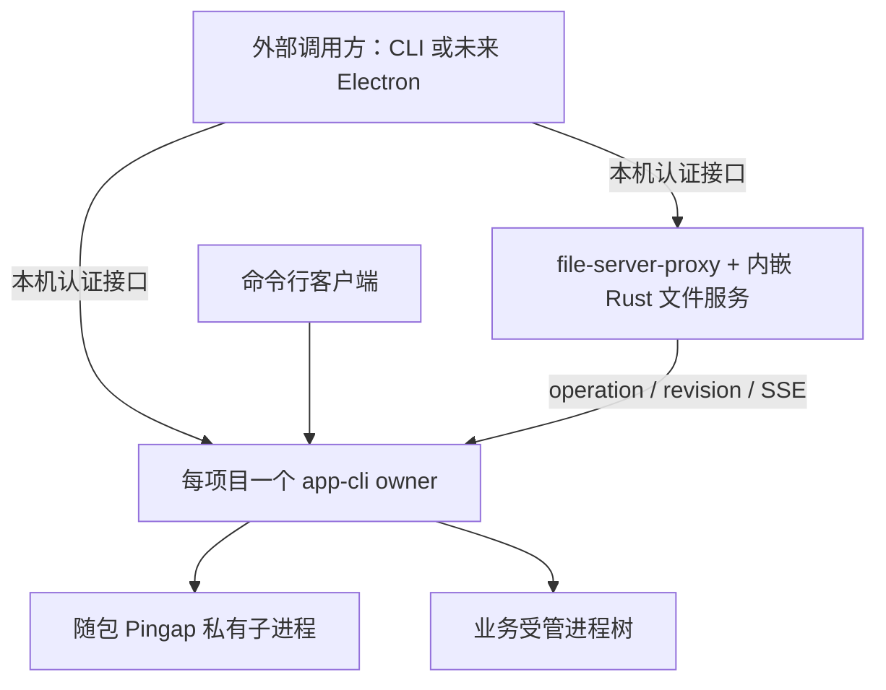

# Plan：两个原生组件的自包含与跨平台实施

## 1. 可行性与源码基线

2026-09-17，RCoder `feature-userapp` / `19dfd381`。以下是静态调用链证据，尚未做本轮三平台运行验证。行号仅用于定位，实施时重读。

已有基础值得复用：app-cli 的 runtime kernel、builtin 引擎、HTTP/SSE 和平台适配模块；file-server-proxy 的 `embed-file-server` 默认编译 feature、进程内 Router；file-server 的 `DeploymentMode::Standalone`。不需要新建一套云控制面或桌面状态机。

### 必须处理的原生缺口

| ID / 优先级 | 当前源码依据 | 具体问题及修正方向 |
|---|---|---|
| N01 / P1 | `crates/app-cli/src/supervisor.rs:92–93,438–469` | builtin 一律调用 `wait_for_pg`；没有 `pg_isready` 仍轮询约 60 秒后返回错误，与“失败不阻断”的注释不符。`APP_CLI_SKIP_PG_WAIT` 是临时开关，不能作为原生正常配置。按项目声明决定数据库前置；纯静态/前端项目不探测 PG。 |
| N02 / P1 | `crates/app-cli/src/config.rs:27–45`、`crates/app-cli/src/supervisor.rs:699–701`、`crates/app-cli/src/proxy/compiler.rs:344–363`；`crates/file-server/src/config/mod.rs:45–52,216–220` | 默认使用 `/app`、`/run`；Pingap 路径校验对所有 Unix 使用容器白名单，对 Windows 整体跳过。macOS/原生 Linux 合法目录会被误拒，Windows 又缺少对应保护。显式区分运行模式，统一解析可写布局及允许根。Standalone 枚举已存在，但不能仅设置枚举就视为目录问题解决。 |
| N03 / P1 | `crates/app-cli/src/proxy/pingap.rs:9,54`、`proxy/admin_probe.rs:23–54`；`crates/file-server-proxy/src/instance.rs:67–70,97`、`npm/bin/file-server-proxy.js:149–154` | 管理口、9080、3018、60000 与项目端口不能只改其中一项。proxy 固定绑定 `0.0.0.0`，`FILE_SERVER_HOST` 不影响这层 listener；Rust 接受端口 0 却返回原地址字符串，npm 又拒绝 0。支持原生 loopback、真实已绑定地址和完整端口计划。 |
| N04 / P1 | `npm/app-cli/bin/cli.js:44–52`、`.github/workflows/release-app-cli.yml:310–317` | 只有 Windows 包携带并注入 Pingap；Unix 平台只拷 app-cli，默认找 `/usr/local/bin/pingap`。普通 Mac/Linux 用户无法仅装包即运行完整链。所有目标都提供与配置契约匹配的 Pingap 配套产物。 |
| N05 / P1 | `crates/file-server-proxy/npm/package.json`；`npm/bin/file-server-proxy.js:91,174–185`、`npm/lib/orchestrate.js:159–169`（后三者相对此 crate） | npm 默认 `userapp_split` 并启动 TS 服务，固定依赖 nuwax-file-server；以 `process.execPath` 执行 JS 的假设不能直接搬入 Electron。原生标准模式明确 `all_rust + embed`，TS 兼容模式显式可选，先核对功能覆盖再调整分发依赖。 |
| N06 / P1 | `crates/file-server-proxy/npm/lib/daemon.js:13–47,58–102`；`npm/bin/file-server-proxy.js:157–171,326–338`；`npm/lib/orchestrate.js:119–154` | 全局 tmp 状态文件无跨进程锁，损坏按不存在，PID 存活当归属，健康失效后清理旧 PID。并发启动、PID 复用、另一个配置空间可能误复用或误杀。改为 Rust 侧实例锁、身份握手和受确认的停止，JS 只作客户端。 |
| N07 / P1 | `crates/file-server-proxy/src/proxy.rs:130–154`、`src/instance.rs:67`；`crates/file-server/src/server.rs:165–185` | 标准独立链直接向内嵌 Router 转发，所读入口及公共中间件未实施本机令牌校验，且监听全网卡。用于宿主机文件操作前，应在独立入口加入 loopback、认证及授权；无需改变已经由平台注入保护的嵌入入口。 |
| N08 / P1 | `crates/file-server/src/service/dev_server/process/mod.rs:166–179,413–440`、`process/signal.rs:65–95`；`crates/file-server-proxy/npm/lib/daemon.js:74–84`；此前 R01 | file-server 存在硬编码 `sh`、依赖 `ps` 扫描及 Windows taskkill/tasklist 路径；proxy 的 Windows kill 异常被吞后仍返回 true。真实业务的进程树、命令及退出结果需要跨平台验证，不能靠 Windows 编译通过或 helper 测试宣告完成。 |
| N09 / P2 | `crates/file-server-proxy/npm/lib/resolve.js:23–44,70–77`、`lib/index.js:29–66`、`lib/fetch.js:8–33`；`.github/workflows/release-file-server-proxy.yml:61–66,180` | 启动可临时下载并写 node_modules 缓存；下载器未消费发布 manifest 的 sha256；PowerShell/tar 命令以字符串拼接路径。解析器接受 Windows ARM64，但发布矩阵只有 Windows x64。打包时固定产物及校验，路径用安全参数处理，不支持架构早拒绝。 |
| N10 / P1 | `crates/file-server-proxy/src/main.rs:256–258`；`crates/file-server/src/service/dev_server/process/mod.rs:166–180,199` | proxy 独立入口永久 pending，当前 JS 停机注释假定它“没有子进程树”，但内嵌文件服务会产生构建/dev 子进程。补组件关停、活动任务及自有进程树处理；业务 app-cli owner 不归 proxy 的任意 kill 处理。 |

N02/N03/N06/N08 与 [R01–R09](../development-review-2026-09-17/review.md)共享根因，应合并修复，不能再做第二套所有权协议。以上是已确认缺口，不代表所有文件 API 均已做 Windows 行为审计。

## 2. 推荐架构与依赖选择

Electron 只作为未来调用方出现，以下图中客户端部分不属于本轮开发范围。

app-cli 直接使用 OS 进程、文件锁、本地持久状态与 TCP，不要求 Electron 存活；file-server-proxy 自带文件接口实现，不依赖一个单独的 Rust file-server 服务。共享库不引入外部服务。

### Pingap：首版采用随包私有进程

三平台随 app-cli 平台包携带版本锁定的 Pingap，也允许外部程序显式指定配套资源位置；由 app-cli 负责配置、启动、认证、日志与退出，用户无需安装 Pingap 服务或配置 supervisor。

这能保留现有 custom/extend 配置、代理插件和配置生效确认语义。直接改成简易 Hyper 代理会丢失这部分契约；把全部 Pingap 编进 app-cli 则需要单独验证生命周期、重载及上游平台支持，不作为本批前置。未来若确需单 exe，再独立评审，不阻塞本轮自包含分发。

配套 Pingap 必须与 app-cli 使用的配置库版本/提交匹配，三平台分别做配置配对测试。配置和 admin 数据存于本实例私有目录，不抢系统 Pingap；缺少配套文件先拒绝本次启动，不先停旧业务。

### file-server-proxy：原生标准模式只装配 Rust 上游

- 原生启动器显式选择 `--embed --policy all_rust`，不依赖默认值巧合；未编译 embed 却请求此模式必须失败，不能仅 warn 后尝试 8086。
- file-server/userapp 两套路由在同进程装配。文件服务无需 TS、Node 后台服务、PG、Redis 或 RCoder API 才能就绪。
- 列出客户端必需 API 与 TS 对照矩阵，用 Rust 实际接口验收。已有 TS 兼容策略保留为显式模式，安装/下载也按该模式需要决定；不能因“去依赖”直接删除现有功能或静默改路由。
- 业务预览通过 app-cli 返回的业务入口访问；不能把 file-server-proxy 自动当成 Vite HMR/终端 WebSocket 的透明隧道，其现有代理明确不透传 WebSocket（`proxy.rs:104–106`）。若正式客户端必须经此入口访问，补能力及对应验收后才能声明支持。

## 3. 配置、路径及实例身份

### 模式先于环境探测

统一解析出的配置包含 native/managed 模式。具体参数名在实现中集中定义并同步文档；本文件不假称现有 CLI 已支持新 flag。

- native 固定选择 builtin，不因恰好发现 supervisord socket 而切换宿主机执行引擎。
- managed 使用平台注入的 workspace、app identity、token、稳定 state root 与既有端口约定。两镜像仓库同步显式注入，保留容器行为。
- CLI、npm 启动器及其他调用程序共享模式解析规则。已有项目/owner 的模式和身份不能通过本次 flag 改写或旁路。
- 不用 `cfg(unix)`、目录名恰为 `/app` 或“某端口开放”推断部署模式。

### 统一 RuntimeLayout

建议集中解析下列概念，复用已有字段，不要求引入通用配置框架：

| 字段 | 内容 |
|---|---|
| resources_root | 安装包中只读、按组件版本组织的二进制和必要资源 |
| user_runtime_root | 当前 OS 用户稳定的产品运行状态根，独立于 Electron 某版本的安装路径 |
| project_identity / workspace_root | 已规范化且经身份核验的项目，与部署 active 目录分离 |
| state_root / credential_root | 项目 owner 的锁、记录、发现信息及受保护凭据 |
| log_root / cache_root | 可写、可保留/轮转的日志与可清理缓存 |
| file_service_scope | proxy 的本地配置空间标识、授权根集合及配置摘要 |
| tool_paths / endpoint_plan | 受支持工具的绝对路径与所有监听/业务端口计划 |

使用现有跨平台目录库取得当前用户路径，再放产品子目录；不硬编码用户名。Electron 与普通 CLI 必须解析到同一个默认 user_runtime_root，不能一方仅用私有 `app.getPath('userData')`，另一方从 workspace.parent 猜根。

项目首次登记经跨进程互斥写入本地映射，使用规范路径与可获得的文件身份校验别名；source/.run 映射来自项目记录，不能盲猜 parent。移动项目与复制项目须分开处理，无法确认时要求显式重新关联。不要仅 lower-case 全路径或以可复制的项目 ID 文件作为唯一真实性证据。

app-cli 按项目持锁；proxy 默认按产品配置空间持锁，两者锁文件不同、职责不互斥。多个 proxy 配置空间仍连接同一个项目 owner，不能让 profile 改变项目的运行锁域。首版默认配置空间即可，不需要做跨用户或远程发现服务。

原生路径白名单由已授权 workspace/state/log/cache 等根派生；同时处理盘符、UNC/网络目录支持边界、符号链接/junction、尚未创建的子路径。Windows 不能整段跳过校验，Unix 不能继续使用固定容器白名单。权限或布局解析失败返回带上下文的错误；稳定状态目录不静默降级至 tmp。

## 4. 端口与本机控制协议

1. owner/proxy 先解析身份并取得自己的跨进程锁，再 bind 并持有 listener；初始化期只开放有限诊断。业务/active 变更晚于这些步骤。
2. native 管理口与 proxy 文件入口默认 `127.0.0.1:0`，发布 listener.local_addr() 的真实结果，整个生命周期不关闭重绑。显式固定端口占用则 fail-fast；managed 默认值保持既有契约。
3. Pingap 入口/admin 及用户服务端口纳入同一实例计划。外部程序不一定支持接收预绑定 listener，不能用“探测空闲→关闭→spawn”声称已预留；优先使用组件支持的真实分配/发现能力，否则受控选择、确认 bind 结果及有界重试，失败清理自己的资源。
4. 自动分配项目端口只适用于声明支持的服务；需将最终 PORT、健康检查及代理 upstream 统一更新。命令硬编码端口的项目明确报冲突；不能只改环境变量就宣称两个相同模板能并存。
5. app-cli 与 proxy 各自具有组件身份、实例 ID、协议/能力、地址、配置或项目身份。发现 JSON 原子写入且不含 token，连接后进行带认证的身份握手。`/health` 200、PID 存活或 TCP 成功都不是身份确认。
6. 复用 app-cli 已有 operation/revision/sequence 机制；proxy 的 start/stop/status 只需小型组件控制接口，不复制完整部署状态机。响应丢失保留请求身份，查询原结果；调用超时不转成按 PID 强杀。

本机凭据按组件隔离、仅当前用户可读（Unix 权限/Windows ACL）。HTTP 客户端关闭本机控制流的系统代理与跨目标重定向。native proxy 在完整独立入口统一认证，覆盖文件、构建及 UserApp 子树；不把认证藏在只覆盖部分 Router 的层。只读健康信息最小化。

本地调用者携带凭据并使用接口已授权的目录范围；预览应用不应拿到控制 token。SSE 允许经请求头认证，不强迫调用者把长效凭据放进 URL。文件接口中的任意绝对路径、home 浏览等能力须与授权范围一致，不能只信任请求参数。本轮不实现 Electron IPC。

## 5. 进程树、退出与恢复

复用 [cross-platform.md](../userapp-runtime-ownership/cross-platform.md) 的 OS 适配和 R01 修复：Unix 进程组、Windows 创建时受管 Job、句柄及子孙收束确认。可以在低依赖公共模块复用启动/停止代码，不能让独立 app-cli 被迫依赖整个 RCoder workspace 的平台服务。

- app-cli 管 migrate、业务和 Pingap；file-server-proxy 管自己发起的构建/文件任务/既有非 UserApp dev 进程。UserApp 必须转交 app-cli。Custom Page 原有协调器的业务职责不因本方案被整体改写，但其进程适配必须核验。
- Windows `taskkill` 命令返回、直接子进程 wait 或 Job helper 的通过数量不能替代业务树退出证明。正常关停走控制协议；超时保留未确认状态，不能吞掉 taskkill 失败然后宣告成功。
- 不通过全局 ps、进程名、端口或不带实例证据的 PID 文件抢杀、接管。旧 PID 记录无法证明身份时保留诊断并拒绝破坏性恢复。
- proxy 新增真正的关停流程：关闭写受理，处理活动任务，确认自有子进程，排空有限请求/日志，再退出。已经交给 app-cli 的操作不因 proxy 退出而取消或丢失 task-operation 关联。
- 后台 app-cli 不依赖 Electron 的 stdout pipe 生存。进程脱离方式、日志句柄与启动错误回传分别实现并测试；`detached/unref` 不代替进程树管理。[Node 子进程文档](https://nodejs.org/api/child_process.html)说明了父子 stdio 和引用关系。
- 新 owner 获锁后仍先处理旧记录/未知业务。Windows Job 随 owner 关闭能收束本地进程，也不能证明已发出的数据库或网络副作用撤回；未知结果保持 RecoveryRequired。

### 组件提供的生命周期语义

| 事件 | 默认处理 |
|---|---|
| 客户端断连 | 不 Stop 应用，不改变 app-cli 的 desired 状态 |
| 用户点击停止应用 | 发送 app-cli Stop，确认运行态停止并持久化 Stopped |
| 用户要求退出后台组件 | 显式关停；确认清理后退出；不等同于修改用户 Stop 意图 |
| 客户端重连 | 支持发现并核验已有组件、恢复任务/状态观察，不重复部署 |
| 客户端或 owner 崩溃 | 重连/启动时读持久状态并恢复；不清空 journal，不无条件重跑迁移 |

客户端后续自行选择退出策略，需要停止应用时调用 Stop，需要退出组件时走关停协议。本轮不规定窗口/UI 逻辑，不增加自动系统登录启动或无限重启守护器。

## 6. 工具链、数据库与项目兼容

为每次运行计划计算所需能力，在停止旧运行实例前做可完成的前置校验：二进制存在/可执行、版本与架构、目录权限、配置可编译、项目命令、必需数据库配置。真正运行阶段可能失败，仍需要持久状态和清理确认，预检不能消除全部竞态。

- 无数据库需求时不探测 PG，控制 API/文件服务始终不依赖数据库。数据库需求来自明确配置，不依据环境碰巧存在 `PGHOST` 或用户名默认值猜测。
- PG 就绪可使用适合协议的库探测或显式可执行工具配置，不把系统 `pg_isready` 作为所有用户安装前置。超时有总预算、错误阶段及脱敏上下文。
- Node/pnpm 等工具路径可来自产品配套开发工具链或用户明确配置；基础包不依赖全局 PATH。桌面图标启动常与交互 shell 的环境不同，不能靠 source 用户 shell 配置来掩盖打包遗漏。
- Windows 执行 npm/pnpm 的 `.cmd` 或 shell 指令需专门适配、参数/转义测试；优先真实可执行文件加参数数组，不把所有命令机械改成 `sh -c`。含 Bash 依赖的项目清楚报告平台前置，不假装能自动转换。
- release/artifact 若包含原生依赖，记录并校验 OS/架构；不能把 Linux 编译的 node_modules、exe 或脚本制品直接标为 Windows 可运行。兼容元数据变更须按原有版本协议实施。
- 缺失能力返回结构化错误，例如 dependency_missing、unsupported_platform、runtime_incompatible；错误说明和 retry 判断不再次引入字符串匹配。

## 7. 原生分发与后续嵌入契约

### 原生分发

- 提供一个版本锁定的 runtime 清单：两组件版本/协议、Pingap 配对版本、OS/arch/ABI、文件路径、sha256 与源码身份。它是包内容元数据，不是新服务。
- 打包阶段解析并校验所有产物；安装后基础启动不访问 OSS/npm。缺包、哈希不符、目标平台不符均提前失败。发布 manifest 中的哈希用于校验产物完整性，其真实性来自可信发布来源/签名，不能称哈希自身提供身份认证。
- 保留 npm 作为独立 CLI 分发入口，但 Electron 不依赖 postinstall 恰好在构建机下载了正确架构。修复安全解压参数、错误架构映射和缓存布局；不同平台、ABI 与版本不能共用一个易混淆缓存文件。
- 组件目录按版本保存；Windows 旧 exe 正在运行时不原地替换。先核验旧 owner 协议、完成关停或明确等待，再启新版本；状态迁移先保护原数据，不兼容则拒绝接管。
- 清楚记录原生包的最低 OS/ABI、动态库前置及实际覆盖，不用构建矩阵替代运行测试。宿主机业务进程使用当前用户权限，不能沿用容器隔离的承诺。

### 为 Electron 保留的最小兼容约定

外部程序可直接启动原生二进制并传入实际资源路径、cwd/env，查询结构化身份/就绪、订阅事件和发起停止，无需运行 `npx` 或复制 JS 守护状态机。程序资源与可写状态必须分开；Electron 的 ASAR 只读且内部目录不能作 cwd，因此两组件不能依赖写入安装资源目录。[ASAR 限制](https://www.electronjs.org/docs/latest/tutorial/asar-archives)。

调用方自己的单实例锁不能替代两组件的 owner 锁；Electron 的锁只协调 Electron 实例，这是基于其文档作用范围的推论。[Electron app](https://www.electronjs.org/docs/latest/api/app#apprequestsingleinstancelockadditionaldata)。

不假设调用环境的 `process.execPath` 一定是普通 Node。原生标准模式不依赖该假设，JS 兼容模式显式要求有效 Node 配置；不能把 Electron 内置 Node 当作用户项目工具链。组件的启动和停止契约保持通用，不依赖 Electron 专属 API。

**本轮不开发 Electron 客户端、IPC SDK、Electron 示例工程、安装器、签名或自动更新。** 原生组件可独立实施和验收；正式客户端后续采用何种 UI/打包方案不阻塞本轮。

## 8. 实施依赖与简化原则

1. 先修 R01–R09 涉及的所有权、真实进程树、事件和关联保护，再落地可复用的 native 配置/布局；可独立的 N01/N04 反例先行。
2. 接入原生端口、凭据和 proxy 生命周期，完成无额外后台服务的两个真实二进制闭环。
3. 完成版本清单、全平台随包依赖及外部调用说明；原生默认与显式 TS 兼容模式分开验证。
4. 三平台原生测试；再按共享改动范围验证新 managed 镜像、Compose/remote-k8s，处理 B01–B05；发布单独记录。

不新增本地 Redis/PG 协调服务，不要求 Rust 与 Electron FFI，不额外引入 Actor 框架，不为了简化测试删除恢复保护。基于现有边界增加小型适配器，比重写业务状态机更容易验证。
