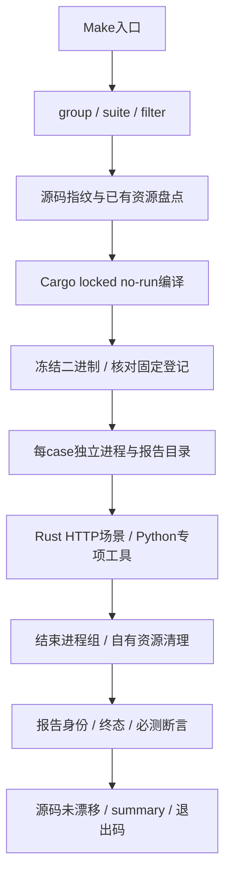

# 测试逻辑与验收流程

本文描述实现，不代表任何一轮全部测试已通过。数量基于`2578a86c`，以后以[suite_cases.json](tools/suite_cases.json)与`make test-e2e-list`为准。

## 1. 测试层级

| 层级 | 入口 | 证明什么 |
|---|---|---|
| Rust单元/组件/集成目标 | nextest、make test、独立make test-app-cli | 对应代码、状态机和测试调用链 |
| Python工具自测 | unittest tools/test_*.py | 契约、来源、身份和清理规则；部分使用受控响应 |
| 严格业务场景 | make test-e2e* → tools/run.py | 已选择场景真实行为、报告及清理 |
| 独立专项 | root-logs、app-cli recovery、CephFS、真实agent、K8s工具 | 专项声明范围，不自动等于默认全集 |

严格启动器有意用Cargo编译目标，再逐例执行libtest；不要机械改为nextest，或把直接Cargo的环境门控skip算作验收。

## 2. 严格执行链



实现见[run.py](tools/run.py)：

1. `GROUPS`及参数选择套件，生成run UUID，记录HEAD、实际源码摘要与测试前资源。
2. `cargo test -p rcoder-e2e --locked --no-run --message-format=json --test <suite>`编译；编译后复核源码未变。
3. 按SHA256冻结测试二进制，读取`--list`，与固定成员对照。
4. 每用例另生成case UUID，以`--exact --test-threads=1 --nocapture`独立进程串行执行。
5. 退出、超时或取消后先收束整个进程组，再执行创建状态感知的清理。
6. 验收报告/清理，逐例更新summary；整轮结束再查源码摘要。

HEAD是历史锚点，`worktree_sha256`是本轮实际输入。冻结快照支持`E2E_SOURCE_ROOT`、`E2E_INPUT_MANIFEST`、`E2E_ORIGIN_HEAD`，没有`.git`也能验证内容。外层case上限当前3600秒；测试进程组终止等待与产品app-cli的3秒退出宽限是不同预算。

## 3. 默认分组与显式专项

| Make入口 | 默认范围 | 注意 |
|---|---|---|
| test-e2e | userapp：12 suites / 55 cases | 基础/dev/build-rules/faults/deploy/lifecycle、存储/并发/崩溃；含8个真实agent/chat，非纯无LLM |
| test-e2e-compose | compose：7 suites / 68 cases | chat/SSE/session/webchat/preview及部分UserApp；缺faults/deploy/storage/crash |
| test-e2e-compose-deploy | deploy：2 cases | 七服务部署及dev/prod隔离，也在userapp组 |
| test-e2e-host / host-direct | Published：2；Direct：1 | 宿主机Docker可达方式 |
| test-e2e-host-k8s | 2 cases | 宿主机K8s控制与计算 |
| test-e2e-k8s RUN_LB=1 | LB：3 cases | 忽略场景显式启用；真实LLM；不是UserApp全链 |
| test-e2e-k8s-userapp | 独立K8s工具 | 非run.py默认group；目标授权、NodePort/SSH前置 |
| test-e2e-app-cli-recovery | 隔离容器故障矩阵 | 无RCoder控制面/LLM |
| test-e2e-userapp-root-logs | 目录、停服日志、强杀/重编/HTTP | 当前Linux二进制与源码收据 |
| test-e2e-app-cli-cephfs-lock | 跨节点CephFS，9必测项 | opt-in；保namespace/PVC；all另含RBD/同Pod重启，共29项 |
| userapp_project_repair.py | 原始导入/嵌套工程适配 | 真实agent/LLM；preflight不是修复成功 |

分组有重叠，不相加为唯一样本数。全部静态登记20 suites / 92 cases，不是已运行数量。真实K8s构建部署优先使用[远端配置](../tools/remote_k8s/env.example)与[Make工作流](../make/remote-k8s.mk)。

### 筛选与门控

- `E2E_SUITE=a,b`覆盖group默认清单。
- `E2E_FILTER=名称片段`是子串；选中后仍按全名`--exact`执行。
- 无filter要求完整套件；filter只缩小已登记集合；整体零匹配失败。
- 未登记case、固定case消失、断言/身份登记缺失均失败；`gate_*`辅助检查不计正式集合。
- 启动器注入run/case/report/test四项上下文与strict标志；直接cargo缺上下文在外部I/O前skip。不要手填一半变量绕过正式入口。
- env > `.env.local` > 默认。基础设施不需LLM；真实OpenAI/Anthropic场景缺模型配置会skip，严格启动器仍判失败。

## 4. 模块职责与核心场景

| 路径 | 职责 |
|---|---|
| tests/compose_userapp*.rs | 公共API及业务断言，或调用Python工具映射hard结果 |
| src/common/mod.rs | 环境、上下文及模型/目标前置 |
| src/common/sse.rs / scenario.rs | 类型化SSE消费与场景编排 |
| src/common/userapp_compute*.rs | 共享计算控制流程，物理观察由probe提供 |
| src/common/resources.rs | 容器、应用/lifecycle、换代与清理身份 |
| src/common/report.rs | JSONL实时事件、固定身份、正常/异常终态 |
| tools/*_contract.py | 真实故障/模板/存储组合或明确的组件契约 |
| tools/test_*.py | 工具自测，不代替真实部署 |

| 核心行为 | 严格case / 入口 | 底层工具 |
|---|---|---|
| 闲置回收→原卷重建→编译/HTTP→Stop/Start | userapp_dev_idle_recycle_owner_recovery / dev | idle_owner_recovery.py |
| prod冷A/热B/Restart/readiness身份 | userapp_prod_readiness_contract / faults | prod_readiness_contract.py |
| 真实pip及原卷重建缓存 | userapp_python_dependency_cache_survives_builder_recycle / build-rules | python_dependency_cache_contract.py |
| 实际CephFS锁与交接 | 显式CephFS Make入口 | app_cli_k8s_lock.py |

参数及配对构建receipt统一维护在[tools/README.md](tools/README.md)。HTTP200、任务completed、端口可连、子工具exit0均不能单独证明恢复；要匹配操作/代次/物理资源，并查实际新内容、停止结果与数据保留。

## 5. 固定契约与通过条件

| 文件 | 固定什么 |
|---|---|
| [suite_cases.json](tools/suite_cases.json) | 套件成员，防止动态发现缩减测试 |
| [report_identities.json](tools/report_identities.json) | canonical case的scenario/backend报告 |
| [contracts.py](tools/contracts.py) + [acceptance_steps.json](tools/acceptance_steps.json) | case必做成功hard断言名 |

`validate_reports`要求第一行唯一begin、末行唯一pass终态；每行run/case/test身份匹配；所有登记scenario/backend齐全；至少一个hard且全为true，终态计数与实际一致；必测步骤齐全。必做步骤按canonical case汇总，身份按每份报告核对。

libtest非零、skip/aborted、缺报告/解析失败、清理失败均红。通用启动器不直接相信Python JSON的`success:true`，Rust包装须把工具结果与清理转为hard。Reporter提前退出补aborted；SIGKILL来不及写终态则以缺报告失败。

冻结的是E2E测试二进制，不是产品镜像。prod/CephFS还要外部构建receipt验证当前源码与镜像/产品二进制，不能用旧镜像现场测出的hash自证。

## 6. 资源清理与数据边界

先结束测试进程组，再fixture专属cleanup，最后通用兜底。创建前保存`ownership.json`；响应丢失、换代或归属不明不能以空inventory假报完成。同名资源不授权接管；正常builder换代要完整应用/lifecycle验证后才能刷新回执。

| 类型 | 策略 |
|---|---|
| 新idle/prod/Python fixture | 按run/case/CID/lifecycle/挂载清计算，保数据；父fallback复用规则 |
| 普通agent K8s PVC | 清准确STS/Service，核原PVC name/UID保留；agent PVC不删除 |
| CephFS/RBD锁实验 | 按Pod UID/resourceVersion清计算，保namespace/PVC，禁止cleanup-volume |
| 普通UserApp测试应用 | 正式delete/app/purge回收本场景测试数据，区别于agent停止 |
| 独占PG契约项目 | 明确compose down -v清临时自有卷 |
| Docker身份契约临时卷 | 校验UUID名称与run/case标签后清自有卷 |

不能笼统说所有E2E卷都保留，也不能按名字相似删除既有服务。诊断与清理失败独立计入结果；不持久化完整Docker Env，已知凭据脱敏。

## 报告与排错

```text
tests-e2e/reports/
  _bin/<test-binary-sha>/<suite>
  <run-id>/
    manifest.json                 # 源码、计划、二进制与资源盘点
    summary.json                  # 判定、错误、耗时、aborted及最慢项
    build.jsonl                   # Cargo编译器输出
    bin/<suite>                   # 本轮冻结二进制
    <suite>/<case>/
      process.log
      <scenario>__<backend>.jsonl
      summary.json                # Rust reporter摘要
      resources/                  # 身份、诊断和清理回执
      <fixture-dir>/              # 子工具ownership/report/制品
```

`E2E_RUN_ROOT`可重定向根。先读run级summary，再查失败hard、process日志与清理证据，最后结合trace_id/session_id/operation_id看服务端日志。K8s容器内`/app/logs/`也要看，stdout空不代表无错误。

历史报告保留原源码/镜像/范围；重跑另写新结果。修剪报告是独立dry-run入口，不混入成功清理。

## 7. 新增/维护用例的顺序

1. 定位组件、进程、Compose或K8s层，复用相同层fixture。
2. 补修前会失败的真实行为反例，不以helper真假或总数代替核心行为。
3. 实现创建前回执、归属核验、异常/取消清理和数据策略。
4. 接Rust报告，把工具失败/缺证据转hard并保留终态。
5. 同步三种登记，执行`make test-e2e-check`。
6. 工具自测→目标编译/Clippy→聚焦真实场景；共用Cargo target串行，执行期冻结源码与部署。
7. 分开报告实现、组件、真实运行、部署/发布；未执行、缺前置、空筛选不算通过。
